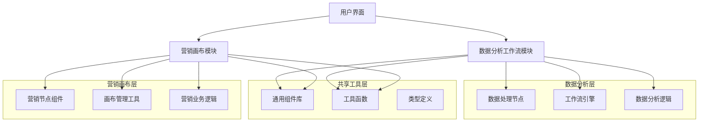
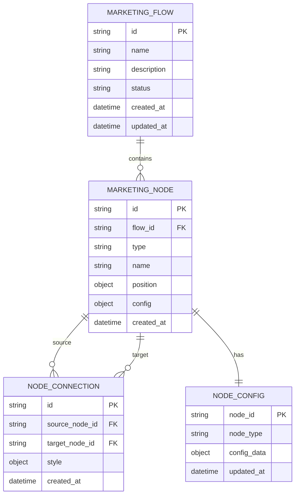
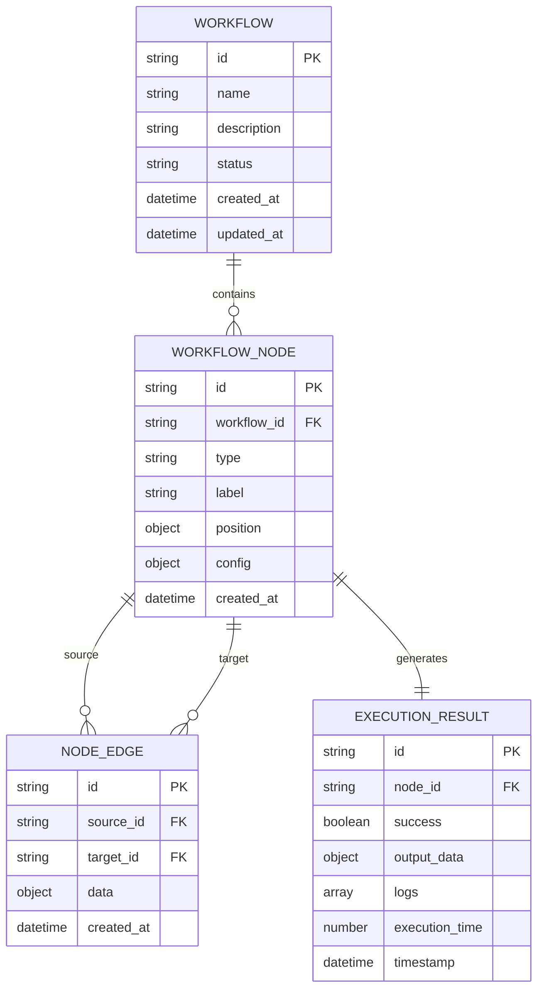

# 组件分离技术架构方案

## 1. 架构设计



## 2. 技术描述

### 前端技术栈
- **框架**: Vue 3 + Composition API
- **构建工具**: Vite
- **图形引擎**: AntV X6
- **UI组件**: Arco Design
- **状态管理**: Vuex
- **路由**: Vue Router
- **开发语言**: JavaScript + TypeScript

### 后端服务
- **数据存储**: 本地存储 + Vuex状态管理
- **API通信**: Axios (用于外部服务调用)

## 3. 路由定义

| 路由 | 用途 | 组件路径 |
|------|------|----------|
| /marketing/tasks | 营销画布主页面 | @/pages/marketing/tasks/TaskFlowCanvas.vue |
| /marketing/tasks/config | 营销节点配置 | @/pages/marketing/tasks/components/配置组件 |
| /data-analysis/workflow | 数据分析工作流 | @/pages/data-analysis/workflow/WorkflowCanvas.vue |
| /data-analysis/workflow/nodes | 数据节点配置 | @/pages/data-analysis/workflow/components/节点组件 |

## 4. API定义

### 4.1 营销画布API

**获取营销节点配置**
```
GET /api/marketing/node-config
```

请求参数：
| 参数名 | 参数类型 | 是否必需 | 描述 |
|--------|----------|----------|------|
| nodeType | string | true | 节点类型 (start, sms, ai-call, benefit, crowd-split) |
| nodeId | string | false | 节点ID |

响应：
| 参数名 | 参数类型 | 描述 |
|--------|----------|------|
| success | boolean | 请求状态 |
| data | object | 节点配置数据 |
| message | string | 响应消息 |

示例：
```json
{
  "success": true,
  "data": {
    "nodeType": "sms",
    "config": {
      "template": "marketing",
      "content": "营销短信内容"
    }
  },
  "message": "获取成功"
}
```

**保存营销流程**
```
POST /api/marketing/save-flow
```

请求：
| 参数名 | 参数类型 | 是否必需 | 描述 |
|--------|----------|----------|------|
| flowId | string | true | 流程ID |
| nodes | array | true | 节点数据 |
| connections | array | true | 连接数据 |

### 4.2 数据分析工作流API

**执行数据处理节点**
```
POST /api/workflow/execute-node
```

请求：
| 参数名 | 参数类型 | 是否必需 | 描述 |
|--------|----------|----------|------|
| nodeId | string | true | 节点ID |
| nodeType | string | true | 节点类型 (datasource, python, sql) |
| config | object | true | 节点配置 |
| inputData | any | false | 输入数据 |

响应：
| 参数名 | 参数类型 | 描述 |
|--------|----------|------|
| success | boolean | 执行状态 |
| outputData | any | 输出数据 |
| logs | array | 执行日志 |
| executionTime | number | 执行时间(ms) |

## 5. 数据模型

### 5.1 营销画布数据模型



### 5.2 数据分析工作流数据模型



### 5.3 数据定义语言

**营销流程表 (marketing_flows)**
```sql
-- 创建营销流程表
CREATE TABLE marketing_flows (
    id VARCHAR(36) PRIMARY KEY DEFAULT (UUID()),
    name VARCHAR(100) NOT NULL,
    description TEXT,
    status VARCHAR(20) DEFAULT 'draft' CHECK (status IN ('draft', 'active', 'paused', 'completed')),
    created_at TIMESTAMP DEFAULT CURRENT_TIMESTAMP,
    updated_at TIMESTAMP DEFAULT CURRENT_TIMESTAMP ON UPDATE CURRENT_TIMESTAMP
);

-- 创建营销节点表
CREATE TABLE marketing_nodes (
    id VARCHAR(36) PRIMARY KEY DEFAULT (UUID()),
    flow_id VARCHAR(36) NOT NULL,
    type VARCHAR(50) NOT NULL,
    name VARCHAR(100) NOT NULL,
    position JSON NOT NULL,
    config JSON,
    created_at TIMESTAMP DEFAULT CURRENT_TIMESTAMP,
    FOREIGN KEY (flow_id) REFERENCES marketing_flows(id) ON DELETE CASCADE
);

-- 创建节点连接表
CREATE TABLE node_connections (
    id VARCHAR(36) PRIMARY KEY DEFAULT (UUID()),
    source_node_id VARCHAR(36) NOT NULL,
    target_node_id VARCHAR(36) NOT NULL,
    style JSON,
    created_at TIMESTAMP DEFAULT CURRENT_TIMESTAMP,
    FOREIGN KEY (source_node_id) REFERENCES marketing_nodes(id) ON DELETE CASCADE,
    FOREIGN KEY (target_node_id) REFERENCES marketing_nodes(id) ON DELETE CASCADE
);

-- 创建索引
CREATE INDEX idx_marketing_nodes_flow_id ON marketing_nodes(flow_id);
CREATE INDEX idx_marketing_nodes_type ON marketing_nodes(type);
CREATE INDEX idx_node_connections_source ON node_connections(source_node_id);
CREATE INDEX idx_node_connections_target ON node_connections(target_node_id);

-- 初始化数据
INSERT INTO marketing_flows (name, description, status) VALUES
('示例营销流程', '这是一个示例营销活动流程', 'draft'),
('短信营销活动', 'SMS营销推广活动', 'active');
```

**数据分析工作流表 (workflows)**
```sql
-- 创建工作流表
CREATE TABLE workflows (
    id VARCHAR(36) PRIMARY KEY DEFAULT (UUID()),
    name VARCHAR(100) NOT NULL,
    description TEXT,
    status VARCHAR(20) DEFAULT 'idle' CHECK (status IN ('idle', 'running', 'completed', 'error')),
    created_at TIMESTAMP DEFAULT CURRENT_TIMESTAMP,
    updated_at TIMESTAMP DEFAULT CURRENT_TIMESTAMP ON UPDATE CURRENT_TIMESTAMP
);

-- 创建工作流节点表
CREATE TABLE workflow_nodes (
    id VARCHAR(36) PRIMARY KEY DEFAULT (UUID()),
    workflow_id VARCHAR(36) NOT NULL,
    type VARCHAR(50) NOT NULL,
    label VARCHAR(100) NOT NULL,
    position JSON NOT NULL,
    config JSON,
    created_at TIMESTAMP DEFAULT CURRENT_TIMESTAMP,
    FOREIGN KEY (workflow_id) REFERENCES workflows(id) ON DELETE CASCADE
);

-- 创建节点边表
CREATE TABLE node_edges (
    id VARCHAR(36) PRIMARY KEY DEFAULT (UUID()),
    source_id VARCHAR(36) NOT NULL,
    target_id VARCHAR(36) NOT NULL,
    data JSON,
    created_at TIMESTAMP DEFAULT CURRENT_TIMESTAMP,
    FOREIGN KEY (source_id) REFERENCES workflow_nodes(id) ON DELETE CASCADE,
    FOREIGN KEY (target_id) REFERENCES workflow_nodes(id) ON DELETE CASCADE
);

-- 创建执行结果表
CREATE TABLE execution_results (
    id VARCHAR(36) PRIMARY KEY DEFAULT (UUID()),
    node_id VARCHAR(36) NOT NULL,
    success BOOLEAN NOT NULL,
    output_data JSON,
    logs JSON,
    execution_time INT,
    timestamp TIMESTAMP DEFAULT CURRENT_TIMESTAMP,
    FOREIGN KEY (node_id) REFERENCES workflow_nodes(id) ON DELETE CASCADE
);

-- 创建索引
CREATE INDEX idx_workflow_nodes_workflow_id ON workflow_nodes(workflow_id);
CREATE INDEX idx_workflow_nodes_type ON workflow_nodes(type);
CREATE INDEX idx_node_edges_source ON node_edges(source_id);
CREATE INDEX idx_node_edges_target ON node_edges(target_id);
CREATE INDEX idx_execution_results_node_id ON execution_results(node_id);
CREATE INDEX idx_execution_results_timestamp ON execution_results(timestamp DESC);

-- 初始化数据
INSERT INTO workflows (name, description, status) VALUES
('数据清洗流程', '用户数据清洗和预处理工作流', 'idle'),
('报表生成流程', '自动化报表生成工作流', 'idle');
```

## 6. 实施步骤

### 第一阶段：目录结构创建
1. 创建新的目录结构
2. 设置路径别名配置
3. 更新构建配置

### 第二阶段：组件迁移
1. 迁移数据分析相关组件
2. 更新组件内部导入路径
3. 测试组件功能完整性

### 第三阶段：依赖关系整理
1. 分析组件间依赖关系
2. 创建共享组件库
3. 优化代码复用

### 第四阶段：测试和验证
1. 单元测试更新
2. 集成测试验证
3. 功能回归测试

### 第五阶段：文档和部署
1. 更新开发文档
2. 部署配置调整
3. 团队培训和交接

## 7. 风险评估与控制

### 7.1 技术风险
- **依赖关系复杂**：通过逐步迁移和充分测试控制
- **路径引