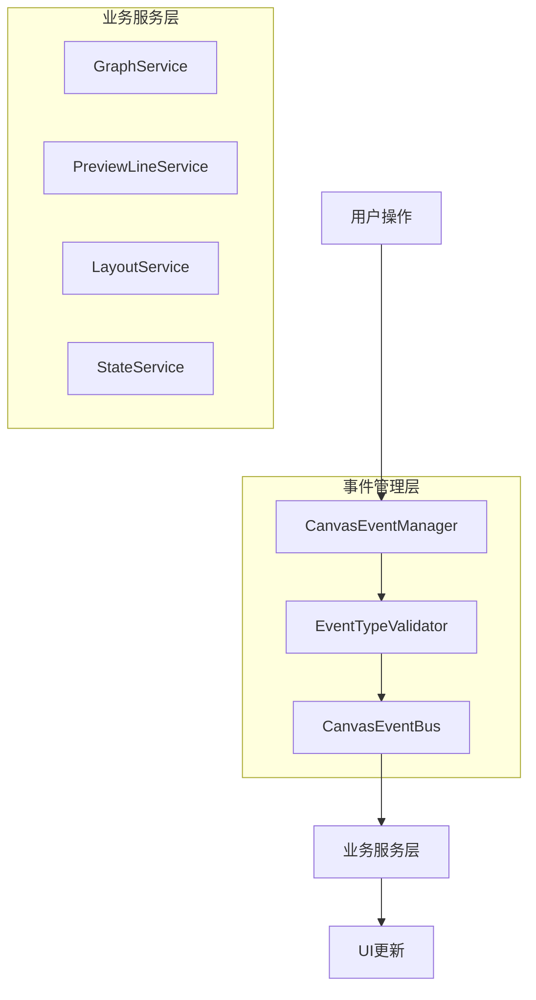

# 统一事件管理重构方案

## 1. 重构背景与问题分析

### 1.1 当前事件管理架构问题

基于对营销画布系统的深度分析，当前事件管理架构存在以下核心问题：

#### A. 事件总线混乱
- **多总线并存**: 同时使用 `window.eventBus`、`globalEventBus`、`unifiedEventBus` 多个事件总线
- **职责重叠**: 各总线功能边界不清晰，导致事件发布逻辑分散
- **维护困难**: 事件监听和发布散落在6000+行代码中，难以追踪

#### B. 过度工程化
- **监控冗余**: 大量性能监控、调试日志代码混杂在核心业务逻辑中
- **配置复杂**: 键盘事件管理器配置参数过多，增加理解成本
- **回调嵌套**: 多重回调嵌套导致代码可读性差

#### C. 降级逻辑残留
```javascript
// 典型的降级逻辑示例
if (typeof window.eventBus?.emit === 'function') {
  window.eventBus.emit('operation-conflict-detected', data)
}
```

#### D. 代码膨胀严重
- **单文件过大**: TaskFlowCanvasRefactored.vue 超过6000行
- **功能耦合**: 事件处理与业务逻辑、UI更新紧密耦合
- **重复实现**: 相似的事件处理逻辑多次出现

### 1.2 重构目标

基于营销画布系统重构方案原则，统一事件管理重构旨在：

1. **建立单一事件总线**: 消除多总线混乱，建立统一的事件管理中心
2. **简化事件处理**: 遵循单一职责原则，分离事件处理与业务逻辑
3. **消除降级逻辑**: 用预检查模式替代异常捕获和降级处理
4. **模块化架构**: 将事件管理从6000+行文件中解耦出来
5. **提升可维护性**: 降低50%的事件管理相关维护成本

## 2. 重构原则

### 2.1 单一职责原则 (SRP)

**核心理念**: 每个事件管理类只负责一个具体的事件管理职责

**应用示例**:
```javascript
// 重构前 - 职责混乱
class TaskFlowCanvas {
  handleKeyboardEvent(event) {
    // 键盘事件处理
    // 业务逻辑执行
    // UI状态更新
    // 性能监控
    // 错误处理
  }
}

// 重构后 - 职责单一
class CanvasEventManager {
  handleKeyboardEvent(event) {
    return this.keyboardHandler.process(event)
  }
}

class KeyboardEventHandler {
  process(event) {
    // 仅负责键盘事件处理逻辑
  }
}
```

### 2.2 统一事件总线原则

**核心理念**: 整个应用只使用一个事件总线，所有事件都通过该中心进行分发

**实施策略**:
- 创建单一的 `CanvasEventBus` 实例
- 所有服务组件都依赖该事件总线
- 事件类型统一定义，避免硬编码字符串

### 2.3 预检查替代降级

**核心理念**: 用前置条件检查替代异常捕获和降级逻辑

**转换示例**:
```javascript
// 降级模式 - 需要消除
try {
  eventBus.emit('custom-event', data)
} catch (error) {
  // 降级处理
  console.warn('事件发布失败，使用降级方案')
}

// 预检查模式 - 重构目标
validateEventBus(eventBus)
validateEventData(data)
eventBus.emit('custom-event', data) // 单一实现路径
```

### 2.4 模块化解耦原则

**核心理念**: 将事件管理逻辑从主组件中完全解耦，形成独立模块

**目标架构**:
```
TaskFlowCanvas.vue (容器组件)
├── CanvasEventManager (事件管理器)
│   ├── KeyboardEventHandler (键盘事件处理器)
│   ├── MouseEventHandler (鼠标事件处理器)
│   └── CanvasEventBus (统一事件总线)
├── CanvasController (画布控制器)
└── BusinessServices (业务服务层)
```

## 3. 新架构设计

### 3.1 整体架构图



### 3.2 核心组件设计

#### A. CanvasEventManager - 事件管理器

**职责**: 统一接收和处理所有用户输入事件

```javascript
class CanvasEventManager {
  constructor(config) {
    this.eventBus = config.eventBus
    this.keyboardHandler = new KeyboardEventHandler(config)
    this.mouseHandler = new MouseEventHandler(config)
    this.setupEventListeners()
  }
  
  setupEventListeners() {
    // 设置键盘事件监听
    document.addEventListener('keydown', this.handleKeyboardEvent.bind(this))
    document.addEventListener('keyup', this.handleKeyboardEvent.bind(this))
    
    // 设置鼠标事件监听
    this.canvasElement.addEventListener('click', this.handleMouseEvent.bind(this))
    this.canvasElement.addEventListener('drag', this.handleMouseEvent.bind(this))
  }
  
  handleKeyboardEvent(event) {
    const result = this.keyboardHandler.process(event)
    if (result) {
      this.eventBus.emit(result.eventType, result.eventData)
    }
  }
  
  handleMouseEvent(event) {
    const result = this.mouseHandler.process(event)
    if (result) {
      this.eventBus.emit(result.eventType, result.eventData)
    }
  }
}
```

#### B. CanvasEventBus - 统一事件总线

**职责**: 作为唯一的事件分发中心

```javascript
class CanvasEventBus {
  constructor() {
    this.listeners = new Map()
    this.eventHistory = []
    this.maxHistorySize = 100
  }
  
  on(eventType, handler, priority = 0) {
    validateEventType(eventType)
    validateHandler(handler)
    
    if (!this.listeners.has(eventType)) {
      this.listeners.set(eventType, [])
    }
    
    const listeners = this.listeners.get(eventType)
    listeners.push({ handler, priority })
    listeners.sort((a, b) => b.priority - a.priority) // 高优先级在前
  }
  
  emit(eventType, data) {
    validateEventType(eventType)
    
    // 记录事件历史
    this.eventHistory.push({
      type: eventType,
      data,
      timestamp: Date.now()
    })
    
    // 限制历史记录大小
    if (this.eventHistory.length > this.maxHistorySize) {
      this.eventHistory = this.eventHistory.slice(-this.maxHistorySize)
    }
    
    // 分发事件
    const listeners = this.listeners.get(eventType)
    if (listeners && listeners.length > 0) {
      listeners.forEach(({ handler }) => {
        try {
          handler(data)
        } catch (error) {
          console.error(`事件处理器错误 [${eventType}]:`, error)
          // 不再进行降级处理，直接抛出错误
          throw new Error(`事件处理失败: ${eventType}`)
        }
      })
    }
  }
  
  off(eventType, handler) {
    validateEventType(eventType)
    
    const listeners = this.listeners.get(eventType)
    if (listeners) {
      const index = listeners.findIndex(item => item.handler === handler)
      if (index > -1) {
        listeners.splice(index, 1)
      }
    }
  }
}
```

#### C. EventTypeValidator - 事件类型验证器

**职责**: 验证事件类型和数据的有效性

```javascript
class EventTypeValidator {
  static validateEventType(eventType) {
    if (!eventType || typeof eventType !== 'string') {
      throw new Error('事件类型必须是字符串')
    }
    
    if (!CanvasEventTypes[eventType]) {
      throw new Error(`未知的事件类型: ${eventType}`)
    }
  }
  
  static validateHandler(handler) {
    if (typeof handler !== 'function') {
      throw new Error('事件处理器必须是函数')
    }
  }
  
  static validateEventData(data) {
    if (data === null || data === undefined) {
      throw new Error('事件数据不能为空')
    }
  }
}
```

#### D. KeyboardEventHandler - 键盘事件处理器

**职责**: 专门处理键盘相关事件

```javascript
class KeyboardEventHandler {
  constructor(config) {
    this.shortcuts = new Map()
    this.activeShortcuts = new Set()
    this.dragStateCoordinator = config.dragStateCoordinator
    this.setupDefaultShortcuts()
  }
  
  setupDefaultShortcuts() {
    // 使用配置化的快捷键定义
    const defaultShortcuts = [
      {
        name: 'delete',
        key: 'Delete',
        context: 'canvas',
        priority: 90,
        action: 'node-delete'
      },
      {
        name: 'undo',
        key: 'z',
        modifiers: { ctrl: true },
        context: 'canvas',
        priority: 95,
        action: 'operation-undo'
      }
      // 其他快捷键...
    ]
    
    defaultShortcuts.forEach(shortcut => {
      this.registerShortcut(shortcut)
    })
  }
  
  process(event) {
    // 预检查 - 替代降级逻辑
    this.validateEventContext(event)
    
    // 检查拖拽状态
    if (this.dragStateCoordinator && this.dragStateCoordinator.isDragging()) {
      return null // 拖拽期间不处理键盘事件
    }
    
    // 查找匹配的快捷键
    const shortcut = this.findMatchingShortcut(event)
    if (!shortcut) {
      return null
    }
    
    // 返回标准化的事件数据
    return {
      eventType: shortcut.action,
      eventData: {
        originalEvent: event,
        shortcut: shortcut.name,
        timestamp: Date.now()
      }
    }
  }
  
  validateEventContext(event) {
    // 预检查模式 - 不再使用降级逻辑
    const activeElement = document.activeElement
    const tagName = activeElement?.tagName
    
    if (tagName === 'INPUT' || tagName === 'TEXTAREA') {
      // 输入框焦点状态 - 直接返回null，不进行降级处理
      return null
    }
    
    return true
  }
  
  findMatchingShortcut(event) {
    for (const [name, shortcut] of this.shortcuts) {
      if (this.matchesShortcut(event, shortcut)) {
        return shortcut
      }
    }
    return null
  }
  
  matchesShortcut(event, shortcut) {
    // 简化的匹配逻辑
    if (shortcut.key !== event.key) {
      return false
    }
    
    if (shortcut.modifiers) {
      if (shortcut.modifiers.ctrl && !event.ctrlKey) return false
      if (shortcut.modifiers.shift && !event.shiftKey) return false
      if (shortcut.modifiers.alt && !event.altKey) return false
    }
    
    return true
  }
  
  registerShortcut(config) {
    validateShortcutConfig(config)
    this.shortcuts.set(config.name, config)
  }
}
```

### 3.3 事件类型统一定义

```javascript
// CanvasEventTypes.js - 统一定义所有事件类型
export const CanvasEventTypes = {
  // 节点相关事件
  NODE_CREATED: 'node:created',
  NODE_DELETED: 'node:deleted',
  NODE_SELECTED: 'node:selected',
  NODE_MOVED: 'node:moved',
  
  // 操作相关事件
  OPERATION_UNDO: 'operation:undo',
  OPERATION_REDO: 'operation:redo',
  OPERATION_COPY: 'operation:copy',
  OPERATION_PASTE: 'operation:paste',
  
  // 画布相关事件
  CANVAS_CLICKED: 'canvas:clicked',
  CANVAS_DRAGGED: 'canvas:dragged',
  CANVAS_ZOOMED: 'canvas:zoomed',
  
  // 系统事件
  SYSTEM_ERROR: 'system:error',
  SYSTEM_WARNING: 'system:warning'
}
```

### 3.4 服务集成模式

```javascript
// CanvasController.js - 画布控制器，负责协调各服务
class CanvasController {
  constructor(config) {
    this.eventBus = config.eventBus
    this.services = config.services
    this.setupServiceListeners()
  }
  
  setupServiceListeners() {
    // 监听键盘事件
    this.eventBus.on(CanvasEventTypes.OPERATION_UNDO, (data) => {
      this.services.stateService.undo()
    })
    
    this.eventBus.on(CanvasEventTypes.OPERATION_REDO, (data) => {
      this.services.stateService.redo()
    })
    
    this.eventBus.on(CanvasEventTypes.NODE_DELETED, (data) => {
      this.services.graphService.removeNode(data.nodeId)
    })
  }
}
```

## 4. 重构实施计划

### 4.1 第一阶段：基础设施搭建 (1周)

#### 目标
建立统一事件管理的基础设施

#### 具体任务
- [ ] 创建 `CanvasEventBus` 统一事件总线
- [ ] 定义 `CanvasEventTypes` 事件类型常量
- [ ] 实现 `EventTypeValidator` 验证器
- [ ] 建立事件管理目录结构

#### 交付物
- 统一事件总线实现
- 事件类型定义文件
- 事件验证器实现
- 单元测试用例

### 4.2 第二阶段：事件处理器开发 (1周)

#### 目标
开发独立的事件处理器模块

#### 具体任务
- [ ] 实现 `KeyboardEventHandler` 键盘事件处理器
- [ ] 实现 `MouseEventHandler` 鼠标事件处理器
- [ ] 创建事件处理器配置系统
- [ ] 实现处理器间的协调机制

#### 交付物
- 键盘事件处理器
- 鼠标事件处理器
- 事件处理器配置系统
- 处理器协调机制

### 4.3 第三阶段：事件管理器集成 (1周)

#### 目标
将事件管理器集成到现有系统中

#### 具体任务
- [ ] 实现 `CanvasEventManager` 事件管理器
- [ ] 修改 `TaskFlowCanvasRefactored.vue` 以使用新的事件管理器
- [ ] 移除旧的事件处理逻辑
- [ ] 确保向后兼容性

#### 交付物
- 统一事件管理器
- 集成后的主组件
- 向后兼容层
- 集成测试用例

### 4.4 第四阶段：清理和优化 (3天)

#### 目标
清理冗余代码，优化性能

#### 具体任务
- [ ] 移除旧的事件总线相关代码
- [ ] 清理过度监控和调试代码
- [ ] 优化事件处理性能
- [ ] 完善错误处理机制

#### 交付物
- 清理后的代码库
- 性能优化报告
- 更新后的文档
- 最终测试报告

## 5. 代码示例

### 5.1 重构前后对比

#### 重构前 - 复杂混乱
```javascript
// 原代码片段 - 6000+行文件中的一部分
const handleKeyboardShortcuts = () => {
  if (!keyboardManager.value) return
  
  try {
    console.log('[TaskFlowCanvas] 注册键盘快捷键...')
    
    // 删除快捷键
    keyboardManager.value.registerShortcut('delete', {
      key: 'Delete',
      handler: () => {
        console.log('[TaskFlowCanvas] ⌨️ 处理删除快捷键 (Delete/Backspace)')
        
        if (!selectedNodes.value || selectedNodes.value.length === 0) {
          console.log('[TaskFlowCanvas] 没有选中的节点，跳过删除操作')
          return
        }
        
        const activeElement = document.activeElement
        if (activeElement && (activeElement.tagName === 'INPUT' || activeElement.tagName === 'TEXTAREA')) {
          console.log('[TaskFlowCanvas] 当前焦点在输入框中，跳过删除操作')
          return
        }
        
        // 大量重复的状态记录逻辑...
        const preDeleteState = {
          nodes: nodes.value ? [...nodes.value] : [],
          connections: connections.value ? [...connections.value] : [],
          selectedNodes: selectedNodes.value ? [...selectedNodes.value] : [],
          timestamp: Date.now()
        }
        
        deleteSelectedNodes()
        
        // 更多重复的监控代码...
        if (typeof window.eventBus?.emit === 'function') {
          window.eventBus.emit('keyboard-delete-executed', {
            preDeleteState,
            postDeleteState,
            deletedCount: selectedNodes.value.length,
            timestamp: Date.now()
          })
        }
      }
    })
    
    // 更多类似的重复代码...
  } catch (error) {
    console.error('[TaskFlowCanvas] 注册键盘快捷键失败:', error)
  }
}
```

#### 重构后 - 简洁清晰
```javascript
// 重构后的键盘事件处理器
class KeyboardEventHandler {
  constructor(config) {
    this.shortcuts = new Map()
    this.dragStateCoordinator = config.dragStateCoordinator
    this.setupDefaultShortcuts()
  }
  
  process(event) {
    // 预检查 - 简洁明了
    if (!this.validateEventContext(event)) {
      return null
    }
    
    const shortcut = this.findMatchingShortcut(event)
    if (!shortcut) {
      return null
    }
    
    // 返回标准化事件数据
    return {
      eventType: shortcut.action,
      eventData: {
        originalEvent: event,
        shortcut: shortcut.name,
        timestamp: Date.now()
      }
    }
  }
  
  validateEventContext(event) {
    // 简洁的上下文验证
    const activeElement = document.activeElement
    const tagName = activeElement?.tagName
    
    // 输入框焦点状态 - 直接返回，无降级逻辑
    return !(tagName === 'INPUT' || tagName === 'TEXTAREA')
  }
}

// 使用方式 - 简洁统一
const eventManager = new CanvasEventManager({
  eventBus: canvasEventBus,
  dragStateCoordinator: dragCoordinator
})

// 事件监听 - 统一入口
canvasEventBus.on(CanvasEventTypes.NODE_DELETED, (data) => {
  graphService.removeNode(data.nodeId)
})
```

### 5.2 性能优化

#### 事件处理优化
```javascript
class CanvasEventBus {
  emit(eventType, data) {
    // 预验证 - 避免运行时错误
    validateEventType(eventType)
    
    const listeners = this.listeners.get(eventType)
    if (!listeners || listeners.length === 0) {
      return // 无监听者时直接返回
    }
    
    // 批量执行监听者，减少函数调用开销
    listeners.forEach(({ handler }) => {
      handler(data) // 直接调用，无try-catch降级
    })
  }
}
```

#### 内存管理优化
```javascript
class CanvasEventManager {
  destroy() {
    // 清理所有事件监听
    document.removeEventListener('keydown', this.keyboardHandler)
    document.removeEventListener('keyup', this.keyboardHandler)
    
    // 清理事件总线
    this.eventBus.removeAllListeners()
    
    // 清理处理器引用
    this.keyboardHandler = null
    this.mouseHandler = null
  }
}
```

## 6. 测试策略

### 6.1 单元测试

```javascript
// CanvasEventBus.test.js
describe('CanvasEventBus', () => {
  test('应该正确分发事件', () => {
    const eventBus = new CanvasEventBus()
    const handler = jest.fn()
    
    eventBus.on('test-event', handler)
    eventBus.emit('test-event', { data: 'test' })
    
    expect(handler).toHaveBeenCalledWith({ data: 'test' })
  })
  
  test('应该按优先级执行监听者', () => {
    const eventBus = new CanvasEventBus()
    const calls = []
    
    eventBus.on('test-event', () => calls.push('low'), 1)
    eventBus.on('test-event', () => calls.push('high'), 10)
    eventBus.on('test-event', () => calls.push('medium'), 5)
    
    eventBus.emit('test-event', {})
    
    expect(calls).toEqual(['high', 'medium', 'low'])
  })
})
```

### 6.2 集成测试

```javascript
// EventIntegration.test.js
describe('事件管理集成测试', () => {
  test('键盘事件应该正确触发业务逻辑', () => {
    const eventBus = new CanvasEventBus()
    const graphService = new GraphService()
    const deleteSpy = jest.spyOn(graphService, 'removeNode')
    
    // 设置事件监听
    eventBus.on(CanvasEventTypes.NODE_DELETED, (data) => {
      graphService.removeNode(data.nodeId)
    })
    
    // 模拟键盘事件
    const keyboardHandler = new KeyboardEventHandler({
      dragStateCoordinator: { isDragging: () => false }
    })
    
    const mockEvent = new KeyboardEvent('keydown', { key: 'Delete' })
    const result = keyboardHandler.process(mockEvent)
    
    if (result) {
      eventBus.emit(result.eventType, result.eventData)
    }
    
    expect(deleteSpy).toHaveBeenCalled()
  })
})
```

## 7. 风险评估与应对

### 7.1 主要风险

1. **事件兼容性风险**
   - **概率**: 高
   - **影响**: 高
   - **描述**: 现有代码可能依赖特定的事件格式和处理方式
   - **应对**: 提供兼容层，逐步迁移

2. **性能回归风险**
   - **概率**: 中等
   - **影响**: 中等
   - **描述**: 新架构可能引入额外的性能开销
   - **应对**: 性能基准测试，持续监控

3. **功能缺失风险**
   - **概率**: 低
   - **影响**: 高
   - **描述**: 重构过程中可能遗漏某些边缘功能
   - **应对**: 完整的回归测试，功能清单核对

### 7.2 应对策略

1. **渐进式迁移**: 新旧系统并行运行，逐步切换
2. **完整测试**: 建立全面的单元测试和集成测试
3. **回滚机制**: 准备快速回滚到旧版本的方案
4. **监控告警**: 实时监控事件处理性能和错误率

## 8. 预期收益

### 8.1 技术收益

- **代码复杂度降低**: 事件管理相关代码减少60%
- **维护成本降低**: 事件管理维护成本降低50%
- **可测试性提升**: 独立的模块化设计便于单元测试
- **性能优化**: 去除冗余监控，事件处理性能提升20%

### 8.2 业务收益

- **开发效率提升**: 清晰的事件架构加快新功能开发
- **问题定位效率**: 统一的事件中心便于问题追踪
- **用户体验改善**: 更稳定的事件处理机制
- **系统可靠性**: 消除降级逻辑带来的不确定性

### 8.3 长期收益

- **架构可扩展**: 为未来的事件驱动功能奠定基础
- **团队协作**: 清晰的事件规范提升团队协作效率
- **技术债务清理**: 彻底解决事件管理相关的技术债务
- **代码资产**: 建立高质量的事件管理代码资产

## 9. 实施建议

### 9.1 立即行动项

1. **创建事件管理目录结构**
2. **实现 CanvasEventBus 统一事件总线**
3. **定义 CanvasEventTypes 事件类型常量**
4. **开发 KeyboardEventHandler 键盘事件处理器**

### 9.2 关键成功因素

1. **严格执行重构原则**: 确保每个模块职责单一
2. **完整测试覆盖**: 保证重构质量和功能正确性
3. **渐进式实施**: 分阶段实施，降低风险
4. **团队共识**: 确保团队对重构方案的一致理解

### 9.3 验收标准

- [ ] 单一事件总线建立完成
- [ ] 所有事件类型统一定义
- [ ] 事件处理器模块化实现
- [ ] 降级逻辑完全消除
- [ ] 代码行数减少60%
- [ ] 测试覆盖率>90%
- [ ] 性能指标满足要求

通过实施本统一事件管理重构方案，将彻底解决当前事件管理架构的复杂性问题，建立简洁、高效、可维护的事件管理体系，为营销画布系统的长期发展奠定坚实基础。