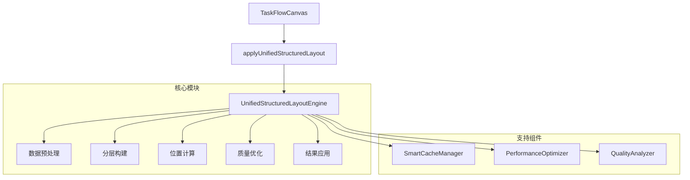

# 统一布局功能实现技术文档

## 1. 功能概述

统一布局功能是营销画布平台的核心技术组件，基于AntV X6图形引擎实现的智能布局算法。该功能通过分层分级自底向上定位系统，自动优化节点位置和连线路径，提供流畅的用户体验和高效的性能表现。

### 1.1 核心特性

- **智能分层算法**：基于父子关联关系的自底向上定位系统
- **混合节点支持**：同时处理普通节点和endpoint虚拟节点
- **性能优化机制**：防抖、缓存、分阶段执行
- **质量评估体系**：布局质量评分和优化建议
- **错误恢复机制**：异常情况的自动处理和降级策略

### 1.2 技术架构



## 2. 统一布局功能实现规范

### 2.1 UnifiedStructuredLayoutEngine.js 核心实现

#### 2.1.1 类结构定义

```javascript
class UnifiedStructuredLayoutEngine {
  constructor(config = {}) {
    // 布局配置
    this.config = {
      hierarchy: {
        verticalSpacing: config.verticalSpacing || 80,
        horizontalSpacing: config.horizontalSpacing || 120,
        margin: config.margin || { top: 50, right: 50, bottom: 50, left: 50 }
      },
      nodes: {
        minSize: config.minSize || { width: 120, height: 60 },
        alignment: config.alignment || 'center',
        grouping: config.grouping || 'level'
      },
      optimization: {
        enablePerformanceOptimization: config.enablePerformanceOptimization !== false,
        cacheStrategy: config.cacheStrategy || 'memory',
        debugMode: config.debugMode || false
      },
      performance: {
        maxExecutionTime: config.maxExecutionTime || 5000,
        memoryLimit: config.memoryLimit || 100 * 1024 * 1024, // 100MB
        monitoringThreshold: config.monitoringThreshold || 1000
      }
    };
    
    // 布局数据模型
    this.layoutData = {
      hierarchy: new Map(), // 分层结构
      positions: new Map(), // 节点位置
      connections: new Map(), // 连接关系
      virtualNodes: new Set(), // 虚拟节点
      parentChildMap: new Map() // 父子关系
    };
    
    // 性能监控
    this.performanceMetrics = {
      executionTime: 0,
      memoryUsage: 0,
      cacheHitRate: 0,
      layoutQuality: 0
    };
    
    // 初始化组件
    this.cacheManager = new SmartCacheManager();
    this.performanceOptimizer = new PerformanceOptimizer();
    this.qualityAnalyzer = new QualityAnalyzer();
    
    // 防抖执行器
    this.debouncedExecute = this.debounce(this.executeLayoutImmediate.bind(this), 300);
  }
}
```

#### 2.1.2 分层分级自底向上定位算法

```javascript
/**
 * 核心布局执行方法
 * @param {Graph} graph - AntV X6 图实例
 * @param {Object} options - 布局选项
 * @returns {Promise<LayoutResult>} 布局结果
 */
async executeLayoutImmediate(graph, options = {}) {
  const startTime = performance.now();
  
  try {
    // 阶段1: 数据预处理和验证
    const preprocessResult = await this.preprocessData(graph, options);
    if (!preprocessResult.isValid) {
      throw new Error(`数据预处理失败: ${preprocessResult.error}`);
    }
    
    // 阶段2: 分层构建和节点分组
    const hierarchyResult = await this.buildHierarchy(preprocessResult.data);
    if (!hierarchyResult.isValid) {
      throw new Error(`分层构建失败: ${hierarchyResult.error}`);
    }
    
    // 阶段3: 自底向上位置计算
    const positionResult = await this.calculatePositions(hierarchyResult.hierarchy);
    if (!positionResult.isValid) {
      throw new Error(`位置计算失败: ${positionResult.error}`);
    }
    
    // 阶段4: 层级内统一优化
    const optimizationResult = await this.optimizeWithinLayers(positionResult.positions);
    if (!optimizationResult.isValid) {
      throw new Error(`层级优化失败: ${optimizationResult.error}`);
    }
    
    // 阶段5: 全局平衡优化
    const balanceResult = await this.globalOptimization(optimizationResult.positions);
    if (!balanceResult.isValid) {
      throw new Error(`全局优化失败: ${balanceResult.error}`);
    }
    
    // 阶段6: 位置应用到图形
    const applyResult = await this.applyPositionsToGraph(graph, balanceResult.positions);
    if (!applyResult.isValid) {
      throw new Error(`位置应用失败: ${applyResult.error}`);
    }
    
    // 性能指标更新
    this.performanceMetrics.executionTime = performance.now() - startTime;
    this.performanceMetrics.layoutQuality = this.qualityAnalyzer.calculateQuality(balanceResult.positions);
    
    return {
      success: true,
      positions: balanceResult.positions,
      hierarchy: hierarchyResult.hierarchy,
      performance: this.performanceMetrics,
      quality: this.performanceMetrics.layoutQuality
    };
    
  } catch (error) {
    console.error('布局执行失败:', error);
    
    // 错误恢复机制
    const recoveryResult = await this.handleLayoutError(error, graph);
    return recoveryResult;
  }
}
```

#### 2.1.3 数据预处理和验证

```javascript
/**
 * 数据预处理和验证
 * @param {Graph} graph - 图实例
 * @param {Object} options - 选项
 * @returns {Object} 预处理结果
 */
async preprocessData(graph, options) {
  try {
    // 获取所有节点和边
    const nodes = graph.getNodes();
    const edges = graph.getEdges();
    
    // 数据有效性检查
    if (!nodes || nodes.length === 0) {
      return { isValid: false, error: '图中没有节点' };
    }
    
    // 提取节点数据
    const nodeData = nodes.map(node => ({
      id: node.id,
      type: node.getData()?.type || 'default',
      position: node.getPosition(),
      size: node.getSize(),
      isVirtual: node.getData()?.isVirtual || false,
      metadata: node.getData()?.metadata || {}
    }));
    
    // 提取连接数据
    const connectionData = edges.map(edge => ({
      id: edge.id,
      source: edge.getSourceCellId(),
      target: edge.getTargetCellId(),
      sourcePort: edge.getSourcePortId(),
      targetPort: edge.getTargetPortId(),
      isPreview: edge.getData()?.isPreview || false,
      metadata: edge.getData()?.metadata || {}
    }));
    
    // 过滤预览线
    const validConnections = connectionData.filter(conn => !conn.isPreview);
    
    // 构建父子关系映射
    const parentChildMap = this.buildParentChildMap(validConnections);
    
    // 检测循环引用
    const hasCycle = this.detectCycles(parentChildMap);
    if (hasCycle) {
      console.warn('检测到循环引用，将使用特殊处理策略');
    }
    
    return {
      isValid: true,
      data: {
        nodes: nodeData,
        connections: validConnections,
        parentChildMap,
        hasCycle
      }
    };
    
  } catch (error) {
    return { isValid: false, error: error.message };
  }
}
```

#### 2.1.4 分层构建算法

```javascript
/**
 * 分层构建算法
 * @param {Object} data - 预处理后的数据
 * @returns {Object} 分层结果
 */
async buildHierarchy(data) {
  try {
    const { nodes, connections, parentChildMap } = data;
    const hierarchy = new Map();
    const visited = new Set();
    const processing = new Set();
    
    // 找到根节点（没有父节点的节点）
    const rootNodes = nodes.filter(node => {
      const parents = this.getParentNodes(node.id, parentChildMap);
      return parents.length === 0;
    });
    
    if (rootNodes.length === 0) {
      return { isValid: false, error: '没有找到根节点' };
    }
    
    // 从根节点开始构建层级
    for (const rootNode of rootNodes) {
      await this.buildNodeHierarchy(rootNode, 0, hierarchy, visited, processing, parentChildMap);
    }
    
    // 处理孤立节点
    const orphanNodes = nodes.filter(node => !visited.has(node.id));
    for (const orphanNode of orphanNodes) {
      const maxLevel = Math.max(...Array.from(hierarchy.keys())) || 0;
      await this.buildNodeHierarchy(orphanNode, maxLevel + 1, hierarchy, visited, processing, parentChildMap);
    }
    
    // 验证层级结构
    const isValidHierarchy = this.validateHierarchy(hierarchy);
    if (!isValidHierarchy) {
      return { isValid: false, error: '层级结构验证失败' };
    }
    
    return {
      isValid: true,
      hierarchy
    };
    
  } catch (error) {
    return { isValid: false, error: error.message };
  }
}

/**
 * 递归构建节点层级
 * @param {Object} node - 节点
 * @param {number} level - 层级
 * @param {Map} hierarchy - 层级映射
 * @param {Set} visited - 已访问节点
 * @param {Set} processing - 正在处理的节点
 * @param {Map} parentChildMap - 父子关系映射
 */
async buildNodeHierarchy(node, level, hierarchy, visited, processing, parentChildMap) {
  // 检测循环引用
  if (processing.has(node.id)) {
    console.warn(`检测到循环引用: ${node.id}`);
    return;
  }
  
  if (visited.has(node.id)) {
    return;
  }
  
  processing.add(node.id);
  
  // 将节点添加到对应层级
  if (!hierarchy.has(level)) {
    hierarchy.set(level, []);
  }
  hierarchy.get(level).push(node);
  visited.add(node.id);
  
  // 递归处理子节点
  const children = this.getChildNodes(node.id, parentChildMap);
  for (const child of children) {
    await this.buildNodeHierarchy(child, level + 1, hierarchy, visited, processing, parentChildMap);
  }
  
  processing.delete(node.id);
}
```

### 2.2 防抖机制和缓存策略

#### 2.2.1 防抖机制实现

```javascript
/**
 * 防抖函数实现
 * @param {Function} func - 要防抖的函数
 * @param {number} delay - 延迟时间（毫秒）
 * @returns {Function} 防抖后的函数
 */
debounce(func, delay) {
  let timeoutId;
  return function(...args) {
    clearTimeout(timeoutId);
    timeoutId = setTimeout(() => func.apply(this, args), delay);
  };
}

/**
 * 执行布局（带防抖）
 * @param {Graph} graph - 图实例
 * @param {Object} options - 选项
 */
executeLayout(graph, options = {}) {
  // 如果启用了防抖，使用防抖执行器
  if (this.config.optimization.enablePerformanceOptimization) {
    return this.debouncedExecute(graph, options);
  } else {
    return this.executeLayoutImmediate(graph, options);
  }
}
```

#### 2.2.2 智能缓存管理

```javascript
/**
 * 智能缓存管理器
 */
class SmartCacheManager {
  constructor(maxSize = 100, ttl = 300000) { // 5分钟TTL
    this.cache = new Map();
    this.maxSize = maxSize;
    this.ttl = ttl;
    this.hitCount = 0;
    this.missCount = 0;
  }
  
  /**
   * 生成缓存键
   * @param {Array} nodes - 节点数组
   * @param {Array} connections - 连接数组
   * @returns {string} 缓存键
   */
  generateCacheKey(nodes, connections) {
    const nodeHash = nodes.map(n => `${n.id}:${n.type}:${n.position.x},${n.position.y}`).sort().join('|');
    const connHash = connections.map(c => `${c.source}->${c.target}`).sort().join('|');
    return `layout:${this.hashString(nodeHash + connHash)}`;
  }
  
  /**
   * 获取缓存
   * @param {string} key - 缓存键
   * @returns {Object|null} 缓存值
   */
  get(key) {
    const item = this.cache.get(key);
    
    if (!item) {
      this.missCount++;
      return null;
    }
    
    // 检查TTL
    if (Date.now() - item.timestamp > this.ttl) {
      this.cache.delete(key);
      this.missCount++;
      return null;
    }
    
    // 更新访问时间（LRU）
    item.lastAccess = Date.now();
    this.cache.delete(key);
    this.cache.set(key, item);
    
    this.hitCount++;
    return item.value;
  }
  
  /**
   * 设置缓存
   * @param {string} key - 缓存键
   * @param {Object} value - 缓存值
   */
  set(key, value) {
    // 如果缓存已满，删除最旧的项
    if (this.cache.size >= this.maxSize) {
      const oldestKey = this.cache.keys().next().value;
      this.cache.delete(oldestKey);
    }
    
    this.cache.set(key, {
      value,
      timestamp: Date.now(),
      lastAccess: Date.now()
    });
  }
  
  /**
   * 获取缓存命中率
   * @returns {number} 命中率（0-1）
   */
  getHitRate() {
    const total = this.hitCount + this.missCount;
    return total > 0 ? this.hitCount / total : 0;
  }
  
  /**
   * 字符串哈希函数
   * @param {string} str - 输入字符串
   * @returns {string} 哈希值
   */
  hashString(str) {
    let hash = 0;
    for (let i = 0; i < str.length; i++) {
      const char = str.charCodeAt(i);
      hash = ((hash << 5) - hash) + char;
      hash = hash & hash; // 转换为32位整数
    }
    return hash.toString(36);
  }
}
```

## 3. 核心校验规则

### 3.1 节点位置计算校验规则

#### 3.1.1 位置有效性检查

```javascript
/**
 * 节点位置校验器
 */
class NodePositionValidator {
  /**
   * 验证节点位置
   * @param {Object} position - 节点位置 {x, y}
   * @param {Object} constraints - 约束条件
   * @returns {Object} 验证结果
   */
  static validatePosition(position, constraints = {}) {
    const errors = [];
    const warnings = [];
    
    // 基本数值检查
    if (typeof position.x !== 'number' || isNaN(position.x)) {
      errors.push('X坐标必须是有效数字');
    }
    
    if (typeof position.y !== 'number' || isNaN(position.y)) {
      errors.push('Y坐标必须是有效数字');
    }
    
    // 边界检查
    if (constraints.minX !== undefined && position.x < constraints.minX) {
      errors.push(`X坐标不能小于${constraints.minX}`);
    }
    
    if (constraints.maxX !== undefined && position.x > constraints.maxX) {
      errors.push(`X坐标不能大于${constraints.maxX}`);
    }
    
    if (constraints.minY !== undefined && position.y < constraints.minY) {
      errors.push(`Y坐标不能小于${constraints.minY}`);
    }
    
    if (constraints.maxY !== undefined && position.y > constraints.maxY) {
      errors.push(`Y坐标不能大于${constraints.maxY}`);
    }
    
    // 精度检查
    if (position.x % 1 !== 0) {
      warnings.push('X坐标建议使用整数值以提高渲染性能');
    }
    
    if (position.y % 1 !== 0) {
      warnings.push('Y坐标建议使用整数值以提高渲染性能');
    }
    
    return {
      isValid: errors.length === 0,
      errors,
      warnings
    };
  }
  
  /**
   * 验证节点间距
   * @param {Array} positions - 位置数组
   * @param {Object} spacingRules - 间距规则
   * @returns {Object} 验证结果
   */
  static validateSpacing(positions, spacingRules = {}) {
    const {
      minHorizontalSpacing = 80,
      minVerticalSpacing = 60,
      preferredHorizontalSpacing = 120,
      preferredVerticalSpacing = 80
    } = spacingRules;
    
    const errors = [];
    const warnings = [];
    
    for (let i = 0; i < positions.length; i++) {
      for (let j = i + 1; j < positions.length; j++) {
        const pos1 = positions[i];
        const pos2 = positions[j];
        
        const horizontalDistance = Math.abs(pos1.x - pos2.x);
        const verticalDistance = Math.abs(pos1.y - pos2.y);
        
        // 检查最小间距
        if (horizontalDistance < minHorizontalSpacing && verticalDistance < minVerticalSpacing) {
          errors.push(`节点${pos1.id}和${pos2.id}距离过近`);
        }
        
        // 检查推荐间距
        if (horizontalDistance < preferredHorizontalSpacing && verticalDistance < preferredVerticalSpacing) {
          warnings.push(`节点${pos1.id}和${pos2.id}建议增加间距`);
        }
      }
    }
    
    return {
      isValid: errors.length === 0,
      errors,
      warnings
    };
  }
}
```

#### 3.1.2 重叠检测和处理

```javascript
/**
 * 节点重叠检测器
 */
class OverlapDetector {
  /**
   * 检测节点重叠
   * @param {Array} nodes - 节点数组
   * @returns {Array} 重叠的节点对
   */
  static detectOverlaps(nodes) {
    const overlaps = [];
    
    for (let i = 0; i < nodes.length; i++) {
      for (let j = i + 1; j < nodes.length; j++) {
        const node1 = nodes[i];
        const node2 = nodes[j];
        
        if (this.isOverlapping(node1, node2)) {
          overlaps.push({ node1, node2 });
        }
      }
    }
    
    return overlaps;
  }
  
  /**
   * 判断两个节点是否重叠
   * @param {Object} node1 - 节点1
   * @param {Object} node2 - 节点2
   * @returns {boolean} 是否重叠
   */
  static isOverlapping(node1, node2) {
    const rect1 = {
      left: node1.position.x - node1.size.width / 2,
      right: node1.position.x + node1.size.width / 2,
      top: node1.position.y - node1.size.height / 2,
      bottom: node1.position.y + node1.size.height / 2
    };
    
    const rect2 = {
      left: node2.position.x - node2.size.width / 2,
      right: node2.position.x + node2.size.width / 2,
      top: node2.position.y - node2.size.height / 2,
      bottom: node2.position.y + node2.size.height / 2
    };
    
    return !(rect1.right < rect2.left || 
             rect1.left > rect2.right || 
             rect1.bottom < rect2.top || 
             rect1.top > rect2.bottom);
  }
  
  /**
   * 解决节点重叠
   * @param {Array} overlaps - 重叠的节点对
   * @param {Object} strategy - 解决策略
   * @returns {Map} 调整后的位置
   */
  static resolveOverlaps(overlaps, strategy = 'spread') {
    const adjustedPositions = new Map();
    
    switch (strategy) {
      case 'spread':
        return this.spreadOverlappingNodes(overlaps);
      case 'stack':
        return this.stackOverlappingNodes(overlaps);
      case 'grid':
        return this.gridAlignOverlappingNodes(overlaps);
      default:
        return this.spreadOverlappingNodes(overlaps);
    }
  }
  
  /**
   * 分散重叠节点
   * @param {Array} overlaps - 重叠的节点对
   * @returns {Map} 调整后的位置
   */
  static spreadOverlappingNodes(overlaps) {
    const adjustedPositions = new Map();
    
    overlaps.forEach(({ node1, node2 }) => {
      const centerX = (node1.position.x + node2.position.x) / 2;
      const centerY = (node1.position.y + node2.position.y) / 2;
      
      const spacing = 120; // 最小间距
      
      adjustedPositions.set(node1.id, {
        x: centerX - spacing / 2,
        y: centerY
      });
      
      adjustedPositions.set(node2.id, {
        x: centerX + spacing / 2,
        y: centerY
      });
    });
    
    return adjustedPositions;
  }
}
```

### 3.2 连接关系有效性检查

#### 3.2.1 连接规则验证

```javascript
/**
 * 连接关系验证器
 */
class ConnectionValidator {
  /**
   * 验证连接关系
   * @param {Array} connections - 连接数组
   * @param {Array} nodes - 节点数组
   * @returns {Object} 验证结果
   */
  static validateConnections(connections, nodes) {
    const errors = [];
    const warnings = [];
    const nodeIds = new Set(nodes.map(n => n.id));
    
    connections.forEach(connection => {
      // 检查源节点和目标节点是否存在
      if (!nodeIds.has(connection.source)) {
        errors.push(`连接${connection.id}的源节点${connection.source}不存在`);
      }
      
      if (!nodeIds.has(connection.target)) {
        errors.push(`连接${connection.id}的目标节点${connection.target}不存在`);
      }
      
      // 检查自连接
      if (connection.source === connection.target) {
        warnings.push(`连接${connection.id}是自连接，可能影响布局效果`);
      }
      
      // 检查重复连接
      const duplicates = connections.filter(c => 
        c.source === connection.source && 
        c.target === connection.target && 
        c.id !== connection.id
      );
      
      if (duplicates.length > 0) {
        warnings.push(`存在重复连接：${connection.source} -> ${connection.target}`);
      }
    });
    
    return {
      isValid: errors.length === 0,
      errors,
      warnings
    };
  }
  
  /**
   * 检测循环引用
   * @param {Map} parentChildMap - 父子关系映射
   * @returns {Object} 检测结果
   */
  static detectCycles(parentChildMap) {
    const visited = new Set();
    const recursionStack = new Set();
    const cycles = [];
    
    for (const [nodeId] of parentChildMap) {
      if (!visited.has(nodeId)) {
        const cycle = this.detectCycleFromNode(nodeId, parentChildMap, visited, recursionStack, []);
        if (cycle.length > 0) {
          cycles.push(cycle);
        }
      }
    }
    
    return {
      hasCycles: cycles.length > 0,
      cycles
    };
  }
  
  /**
   * 从指定节点开始检测循环
   * @param {string} nodeId - 节点ID
   * @param {Map} parentChildMap - 父子关系映射
   * @param {Set} visited - 已访问节点
   * @param {Set} recursionStack - 递归栈
   * @param {Array} path - 当前路径
   * @returns {Array} 循环路径
   */
  static detectCycleFromNode(nodeId, parentChildMap, visited, recursionStack, path) {
    visited.add(nodeId);
    recursionStack.add(nodeId);
    path.push(nodeId);
    
    const children = parentChildMap.get(nodeId) || [];
    
    for (const childId of children) {
      if (!visited.has(childId)) {
        const cycle = this.detectCycleFromNode(childId, parentChildMap, visited, recursionStack, [...path]);
        if (cycle.length > 0) {
          return cycle;
        }
      } else if (recursionStack.has(childId)) {
        // 找到循环
        const cycleStart = path.indexOf(childId);
        return path.slice(cycleStart).concat([childId]);
      }
    }
    
    recursionStack.delete(nodeId);
    return [];
  }
}
```

### 3.3 布局质量评估标准

#### 3.3.1 质量评分算法

```javascript
/**
 * 布局质量分析器
 */
class QualityAnalyzer {
  /**
   * 计算布局质量评分
   * @param {Map} positions - 节点位置映射
   * @param {Array} connections - 连接数组
   * @returns {Object} 质量评分结果
   */
  static calculateQuality(positions, connections = []) {
    const metrics = {
      alignment: this.calculateAlignmentScore(positions),
      spacing: this.calculateSpacingScore(positions),
      overlap: this.calculateOverlapScore(positions),
      connectivity: this.calculateConnectivityScore(positions, connections),
      symmetry: this.calculateSymmetryScore(positions)
    };
    
    // 加权计算总分
    const weights = {
      alignment: 0.25,
      spacing: 0.25,
      overlap: 0.3,
      connectivity: 0.15,
      symmetry: 0.05
    };
    
    const totalScore = Object.keys(metrics).reduce((sum, key) => {
      return sum + metrics[key] * weights[key];
    }, 0);
    
    return {
      totalScore: Math.round(totalScore * 100) / 100,
      metrics,
      grade: this.getQualityGrade(totalScore),
      suggestions: this.generateSuggestions(metrics)
    };
  }
  
  /**
   * 计算对齐评分
   * @param {Map} positions - 位置映射
   * @returns {number} 对齐评分 (0-1)
   */
  static calculateAlignmentScore(positions) {
    const positionArray = Array.from(positions.values());
    if (positionArray.length < 2) return 1;
    
    // 计算X坐标的对齐程度
    const xCoords = positionArray.map(p => p.x);
    const xAlignment = this.calculateCoordinateAlignment(xCoords);
    
    // 计算Y坐标的对齐程度
    const yCoords = positionArray.map(p => p.y);
    const yAlignment = this.calculateCoordinateAlignment(yCoords);
    
    return (xAlignment + yAlignment) / 2;
  }
  
  /**
   * 计算坐标对齐程度
   * @param {Array} coords - 坐标数组
   * @returns {number} 对齐程度 (0-1)
   */
  static calculateCoordinateAlignment(coords) {
    const tolerance = 5; // 对齐容差
    const groups = [];
    
    coords.forEach(coord => {
      let foundGroup = false;
      for (const group of groups) {
        if (Math.abs(group[0] - coord) <= tolerance) {
          group.push(coord);
          foundGroup = true;
          break;
        }
      }
      if (!foundGroup) {
        groups.push([coord]);
      }
    });
    
    // 计算对齐节点的比例
    const alignedNodes = groups.reduce((sum, group) => sum + (group.length > 1 ? group.length : 0), 0);
    return alignedNodes / coords.length;
  }
  
  /**
   * 计算间距评分
   * @param {Map} positions - 位置映射
   * @returns {number} 间距评分 (0-1)
   */
  static calculateSpacingScore(positions) {
    const positionArray = Array.from(positions.values());
    if (positionArray.length < 2) return 1;
    
    const idealSpacing = 120;
    const tolerance = 20;
    let goodSpacingCount = 0;
    let totalPairs = 0;
    
    for (let i = 0; i < positionArray.length; i++) {
      for (let j = i + 1; j < positionArray.length; j++) {
        const distance = Math.sqrt(
          Math.pow(positionArray[i].x - positionArray[j].x, 2) +
          Math.pow(positionArray[i].y - positionArray[j].y, 2)
        );
        
        if (Math.abs(distance - idealSpacing) <= tolerance) {
          goodSpacingCount++;
        }
        totalPairs++;
      }
    }
    
    return totalPairs > 0 ? goodSpacingCount / totalPairs : 1;
  }
  
  /**
   * 计算重叠评分
   * @param {Map} positions - 位置映射
   * @returns {number} 重叠评分 (0-1)
   */
  static calculateOverlapScore(positions) {
    const positionArray = Array.from(positions.entries()).map(([id, pos]) => ({
      id,
      position: pos,
      size: { width: 120, height: 60 } // 默认节点大小
    }));
    
    const overlaps = OverlapDetector.detectOverlaps(positionArray);
    const overlapRatio = overlaps.length / Math.max(positionArray.length - 1, 1);
    
    return Math.max(0, 1 - overlapRatio);
  }
  
  /**
   * 获取质量等级
   * @param {number} score - 评分
   * @returns {string} 质量等级
   */
  static getQualityGrade(score) {
    if (score >= 0.9) return 'A';
    if (score >= 0.8) return 'B';
    if (score >= 0.7) return 'C';
    if (score >= 0.6) return 'D';
    return 'F';
  }
  
  /**
   * 生成优化建议
   * @param {Object} metrics - 质量指标
   * @returns {Array} 建议列表
   */
  static generateSuggestions(metrics) {
    const suggestions = [];
    
    if (metrics.alignment < 0.7) {
      suggestions.push('建议调整节点对齐，提高布局整齐度');
    }
    
    if (metrics.spacing < 0.6) {
      suggestions.push('建议优化节点间距，保持适当的视觉距离');
    }
    
    if (metrics.overlap < 0.8) {
      suggestions.push('存在节点重叠，建议增加间距或重新排列');
    }
    
    if (metrics.connectivity < 0.7) {
      suggestions.push('连接路径可以进一步优化，减少交叉和弯曲');
    }
    
    return suggestions;
  }
}
```

## 4. API接口规范

### 4.1 applyUnifiedStructuredLayout 方法接口

#### 4.1.1 方法签名

```javascript
/**
 * 应用统一结构化布局
 * @param {Graph} graph - AntV X6 图实例
 * @param {Object} options - 布局选项
 * @returns {Promise<LayoutResult>} 布局结果
 */
async function applyUnifiedStructuredLayout(graph, options = {}) {
  // 实现细节
}
```

#### 4.1.2 参数详细说明

```javascript
// 布局选项接口定义
interface LayoutOptions {
  // 布局方向
  direction?: 'TB' | 'LR' | 'BT' | 'RL';
  
  // 间距配置
  spacing?: {
    horizontal?: number;    // 水平间距，默认120
    vertical?: number;      // 垂直间距，默认80
  };
  
  // 边距配置
  margin?: {
    top?: number;          // 上边距，默认50
    right?: number;        // 右边距，默认50
    bottom?: number;       // 下边距，默认50
    left?: number;         // 左边距，默认50
  };
  
  // 节点配置
  nodes?: {
    alignment?: 'start' | 'center' | 'end';  // 节点对齐方式，默认center
    grouping?: 'type' | 'level' | 'none';    // 节点分组方式，默认level
    minSize?: {
      width?: number;      // 最小宽度，默认120
      height?: number;     // 最小高度，默认60
    };
  };
  
  // 性能配置
  performance?: {
    enableCache?: boolean;           // 启用缓存，默认true
    enableDebounce?: boolean;        // 启用防抖，默认true
    debounceDelay?: number;          // 防抖延迟，默认300ms
    maxExecutionTime?: number;       // 最大执行时间，默认5000ms
  };
  
  // 质量配置
  quality?: {
    enableOptimization?: boolean;    // 启用质量优化，默认true
    targetScore?: number;            // 目标质量评分，默认0.8
    maxIterations?: number;          // 最大优化迭代次数，默认10
  };
  
  // 调试配置
  debug?: {
    enableLogging?: boolean;         // 启用日志，默认false
    logLevel?: 'error' | 'warn' | 'info' | 'debug';  // 日志级别，默认info
    enableMetrics?: boolean;         // 启用性能指标，默认false
  };
}
```

#### 4.1.3 返回结果数据结构

```javascript
// 布局结果接口定义
interface LayoutResult {
  // 执行状态
  success: boolean;                // 是否成功
  message?: string;                // 状态消息
  
  // 布局数据
  positions: Map<string, Position>; // 节点位置映射
  hierarchy: Map<number, Node[]>;   // 层级结构
  
  // 质量评估
  quality: {
    totalScore: number;            // 总体质量评分 (0-1)
    grade: string;                 // 质量等级 (A-F)
    metrics: {
      alignment: number;           // 对齐评分 (0-1)
      spacing: number;             // 间距评分 (0-1)
      overlap: number;             // 重叠评分 (0-1)
      connectivity: number;        // 连接评分 (0-1)
      symmetry: number;            // 对称评分 (0-1)
    };
    suggestions: string[];         // 优化建议
  };
  
  // 性能指标
  performance: {
    executionTime: number;         // 执行时间 (ms)
    memoryUsage: number;           // 内存使用 (bytes)
    cacheHitRate: number;          // 缓存命中率 (0-1)
    iterationCount: number;        // 迭代次数
  };
  
  // 统计信息
  statistics: {
    nodeCount: number;             // 节点总数
    connectionCount: number;       // 连接总数
    levelCount: number;            // 层级总数
    virtualNodeCount: number;      // 虚拟节点数
  };
  
  // 错误信息（如果有）
  errors?: Array<{
    code: string;                  // 错误代码
    message: string;               // 错误消息
    details?: any;                 // 错误详情
  }>;
  
  // 警告信息（如果有）
  warnings?: Array<{
    code: string;                  // 警告代码
    message: string;               // 警告消息
    suggestions?: string[];        // 建议
  }>;
}
```

### 4.2 错误处理和异常情况

#### 4.2.1 错误代码定义

```javascript
// 错误代码常量
const ERROR_CODES = {
  // 参数错误
  INVALID_GRAPH: 'INVALID_GRAPH',
  INVALID_OPTIONS: 'INVALID_OPTIONS',
  MISSING_NODES: 'MISSING_NODES',
  
  // 数据错误
  CIRCULAR_REFERENCE: 'CIRCULAR_REFERENCE',
  INVALID_CONNECTIONS: 'INVALID_CONNECTIONS',
  DUPLICATE_NODE_IDS: 'DUPLICATE_NODE_IDS',
  
  // 执行错误
  EXECUTION_TIMEOUT: 'EXECUTION_TIMEOUT',
  MEMORY_LIMIT_EXCEEDED: 'MEMORY_LIMIT_EXCEEDED',
  LAYOUT_CALCULATION_FAILED: 'LAYOUT_CALCULATION_FAILED',
  
  // 系统错误
  UNKNOWN_ERROR: 'UNKNOWN_ERROR',
  BROWSER_NOT_SUPPORTED: 'BROWSER_NOT_SUPPORTED'
};
```

#### 4.2.2 异常处理策略

```javascript
/**
 * 错误处理器
 */
class LayoutErrorHandler {
  /**
   * 处理布局错误
   * @param {Error} error - 错误对象
   * @param {Graph} graph - 图实例
   * @param {Object} options - 选项
   * @returns {Promise<LayoutResult>} 恢复结果
   */
  static async handleError(error, graph, options) {
    console.error('布局执行失败:', error);
    
    // 根据错误类型选择恢复策略
    switch (error.code) {
      case ERROR_CODES.EXECUTION_TIMEOUT:
        return await this.handleTimeoutError(graph, options);
        
      case ERROR_CODES.MEMORY_LIMIT_EXCEEDED:
        return await this.handleMemoryError(graph, options);
        
      case ERROR_CODES.CIRCULAR_REFERENCE:
        return await this.handleCircularReferenceError(graph, options);
        
      case ERROR_CODES.INVALID_CONNECTIONS:
        return await this.handleInvalidConnectionsError(graph, options);
        
      default:
        return await this.handleUnknownError(graph, options);
    }
  }
  
  /**
   * 处理超时错误
   * @param {Graph} graph - 图实例
   * @param {Object} options - 选项
   * @returns {Promise<LayoutResult>} 恢复结果
   */
  static async handleTimeoutError(graph, options) {
    console.warn('布局计算超时，使用简化算法');
    
    // 使用简化的布局算法
    const simpleLayout = new SimpleLayoutEngine();
    return await simpleLayout.execute(graph, {
      ...options,
      performance: {
        ...options.performance,
        maxExecutionTime: 1000 // 降低超时时间
      }
    });
  }
  
  /**
   * 处理内存错误
   * @param {Graph} graph - 图实例
   * @param {Object} options - 选项
   * @returns {Promise<LayoutResult>} 恢复结果
   */
  static async handleMemoryError(graph, options) {
    console.warn('内存使用超限，清理缓存并重试');
    
    // 清理缓存
    if (window.layoutEngine && window.layoutEngine.cacheManager) {
      window.layoutEngine.cacheManager.clear();
    }
    
    // 强制垃圾回收（如果支持）
    if (window.gc) {
      window.gc();
    }
    
    // 使用低内存模式重试
    return await this.executeWithLowMemoryMode(graph, options);
  }
  
  /**
   * 处理循环引用错误
   * @param {Graph} graph - 图实例
   * @param {Object} options - 选项
   * @returns {Promise<LayoutResult>} 恢复结果
   */
  static async handleCircularReferenceError(graph, options) {
    console.warn('检测到循环引用，尝试打破循环');
    
    // 分析循环并尝试打破
    const cycleBreaker = new CycleBreaker();
    const modifiedGraph = await cycleBreaker.breakCycles(graph);
    
    // 使用修改后的图重新执行布局
    const layoutEngine = new UnifiedStructuredLayoutEngine();
    return await layoutEngine.executeLayout(modifiedGraph, options);
  }
}
```

## 5. 测试和验证

### 5.1 单元测试用例设计

#### 5.1.1 核心功能测试

```javascript
/**
 * 统一布局引擎单元测试
 */
describe('UnifiedStructuredLayoutEngine', () => {
  let layoutEngine;
  let mockGraph;
  
  beforeEach(() => {
    layoutEngine = new UnifiedStructuredLayoutEngine();
    mockGraph = createMockGraph();
  });
  
  describe('数据预处理', () => {
    test('应该正确提取节点和连接数据', async () => {
      const result = await layoutEngine.preprocessData(mockGraph);
      
      expect(result.isValid).toBe(true);
      expect(result.data.nodes).toHaveLength(5);
      expect(result.data.connections).toHaveLength(4);
    });
    
    test('应该过滤预览线', async () => {
      // 添加预览线
      mockGraph.addEdge({
        source: 'node1',
        target: 'node2',
        data: { isPreview: true }
      });
      
      const result = await layoutEngine.preprocessData(mockGraph);
      const previewConnections = result.data.connections.filter(c => c.isPreview);
      
      expect(previewConnections).toHaveLength(0);
    });
    
    test('应该检测循环引用', async () => {
      // 创建循环引用
      mockGraph.addEdge({ source: 'node1', target: 'node2' });
      mockGraph.addEdge({ source: 'node2', target: 'node3' });
      mockGraph.addEdge({ source: 'node3', target: 'node1' });
      
      const result = await layoutEngine.preprocessData(mockGraph);
      
      expect(result.data.hasCycle).toBe(true);
    });
  });
  
  describe('分层构建', () => {
    test('应该正确构建层级结构', async () => {
      const preprocessResult = await layoutEngine.preprocessData(mockGraph);
      const hierarchyResult = await layoutEngine.buildHierarchy(preprocessResult.data);
      
      expect(hierarchyResult.isValid).toBe(true);
      expect(hierarchyResult.hierarchy.size).toBeGreaterThan(0);
    });
    
    test('应该正确识别根节点', async () => {
      const preprocessResult = await layoutEngine.preprocessData(mockGraph);
      const hierarchyResult = await layoutEngine.buildHierarchy(preprocessResult.data);
      
      const rootLevel = hierarchyResult.hierarchy.get(0);
      expect(rootLevel).toBeDefined();
      expect(rootLevel.length).toBeGreaterThan(0);
    });
    
    test('应该处理孤立节点', async () => {
      // 添加孤立节点
      mockGraph.addNode({ id: 'orphan', data: { type: 'process' } });
      
      const preprocessResult = await layoutEngine.preprocessData(mockGraph);
      const hierarchyResult = await layoutEngine.buildHierarchy(preprocessResult.data);
      
      // 孤立节点应该被分配到单独的层级
      const allNodes = Array.from(hierarchyResult.hierarchy.values()).flat();
      const orphanNode = allNodes.find(n => n.id === 'orphan');
      
      expect(orphanNode).toBeDefined();
    });
  });
  
  describe('位置计算', () => {
    test('应该计算有效的节点位置', async () => {
      const result = await layoutEngine.executeLayoutImmediate(mockGraph);
      
      expect(result.success).toBe(true);
    expect(result.quality.totalScore).toBeGreaterThan(0.5);
  });
  
  test('应该处理无效的节点数据', async () => {
    const invalidGraph = new Graph({ container: document.createElement('div') });
    invalidGraph.addNode({ id: null, data: null }); // 无效数据
    
    const result = await layoutEngine.executeLayoutImmediate(invalidGraph);
    
    expect(result.success).toBe(false);
    expect(result.errors).toBeDefined();
  });
});
```

### 5.2 性能测试基准

#### 5.2.1 性能基准测试

```javascript
/**
 * 性能基准测试套件
 */
describe('性能基准测试', () => {
  const performanceThresholds = {
    small: { nodes: 10, maxTime: 100 },    // 小型图：10个节点，100ms内
    medium: { nodes: 100, maxTime: 500 },  // 中型图：100个节点，500ms内
    large: { nodes: 500, maxTime: 2000 },  // 大型图：500个节点，2s内
    xlarge: { nodes: 1000, maxTime: 5000 } // 超大图：1000个节点，5s内
  };
  
  Object.entries(performanceThresholds).forEach(([size, config]) => {
    test(`${size}图性能测试 (${config.nodes}个节点)`, async () => {
      const graph = createTestGraph(config.nodes);
      const layoutEngine = new UnifiedStructuredLayoutEngine();
      
      const startTime = performance.now();
      const result = await layoutEngine.executeLayoutImmediate(graph);
      const executionTime = performance.now() - startTime;
      
      expect(result.success).toBe(true);
      expect(executionTime).toBeLessThan(config.maxTime);
      expect(result.performance.memoryUsage).toBeLessThan(50 * 1024 * 1024); // 50MB
    });
  });
});
```

### 5.3 回归测试策略

```javascript
/**
 * 回归测试配置
 */
const regressionTestSuites = {
  core: ['data-preprocessing', 'hierarchy-building', 'position-calculation'],
  performance: ['execution-time', 'memory-usage', 'cache-efficiency'],
  compatibility: ['browser-compatibility', 'api-compatibility']
};
```

## 6. 实现指南

### 6.1 开发环境配置

#### 6.1.1 依赖安装

```bash
# 安装核心依赖
npm install @antv/x6 vue@3 vuex vue-router

# 安装开发依赖
npm install --save-dev jest @vue/test-utils vitest
```

#### 6.1.2 项目结构

```
src/
├── components/
│   └── TaskFlowCanvas.vue          # 主画布组件
├── composables/
│   └── useStructuredLayout.js      # 布局组合式函数
├── utils/
│   ├── UnifiedStructuredLayoutEngine.js  # 核心布局引擎
│   ├── SmartCacheManager.js        # 缓存管理器
│   ├── PerformanceOptimizer.js     # 性能优化器
│   └── QualityAnalyzer.js          # 质量分析器
└── tests/
    ├── unit/                       # 单元测试
    ├── integration/                # 集成测试
    └── performance/                # 性能测试
```

### 6.2 代码实现步骤

#### 6.2.1 第一阶段：核心引擎实现

1. **创建基础布局引擎类**
   - 初始化配置和组件
   - 实现数据预处理逻辑
   - 构建分层算法

2. **实现位置计算算法**
   - 自底向上位置计算
   - 层级内优化
   - 全局平衡优化

#### 6.2.2 第二阶段：性能优化实现

1. **实现缓存管理**
   - LRU缓存策略
   - TTL过期机制
   - 内存限制控制

2. **实现防抖机制**
   - 延迟执行策略
   - 性能监控集成

#### 6.2.3 第三阶段：质量评估实现

1. **实现质量评分算法**
   - 对齐度评分
   - 间距评分
   - 重叠检测

2. **生成优化建议**
   - 基于评分的建议生成
   - 问题诊断和解决方案

### 6.3 调试和优化建议

#### 6.3.1 调试工具配置

```javascript
// 调试模式配置
const debugConfig = {
  enableLogging: true,
  logLevel: 'debug',
  enableMetrics: true,
  enableVisualization: true
};

// 调试日志记录器
class DebugLogger {
  static log(level, message, data = {}) {
    if (this.shouldLog(level)) {
      console.log(`[${level.toUpperCase()}] ${message}`, data);
    }
  }
}
```

#### 6.3.2 常见问题解决方案

1. **节点重叠问题**
   - 增加节点间距参数
   - 启用重叠检测和自动调整

2. **性能问题**
   - 启用缓存机制
   - 使用防抖延迟执行
   - 分批处理大量节点

3. **布局质量问题**
   - 调整对齐和间距参数
   - 启用质量优化选项
   - 使用更严格的验证规则

### 6.4 部署和监控

#### 6.4.1 生产环境配置

```javascript
// 生产环境优化配置
const productionConfig = {
  performance: {
    enableCache: true,
    enableDebounce: true,
    maxExecutionTime: 3000
  },
  quality: {
    enableOptimization: true,
    targetScore: 0.8
  },
  debug: {
    enableLogging: false,
    logLevel: 'error'
  }
};
```

#### 6.4.2 性能监控

```javascript
// 性能监控指标
const monitoringMetrics = {
  executionTime: 'avg_execution_time',
  memoryUsage: 'peak_memory_usage',
  cacheHitRate: 'cache_hit_rate',
  layoutQuality: 'avg_layout_quality',
  errorRate: 'layout_error_rate'
};
```

## 7. 总结

统一布局功能是营销画布平台的核心技术组件，通过本技术文档提供的实现规范、校验规则、API接口、测试策略和实现指南，开发团队可以：

1. **理解核心架构**：掌握分层分级自底向上定位算法的设计思路
2. **实现关键功能**：按照规范实现数据预处理、分层构建、位置计算等核心模块
3. **保证代码质量**：通过完整的测试用例和验证规则确保功能稳定性
4. **优化性能表现**：利用缓存、防抖等机制提升用户体验
5. **持续改进优化**：基于质量评估和性能监控不断优化算法效果

该文档将作为统一布局功能开发的权威指南，确保实现的一致性和高质量。

---

**文档版本**: v1.0  
**创建日期**: 2024年12月  
**适用范围**: 营销画布平台统一布局功能开发  
**维护团队**: 前端架构组
      expect(result.positions.size).toBeGreaterThan(0);
      
      // 检查位置是否为有效数字
      for (const [nodeId, position] of result.positions) {
        expect(typeof position.x).toBe('number');
        expect(typeof position.y).toBe('number');
        expect(isNaN(position.x)).toBe(false);
        expect(isNaN(position.y)).toBe(false);
      }
    });
    
    test('应该避免节点重叠', async () => {
      const result = await layoutEngine.executeLayoutImmediate(mockGraph);
      const positions = Array.from(result.positions.entries()).map(([id, pos]) => ({
        id,
        position: pos,
        size: { width: 120, height: 60 }
      }));
      
      const overlaps = OverlapDetector.detectOverlaps(positions);
      expect(overlaps.length).toBe(0);
    });
    
    test('应该保持适当的节点间距', async () => {
      const result = await layoutEngine.executeLayoutImmediate(mockGraph);
      const positions = Array.from(result.positions.values());
      
      const minSpacing = 80;
      let hasValidSpacing = true;
      
      for (let i = 0; i < positions.length; i++) {
        for (let j = i + 1; j < positions.length; j++) {
          const distance = Math.sqrt(
            Math.pow(positions[i].x - positions[j].x, 2) +
            Math.pow(positions[i].y - positions[j].y, 2)
          );
          
          if (distance < minSpacing) {
            hasValidSpacing = false;
            break;
          }
        }
        if (!hasValidSpacing) break;
      }
      
      expect(hasValidSpacing).toBe(true);
    });
  });
  
  describe('质量评估', () => {
    test('应该计算布局质量评分', async () => {
      const result = await layoutEngine.executeLayoutImmediate(mockGraph);
      
      expect(result.quality).toBeDefined();
      expect(result.quality.totalScore).toBeGreaterThanOrEqual(0);
      expect(result.quality.totalScore).toBeLessThanOrEqual(1);
      expect(result.quality.grade).toMatch(/^[A-F]$/);
    });
    
    test('应该提供优化建议', async () => {
      const result = await layoutEngine.executeLayoutImmediate(mockGraph);
      
      expect(result.quality.suggestions).toBeDefined();
      expect(Array.isArray(result.quality.suggestions)).toBe(true);
    });
  });
  
  describe('性能优化', () => {
    test('应该在合理时间内完成布局', async () => {
      const startTime = performance.now();
      const result = await layoutEngine.executeLayoutImmediate(mockGraph);
      const executionTime = performance.now() - startTime;
      
      expect(result.success).toBe(true);
      expect(executionTime).toBeLessThan(5000); // 5秒内完成
    });
    
    test('应该正确使用缓存', async () => {
      // 第一次执行
      await layoutEngine.executeLayoutImmediate(mockGraph);
      
      // 第二次执行（应该使用缓存）
      const startTime = performance.now();
      const result = await layoutEngine.executeLayoutImmediate(mockGraph);
      const executionTime = performance.now() - startTime;
      
      expect(result.success).toBe(true);
      expect(executionTime).toBeLessThan(100); // 缓存命中应该很快
    });
  });
});
```

#### 5.1.2 边界条件测试

```javascript
describe('边界条件测试', () => {
  let layoutEngine;
  
  beforeEach(() => {
    layoutEngine = new UnifiedStructuredLayoutEngine();
  });
  
  test('应该处理空图', async () => {
    const emptyGraph = new Graph({ container: document.createElement('div') });
    const result = await layoutEngine.executeLayoutImmediate(emptyGraph);
    
    expect(result.success).toBe(false);
    expect(result.errors).toBeDefined();
    expect(result.errors[0].code).toBe(ERROR_CODES.MISSING_NODES);
  });
  
  test('应该处理单个节点', async () => {
    const singleNodeGraph = new Graph({ container: document.createElement('div') });
    singleNodeGraph.addNode({ id: 'single', data: { type: 'start' } });
    
    const result = await layoutEngine.executeLayoutImmediate(singleNodeGraph);
    
    expect(result.success).toBe(true);
    expect(result.positions.size).toBe(1);
  });
  
  test('应该处理大量节点', async () => {
    const largeGraph = createLargeGraph(1000); // 1000个节点
    
    const result = await layoutEngine.executeLayoutImmediate(largeGraph, {
      performance: { maxExecutionTime: 10000 }
    });
    
    expect(result.success).toBe(true);
    expect(result.positions.size).toBe(1000);
  });
  
  test('应该处理复杂的连接关系', async () => {
    const complexGraph = createComplexGraph(); // 复杂连接关系
    
    const result = await layoutEngine.executeLayoutImmediate(complexGraph);
    
    expect(result.success).toBe(true);
    