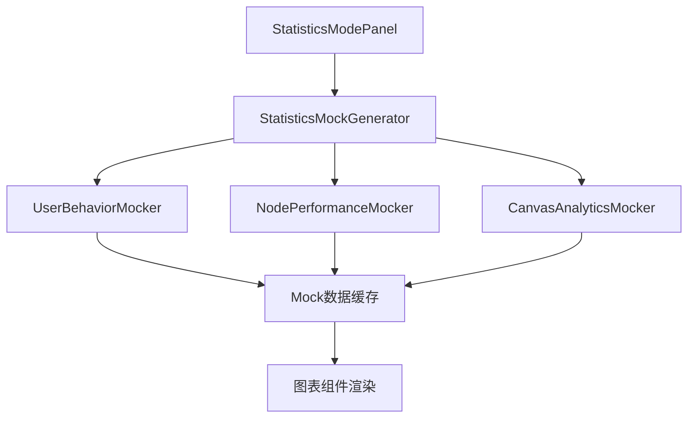

# 统计模式Mock数据生成器技术方案

## 1. 概述

本文档详细描述画布统计模式的前端Mock数据生成实现方案，通过纯前端模拟数据替代后端API，实现完整的统计功能展示。

## 2. 核心架构

### 2.1 Mock数据生成器架构



### 2.2 技术栈

- **前端框架**: Vue 3 + Composition API
- **图表库**: ECharts 或 Chart.js
- **数据生成**: 自定义Mock生成器
- **缓存机制**: LocalStorage + 内存缓存
- **时间处理**: Day.js

## 3. Mock数据生成器实现

### 3.1 核心生成器类

```javascript
// StatisticsMockGenerator.js
class StatisticsMockGenerator {
  constructor() {
    this.cache = new Map();
    this.cacheExpiry = 5 * 60 * 1000; // 5分钟缓存
  }

  generateStatistics(canvasId, options = {}) {
    const cacheKey = `${canvasId}_${JSON.stringify(options)}`;
    
    // 检查缓存
    if (this.cache.has(cacheKey)) {
      const cached = this.cache.get(cacheKey);
      if (Date.now() - cached.timestamp < this.cacheExpiry) {
        return cached.data;
      }
    }

    // 生成新数据
    const data = {
      userBehavior: this.generateUserBehaviorData(options),
      nodePerformance: this.generateNodePerformanceData(options),
      canvasAnalytics: this.generateCanvasAnalyticsData(options)
    };

    // 缓存数据
    this.cache.set(cacheKey, {
      data,
      timestamp: Date.now()
    });

    return data;
  }

  generateUserBehaviorData(options) {
    const { timeRange = 'week', userId } = options;
    const days = this.getTimeRangeDays(timeRange);
    
    return {
      userPaths: this.generateUserPaths(days, userId),
      sessionData: this.generateSessionData(days),
      interactionHeatmap: this.generateInteractionHeatmap()
    };
  }

  generateNodePerformanceData(options) {
    const { timeRange = 'week', nodeType } = options;
    const days = this.getTimeRangeDays(timeRange);
    
    return {
      executionStats: this.generateExecutionStats(days, nodeType),
      successRates: this.generateSuccessRates(days),
      performanceMetrics: this.generatePerformanceMetrics(days)
    };
  }

  generateCanvasAnalyticsData(options) {
    const { timeRange = 'week' } = options;
    const days = this.getTimeRangeDays(timeRange);
    
    return {
      overallStats: this.generateOverallStats(days),
      trendData: this.generateTrendData(days),
      comparisonData: this.generateComparisonData(days)
    };
  }
}
```

### 3.2 用户行为数据模拟器

```javascript
// UserBehaviorMocker.js
class UserBehaviorMocker {
  generateUserPaths(days, userId) {
    const paths = [];
    const nodeTypes = ['start', 'condition', 'action', 'split', 'end'];
    
    for (let i = 0; i < days; i++) {
      const date = new Date();
      date.setDate(date.getDate() - i);
      
      const dailyPaths = this.generateDailyPaths(date, nodeTypes, userId);
      paths.push(...dailyPaths);
    }
    
    return paths;
  }

  generateDailyPaths(date, nodeTypes, userId) {
    const pathCount = Math.floor(Math.random() * 20) + 5; // 5-25条路径
    const paths = [];
    
    for (let i = 0; i < pathCount; i++) {
      const path = {
        id: `path_${date.getTime()}_${i}`,
        userId: userId || `user_${Math.floor(Math.random() * 100)}`,
        timestamp: new Date(date.getTime() + Math.random() * 24 * 60 * 60 * 1000),
        nodes: this.generatePathNodes(nodeTypes),
        duration: Math.floor(Math.random() * 300) + 30, // 30-330秒
        success: Math.random() > 0.1 // 90%成功率
      };
      paths.push(path);
    }
    
    return paths;
  }

  generatePathNodes(nodeTypes) {
    const pathLength = Math.floor(Math.random() * 5) + 3; // 3-8个节点
    const nodes = [];
    
    for (let i = 0; i < pathLength; i++) {
      nodes.push({
        nodeId: `node_${Math.floor(Math.random() * 20)}`,
        nodeType: nodeTypes[Math.floor(Math.random() * nodeTypes.length)],
        executionTime: Math.floor(Math.random() * 50) + 10, // 10-60ms
        timestamp: Date.now() + i * 1000
      });
    }
    
    return nodes;
  }

  generateSessionData(days) {
    return days.map(day => ({
      date: day,
      sessions: Math.floor(Math.random() * 50) + 20,
      uniqueUsers: Math.floor(Math.random() * 30) + 15,
      avgSessionDuration: Math.floor(Math.random() * 180) + 60
    }));
  }

  generateInteractionHeatmap() {
    const heatmapData = [];
    for (let x = 0; x < 24; x++) { // 24小时
      for (let y = 0; y < 7; y++) { // 7天
        heatmapData.push({
          hour: x,
          day: y,
          value: Math.floor(Math.random() * 100)
        });
      }
    }
    return heatmapData;
  }
}
```

### 3.3 节点性能数据模拟器

```javascript
// NodePerformanceMocker.js
class NodePerformanceMocker {
  generateExecutionStats(days, nodeType) {
    const nodeTypes = nodeType ? [nodeType] : ['start', 'condition', 'action', 'split', 'end'];
    const stats = [];
    
    nodeTypes.forEach(type => {
      days.forEach(day => {
        stats.push({
          date: day,
          nodeType: type,
          executions: Math.floor(Math.random() * 200) + 50,
          avgExecutionTime: Math.floor(Math.random() * 100) + 20,
          successCount: Math.floor(Math.random() * 180) + 45,
          errorCount: Math.floor(Math.random() * 10)
        });
      });
    });
    
    return stats;
  }

  generateSuccessRates(days) {
    return days.map(day => ({
      date: day,
      successRate: 0.85 + Math.random() * 0.1, // 85-95%
      totalExecutions: Math.floor(Math.random() * 500) + 100,
      errors: Math.floor(Math.random() * 20) + 5
    }));
  }

  generatePerformanceMetrics(days) {
    return days.map(day => ({
      date: day,
      avgResponseTime: Math.floor(Math.random() * 200) + 50,
      p95ResponseTime: Math.floor(Math.random() * 500) + 200,
      throughput: Math.floor(Math.random() * 1000) + 500,
      errorRate: Math.random() * 0.05 // 0-5%
    }));
  }
}
```

## 4. 前端组件集成

### 4.1 统计模式面板组件

```vue
<!-- StatisticsModePanel.vue -->
<template>
  <div class="statistics-mode-panel">
    <div class="query-controls">
      <QueryInterface 
        @query-change="handleQueryChange"
        :loading="loading"
      />
    </div>
    
    <div class="charts-container">
      <UserBehaviorChart 
        :data="statisticsData.userBehavior"
        :loading="loading"
      />
      <NodePerformanceChart 
        :data="statisticsData.nodePerformance"
        :loading="loading"
      />
      <CanvasAnalyticsChart 
        :data="statisticsData.canvasAnalytics"
        :loading="loading"
      />
    </div>
  </div>
</template>

<script setup>
import { ref, reactive, onMounted } from 'vue';
import { StatisticsMockGenerator } from '@/utils/StatisticsMockGenerator';

const mockGenerator = new StatisticsMockGenerator();
const loading = ref(false);
const statisticsData = reactive({
  userBehavior: null,
  nodePerformance: null,
  canvasAnalytics: null
});

const handleQueryChange = async (queryOptions) => {
  loading.value = true;
  
  try {
    // 模拟API调用延迟
    await new Promise(resolve => setTimeout(resolve, 500));
    
    const data = mockGenerator.generateStatistics('canvas_123', queryOptions);
    Object.assign(statisticsData, data);
  } catch (error) {
    console.error('生成统计数据失败:', error);
  } finally {
    loading.value = false;
  }
};

onMounted(() => {
  handleQueryChange({ timeRange: 'week' });
});
</script>
```

### 4.2 实时数据更新模拟

```javascript
// RealtimeDataSimulator.js
class RealtimeDataSimulator {
  constructor(mockGenerator, updateCallback) {
    this.mockGenerator = mockGenerator;
    this.updateCallback = updateCallback;
    this.intervalId = null;
    this.isRunning = false;
  }

  start(interval = 30000) { // 30秒更新一次
    if (this.isRunning) return;
    
    this.isRunning = true;
    this.intervalId = setInterval(() => {
      this.generateRealtimeUpdate();
    }, interval);
  }

  stop() {
    if (this.intervalId) {
      clearInterval(this.intervalId);
      this.intervalId = null;
    }
    this.isRunning = false;
  }

  generateRealtimeUpdate() {
    const realtimeData = {
      timestamp: Date.now(),
      newExecutions: Math.floor(Math.random() * 10) + 1,
      currentUsers: Math.floor(Math.random() * 20) + 5,
      systemLoad: Math.random() * 0.8 + 0.1
    };
    
    this.updateCallback(realtimeData);
  }
}
```

## 5. 数据缓存策略

### 5.1 多层缓存机制

```javascript
// CacheManager.js
class CacheManager {
  constructor() {
    this.memoryCache = new Map();
    this.localStoragePrefix = 'canvas_statistics_';
    this.maxMemoryCacheSize = 50;
    this.defaultTTL = 5 * 60 * 1000; // 5分钟
  }

  set(key, data, ttl = this.defaultTTL) {
    const cacheItem = {
      data,
      timestamp: Date.now(),
      ttl
    };
    
    // 内存缓存
    this.memoryCache.set(key, cacheItem);
    
    // 清理过期的内存缓存
    this.cleanupMemoryCache();
    
    // 持久化缓存
    try {
      localStorage.setItem(
        this.localStoragePrefix + key,
        JSON.stringify(cacheItem)
      );
    } catch (error) {
      console.warn('LocalStorage缓存失败:', error);
    }
  }

  get(key) {
    // 优先从内存缓存获取
    let cacheItem = this.memoryCache.get(key);
    
    // 如果内存缓存没有，尝试从LocalStorage获取
    if (!cacheItem) {
      try {
        const stored = localStorage.getItem(this.localStoragePrefix + key);
        if (stored) {
          cacheItem = JSON.parse(stored);
          // 重新加载到内存缓存
          this.memoryCache.set(key, cacheItem);
        }
      } catch (error) {
        console.warn('LocalStorage读取失败:', error);
      }
    }
    
    // 检查是否过期
    if (cacheItem && Date.now() - cacheItem.timestamp < cacheItem.ttl) {
      return cacheItem.data;
    }
    
    // 清理过期缓存
    this.delete(key);
    return null;
  }

  delete(key) {
    this.memoryCache.delete(key);
    localStorage.removeItem(this.localStoragePrefix + key);
  }

  cleanupMemoryCache() {
    if (this.memoryCache.size <= this.maxMemoryCacheSize) return;
    
    // 按时间戳排序，删除最旧的缓存
    const entries = Array.from(this.memoryCache.entries())
      .sort((a, b) => a[1].timestamp - b[1].timestamp);
    
    const deleteCount = this.memoryCache.size - this.maxMemoryCacheSize;
    for (let i = 0; i < deleteCount; i++) {
      this.memoryCache.delete(entries[i][0]);
    }
  }
}
```

## 6. 使用示例

### 6.1 基本使用

```javascript
// 在Vue组件中使用
import { StatisticsMockGenerator } from '@/utils/StatisticsMockGenerator';

const mockGenerator = new StatisticsMockGenerator();

// 生成统计数据
const statisticsData = mockGenerator.generateStatistics('canvas_123', {
  timeRange: 'week',
  nodeType: 'condition',
  userId: 'user_456'
});

console.log('用户行为数据:', statisticsData.userBehavior);
console.log('节点性能数据:', statisticsData.nodePerformance);
console.log('画布分析数据:', statisticsData.canvasAnalytics);
```

### 6.2 实时更新使用

```javascript
// 启动实时数据模拟
const realtimeSimulator = new RealtimeDataSimulator(
  mockGenerator,
  (realtimeData) => {
    // 更新UI
    updateRealtimeDisplay(realtimeData);
  }
);

realtimeSimulator.start(30000); // 30秒更新一次

// 组件销毁时停止
onUnmounted(() => {
  realtimeSimulator.stop();
});
```

## 7. 技术特点

### 7.1 优势

- **零后端依赖**: 完全前端实现，无需后端API支持
- **真实数据模拟**: 生成的数据具有真实性和合理性
- **高性能缓存**: 多层缓存机制，提升查询响应速度
- **灵活配置**: 支持多维度查询条件和数据筛选
- **实时更新**: 模拟实时数据变化，提供动态体验

### 7.2 适用场景

- 产品演示和原型展示
- 前端开发和测试阶段
- 功能验证和用户体验测试
- 后端API开发完成前的前端开发

## 8. 扩展性考虑

### 8.1 数据源切换

```javascript
// DataSourceAdapter.js
class DataSourceAdapter {
  constructor(useMockData = true) {
    this.useMockData = useMockData;
    this.mockGenerator = new StatisticsMockGenerator();
  }

  async getStatistics(canvasId, options) {
    if (this.useMockData) {
      // 使用Mock数据
      return this.mockGenerator.generateStatistics(canvasId, options);
    } else {
      // 使用真实API
      return await this.fetchRealStatistics(canvasId, options);
    }
  }

  async fetchRealStatistics(canvasId, options) {
    // 真实API调用逻辑
    const response = await fetch(`/api/canvas/${canvasId}/statistics`, {
      method: 'POST',
      headers: { 'Content-Type': 'application/json' },
      body: JSON.stringify(options)
    });
    return response.json();
  }
}
```

### 8.2 配置管理

```javascript
// MockConfig.js
export const mockConfig = {
  // 数据生成配置
  dataGeneration: {
    userPathsPerDay: { min: 5, max: 25 },
    nodeExecutionsPerDay: { min: 50, max: 200 },
    successRate: { min: 0.85, max: 0.95 },
    responseTime: { min: 50, max: 200 }
  },
  
  // 缓存配置
  cache: {
    memoryTTL: 5 * 60 * 1000, // 5分钟
    localStorageTTL: 30 * 60 * 1000, // 30分钟
    maxMemorySize: 50
  },
  
  // 实时更新配置
  realtime: {
    updateInterval: 30000, // 30秒
    enabled: true
  }
};
```

通过这套完整的Mock数据生成方案，可以在不依赖后端的情况下，实现功能完整、体验流畅的统计模式功能。