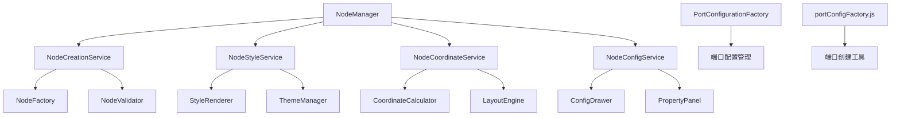
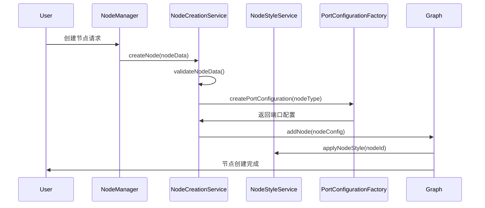

# 节点核心功能分析报告

## 📋 概述

本报告深入分析了画布系统中节点（Node）的核心功能实现，包括节点创建、样式管理、加载机制、端口系统、坐标计算逻辑、删除操作和节点配置等关键功能模块。

## 🏗️ 系统架构

### 1.1 核心组件架构



### 1.2 节点生命周期管理



## 🎯 核心功能模块

### 2.1 节点创建系统

#### 🏭 NodeCreationService 节点创建服务

**核心职责：**
- 节点数据验证和预处理
- 节点实例化和初始化
- 节点添加到画布图形实例
- 节点创建后的回调处理

**关键方法：**

```javascript
// 节点创建主方法
async createNode(nodeData, options = {}) {
  try {
    // 1. 数据验证
    const validatedData = await this.validateNodeData(nodeData)
    
    // 2. 生成节点配置
    const nodeConfig = this.generateNodeConfig(validatedData, options)
    
    // 3. 创建节点实例
    const nodeInstance = await this.createNodeInstance(nodeConfig)
    
    // 4. 添加到画布
    const addedNode = await this.addNodeToGraph(nodeInstance)
    
    // 5. 初始化节点功能
    await this.initializeNodeFeatures(addedNode)
    
    console.log('[NodeCreationService] ✅ 节点创建成功:', addedNode.id)
    return addedNode
    
  } catch (error) {
    console.error('[NodeCreationService] ❌ 节点创建失败:', error)
    throw error
  }
}

// 节点数据验证
validateNodeData(nodeData) {
  const requiredFields = ['type', 'position']
  const missingFields = requiredFields.filter(field => !nodeData[field])
  
  if (missingFields.length > 0) {
    throw new Error(`缺少必需字段: ${missingFields.join(', ')}`)
  }
  
  // 位置验证
  if (!nodeData.position.x || !nodeData.position.y) {
    throw new Error('节点位置坐标无效')
  }
  
  return {
    ...nodeData,
    id: nodeData.id || this.generateNodeId(),
    timestamp: Date.now()
  }
}

// 生成节点配置
generateNodeConfig(nodeData, options) {
  return {
    id: nodeData.id,
    shape: this.getNodeShape(nodeData.type),
    x: nodeData.position.x,
    y: nodeData.position.y,
    width: nodeData.width || this.getDefaultWidth(nodeData.type),
    height: nodeData.height || this.getDefaultHeight(nodeData.type),
    data: {
      ...nodeData,
      ...options.additionalData
    },
    ports: this.generateNodePorts(nodeData.type),
    attrs: this.generateNodeAttrs(nodeData.type, nodeData.style)
  }
}
```

#### 🎨 节点样式生成

```javascript
// 生成节点属性
generateNodeAttrs(nodeType, customStyle = {}) {
  const baseAttrs = {
    body: {
      stroke: '#d9d9d9',
      strokeWidth: 1,
      fill: '#ffffff',
      rx: 6,
      ry: 6
    },
    label: {
      fontSize: 12,
      fill: '#333333',
      textAnchor: 'middle',
      textVerticalAnchor: 'middle'
    }
  }
  
  // 根据节点类型应用特定样式
  const typeSpecificAttrs = this.getTypeSpecificAttrs(nodeType)
  
  // 合并自定义样式
  return this.mergeAttrs(baseAttrs, typeSpecificAttrs, customStyle)
}

// 获取类型特定属性
getTypeSpecificAttrs(nodeType) {
  const typeAttrs = {
    'start': {
      body: { fill: '#e6f7ff', stroke: '#1890ff' },
      label: { fill: '#1890ff' }
    },
    'process': {
      body: { fill: '#f6ffed', stroke: '#52c41a' },
      label: { fill: '#52c41a' }
    },
    'decision': {
      body: { fill: '#fff7e6', stroke: '#fa8c16' },
      label: { fill: '#fa8c16' }
    },
    'end': {
      body: { fill: '#fff1f0', stroke: '#f5222d' },
      label: { fill: '#f5222d' }
    }
  }
  
  return typeAttrs[nodeType] || {}
}
```

### 2.2 节点样式管理系统

#### 🎨 NodeStyleService 样式服务

**核心职责：**
- 节点样式主题管理
- 动态样式更新
- 样式状态管理（选中、悬停、禁用等）
- 自定义样式支持

**关键功能：**

```javascript
class NodeStyleService {
  constructor(graph) {
    this.graph = graph
    this.themeManager = new ThemeManager()
    this.styleCache = new Map()
  }
  
  // 应用节点样式
  applyNodeStyle(nodeId, styleConfig = {}) {
    const node = this.graph.getCellById(nodeId)
    if (!node) {
      console.error('[NodeStyleService] 节点不存在:', nodeId)
      return false
    }
    
    try {
      // 获取当前主题样式
      const themeStyle = this.themeManager.getNodeThemeStyle(node.getData().type)
      
      // 合并样式配置
      const finalStyle = this.mergeStyles(themeStyle, styleConfig)
      
      // 应用样式到节点
      node.setAttrs(finalStyle)
      
      // 缓存样式
      this.styleCache.set(nodeId, finalStyle)
      
      console.log('[NodeStyleService] ✅ 样式应用成功:', nodeId)
      return true
      
    } catch (error) {
      console.error('[NodeStyleService] ❌ 样式应用失败:', error)
      return false
    }
  }
  
  // 更新节点状态样式
  updateNodeState(nodeId, state, active = true) {
    const node = this.graph.getCellById(nodeId)
    if (!node) return false
    
    const stateStyles = {
      selected: {
        body: { stroke: '#1890ff', strokeWidth: 2 }
      },
      hover: {
        body: { stroke: '#40a9ff', strokeWidth: 1.5 }
      },
      disabled: {
        body: { opacity: 0.5 },
        label: { opacity: 0.5 }
      },
      error: {
        body: { stroke: '#f5222d', strokeWidth: 2 }
      }
    }
    
    if (active && stateStyles[state]) {
      node.setAttrs(stateStyles[state])
    } else {
      // 恢复原始样式
      const originalStyle = this.styleCache.get(nodeId)
      if (originalStyle) {
        node.setAttrs(originalStyle)
      }
    }
    
    return true
  }
  
  // 批量更新样式
  batchUpdateStyles(nodeIds, styleConfig) {
    const results = nodeIds.map(nodeId => {
      return this.applyNodeStyle(nodeId, styleConfig)
    })
    
    const successCount = results.filter(Boolean).length
    console.log(`[NodeStyleService] 批量样式更新完成: ${successCount}/${nodeIds.length}`)
    
    return results
  }
}
```

### 2.3 节点端口系统

#### ✅ 端口配置系统

**实际实现方式：**
- 使用 `PortConfigurationFactory.js` 进行端口配置
- 通过 `portConfigFactory.js` 管理端口创建
- 在 X6 图形引擎层面处理端口交互
- 端口连接验证通过画布验证系统实现

#### ⚠️ 【严重问题】节点类型定义不一致性分析

**问题概述：**
经过深入分析，发现系统中存在严重的节点类型定义不一致问题，这可能导致端口配置错误、功能异常和维护困难。

**1. 实际画布支持的节点类型**（来自 `nodeTypes.js` 和测试配置）：
```javascript
const ACTUAL_SUPPORTED_TYPES = [
  'start',           // 开始节点
  'audience-split',  // 人群分流
  'event-split',     // 事件分流
  'sms',            // 短信触达
  'email',          // 邮件触达
  'wechat',         // 微信触达
  'ai-call',        // AI外呼
  'manual-call',    // 人工外呼
  'ab-test',        // AB测试
  'condition',      // 条件判断
  'wait',           // 等待节点
  'benefit',        // 权益节点
  'end'             // 结束节点
]
```

**2. PortConfigurationFactory中定义的默认节点类型**：
```javascript
const PORT_FACTORY_TYPES = [
  'start', 'end', 'action', 'condition', 'delay', 'webhook',
  'audience-split', 'event-split', 'ab-test', 'email', 'sms'
]
```

**3. TypeScript类型定义文件 `canvas.d.ts` 中的NodeType**：
```typescript
export type NodeType = 
  | 'start' | 'end' | 'audience-split' | 'event-split' 
  | 'ab-test' | 'message' | 'delay' | 'condition'
```

**4. NodePortService示例代码中使用的类型**：
```javascript
const EXAMPLE_TYPES = ['start', 'process', 'decision', 'end']
```

#### 🚨 发现的具体不一致问题

| 问题类型 | 具体问题 | 影响范围 |
|---------|---------|----------|
| **缺失类型** | PortConfigurationFactory缺少：`ai-call`, `manual-call`, `wechat`, `wait`, `benefit` | 这些节点的端口配置可能失效 |
| **多余类型** | PortConfigurationFactory包含：`action`, `delay`, `webhook` | 无用的配置代码，增加维护负担 |
| **命名不一致** | canvas.d.ts中的`message`对应实际的`sms` | 类型检查失效 |
| **类型不一致** | 不同文件中节点类型定义存在差异 | 功能不一致，维护困难 |

#### 🔧 标准化修复方案

**1. 统一节点类型定义**
```javascript
// 建议的标准节点类型定义
export const STANDARD_NODE_TYPES = {
  // 流程控制节点
  START: 'start',
  END: 'end',
  
  // 分流节点
  AUDIENCE_SPLIT: 'audience-split',
  EVENT_SPLIT: 'event-split',
  AB_TEST: 'ab-test',
  CONDITION: 'condition',
  
  // 触达节点
  SMS: 'sms',
  EMAIL: 'email',
  WECHAT: 'wechat',
  AI_CALL: 'ai-call',
  MANUAL_CALL: 'manual-call',
  
  // 功能节点
  WAIT: 'wait',
  BENEFIT: 'benefit'
}
```

**2. 更新PortConfigurationFactory**
```javascript
// 修复后的默认节点类型配置
const CORRECTED_DEFAULT_TYPES = [
  'start', 'end', 'audience-split', 'event-split', 'ab-test',
  'condition', 'sms', 'email', 'wechat', 'ai-call', 'manual-call',
  'wait', 'benefit'
]
```

**3. 更新TypeScript类型定义**
```typescript
// 修复后的NodeType定义
export type NodeType = 
  | 'start' | 'end'
  | 'audience-split' | 'event-split' | 'ab-test' | 'condition'
  | 'sms' | 'email' | 'wechat' | 'ai-call' | 'manual-call'
  | 'wait' | 'benefit'
```

#### 📋 修复优先级和建议

**高优先级修复：**
1. ✅ 更新 `PortConfigurationFactory.js` 中的默认节点类型列表
2. ✅ 修复 `canvas.d.ts` 中的 TypeScript 类型定义
3. ✅ 更新所有示例代码中的节点类型引用

**中优先级修复：**
1. 🔄 创建统一的节点类型常量文件
2. 🔄 添加节点类型验证中间件
3. 🔄 更新相关测试用例

**低优先级改进：**
1. 📝 完善节点类型文档
2. 📝 添加类型迁移指南
3. 📝 建立类型定义维护规范

#### 🎨 样式配置文件中的节点类型一致性分析

**发现的样式配置文件：**

**1. `/src/utils/nodeTypes.js` - 节点样式主配置文件**
```javascript
// ✅ 正确：包含完整的实际支持节点类型
const STYLE_SUPPORTED_TYPES = [
  'start', 'audience-split', 'event-split', 'sms', 'email', 'wechat',
  'ai-call', 'manual-call', 'ab-test', 'condition', 'wait', 'benefit', 
  'task', 'end'
]
```

**2. `/src/pages/marketing/tasks/utils/canvas/canvasConfig.js` - 画布配置文件**
```javascript
// ✅ 正确：通过引用其他配置文件保持一致性
import { createPortConfig } from './portConfigFactory.js'
const { getPortGroups } = require('./x6Config.js')
```

**3. `/src/pages/marketing/tasks/utils/canvas/x6Config.js` - X6引擎配置文件**
```javascript
// ✅ 正确：通用配置，不依赖特定节点类型
export const getNodeStyles = (nodeType, nodeConfig) => {
  // 动态处理任何节点类型
}
```

#### 🔍 样式配置一致性评估

| 配置文件 | 节点类型定义方式 | 一致性状态 | 问题描述 |
|---------|-----------------|-----------|----------|
| **nodeTypes.js** | ✅ 完整枚举所有类型 | 🟢 良好 | 包含所有实际支持的节点类型 |
| **canvasConfig.js** | ✅ 引用其他配置 | 🟢 良好 | 通过引用保持一致性 |
| **x6Config.js** | ✅ 动态处理 | 🟢 良好 | 不硬编码节点类型 |
| **PortConfigurationFactory** | ❌ 硬编码部分类型 | 🔴 严重 | 缺少新增节点类型 |
| **canvas.d.ts** | ❌ 类型定义不完整 | 🔴 严重 | TypeScript类型过时 |

#### 🎯 样式系统修复建议

**1. 建立统一的节点类型常量文件**
```javascript
// 建议创建：/src/constants/nodeTypes.js
export const NODE_TYPES = {
  // 流程控制
  START: 'start',
  END: 'end',
  
  // 分流节点  
  AUDIENCE_SPLIT: 'audience-split',
  EVENT_SPLIT: 'event-split',
  AB_TEST: 'ab-test',
  CONDITION: 'condition',
  
  // 触达节点
  SMS: 'sms',
  EMAIL: 'email', 
  WECHAT: 'wechat',
  AI_CALL: 'ai-call',
  MANUAL_CALL: 'manual-call',
  
  // 功能节点
  WAIT: 'wait',
  BENEFIT: 'benefit',
  TASK: 'task'
}

export const NODE_TYPE_ARRAY = Object.values(NODE_TYPES)
```

**2. 更新所有配置文件引用统一常量**
```javascript
// nodeTypes.js 中使用
import { NODE_TYPES } from '../constants/nodeTypes.js'

export const nodeTypes = {
  [NODE_TYPES.START]: { /* 配置 */ },
  [NODE_TYPES.SMS]: { /* 配置 */ },
  // ...
}
```

**3. 添加节点类型验证中间件**
```javascript
// 建议创建：/src/utils/nodeTypeValidator.js
import { NODE_TYPE_ARRAY } from '../constants/nodeTypes.js'

export const validateNodeType = (nodeType) => {
  if (!NODE_TYPE_ARRAY.includes(nodeType)) {
    throw new Error(`不支持的节点类型: ${nodeType}`)
  }
  return true
}
```

#### 📊 修复影响评估

| 修复项目 | 影响范围 | 风险等级 | 预计工作量 |
|---------|---------|---------|-----------|
| 统一节点类型常量 | 🔴 全系统 | 🟡 中等 | 2-3小时 |
| 更新PortConfigurationFactory | 🟡 端口配置 | 🟢 低 | 1小时 |
| 修复TypeScript类型定义 | 🟡 类型检查 | 🟢 低 | 30分钟 |
| 添加类型验证 | 🟢 错误预防 | 🟢 低 | 1小时 |

#### ✅ 样式系统优势

**当前样式系统的优点：**
1. **nodeTypes.js 配置完整** - 包含所有实际支持的节点类型
2. **动态样式处理** - x6Config.js 支持任意节点类型的样式生成
3. **配置分离良好** - 样式、端口、画布配置分别管理
4. **扩展性强** - 新增节点类型只需在 nodeTypes.js 中添加配置

**需要改进的地方：**
1. **类型定义滞后** - TypeScript 类型定义需要同步更新
2. **端口配置不完整** - PortConfigurationFactory 缺少新节点类型
3. **缺少统一常量** - 各文件中硬编码节点类型字符串

**端口配置生成：**

**端口配置实现：**

```javascript
// 实际端口功能通过 PortConfigurationFactory 实现
// 位置：src/pages/marketing/tasks/utils/canvas/PortConfigurationFactory.js
export class PortConfigurationFactory {
  static createPortConfig(nodeType, options = {}) {
    // 根据节点类型创建端口配置
    return this.getPortConfigByType(nodeType, options)
  }
  
  static getPortConfigByType(nodeType, options) {
    // 支持的节点类型：start, end, audience-split, event-split, sms, ai-call, manual-call, ab-test, wait
    const configs = {
      'start': { /* 开始节点端口配置 */ },
      'end': { /* 结束节点端口配置 */ },
      'audience-split': { /* 人群分流端口配置 */ },
      'event-split': { /* 事件分流端口配置 */ },
      'sms': { /* 短信触达端口配置 */ },
      'ai-call': { /* AI外呼端口配置 */ },
      'manual-call': { /* 人工外呼端口配置 */ },
      'ab-test': { /* AB实验端口配置 */ },
      'wait': { /* 等待节点端口配置 */ }
    }
    
    return configs[nodeType] || configs['start']
  }
}
```

### 2.4 节点坐标计算系统

#### 📐 NodeCoordinateService 坐标服务

**核心职责：**
- 节点位置计算和管理
- 自动布局算法
- 坐标变换和缩放
- 碰撞检测和避让

**关键功能：**

```javascript
class NodeCoordinateService {
  constructor(graph) {
    this.graph = graph
    this.layoutEngine = new LayoutEngine()
    this.gridSize = 20
    this.snapToGrid = true
  }
  
  // 计算节点位置
  calculateNodePosition(nodeData, options = {}) {
    let position = { x: 0, y: 0 }
    
    if (nodeData.position) {
      position = { ...nodeData.position }
    } else if (options.autoPosition) {
      position = this.calculateAutoPosition(nodeData.type, options)
    } else {
      position = this.getDefaultPosition(nodeData.type)
    }
    
    // 网格对齐
    if (this.snapToGrid) {
      position = this.snapPositionToGrid(position)
    }
    
    // 碰撞检测
    if (options.avoidCollision) {
      position = this.avoidCollision(position, nodeData)
    }
    
    return position
  }
  
  // 自动位置计算
  calculateAutoPosition(nodeType, options) {
    const existingNodes = this.graph.getNodes()
    
    if (existingNodes.length === 0) {
      return { x: 100, y: 100 }
    }
    
    // 根据节点类型确定位置策略
    switch (nodeType) {
      case 'start':
        return this.calculateStartNodePosition()
      case 'end':
        return this.calculateEndNodePosition()
      default:
        return this.calculateProcessNodePosition(options)
    }
  }
  
  // 起始节点位置计算
  calculateStartNodePosition() {
    const startNodes = this.graph.getNodes().filter(node => 
      node.getData().type === 'start'
    )
    
    if (startNodes.length === 0) {
      return { x: 50, y: 200 }
    }
    
    // 如果已有起始节点，在下方创建新的
    const lastStartNode = startNodes[startNodes.length - 1]
    const lastPosition = lastStartNode.getPosition()
    
    return {
      x: lastPosition.x,
      y: lastPosition.y + 150
    }
  }
  
  // 处理节点位置计算
  calculateProcessNodePosition(options) {
    const { referenceNodeId, direction = 'right', offset = 200 } = options
    
    if (referenceNodeId) {
      const referenceNode = this.graph.getCellById(referenceNodeId)
      if (referenceNode) {
        const refPosition = referenceNode.getPosition()
        const refSize = referenceNode.getSize()
        
        const directionOffsets = {
          right: { x: refSize.width + offset, y: 0 },
          left: { x: -offset, y: 0 },
          bottom: { x: 0, y: refSize.height + offset },
          top: { x: 0, y: -offset }
        }
        
        const offsetVector = directionOffsets[direction] || directionOffsets.right
        
        return {
          x: refPosition.x + offsetVector.x,
          y: refPosition.y + offsetVector.y
        }
      }
    }
    
    // 默认位置计算
    return this.calculateDefaultProcessPosition()
  }
  
  // 网格对齐
  snapPositionToGrid(position) {
    return {
      x: Math.round(position.x / this.gridSize) * this.gridSize,
      y: Math.round(position.y / this.gridSize) * this.gridSize
    }
  }
  
  // 碰撞避让
  avoidCollision(position, nodeData) {
    const nodeSize = {
      width: nodeData.width || 120,
      height: nodeData.height || 60
    }
    
    const existingNodes = this.graph.getNodes()
    let adjustedPosition = { ...position }
    let attempts = 0
    const maxAttempts = 50
    
    while (attempts < maxAttempts) {
      const hasCollision = existingNodes.some(node => {
        const nodePos = node.getPosition()
        const nodeSize = node.getSize()
        
        return this.checkRectangleCollision(
          adjustedPosition, nodeSize,
          nodePos, nodeSize
        )
      })
      
      if (!hasCollision) {
        break
      }
      
      // 调整位置
      adjustedPosition.x += this.gridSize
      if (adjustedPosition.x > 800) {
        adjustedPosition.x = position.x
        adjustedPosition.y += this.gridSize * 2
      }
      
      attempts++
    }
    
    return adjustedPosition
  }
  
  // 矩形碰撞检测
  checkRectangleCollision(pos1, size1, pos2, size2) {
    const margin = 10 // 最小间距
    
    return !(
      pos1.x + size1.width + margin < pos2.x ||
      pos2.x + size2.width + margin < pos1.x ||
      pos1.y + size1.height + margin < pos2.y ||
      pos2.y + size2.height + margin < pos1.y
    )
  }
}
```

### 2.5 节点删除系统

#### 🗑️ 节点删除服务

**核心功能：**

```javascript
class NodeDeletionService {
  constructor(graph, unifiedEdgeManager) {
    this.graph = graph
    this.unifiedEdgeManager = unifiedEdgeManager
  }
  
  // 删除单个节点
  async deleteNode(nodeId, options = {}) {
    try {
      const node = this.graph.getCellById(nodeId)
      if (!node) {
        console.warn('[NodeDeletionService] 节点不存在:', nodeId)
        return false
      }
      
      // 1. 清理相关连接
      await this.cleanupNodeConnections(nodeId)
      
      // 2. 清理预览线
      await this.cleanupNodePreviewLines(nodeId)
      
      // 3. 清理节点配置
      await this.cleanupNodeConfig(nodeId)
      
      // 4. 从画布移除节点
      this.graph.removeCell(node)
      
      console.log('[NodeDeletionService] ✅ 节点删除成功:', nodeId)
      return true
      
    } catch (error) {
      console.error('[NodeDeletionService] ❌ 节点删除失败:', error)
      return false
    }
  }
  
  // 清理节点连接
  async cleanupNodeConnections(nodeId) {
    const connectedEdges = this.graph.getConnectedEdges(nodeId)
    
    for (const edge of connectedEdges) {
      try {
        this.graph.removeCell(edge)
        console.log('[NodeDeletionService] 清理连接:', edge.id)
      } catch (error) {
        console.error('[NodeDeletionService] 清理连接失败:', error)
      }
    }
  }
  
  // 清理节点预览线
  async cleanupNodePreviewLines(nodeId) {
    if (!this.unifiedEdgeManager) {
      console.warn('[NodeDeletionService] UnifiedEdgeManager不可用')
      return
    }
    
    try {
      await this.unifiedEdgeManager.cleanupNodePreviewLines(nodeId)
      console.log('[NodeDeletionService] ✅ 预览线清理成功:', nodeId)
    } catch (error) {
      console.error('[NodeDeletionService] ❌ 预览线清理失败:', error)
    }
  }
  
  // 批量删除节点
  async batchDeleteNodes(nodeIds, options = {}) {
    const results = []
    
    for (const nodeId of nodeIds) {
      const result = await this.deleteNode(nodeId, options)
      results.push({ nodeId, success: result })
    }
    
    const successCount = results.filter(r => r.success).length
    console.log(`[NodeDeletionService] 批量删除完成: ${successCount}/${nodeIds.length}`)
    
    return results
  }
}
```

### 2.6 节点配置系统

#### ⚙️ NodeConfigService 配置服务

**核心功能：**

```javascript
class NodeConfigService {
  constructor(graph) {
    this.graph = graph
    this.configDrawer = null
    this.configCache = new Map()
  }
  
  // 打开节点配置
  openNodeConfig(nodeId) {
    const node = this.graph.getCellById(nodeId)
    if (!node) {
      console.error('[NodeConfigService] 节点不存在:', nodeId)
      return false
    }
    
    try {
      const nodeData = node.getData()
      const configSchema = this.getConfigSchema(nodeData.type)
      
      // 打开配置抽屉
      if (this.configDrawer) {
        this.configDrawer.open({
          nodeId,
          nodeData,
          configSchema,
          onSave: (updatedConfig) => this.saveNodeConfig(nodeId, updatedConfig),
          onCancel: () => this.configDrawer.close()
        })
      }
      
      return true
    } catch (error) {
      console.error('[NodeConfigService] 打开配置失败:', error)
      return false
    }
  }
  
  // 保存节点配置
  saveNodeConfig(nodeId, configData) {
    const node = this.graph.getCellById(nodeId)
    if (!node) return false
    
    try {
      // 验证配置数据
      const validatedConfig = this.validateConfigData(configData)
      
      // 更新节点数据
      node.setData({
        ...node.getData(),
        ...validatedConfig
      })
      
      // 更新节点样式（如果需要）
      if (validatedConfig.style) {
        node.setAttrs(validatedConfig.style)
      }
      
      // 缓存配置
      this.configCache.set(nodeId, validatedConfig)
      
      console.log('[NodeConfigService] ✅ 配置保存成功:', nodeId)
      return true
      
    } catch (error) {
      console.error('[NodeConfigService] ❌ 配置保存失败:', error)
      return false
    }
  }
  
  // 获取配置模式
  getConfigSchema(nodeType) {
    const schemas = {
      'start': {
        title: '开始节点配置',
        fields: [
          { key: 'name', label: '节点名称', type: 'text', required: true },
          { key: 'description', label: '描述', type: 'textarea' }
        ]
      },
      'process': {
        title: '处理节点配置',
        fields: [
          { key: 'name', label: '节点名称', type: 'text', required: true },
          { key: 'description', label: '描述', type: 'textarea' },
          { key: 'timeout', label: '超时时间(秒)', type: 'number' },
          { key: 'retryCount', label: '重试次数', type: 'number' }
        ]
      },
      'decision': {
        title: '决策节点配置',
        fields: [
          { key: 'name', label: '节点名称', type: 'text', required: true },
          { key: 'condition', label: '判断条件', type: 'text', required: true },
          { key: 'trueLabel', label: '真值标签', type: 'text' },
          { key: 'falseLabel', label: '假值标签', type: 'text' }
        ]
      }
    }
    
    return schemas[nodeType] || schemas['process']
  }
}
```

## 🔄 系统集成与交互

### 3.1 与画布系统集成

```javascript
// 节点管理器与画布系统的集成
class NodeCanvasIntegration {
  constructor(graph, canvasServiceManager) {
    this.graph = graph
    this.canvasServiceManager = canvasServiceManager
    this.nodeManager = new NodeManager(graph)
    
    this.initializeIntegration()
  }
  
  initializeIntegration() {
    // 注册节点服务到画布服务管理器
    this.canvasServiceManager.register('NodeCreationService', this.nodeManager.creationService)
    this.canvasServiceManager.register('NodeStyleService', this.nodeManager.styleService)
    this.canvasServiceManager.register('PortConfigurationFactory', this.portConfigFactory)
    this.canvasServiceManager.register('NodeCoordinateService', this.nodeManager.coordinateService)
    this.canvasServiceManager.register('NodeConfigService', this.nodeManager.configService)
    
    // 监听画布事件
    this.setupCanvasEventListeners()
  }
  
  setupCanvasEventListeners() {
    // 节点创建事件
    this.graph.on('node:added', ({ node }) => {
      console.log('[NodeCanvasIntegration] 节点已添加:', node.id)
      this.nodeManager.onNodeAdded(node)
    })
    
    // 节点删除事件
    this.graph.on('node:removed', ({ node }) => {
      console.log('[NodeCanvasIntegration] 节点已删除:', node.id)
      this.nodeManager.onNodeRemoved(node)
    })
    
    // 节点选择事件
    this.graph.on('node:selected', ({ node }) => {
      this.nodeManager.styleService.updateNodeState(node.id, 'selected', true)
    })
    
    // 节点取消选择事件
    this.graph.on('node:unselected', ({ node }) => {
      this.nodeManager.styleService.updateNodeState(node.id, 'selected', false)
    })
  }
}
```

### 3.2 与预览线系统交互

```javascript
// 节点与预览线系统的交互
class NodePreviewLineIntegration {
  constructor(nodeManager, unifiedEdgeManager) {
    this.nodeManager = nodeManager
    this.unifiedEdgeManager = unifiedEdgeManager
    
    this.setupPreviewLineIntegration()
  }
  
  setupPreviewLineIntegration() {
    // 节点端口连接开始时创建预览线
    this.nodeManager.portService.on('port:connect:start', async ({ sourceNodeId, sourcePortId }) => {
      try {
        await this.unifiedEdgeManager.createPreviewLine(sourceNodeId, {
          sourcePortId,
          interactive: true
        })
      } catch (error) {
        console.error('[NodePreviewLineIntegration] 预览线创建失败:', error)
      }
    })
    
    // 节点删除时清理相关预览线
    this.nodeManager.on('node:before:delete', async ({ nodeId }) => {
      try {
        await this.unifiedEdgeManager.cleanupNodePreviewLines(nodeId)
      } catch (error) {
        console.error('[NodePreviewLineIntegration] 预览线清理失败:', error)
      }
    })
  }
}
```

## 📊 性能优化

### 4.1 节点渲染优化

```javascript
// 节点渲染性能优化
class NodeRenderOptimizer {
  constructor(graph) {
    this.graph = graph
    this.renderQueue = []
    this.isRendering = false
    this.batchSize = 10
  }
  
  // 批量渲染节点
  batchRenderNodes(nodes) {
    this.renderQueue.push(...nodes)
    
    if (!this.isRendering) {
      this.processRenderQueue()
    }
  }
  
  async processRenderQueue() {
    this.isRendering = true
    
    while (this.renderQueue.length > 0) {
      const batch = this.renderQueue.splice(0, this.batchSize)
      
      await Promise.all(batch.map(node => this.renderNode(node)))
      
      // 让出控制权，避免阻塞UI
      await new Promise(resolve => setTimeout(resolve, 0))
    }
    
    this.isRendering = false
  }
  
  async renderNode(nodeData) {
    try {
      const node = await this.nodeManager.creationService.createNode(nodeData)
      return node
    } catch (error) {
      console.error('[NodeRenderOptimizer] 节点渲染失败:', error)
      return null
    }
  }
}
```

## 🎯 总结

节点核心功能系统通过模块化的架构设计，实现了：

### ✅ 核心优势
- **完整的节点生命周期管理**：从创建到删除的全流程支持
- **灵活的样式系统**：支持主题、状态和自定义样式
- **智能的坐标计算**：自动布局、碰撞避让、网格对齐
- **强大的端口系统**：类型验证、连接管理、交互支持
- **统一的配置管理**：可扩展的配置模式和验证机制
- **高性能渲染**：批量处理、异步渲染、资源优化

### 🔧 技术特点
- **服务化架构**：各功能模块独立，易于维护和扩展
- **事件驱动**：响应式的交互和状态管理
- **类型安全**：完整的数据验证和错误处理
- **性能优化**：批量操作、缓存机制、异步处理

### 🚀 扩展性
- **插件化端口类型**：支持自定义端口类型和验证规则
- **可配置样式主题**：支持多主题切换和自定义主题
- **灵活的布局算法**：支持多种自动布局策略
- **可扩展配置模式**：支持动态配置字段和验证规则

该节点核心功能系统为画布应用提供了完整、高效、可扩展的节点管理解决方案。