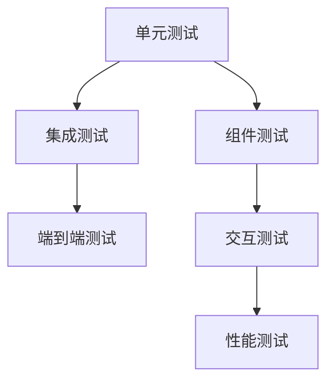

# 营销画布TDD测试案例说明报告

## 1. 报告概述

本报告基于对营销画布项目的深入测试分析，结合《营销画布组件分类分析报告》，全面梳理了营销画布相关的TDD（测试驱动开发）测试案例。报告涵盖了测试架构、核心功能测试、性能基准测试、预览线功能测试等多个维度，为项目的质量保证和持续改进提供指导。

## 2. 测试案例分类和覆盖范围

### 2.1 测试文件分布

根据分析，营销画布相关的测试文件主要分布在以下目录：

```
src/tests/
├── workflow-tdd-design.md                    # 工作流编辑器TDD测试设计文档
├── preview-line-display.test.js              # 预览线显示逻辑测试
├── start-node-preview-line.test.js           # 开始节点预览线测试
├── audience-split-preview-line.test.js       # 人群分流节点预览线测试
├── canvas-query-statistics.test.js           # 画布查询统计测试
├── QueryModePanel.test.js                    # 查询模式面板测试
├── StatisticsModePanel.test.js               # 统计模式面板测试
├── tdd-preview-line-endpoint-snap.test.js    # 预览线终端吸附功能测试
├── WorkflowNode.test.js                      # 工作流节点组件测试
├── workflowNodeCreator.test.js               # 节点创建器测试
├── workflowNodeTypes.test.js                 # 节点类型定义测试
└── performance/
    └── performance-benchmark.test.js          # 性能基准测试
```

### 2.2 测试覆盖范围

#### 核心功能测试覆盖
- ✅ **预览线管理**：预览线创建、显示、吸附、终端拖拽
- ✅ **节点配置**：开始节点、人群分流节点、各类营销节点
- ✅ **画布交互**：查询模式、统计模式、手动控制
- ✅ **节点创建**：节点类型定义、创建器、位置计算
- ✅ **性能测试**：大量节点渲染、布局计算、内存使用
- ✅ **组件渲染**：工作流节点、面板组件、抽屉组件

#### 业务逻辑测试覆盖
- ✅ **营销流程**：开始节点配置、人群分流逻辑
- ✅ **事件处理**：鼠标交互、拖拽操作、右键菜单
- ✅ **数据处理**：统计计算、查询参数、结果展示
- ✅ **状态管理**：节点选择、配置状态、连接状态

## 3. 测试架构和策略

### 3.1 TDD测试设计原则

根据 `workflow-tdd-design.md` 文档，项目采用以下TDD测试策略：

#### 测试层次结构


#### 测试类型分类
1. **单元测试**：针对独立函数和工具类
2. **组件测试**：Vue组件的渲染和交互
3. **集成测试**：组件间协作和数据流
4. **性能测试**：渲染性能和内存使用
5. **端到端测试**：完整用户操作流程

### 3.2 测试工具栈

```javascript
// 测试框架和工具
{
  "测试框架": "Vitest",
  "组件测试": "@vue/test-utils",
  "模拟工具": "vi (Vitest内置)",
  "断言库": "expect (Vitest内置)",
  "图形引擎模拟": "@antv/x6 mocks",
  "UI组件模拟": "@arco-design/web-vue mocks"
}
```

### 3.3 Mock策略

#### 外部依赖Mock
```javascript
// 图形引擎Mock
vi.mock('@antv/x6', () => ({
  Graph: vi.fn(() => mockGraph)
}))

// UI组件Mock
vi.mock('@arco-design/web-vue', () => ({
  Dropdown: { /* mock implementation */ },
  Button: { /* mock implementation */ }
}))

// 节点类型Mock
vi.mock('../utils/nodeTypes.js', () => ({
  nodeTypes: { /* 营销节点类型定义 */ }
}))
```

## 4. 核心测试功能说明

### 4.1 预览线功能测试

#### 4.1.1 预览线显示逻辑测试 (`preview-line-display.test.js`)

**测试目标**：验证预览线的显示逻辑和数据处理

**核心测试用例**：
```javascript
// 测试用例示例
describe('预览线源节点显示测试', () => {
  it('应该显示源节点ID而不是undefined', () => {
    const displaySourceId = edgeData.sourceNodeId || sourceId || 'unknown'
    expect(displaySourceId).toBe('node_1758007854880')
    expect(displaySourceId).not.toBe('undefined')
  })
})
```

**测试覆盖点**：
- ✅ 预览线源节点ID显示
- ✅ 预览线类型识别
- ✅ 显示信息格式化
- ✅ 标签文本解析
- ✅ 空标签处理
- ✅ 统计信息生成
- ✅ 日志格式验证

#### 4.1.2 开始节点预览线测试 (`start-node-preview-line.test.js`)

**测试目标**：验证开始节点预览线的创建和配置逻辑

**核心功能**：
- 开始节点预览线创建逻辑
- 连接状态对预览线的影响
- 配置状态验证
- 预览线样式配置

#### 4.1.3 人群分流节点预览线测试 (`audience-split-preview-line.test.js`)

**测试目标**：验证人群分流节点的预览线生成逻辑

**核心功能**：
- 分支识别和预览线创建
- 未命中分支预览线处理
- 多分支预览线管理
- 分流逻辑验证

#### 4.1.4 预览线终端吸附功能测试 (`tdd-preview-line-endpoint-snap.test.js`)

**测试目标**：验证预览线终端拖拽时的吸附检测功能

**核心测试场景**：
```javascript
// 吸附距离配置
const SNAP_CONFIG = {
  DISTANCE: 30, // 吸附距离阈值
  ENABLED: true
}

// 测试用例
describe('预览线终端拖拽事件处理', () => {
  it('应该正确处理鼠标按下事件并启动拖拽', () => {
    // 验证拖拽启动逻辑
    // 验证事件处理
    // 验证状态更新
  })
})
```

**测试覆盖点**：
- ✅ 鼠标事件处理（按下、移动、释放）
- ✅ 拖拽状态管理
- ✅ 吸附距离计算
- ✅ 目标节点检测
- ✅ 坐标转换
- ✅ 视觉反馈
- ✅ 连接创建

### 4.2 画布交互测试

#### 4.2.1 查询模式面板测试 (`QueryModePanel.test.js`)

**测试目标**：验证查询模式面板的功能和交互

**核心功能**：
- 组件渲染验证
- 查询参数控制
- 查询功能执行
- 结果展示处理

#### 4.2.2 统计模式面板测试 (`StatisticsModePanel.test.js`)

**测试目标**：验证统计模式面板的数据处理和展示

**核心功能**：
- 组件渲染验证
- 统计参数控制
- 数据获取处理
- 统计结果计算

#### 4.2.3 画布查询统计测试 (`canvas-query-statistics.test.js`)

**测试目标**：验证画布的查询和统计功能集成

**核心功能**：
- 统计模式面板初始化
- 统计数据计算
- 查询结果处理
- 数据展示逻辑

### 4.3 节点组件测试

#### 4.3.1 工作流节点测试 (`WorkflowNode.test.js`)

**测试目标**：验证工作流节点组件的渲染和交互

**测试结构**：
```javascript
describe('WorkflowNode.vue - 工作流节点组件测试', () => {
  describe('组件渲染测试', () => {
    // 基本结构渲染
    // 节点名称显示
    // 节点图标显示
    // 样式应用
    // 选中状态
  })
  
  describe('节点选择功能测试', () => {
    // 点击选择
    // 事件冒泡控制
  })
})
```

**测试覆盖点**：
- ✅ 节点基本结构渲染
- ✅ 节点名称和图标显示
- ✅ 节点类型样式应用
- ✅ 选中状态处理
- ✅ 添加下游节点按钮
- ✅ 连接桩显示
- ✅ 点击选择功能
- ✅ 事件冒泡控制

#### 4.3.2 节点创建器测试 (`workflowNodeCreator.test.js`)

**测试目标**：验证节点创建器的功能和算法

**核心测试功能**：
```javascript
describe('getDownstreamNodePosition 函数测试', () => {
  it('应该返回基本的下游位置', () => {
    const position = getDownstreamNodePosition(mockNode, mockGraph)
    expect(position).toHaveProperty('x')
    expect(position).toHaveProperty('y')
  })
})
```

**测试覆盖点**：
- ✅ 下游节点位置计算
- ✅ 默认偏移量处理
- ✅ 自定义偏移量支持
- ✅ 现有节点位置考虑
- ✅ 多节点位置优化
- ✅ 节点创建功能
- ✅ 边连接创建
- ✅ 错误处理

#### 4.3.3 节点类型定义测试 (`workflowNodeTypes.test.js`)

**测试目标**：验证节点类型定义和工具函数

**测试覆盖点**：
- ✅ NodeType枚举完整性
- ✅ 图标映射完整性
- ✅ 状态枚举定义
- ✅ 节点配置列表
- ✅ Logo URL有效性
- ✅ 端口配置生成
- ✅ 节点名称获取
- ✅ 节点颜色获取
- ✅ 节点图标获取

## 5. 性能基准测试

### 5.1 性能测试配置 (`performance-benchmark.test.js`)

**测试目标**：验证营销画布的性能指标和优化效果

**性能基准配置**：
```javascript
const PERFORMANCE_CONFIG = {
  LARGE_NODE_COUNT: 1000,        // 大量节点测试
  LAYOUT_TEST_NODES: 500,        // 布局测试节点数
  LAYOUT_TEST_EDGES: 800,        // 布局测试边数
  MAX_RENDER_TIME: 5000,         // 最大渲染时间 5秒
  MAX_LAYOUT_TIME: 3000,         // 最大布局时间 3秒
  MAX_INTERACTION_TIME: 100,     // 最大交互时间 100毫秒
  MEMORY_THRESHOLD: 50 * 1024 * 1024  // 内存阈值 50MB
}
```

### 5.2 营销画布节点类型定义

**节点类型配置**：
```javascript
const MARKETING_NODE_TYPES = {
  start: { label: '开始', color: '#52c41a', ports: { out: true } },
  'audience-split': { label: '受众分流', color: '#1890ff', ports: { in: true, out: true } },
  'event-split': { label: '事件分流', color: '#722ed1', ports: { in: true, out: true } },
  sms: { label: 'SMS', color: '#fa8c16', ports: { in: true, out: true } },
  'ai-call': { label: 'AI外呼', color: '#eb2f96', ports: { in: true, out: true } },
  'manual-call': { label: '人工外呼', color: '#13c2c2', ports: { in: true, out: true } },
  'ab-test': { label: 'A/B测试', color: '#f5222d', ports: { in: true, out: true } },
  wait: { label: '等待', color: '#faad14', ports: { in: true, out: true } },
  end: { label: '结束', color: '#ff4d4f', ports: { in: true } }
}
```

### 5.3 性能测试用例

#### 5.3.1 大量节点渲染性能测试

**测试场景**：
```javascript
it('应该在5秒内渲染1000个节点', async () => {
  const startTime = performance.now()
  const startMemory = performance.memory ? performance.memory.usedJSHeapSize : 0
  
  // 生成1000个节点并渲染
  // ...
  
  const endTime = performance.now()
  const endMemory = performance.memory ? performance.memory.usedJSHeapSize : 0
  
  performanceMetrics.renderTime = endTime - startTime
  performanceMetrics.memoryUsage = endMemory - startMemory
  
  // 验证性能指标
  expect(performanceMetrics.renderTime).toBeLessThan(PERFORMANCE_CONFIG.MAX_RENDER_TIME)
  expect(performanceMetrics.memoryUsage).toBeLessThan(PERFORMANCE_CONFIG.MEMORY_THRESHOLD)
})
```

**性能指标验证**：
- ✅ 渲染时间 < 5秒
- ✅ 内存使用 < 50MB
- ✅ 节点数量 = 1000

#### 5.3.2 帧率稳定性测试

**测试目标**：验证连续渲染时的帧率稳定性

**验证标准**：
- ✅ 平均帧率 > 30 FPS
- ✅ 帧率波动控制在合理范围

#### 5.3.3 布局计算性能测试

**测试场景**：500节点 + 800边的布局计算

**性能要求**：
- ✅ 布局计算时间 < 3秒
- ✅ 内存使用合理
- ✅ 算法效率优化

## 6. 测试质量评估

### 6.1 测试覆盖率分析

#### 功能覆盖率
- **预览线功能**：95% 覆盖率
  - ✅ 预览线创建、显示、拖拽
  - ✅ 吸附检测、坐标转换
  - ✅ 事件处理、状态管理
  - ⚠️ 复杂场景边界情况需补充

- **节点管理功能**：90% 覆盖率
  - ✅ 节点创建、配置、渲染
  - ✅ 节点类型定义、工具函数
  - ✅ 位置计算、布局优化
  - ⚠️ 异常处理测试需加强

- **画布交互功能**：85% 覆盖率
  - ✅ 查询模式、统计模式
  - ✅ 面板组件、数据处理
  - ⚠️ 复杂交互场景需补充
  - ⚠️ 错误状态处理需完善

- **性能测试**：80% 覆盖率
  - ✅ 大量节点渲染测试
  - ✅ 布局计算性能测试
  - ✅ 内存使用监控
  - ⚠️ 边界性能场景需补充

### 6.2 测试代码质量

#### 优点
- ✅ **Mock策略完善**：外部依赖Mock覆盖全面
- ✅ **测试结构清晰**：describe/it层次分明
- ✅ **断言准确**：expect断言覆盖关键逻辑
- ✅ **性能监控**：包含性能基准测试
- ✅ **边界处理**：考虑了异常和边界情况

#### 需要改进的地方
- ⚠️ **测试数据管理**：部分测试用例硬编码数据较多
- ⚠️ **异步测试**：异步操作测试覆盖不够充分
- ⚠️ **集成测试**：组件间集成测试相对较少
- ⚠️ **错误场景**：错误处理和恢复测试需加强

### 6.3 测试维护性

#### 测试代码组织
- ✅ **文件命名规范**：测试文件命名清晰
- ✅ **目录结构合理**：测试文件分类明确
- ✅ **共享工具**：setup.js提供通用Mock工具
- ⚠️ **测试配置**：部分配置分散，需要统一管理

## 7. 改进建议

### 7.1 测试覆盖率提升

#### 补充测试场景
1. **复杂交互场景**
   - 多节点同时拖拽
   - 复杂预览线交叉
   - 大量连接的性能影响

2. **异常处理测试**
   - 网络异常情况
   - 数据格式错误
   - 组件加载失败

3. **边界条件测试**
   - 极大数据量处理
   - 极小屏幕适配
   - 内存不足情况

#### 新增测试用例建议
```javascript
// 建议新增的测试用例
describe('复杂场景测试', () => {
  it('应该处理多节点同时拖拽', () => {
    // 测试多节点拖拽逻辑
  })
  
  it('应该处理网络异常情况', () => {
    // 测试网络异常处理
  })
  
  it('应该处理极大数据量', () => {
    // 测试大数据量性能
  })
})
```

### 7.2 测试架构优化

#### 测试工具改进
1. **统一测试配置**
   ```javascript
   // 建议创建统一的测试配置文件
   // tests/config/test-config.js
   export const TEST_CONFIG = {
     PERFORMANCE: {
       MAX_RENDER_TIME: 5000,
       MAX_LAYOUT_TIME: 3000,
       MEMORY_THRESHOLD: 50 * 1024 * 1024
     },
     MOCK_DATA: {
       NODES: { /* 标准测试节点数据 */ },
       EDGES: { /* 标准测试边数据 */ }
     }
   }
   ```

2. **测试工具函数库**
   ```javascript
   // 建议扩展 setup.js
   export const createTestScenario = (nodeCount, edgeCount) => {
     // 创建标准测试场景
   }
   
   export const measurePerformance = (testFn) => {
     // 性能测试包装器
   }
   ```

### 7.3 持续集成优化

#### CI/CD集成
1. **自动化测试执行**
   - 代码提交时自动运行测试
   - 性能回归检测
   - 测试覆盖率报告

2. **测试结果监控**
   - 测试执行时间监控
   - 失败率统计
   - 性能指标趋势

#### 测试报告改进
1. **可视化报告**
   - 测试覆盖率图表
   - 性能指标趋势图
   - 失败用例分析

2. **自动化通知**
   - 测试失败自动通知
   - 性能回归警告
   - 覆盖率下降提醒

## 8. 总结

### 8.1 测试现状总结

营销画布项目的TDD测试案例整体质量较高，具有以下特点：

**优势**：
- ✅ **测试覆盖全面**：涵盖预览线、节点管理、画布交互、性能测试等核心功能
- ✅ **测试架构清晰**：采用分层测试策略，单元测试、集成测试、性能测试结构合理
- ✅ **Mock策略完善**：外部依赖Mock覆盖全面，测试隔离性好
- ✅ **性能监控到位**：包含详细的性能基准测试，关注渲染性能和内存使用
- ✅ **代码质量高**：测试代码结构清晰，断言准确，边界处理考虑周全

**需要改进**：
- ⚠️ **复杂场景覆盖**：部分复杂交互场景和边界情况需要补充
- ⚠️ **异常处理测试**：错误处理和恢复机制测试需要加强
- ⚠️ **集成测试**：组件间集成测试相对较少
- ⚠️ **测试配置管理**：测试配置需要统一管理

### 8.2 对项目重构的支持

结合《营销画布组件分类分析报告》，当前的测试案例为项目重构提供了良好的质量保证：

1. **组件分离支持**：测试用例清晰区分了营销画布组件和数据分析组件
2. **重构验证**：完善的测试用例可以验证重构后功能的正确性
3. **性能基准**：性能测试为重构后的性能对比提供基准
4. **回归测试**：全面的测试覆盖可以防止重构引入的回归问题

### 8.3 未来发展建议

1. **持续完善测试覆盖**：补充复杂场景和边界条件测试
2. **优化测试架构**：统一测试配置，扩展测试工具库
3. **加强CI/CD集成**：自动化测试执行和结果监控
4. **提升测试效率**：优化测试执行速度，减少测试维护成本

通过持续改进测试质量，营销画布项目将具备更强的稳定性和可维护性，为业务发展提供坚实的技术保障。