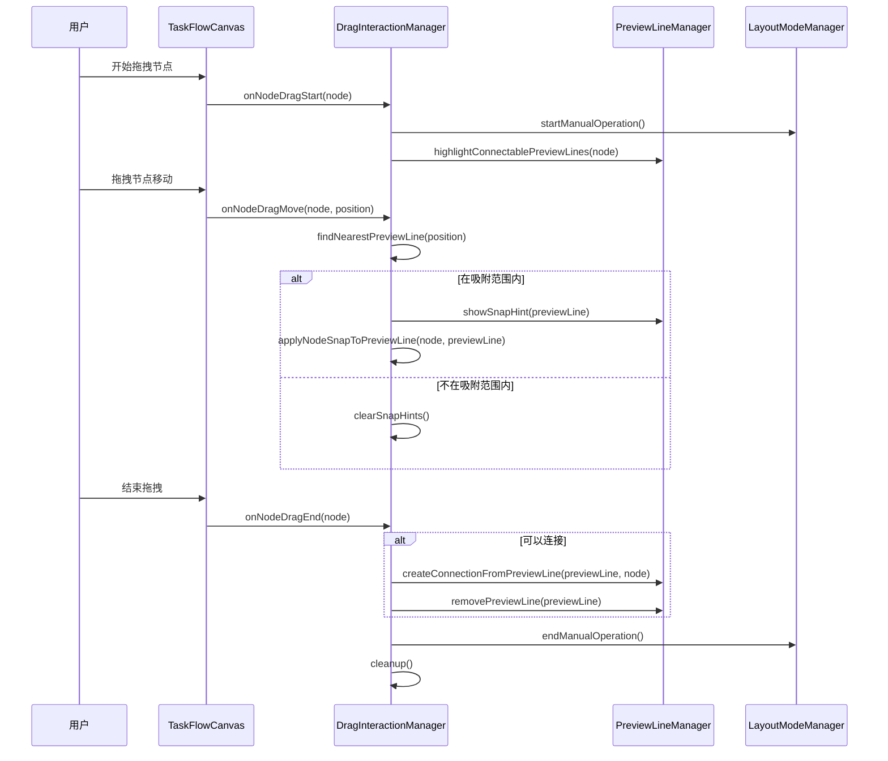
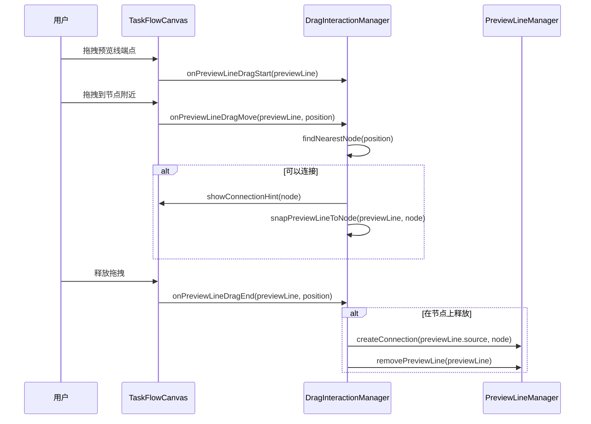
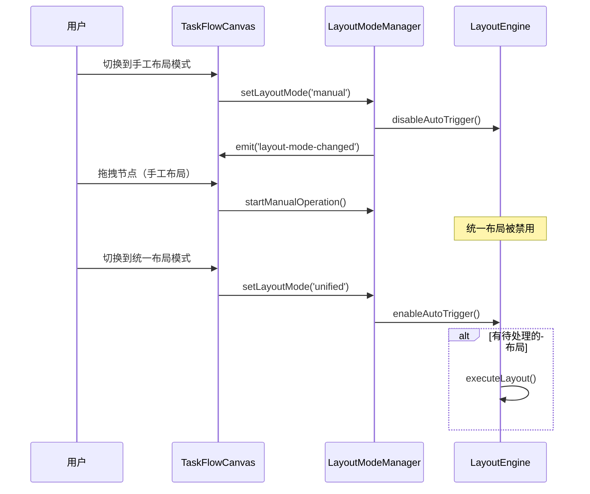
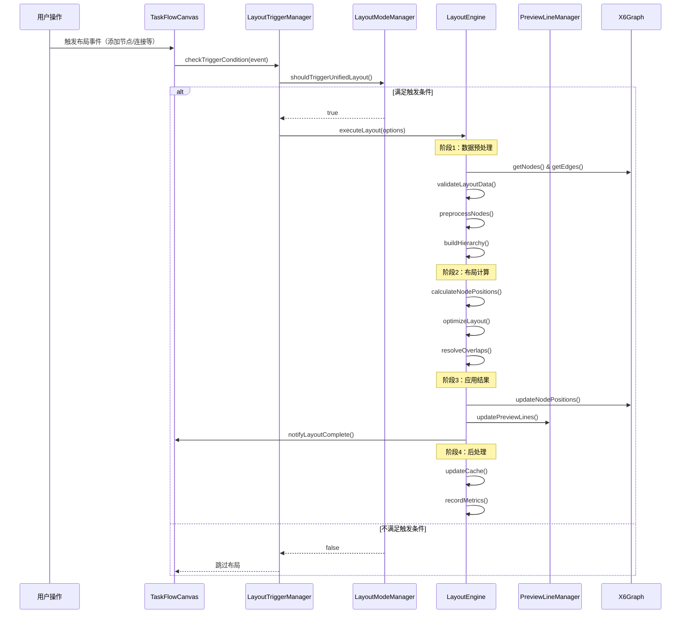
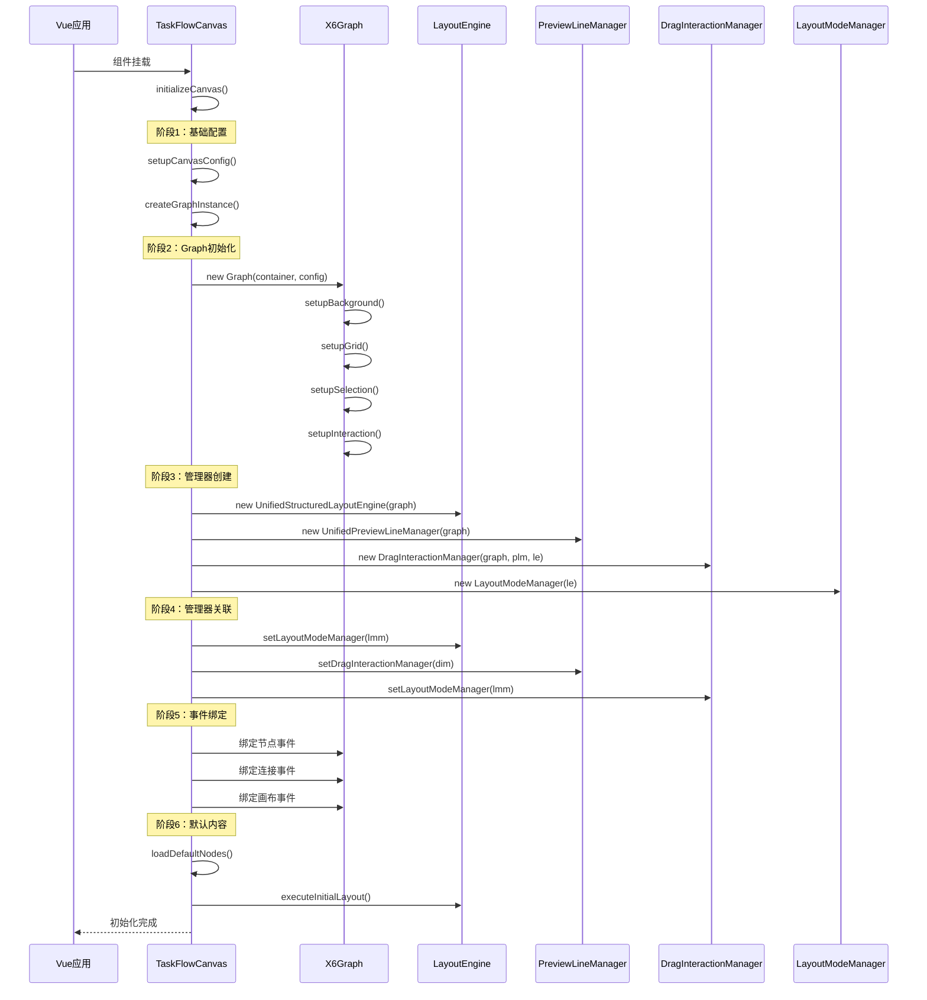
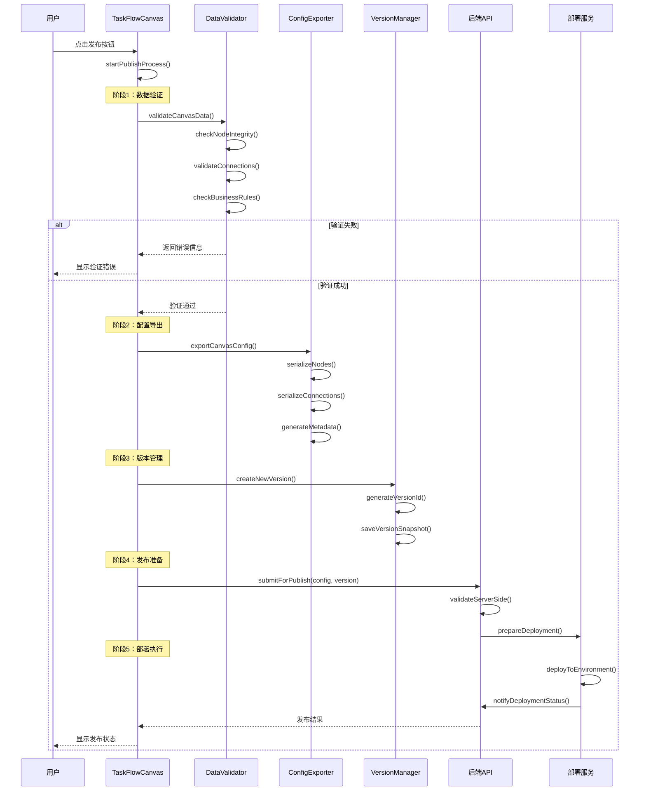

# 营销画布交互逻辑设计方案

## 1. 概述

本文档基于现有的营销画布代码架构，设计节点拖拽吸附预览线、预览线连接节点的交互逻辑处理方案，以及手工布局与统一布局的分离机制。

## 2. 核心交互需求分析

### 2.1 拖拽吸附需求
- **节点拖拽吸附预览线**：当拖拽节点靠近预览线时，节点应自动吸附到预览线的端点
- **预览线连接节点**：当拖动预览线靠近节点时，预览线应自动连接到节点的输入端口
- **视觉反馈**：提供清晰的视觉提示，显示可连接状态和吸附效果

### 2.2 布局模式需求
- **手工布局模式**：用户手动拖拽节点时，不触发统一布局
- **统一布局模式**：系统自动应用结构化布局算法
- **模式切换**：支持在两种模式间灵活切换

## 3. 架构设计方案

### 3.1 组件职责重新分工

#### 3.1.1 TaskFlowCanvas（主画布组件）
**核心职责：**
- 布局模式管理和切换
- 全局事件协调
- 组件间通信枢纽

**新增功能：**
```javascript
// 布局模式状态管理
const layoutMode = ref('manual') // 'manual' | 'unified'
const isManualLayoutActive = ref(false)

// 布局模式切换
const switchLayoutMode = (mode) => {
  layoutMode.value = mode
  if (mode === 'manual') {
    // 禁用统一布局自动触发
    layoutEngine.value?.disableAutoLayout()
  } else {
    // 启用统一布局
    layoutEngine.value?.enableAutoLayout()
  }
}

// 手工布局状态监听
const onManualDragStart = () => {
  isManualLayoutActive.value = true
  // 临时禁用统一布局
  layoutEngine.value?.pauseAutoLayout()
}

const onManualDragEnd = () => {
  isManualLayoutActive.value = false
  // 根据当前模式决定是否恢复统一布局
  if (layoutMode.value === 'unified') {
    layoutEngine.value?.resumeAutoLayout()
  }
}
```

#### 3.1.2 DragInteractionManager（新增：拖拽交互管理器）
**核心职责：**
- 统一管理所有拖拽交互逻辑
- 节点与预览线的吸附检测
- 连接创建和验证

**实现方案：**
```javascript
class DragInteractionManager {
  constructor(graph, previewLineManager, layoutEngine) {
    this.graph = graph
    this.previewLineManager = previewLineManager
    this.layoutEngine = layoutEngine
    this.snapThreshold = 30 // 吸附阈值
    this.isDragging = false
    this.dragTarget = null
    this.setupEventListeners()
  }

  // 节点拖拽开始
  onNodeDragStart(node, event) {
    this.isDragging = true
    this.dragTarget = { type: 'node', element: node }
    
    // 通知画布进入手工布局模式
    this.emit('manual-layout-start')
    
    // 高亮可连接的预览线
    this.highlightConnectablePreviewLines(node)
  }

  // 节点拖拽过程中
  onNodeDragMove(node, event) {
    if (!this.isDragging) return
    
    const nodePosition = node.getPosition()
    const nearestPreviewLine = this.findNearestPreviewLine(nodePosition)
    
    if (nearestPreviewLine && this.isWithinSnapThreshold(nodePosition, nearestPreviewLine)) {
      // 显示吸附提示
      this.showSnapHint(nearestPreviewLine)
      // 应用吸附效果
      this.applyNodeSnapToPreviewLine(node, nearestPreviewLine)
    } else {
      this.clearSnapHints()
    }
  }

  // 节点拖拽结束
  onNodeDragEnd(node, event) {
    const nodePosition = node.getPosition()
    const nearestPreviewLine = this.findNearestPreviewLine(nodePosition)
    
    if (nearestPreviewLine && this.isWithinSnapThreshold(nodePosition, nearestPreviewLine)) {
      // 创建连接
      this.createConnectionFromPreviewLine(nearestPreviewLine, node)
    }
    
    this.cleanup()
    // 通知画布手工布局结束
    this.emit('manual-layout-end')
  }

  // 预览线拖拽处理
  onPreviewLineDrag(previewLine, targetPosition) {
    const nearestNode = this.findNearestNode(targetPosition)
    
    if (nearestNode && this.canConnectToNode(previewLine, nearestNode)) {
      // 显示连接提示
      this.showConnectionHint(nearestNode)
      // 自动吸附到节点端口
      this.snapPreviewLineToNode(previewLine, nearestNode)
    }
  }

  // 查找最近的预览线
  findNearestPreviewLine(position) {
    const previewLines = this.previewLineManager.getAllPreviewLines()
    let nearest = null
    let minDistance = Infinity
    
    previewLines.forEach(line => {
      const distance = this.calculateDistance(position, line.getEndpoint())
      if (distance < minDistance) {
        minDistance = distance
        nearest = line
      }
    })
    
    return minDistance <= this.snapThreshold ? nearest : null
  }

  // 查找最近的节点
  findNearestNode(position) {
    const nodes = this.graph.getNodes().filter(node => 
      !node.getData()?.isPreviewLine && !node.getData()?.isEndpoint
    )
    
    let nearest = null
    let minDistance = Infinity
    
    nodes.forEach(node => {
      const nodeCenter = node.getBBox().getCenter()
      const distance = this.calculateDistance(position, nodeCenter)
      if (distance < minDistance) {
        minDistance = distance
        nearest = node
      }
    })
    
    return minDistance <= this.snapThreshold ? nearest : null
  }

  // 创建从预览线到节点的连接
  createConnectionFromPreviewLine(previewLine, targetNode) {
    const sourceNode = previewLine.getSourceNode()
    const connection = this.graph.addEdge({
      source: sourceNode.id,
      target: targetNode.id,
      attrs: {
        line: {
          stroke: '#1890ff',
          strokeWidth: 2
        }
      }
    })
    
    // 移除预览线
    this.previewLineManager.removePreviewLine(previewLine)
    
    return connection
  }
}
```

#### 3.1.3 LayoutModeManager（新增：布局模式管理器）
**核心职责：**
- 管理手工布局和统一布局的切换
- 控制布局触发条件
- 提供布局状态查询接口

**实现方案：**
```javascript
class LayoutModeManager {
  constructor(layoutEngine) {
    this.layoutEngine = layoutEngine
    this.currentMode = 'manual' // 'manual' | 'unified'
    this.isManualOperationActive = false
    this.autoLayoutPaused = false
  }

  // 设置布局模式
  setLayoutMode(mode) {
    const previousMode = this.currentMode
    this.currentMode = mode
    
    if (mode === 'manual') {
      this.disableUnifiedLayout()
    } else if (mode === 'unified') {
      this.enableUnifiedLayout()
    }
    
    this.emit('layout-mode-changed', { from: previousMode, to: mode })
  }

  // 开始手工操作
  startManualOperation() {
    this.isManualOperationActive = true
    
    // 如果当前是统一布局模式，临时暂停自动布局
    if (this.currentMode === 'unified') {
      this.pauseAutoLayout()
    }
  }

  // 结束手工操作
  endManualOperation() {
    this.isManualOperationActive = false
    
    // 如果是统一布局模式且之前被暂停，恢复自动布局
    if (this.currentMode === 'unified' && this.autoLayoutPaused) {
      this.resumeAutoLayout()
    }
  }

  // 暂停自动布局
  pauseAutoLayout() {
    this.autoLayoutPaused = true
    this.layoutEngine.pauseAutoTrigger()
  }

  // 恢复自动布局
  resumeAutoLayout() {
    this.autoLayoutPaused = false
    this.layoutEngine.resumeAutoTrigger()
  }

  // 检查是否应该触发统一布局
  shouldTriggerUnifiedLayout() {
    return this.currentMode === 'unified' && 
           !this.isManualOperationActive && 
           !this.autoLayoutPaused
  }

  // 禁用统一布局
  disableUnifiedLayout() {
    this.layoutEngine.disableAutoTrigger()
  }

  // 启用统一布局
  enableUnifiedLayout() {
    this.layoutEngine.enableAutoTrigger()
  }
}
```

### 3.2 UnifiedStructuredLayoutEngine 增强

**新增功能：**
```javascript
class UnifiedStructuredLayoutEngine {
  constructor() {
    // 现有代码...
    this.autoTriggerEnabled = true
    this.autoTriggerPaused = false
    this.layoutModeManager = null
  }

  // 设置布局模式管理器
  setLayoutModeManager(layoutModeManager) {
    this.layoutModeManager = layoutModeManager
  }

  // 执行布局前检查
  async executeLayout(options = {}) {
    // 检查是否应该执行布局
    if (!this.shouldExecuteLayout(options)) {
      console.log('[LayoutEngine] 布局执行被跳过 - 手工模式或已暂停')
      return { skipped: true, reason: 'manual_mode_or_paused' }
    }
    
    return this.executeLayoutDebounced(options)
  }

  // 判断是否应该执行布局
  shouldExecuteLayout(options = {}) {
    // 强制执行（如用户点击布局按钮）
    if (options.force) {
      return true
    }
    
    // 检查布局模式管理器
    if (this.layoutModeManager) {
      return this.layoutModeManager.shouldTriggerUnifiedLayout()
    }
    
    // 检查自动触发状态
    return this.autoTriggerEnabled && !this.autoTriggerPaused
  }

  // 禁用自动触发
  disableAutoTrigger() {
    this.autoTriggerEnabled = false
  }

  // 启用自动触发
  enableAutoTrigger() {
    this.autoTriggerEnabled = true
  }

  // 暂停自动触发
  pauseAutoTrigger() {
    this.autoTriggerPaused = true
  }

  // 恢复自动触发
  resumeAutoTrigger() {
    this.autoTriggerPaused = false
  }
}
```

### 3.3 UnifiedPreviewLineManager 增强

**新增功能：**
```javascript
class UnifiedPreviewLineManager {
  constructor() {
    // 现有代码...
    this.dragInteractionManager = null
  }

  // 设置拖拽交互管理器
  setDragInteractionManager(dragInteractionManager) {
    this.dragInteractionManager = dragInteractionManager
  }

  // 获取所有预览线
  getAllPreviewLines() {
    return Array.from(this.previewLines.values())
  }

  // 获取可连接的预览线
  getConnectablePreviewLines(node) {
    return this.getAllPreviewLines().filter(line => 
      this.canConnectToNode(line, node)
    )
  }

  // 检查预览线是否可以连接到节点
  canConnectToNode(previewLine, node) {
    const sourceNode = previewLine.getSourceNode()
    
    // 不能连接到自己
    if (sourceNode.id === node.id) {
      return false
    }
    
    // 检查是否已经存在连接
    const existingConnection = this.graph.getEdges().find(edge => 
      edge.getSourceCellId() === sourceNode.id && 
      edge.getTargetCellId() === node.id
    )
    
    return !existingConnection
  }

  // 高亮预览线
  highlightPreviewLine(previewLine) {
    previewLine.setAttrs({
      line: {
        stroke: '#ff4d4f',
        strokeWidth: 3,
        strokeDasharray: '5,5'
      }
    })
  }

  // 清除预览线高亮
  clearPreviewLineHighlight(previewLine) {
    previewLine.setAttrs({
      line: {
        stroke: '#d9d9d9',
        strokeWidth: 2,
        strokeDasharray: '5,5'
      }
    })
  }
}
```

## 4. 事件流程设计

### 4.1 节点拖拽吸附预览线流程



### 4.2 预览线连接节点流程



### 4.3 布局模式切换流程



## 5. 实现步骤

### 5.1 第一阶段：基础架构搭建
1. 创建 `DragInteractionManager` 类
2. 创建 `LayoutModeManager` 类
3. 在 `TaskFlowCanvas` 中集成新的管理器

### 5.2 第二阶段：拖拽交互实现
1. 实现节点拖拽吸附预览线逻辑
2. 实现预览线连接节点逻辑
3. 添加视觉反馈和提示

### 5.3 第三阶段：布局模式分离
1. 增强 `UnifiedStructuredLayoutEngine` 的模式控制
2. 实现手工布局和统一布局的切换
3. 添加布局触发条件检查

### 5.4 第四阶段：测试和优化
1. 编写单元测试
2. 性能优化
3. 用户体验优化

## 6. 配置选项

```javascript
// 拖拽交互配置
const DRAG_INTERACTION_CONFIG = {
  snapThreshold: 30,           // 吸附阈值（像素）
  highlightDuration: 200,      // 高亮动画时长
  snapAnimationDuration: 150,  // 吸附动画时长
  connectionHintColor: '#1890ff',
  snapHintColor: '#ff4d4f'
}

// 布局模式配置
const LAYOUT_MODE_CONFIG = {
  defaultMode: 'manual',       // 默认布局模式
  autoSwitchDelay: 1000,      // 自动切换延迟
  manualOperationTimeout: 5000 // 手工操作超时时间
}
```

## 7. 核心流程设计

### 7.1 统一布局执行流程

#### 7.1.1 布局触发条件
```javascript
// 统一布局触发条件检查
class LayoutTriggerManager {
  shouldTriggerLayout(event) {
    const triggers = {
      // 自动触发条件
      nodeAdded: () => this.layoutMode === 'unified' && !this.isManualOperation,
      nodeRemoved: () => this.layoutMode === 'unified' && !this.isManualOperation,
      connectionCreated: () => this.layoutMode === 'unified' && !this.isManualOperation,
      connectionRemoved: () => this.layoutMode === 'unified' && !this.isManualOperation,
      
      // 手动触发条件
      userClickLayout: () => true, // 用户点击布局按钮
      modeSwitch: () => event.to === 'unified', // 切换到统一布局模式
      
      // 批量操作后触发
      batchOperationComplete: () => this.layoutMode === 'unified'
    }
    
    return triggers[event.type] ? triggers[event.type]() : false
  }
}
```

#### 7.1.2 布局执行时序图



#### 7.1.3 详细执行步骤

**阶段1：数据预处理（100-200ms）**
```javascript
async preprocessLayoutData() {
  // 1. 数据验证
  const nodes = this.graph.getNodes().filter(node => !node.getData()?.isPreviewLine)
  const edges = this.graph.getEdges()
  
  if (nodes.length === 0) {
    throw new Error('没有可布局的节点')
  }
  
  // 2. 节点分类
  const nodeCategories = {
    startNodes: nodes.filter(node => node.getData()?.type === 'start'),
    processNodes: nodes.filter(node => node.getData()?.type === 'process'),
    endNodes: nodes.filter(node => node.getData()?.type === 'end'),
    aiNodes: nodes.filter(node => node.getData()?.type === 'ai-outbound')
  }
  
  // 3. 构建层级关系
  const hierarchy = this.buildNodeHierarchy(nodes, edges)
  
  // 4. 计算布局约束
  const constraints = this.calculateLayoutConstraints(nodeCategories)
  
  return { nodeCategories, hierarchy, constraints }
}
```

**阶段2：布局计算（200-500ms）**
```javascript
async calculateOptimalLayout(preprocessData) {
  const { nodeCategories, hierarchy, constraints } = preprocessData
  
  // 1. 初始位置计算
  const initialPositions = this.calculateInitialPositions(hierarchy)
  
  // 2. 层级内优化
  const optimizedLayers = await this.optimizeWithinLayers(initialPositions)
  
  // 3. 全局平衡优化
  const balancedLayout = await this.globalBalanceOptimization(optimizedLayers)
  
  // 4. 冲突解决
  const finalLayout = await this.resolveLayoutConflicts(balancedLayout)
  
  // 5. 质量评估
  const layoutQuality = this.evaluateLayoutQuality(finalLayout)
  
  if (layoutQuality.score < 0.7) {
    console.warn('布局质量较低，建议手动调整')
  }
  
  return finalLayout
}
```

**阶段3：应用结果（50-100ms）**
```javascript
async applyLayoutResults(layoutData) {
  // 1. 批量更新节点位置
  const updatePromises = layoutData.nodes.map(nodeData => {
    const node = this.graph.getCellById(nodeData.id)
    return node.setPosition(nodeData.position, { silent: true })
  })
  
  await Promise.all(updatePromises)
  
  // 2. 更新预览线
  await this.previewLineManager.updateAllPreviewLines()
  
  // 3. 触发重绘
  this.graph.trigger('layout:applied')
  
  // 4. 更新视口
  this.centerAndFitCanvas()
}
```

#### 7.1.4 性能优化策略

```javascript
class LayoutPerformanceOptimizer {
  constructor() {
    this.layoutCache = new Map()
    this.debounceTimer = null
    this.batchQueue = []
  }
  
  // 防抖执行
  debouncedLayout(options = {}) {
    clearTimeout(this.debounceTimer)
    this.debounceTimer = setTimeout(() => {
      this.executeLayoutWithCache(options)
    }, options.debounceDelay || 300)
  }
  
  // 缓存优化
  executeLayoutWithCache(options) {
    const cacheKey = this.generateCacheKey()
    const cached = this.layoutCache.get(cacheKey)
    
    if (cached && !options.force) {
      this.applyLayoutResults(cached)
      return
    }
    
    const result = this.executeLayout(options)
    this.layoutCache.set(cacheKey, result)
    
    // 清理过期缓存
    this.cleanupCache()
  }
  
  // 批量处理
  batchLayoutOperations(operations) {
    this.batchQueue.push(...operations)
    
    if (this.batchQueue.length >= 10) {
      this.processBatch()
    }
  }
}
```

### 7.2 画布初始化流程

#### 7.2.1 初始化时序图



#### 7.2.2 详细初始化步骤

**步骤1：基础配置设置**
```javascript
setupCanvasConfig() {
  this.canvasConfig = {
    // 画布尺寸
    width: 1200,
    height: 800,
    
    // 背景配置
    background: {
      color: '#f5f5f5',
      image: null,
      repeat: 'no-repeat',
      position: 'center'
    },
    
    // 网格配置
    grid: {
      size: 20,
      visible: true,
      type: 'dot',
      args: {
        color: '#d0d0d0',
        thickness: 1
      }
    },
    
    // 缩放配置
    scaling: {
      min: 0.1,
      max: 3,
      step: 0.1
    },
    
    // 选择配置
    selecting: {
      enabled: true,
      multiple: true,
      rubberband: true,
      movable: true,
      showNodeSelectionBox: true
    }
  }
}
```

**步骤2：Graph实例创建**
```javascript
createGraphInstance() {
  this.graph = new Graph({
    container: this.$refs.canvasContainer,
    ...this.canvasConfig,
    
    // 连接配置
    connecting: {
      router: 'manhattan',
      connector: {
        name: 'rounded',
        args: { radius: 8 }
      },
      anchor: 'center',
      connectionPoint: 'anchor',
      allowBlank: false,
      allowLoop: false,
      allowNode: true,
      allowEdge: false,
      allowMulti: false
    },
    
    // 高亮配置
    highlighting: {
      magnetAdsorbed: {
        name: 'stroke',
        args: {
          attrs: {
            fill: '#5F95FF',
            stroke: '#5F95FF'
          }
        }
      }
    },
    
    // 交互配置
    interacting: {
      nodeMovable: true,
      edgeMovable: false,
      edgeLabelMovable: false,
      arrowheadMovable: false,
      vertexMovable: false,
      vertexAddable: false,
      vertexDeletable: false
    }
  })
}
```

**步骤3：管理器初始化**
```javascript
initializeManagers() {
  // 1. 创建布局引擎
  this.layoutEngine = new UnifiedStructuredLayoutEngine(this.graph, {
    direction: 'TB',
    nodeSpacing: { x: 100, y: 80 },
    layerSpacing: 120,
    branchSpacing: 60,
    centerAlign: true,
    gridSize: 20
  })
  
  // 2. 创建预览线管理器
  this.previewLineManager = new UnifiedPreviewLineManager(this.graph, {
    previewLineSpacing: 40,
    endpointSize: 8,
    branchLabelOffset: 20
  })
  
  // 3. 创建拖拽交互管理器
  this.dragInteractionManager = new DragInteractionManager(
    this.graph,
    this.previewLineManager,
    this.layoutEngine,
    {
      snapThreshold: 30,
      highlightDuration: 200
    }
  )
  
  // 4. 创建布局模式管理器
  this.layoutModeManager = new LayoutModeManager(this.layoutEngine, {
    defaultMode: 'manual',
    autoSwitchDelay: 1000
  })
  
  // 5. 建立管理器关联
  this.layoutEngine.setLayoutModeManager(this.layoutModeManager)
  this.previewLineManager.setDragInteractionManager(this.dragInteractionManager)
  this.dragInteractionManager.setLayoutModeManager(this.layoutModeManager)
}
```

**步骤4：事件绑定**
```javascript
bindGraphEvents() {
  // 节点事件
  this.graph.on('node:added', this.onNodeAdded)
  this.graph.on('node:removed', this.onNodeRemoved)
  this.graph.on('node:moved', this.onNodeMoved)
  this.graph.on('node:selected', this.onNodeSelected)
  
  // 连接事件
  this.graph.on('edge:connected', this.onEdgeConnected)
  this.graph.on('edge:removed', this.onEdgeRemoved)
  
  // 画布事件
  this.graph.on('canvas:click', this.onCanvasClick)
  this.graph.on('canvas:dblclick', this.onCanvasDblClick)
  
  // 布局事件
  this.graph.on('layout:start', this.onLayoutStart)
  this.graph.on('layout:complete', this.onLayoutComplete)
  
  // 拖拽事件
  this.graph.on('node:drag:start', this.dragInteractionManager.onNodeDragStart)
  this.graph.on('node:drag:move', this.dragInteractionManager.onNodeDragMove)
  this.graph.on('node:drag:end', this.dragInteractionManager.onNodeDragEnd)
}
```

**步骤5：默认内容加载**
```javascript
loadDefaultContent() {
  // 1. 添加开始节点
  const startNode = this.graph.addNode({
    id: 'start-node',
    shape: 'workflow-start',
    x: 100,
    y: 100,
    data: {
      type: 'start',
      label: '开始',
      config: {}
    }
  })
  
  // 2. 创建初始预览线
  this.previewLineManager.createPreviewLine(startNode, {
    direction: 'right',
    length: 150
  })
  
  // 3. 执行初始布局
  setTimeout(() => {
    this.layoutEngine.executeLayout({ force: true })
  }, 100)
  
  // 4. 居中显示
  this.centerAndFitCanvas()
}
```

#### 7.2.3 初始化错误处理

```javascript
class CanvasInitializationErrorHandler {
  handleInitializationError(error, stage) {
    const errorHandlers = {
      'config': () => this.handleConfigError(error),
      'graph': () => this.handleGraphError(error),
      'managers': () => this.handleManagerError(error),
      'events': () => this.handleEventError(error),
      'content': () => this.handleContentError(error)
    }
    
    const handler = errorHandlers[stage]
    if (handler) {
      handler()
    } else {
      this.handleUnknownError(error, stage)
    }
  }
  
  handleGraphError(error) {
    console.error('Graph初始化失败:', error)
    
    // 尝试重新创建
    setTimeout(() => {
      this.retryGraphCreation()
    }, 1000)
  }
  
  handleManagerError(error) {
    console.error('管理器初始化失败:', error)
    
    // 降级到基础功能
    this.enableBasicMode()
  }
}
```

### 7.3 画布发布流程

#### 7.3.1 发布流程时序图



#### 7.3.2 数据验证阶段

```javascript
class CanvasDataValidator {
  async validateCanvasData(graph) {
    const validationResults = {
      isValid: true,
      errors: [],
      warnings: []
    }
    
    // 1. 节点完整性检查
    const nodeValidation = await this.validateNodes(graph.getNodes())
    this.mergeValidationResults(validationResults, nodeValidation)
    
    // 2. 连接有效性检查
    const connectionValidation = await this.validateConnections(graph.getEdges())
    this.mergeValidationResults(validationResults, connectionValidation)
    
    // 3. 业务规则检查
    const businessValidation = await this.validateBusinessRules(graph)
    this.mergeValidationResults(validationResults, businessValidation)
    
    // 4. 性能检查
    const performanceValidation = await this.validatePerformance(graph)
    this.mergeValidationResults(validationResults, performanceValidation)
    
    return validationResults
  }
  
  async validateNodes(nodes) {
    const errors = []
    const warnings = []
    
    // 检查必需节点
    const startNodes = nodes.filter(n => n.getData()?.type === 'start')
    if (startNodes.length === 0) {
      errors.push('缺少开始节点')
    } else if (startNodes.length > 1) {
      errors.push('只能有一个开始节点')
    }
    
    const endNodes = nodes.filter(n => n.getData()?.type === 'end')
    if (endNodes.length === 0) {
      warnings.push('建议添加结束节点')
    }
    
    // 检查节点配置
    for (const node of nodes) {
      const nodeData = node.getData()
      if (!nodeData?.config) {
        errors.push(`节点 ${nodeData?.label || node.id} 缺少配置信息`)
      }
      
      // 检查AI外呼节点特殊配置
      if (nodeData?.type === 'ai-outbound') {
        if (!nodeData.config?.script) {
          errors.push(`AI外呼节点 ${nodeData.label} 缺少话术配置`)
        }
        if (!nodeData.config?.voiceSettings) {
          warnings.push(`AI外呼节点 ${nodeData.label} 建议配置语音参数`)
        }
      }
    }
    
    return { isValid: errors.length === 0, errors, warnings }
  }
  
  async validateConnections(edges) {
    const errors = []
    const warnings = []
    
    // 检查连接完整性
    for (const edge of edges) {
      const source = edge.getSourceNode()
      const target = edge.getTargetNode()
      
      if (!source || !target) {
        errors.push('存在无效连接')
        continue
      }
      
      // 检查连接逻辑
      const sourceType = source.getData()?.type
      const targetType = target.getData()?.type
      
      if (sourceType === 'end') {
        errors.push('结束节点不能作为连接起点')
      }
      
      if (targetType === 'start') {
        errors.push('开始节点不能作为连接终点')
      }
    }
    
    // 检查孤立节点
    const connectedNodes = new Set()
    edges.forEach(edge => {
      connectedNodes.add(edge.getSourceCellId())
      connectedNodes.add(edge.getTargetCellId())
    })
    
    const allNodes = this.graph.getNodes()
    const isolatedNodes = allNodes.filter(node => 
      !connectedNodes.has(node.id) && node.getData()?.type !== 'start'
    )
    
    if (isolatedNodes.length > 0) {
      warnings.push(`存在 ${isolatedNodes.length} 个孤立节点`)
    }
    
    return { isValid: errors.length === 0, errors, warnings }
  }
  
  async validateBusinessRules(graph) {
    const errors = []
    const warnings = []
    
    // 检查流程路径
    const paths = this.findAllPaths(graph)
    if (paths.length === 0) {
      errors.push('没有有效的执行路径')
    }
    
    // 检查循环依赖
    const cycles = this.detectCycles(graph)
    if (cycles.length > 0) {
      errors.push('存在循环依赖')
    }
    
    // 检查分支覆盖
    const branchCoverage = this.analyzeBranchCoverage(graph)
    if (branchCoverage < 0.8) {
      warnings.push('分支覆盖率较低，可能存在未处理的情况')
    }
    
    return { isValid: errors.length === 0, errors, warnings }
  }
}
```

#### 7.3.3 配置导出阶段

```javascript
class CanvasConfigExporter {
  exportCanvasConfig(graph) {
    const config = {
      version: '1.0.0',
      timestamp: new Date().toISOString(),
      metadata: this.generateMetadata(graph),
      nodes: this.serializeNodes(graph.getNodes()),
      connections: this.serializeConnections(graph.getEdges()),
      layout: this.exportLayoutConfig(),
      settings: this.exportCanvasSettings()
    }
    
    return config
  }
  
  serializeNodes(nodes) {
    return nodes.map(node => {
      const data = node.getData()
      const position = node.getPosition()
      const size = node.getSize()
      
      return {
        id: node.id,
        type: data?.type,
        label: data?.label,
        position: { x: position.x, y: position.y },
        size: { width: size.width, height: size.height },
        config: data?.config || {},
        style: this.extractNodeStyle(node),
        metadata: {
          createdAt: data?.createdAt,
          updatedAt: new Date().toISOString(),
          version: data?.version || '1.0.0'
        }
      }
    })
  }
  
  serializeConnections(edges) {
    return edges.map(edge => {
      const data = edge.getData()
      
      return {
        id: edge.id,
        source: edge.getSourceCellId(),
        target: edge.getTargetCellId(),
        sourcePort: edge.getSourcePortId(),
        targetPort: edge.getTargetPortId(),
        label: data?.label,
        condition: data?.condition,
        style: this.extractEdgeStyle(edge),
        metadata: {
          createdAt: data?.createdAt,
          updatedAt: new Date().toISOString()
        }
      }
    })
  }
  
  generateMetadata(graph) {
    const nodes = graph.getNodes()
    const edges = graph.getEdges()
    
    return {
      name: this.canvasName || '未命名画布',
      description: this.canvasDescription || '',
      author: this.currentUser?.name || 'Unknown',
      nodeCount: nodes.length,
      connectionCount: edges.length,
      complexity: this.calculateComplexity(nodes, edges),
      estimatedExecutionTime: this.estimateExecutionTime(nodes),
      tags: this.extractTags(nodes),
      category: this.canvasCategory || 'general'
    }
  }
}
```

#### 7.3.4 版本管理阶段

```javascript
class CanvasVersionManager {
  async createNewVersion(canvasConfig) {
    const version = {
      id: this.generateVersionId(),
      canvasId: this.canvasId,
      versionNumber: await this.getNextVersionNumber(),
      config: canvasConfig,
      changelog: this.generateChangelog(),
      createdAt: new Date().toISOString(),
      createdBy: this.currentUser?.id,
      status: 'draft',
      metadata: {
        size: JSON.stringify(canvasConfig).length,
        checksum: this.calculateChecksum(canvasConfig)
      }
    }
    
    // 保存版本快照
    await this.saveVersionSnapshot(version)
    
    // 更新版本历史
    await this.updateVersionHistory(version)
    
    return version
  }
  
  generateChangelog() {
    const changes = []
    
    // 比较当前配置与上一版本
    if (this.previousVersion) {
      const diff = this.compareVersions(this.currentConfig, this.previousVersion.config)
      
      if (diff.nodesAdded.length > 0) {
        changes.push(`新增 ${diff.nodesAdded.length} 个节点`)
      }
      
      if (diff.nodesRemoved.length > 0) {
        changes.push(`删除 ${diff.nodesRemoved.length} 个节点`)
      }
      
      if (diff.connectionsChanged.length > 0) {
        changes.push(`修改 ${diff.connectionsChanged.length} 个连接`)
      }
      
      if (diff.configUpdated.length > 0) {
        changes.push(`更新 ${diff.configUpdated.length} 个节点配置`)
      }
    }
    
    return changes.length > 0 ? changes : ['初始版本']
  }
  
  async saveVersionSnapshot(version) {
    // 保存到本地存储
    const localKey = `canvas_version_${version.id}`
    localStorage.setItem(localKey, JSON.stringify(version))
    
    // 保存到服务器
    try {
      await this.api.saveVersion(version)
    } catch (error) {
      console.error('版本保存失败:', error)
      throw new Error('版本保存失败，请检查网络连接')
    }
  }
}
```

#### 7.3.5 发布部署阶段

```javascript
class CanvasPublishManager {
  async publishCanvas(version) {
    const publishProcess = {
      status: 'starting',
      steps: [
        { name: 'server_validation', status: 'pending' },
        { name: 'environment_preparation', status: 'pending' },
        { name: 'deployment', status: 'pending' },
        { name: 'verification', status: 'pending' },
        { name: 'activation', status: 'pending' }
      ],
      startTime: new Date().toISOString()
    }
    
    try {
      // 步骤1：服务器端验证
      publishProcess.steps[0].status = 'running'
      await this.serverSideValidation(version)
      publishProcess.steps[0].status = 'completed'
      
      // 步骤2：环境准备
      publishProcess.steps[1].status = 'running'
      await this.prepareEnvironment(version)
      publishProcess.steps[1].status = 'completed'
      
      // 步骤3：部署执行
      publishProcess.steps[2].status = 'running'
      const deploymentResult = await this.executeDeployment(version)
      publishProcess.steps[2].status = 'completed'
      
      // 步骤4：部署验证
      publishProcess.steps[3].status = 'running'
      await this.verifyDeployment(deploymentResult)
      publishProcess.steps[3].status = 'completed'
      
      // 步骤5：激活上线
      publishProcess.steps[4].status = 'running'
      await this.activateCanvas(version)
      publishProcess.steps[4].status = 'completed'
      
      publishProcess.status = 'completed'
      publishProcess.endTime = new Date().toISOString()
      
      return publishProcess
      
    } catch (error) {
      publishProcess.status = 'failed'
      publishProcess.error = error.message
      publishProcess.endTime = new Date().toISOString()
      
      // 回滚操作
      await this.rollbackDeployment(publishProcess)
      
      throw error
    }
  }
  
  async serverSideValidation(version) {
    const response = await this.api.validateCanvas({
      versionId: version.id,
      config: version.config
    })
    
    if (!response.isValid) {
      throw new Error(`服务器验证失败: ${response.errors.join(', ')}`)
    }
    
    return response
  }
  
  async executeDeployment(version) {
    const deploymentConfig = {
      versionId: version.id,
      environment: this.targetEnvironment,
      config: version.config,
      rollbackVersion: this.currentActiveVersion?.id
    }
    
    const deployment = await this.api.deploy(deploymentConfig)
    
    // 监控部署进度
    await this.monitorDeploymentProgress(deployment.id)
    
    return deployment
  }
  
  async monitorDeploymentProgress(deploymentId) {
    const maxAttempts = 30
    let attempts = 0
    
    while (attempts < maxAttempts) {
      const status = await this.api.getDeploymentStatus(deploymentId)
      
      if (status.state === 'completed') {
        return status
      }
      
      if (status.state === 'failed') {
        throw new Error(`部署失败: ${status.error}`)
      }
      
      // 等待5秒后重试
      await new Promise(resolve => setTimeout(resolve, 5000))
      attempts++
    }
    
    throw new Error('部署超时')
  }
}
```

#### 7.3.6 发布错误处理和回滚

```javascript
class PublishErrorHandler {
  async handlePublishError(error, publishProcess) {
    console.error('发布过程出错:', error)
    
    // 记录错误日志
    await this.logPublishError(error, publishProcess)
    
    // 根据错误类型执行不同的处理策略
    switch (error.type) {
      case 'validation_error':
        return this.handleValidationError(error)
      
      case 'deployment_error':
        return this.handleDeploymentError(error, publishProcess)
      
      case 'network_error':
        return this.handleNetworkError(error)
      
      default:
        return this.handleUnknownError(error)
    }
  }
  
  async rollbackDeployment(publishProcess) {
    if (publishProcess.steps[2].status === 'completed') {
      // 如果部署已完成，执行回滚
      try {
        await this.api.rollback({
          deploymentId: publishProcess.deploymentId,
          targetVersion: this.previousActiveVersion?.id
        })
        
        console.log('回滚成功')
      } catch (rollbackError) {
        console.error('回滚失败:', rollbackError)
        // 发送紧急通知
        await this.sendEmergencyNotification(rollbackError)
      }
    }
  }
}
```

## 8. 总结

本设计方案通过引入 `DragInteractionManager` 和 `LayoutModeManager` 两个核心管理器，并详细设计了三个关键流程，实现了：

### 8.1 核心功能
1. **统一的拖拽交互管理**：集中处理节点与预览线的吸附和连接逻辑
2. **清晰的布局模式分离**：手工布局和统一布局互不干扰
3. **完整的布局执行流程**：从触发到应用的全流程优化
4. **标准化的初始化流程**：确保画布组件的可靠启动
5. **规范化的发布流程**：从验证到部署的完整发布管道

### 8.2 技术特色
1. **灵活的组件协作**：各组件职责明确，通信协议清晰
2. **强大的性能优化**：防抖、缓存、批处理等多重优化策略
3. **完善的错误处理**：每个流程都有对应的错误处理和恢复机制
4. **良好的扩展性**：易于添加新的交互功能和布局模式

### 8.3 最佳实践
1. **分阶段执行**：复杂流程分解为多个可控阶段
2. **状态监控**：实时跟踪流程执行状态
3. **版本管理**：完整的版本控制和回滚机制
4. **质量保证**：多层次的验证和测试体系

该方案保持了现有架构的稳定性，同时提供了强大的交互能力、精确的布局控制功能和完整的生命周期管理。