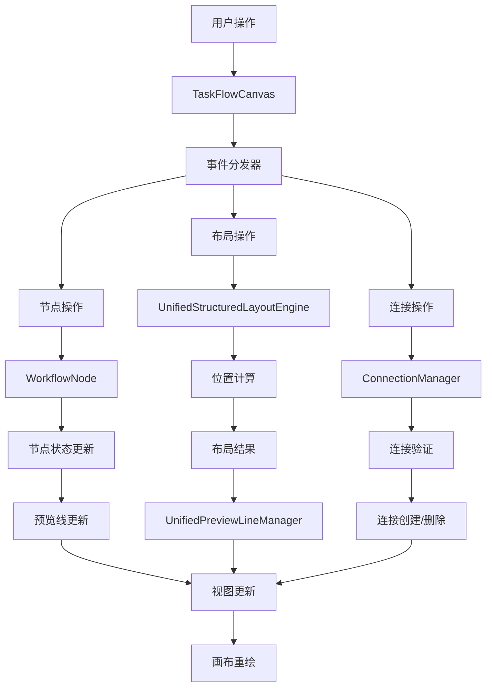

# 营销画布代码优化评估报告

## 1. 代码结构分析和问题识别

### 1.1 TaskFlowCanvas组件问题

**问题识别：**
- **文件过大**：5250行代码，违反单一职责原则
- **状态管理混乱**：30+个ref变量，缺乏统一管理
- **事件处理冗余**：大量重复的事件监听器代码
- **初始化逻辑复杂**：initCanvas方法过于庞大，职责不清

**具体问题：**
```javascript
// 问题1：状态变量过多且分散
const showMinimap = ref(false)
const minimapCollapsed = ref(false)
const isGraphReady = ref(false)
const selectedNodeId = ref(null)
const showNodeSelector = ref(false)
// ... 还有25+个状态变量

// 问题2：初始化方法过于复杂（200+行）
const initCanvas = async () => {
  // 大量配置代码混杂在一起
  // 缺乏模块化分离
}
```

### 1.2 UnifiedStructuredLayoutEngine问题

**问题识别：**
- **类过于庞大**：4292行代码，职责过多
- **循环引用风险**：使用WeakRef但仍存在潜在问题
- **性能优化过度**：多层缓存和防抖机制增加复杂度
- **方法职责不清**：单个方法处理多种逻辑

**具体问题：**
```javascript
// 问题1：构造函数过于复杂
constructor(graph, options = {}, previewLineManager = null) {
  // 初始化20+个属性
  // 创建多个子系统实例
  // 配置复杂的缓存机制
}

// 问题2：方法过长且职责混乱
async executeLayoutImmediate(options = {}) {
  // 200+行代码处理多种逻辑
  // 性能监控、数据处理、布局计算混在一起
}
```

### 1.3 UnifiedPreviewLineManager问题

**问题识别：**
- **文件巨大**：8091行代码，严重违反模块化原则
- **职责过载**：同时处理预览线、分支管理、性能优化
- **内存泄漏风险**：大量定时器和事件监听器
- **代码重复**：相似的位置计算逻辑重复出现

**具体问题：**
```javascript
// 问题1：工具类内嵌在主类中
class BranchLabelUtils {
  // 应该独立为单独模块
}

class PerformanceUtils {
  // 应该独立为单独模块
}

// 问题2：缓存清理机制可能导致内存泄漏
this.cacheCleanupInterval = setInterval(() => {
  this.clearExpiredCache()
}, 10000) // 没有在组件销毁时清理
```

### 1.4 useStructuredLayout组合式函数问题

**问题识别：**
- **职责混乱**：布局、预览线、坐标管理混在一起
- **异步处理复杂**：多层嵌套的异步调用
- **错误处理不一致**：不同方法的错误处理策略不统一

## 2. 性能优化建议

### 2.1 内存优化

**问题：**
- 大量Map和Set缓存未及时清理
- 事件监听器未正确移除
- 循环引用导致垃圾回收困难

**优化方案：**
```javascript
// 1. 实现统一的缓存管理器
class CacheManager {
  constructor(maxSize = 100, ttl = 5000) {
    this.cache = new Map()
    this.maxSize = maxSize
    this.ttl = ttl
  }
  
  set(key, value) {
    if (this.cache.size >= this.maxSize) {
      const firstKey = this.cache.keys().next().value
      this.cache.delete(firstKey)
    }
    this.cache.set(key, { value, timestamp: Date.now() })
  }
  
  cleanup() {
    const now = Date.now()
    for (const [key, item] of this.cache) {
      if (now - item.timestamp > this.ttl) {
        this.cache.delete(key)
      }
    }
  }
}

// 2. 实现事件监听器管理器
class EventListenerManager {
  constructor() {
    this.listeners = new Map()
  }
  
  add(target, event, handler) {
    const key = `${target.constructor.name}-${event}`
    if (!this.listeners.has(key)) {
      this.listeners.set(key, [])
    }
    this.listeners.get(key).push({ target, handler })
    target.addEventListener(event, handler)
  }
  
  removeAll() {
    for (const [key, listeners] of this.listeners) {
      listeners.forEach(({ target, handler }) => {
        target.removeEventListener(key.split('-')[1], handler)
      })
    }
    this.listeners.clear()
  }
}
```

### 2.2 计算性能优化

**问题：**
- 频繁的DOM查询和计算
- 重复的布局计算
- 不必要的响应式更新

**优化方案：**
```javascript
// 1. 使用计算属性缓存
const memoizedLayoutConfig = computed(() => {
  return {
    rankdir: layoutDirection.value,
    nodesep: layoutDirection.value === 'LR' ? 150 : 200,
    ranksep: layoutDirection.value === 'LR' ? 200 : 120
  }
})

// 2. 批量更新机制
class BatchUpdateManager {
  constructor(flushDelay = 16) {
    this.pendingUpdates = new Set()
    this.flushDelay = flushDelay
    this.flushTimer = null
  }
  
  schedule(updateFn) {
    this.pendingUpdates.add(updateFn)
    if (!this.flushTimer) {
      this.flushTimer = setTimeout(() => {
        this.flush()
      }, this.flushDelay)
    }
  }
  
  flush() {
    for (const updateFn of this.pendingUpdates) {
      updateFn()
    }
    this.pendingUpdates.clear()
    this.flushTimer = null
  }
}
```

## 3. 代码简洁性改进方案

### 3.1 组件拆分策略

**TaskFlowCanvas组件拆分：**
```javascript
// 1. 拆分为多个子组件
// TaskFlowCanvas.vue (主组件，200行以内)
// CanvasToolbar.vue (工具栏)
// CanvasContainer.vue (画布容器)
// MinimapPanel.vue (小地图面板)
// HistoryPanel.vue (历史面板)
// NodeSelector.vue (节点选择器)

// 2. 状态管理重构
// useCanvasState.js (画布状态)
// useToolbarState.js (工具栏状态)
// useNodeSelection.js (节点选择)
// useHistoryManagement.js (历史管理)
```

### 3.2 类职责分离

**UnifiedStructuredLayoutEngine重构：**
```javascript
// 1. 核心布局引擎
class LayoutEngine {
  constructor(graph, options) {
    this.graph = graph
    this.options = options
  }
  
  async executeLayout(nodes, edges) {
    // 核心布局逻辑
  }
}

// 2. 性能优化器（独立模块）
class LayoutPerformanceOptimizer {
  constructor(options) {
    this.cache = new CacheManager()
    this.batchManager = new BatchUpdateManager()
  }
}

// 3. 布局验证器（独立模块）
class LayoutValidator {
  validateLayout(layout) {
    // 验证逻辑
  }
}

// 4. 布局应用器（独立模块）
class LayoutApplier {
  applyLayout(graph, layout) {
    // 应用逻辑
  }
}
```

### 3.3 预览线管理器简化

**UnifiedPreviewLineManager重构：**
```javascript
// 1. 核心预览线管理器
class PreviewLineManager {
  constructor(graph, options) {
    this.graph = graph
    this.lines = new Map()
  }
  
  createPreviewLine(config) {
    // 创建预览线
  }
  
  updatePreviewLine(id, config) {
    // 更新预览线
  }
}

// 2. 分支管理器（独立模块）
class BranchManager {
  generateBranchLabel(branchId, index, nodeType) {
    // 分支标签生成
  }
}

// 3. 位置计算器（独立模块）
class PositionCalculator {
  calculatePosition(node, layout) {
    // 位置计算
  }
}
```

## 4. 架构优化建议

### 4.1 分层架构设计

```
┌─────────────────────────────────────┐
│           Presentation Layer        │
│  (TaskFlowCanvas, Toolbar, Panels)  │
├─────────────────────────────────────┤
│           Business Layer            │
│   (LayoutService, PreviewService)   │
├─────────────────────────────────────┤
│           Core Layer                │
│  (LayoutEngine, PreviewManager)     │
├─────────────────────────────────────┤
│           Infrastructure Layer      │
│  (CacheManager, EventManager)       │
└─────────────────────────────────────┘
```

### 4.2 服务化架构

```javascript
// 1. 布局服务
class LayoutService {
  constructor() {
    this.engine = new LayoutEngine()
    this.optimizer = new LayoutOptimizer()
    this.validator = new LayoutValidator()
  }
  
  async applyLayout(graph, options) {
    const layout = await this.engine.calculateLayout(graph, options)
    const optimized = await this.optimizer.optimize(layout)
    const validated = this.validator.validate(optimized)
    return this.engine.apply(graph, validated)
  }
}

// 2. 预览线服务
class PreviewLineService {
  constructor() {
    this.manager = new PreviewLineManager()
    this.calculator = new PositionCalculator()
    this.branchManager = new BranchManager()
  }
  
  createPreviewLines(node, branches) {
    const positions = this.calculator.calculate(node, branches)
    return this.manager.create(positions)
  }
}
```

### 4.3 事件驱动架构

```javascript
// 事件总线
class EventBus {
  constructor() {
    this.events = new Map()
  }
  
  on(event, handler) {
    if (!this.events.has(event)) {
      this.events.set(event, [])
    }
    this.events.get(event).push(handler)
  }
  
  emit(event, data) {
    const handlers = this.events.get(event) || []
    handlers.forEach(handler => handler(data))
  }
}

// 使用事件解耦组件间通信
const eventBus = new EventBus()

// 布局完成事件
eventBus.emit('layout:completed', { layout, duration })

// 预览线更新事件
eventBus.emit('preview:updated', { lines, positions })
```

## 5. 具体重构建议和实施步骤

### 5.1 第一阶段：基础重构（1-2周）

**目标：**减少代码复杂度，提高可维护性

**步骤：**
1. **TaskFlowCanvas组件拆分**
   - 提取CanvasToolbar组件
   - 提取MinimapPanel组件
   - 提取HistoryPanel组件
   - 创建useCanvasState组合式函数

2. **工具类独立化**
   - 提取BranchLabelUtils为独立模块
   - 提取PerformanceUtils为独立模块
   - 创建CacheManager统一缓存管理

3. **事件监听器管理**
   - 实现EventListenerManager
   - 统一事件监听器的添加和移除

### 5.2 第二阶段：架构优化（2-3周）

**目标：**建立清晰的分层架构

**步骤：**
1. **服务层创建**
   - 实现LayoutService
   - 实现PreviewLineService
   - 实现CanvasService

2. **核心引擎重构**
   - 拆分UnifiedStructuredLayoutEngine
   - 创建独立的LayoutEngine
   - 创建独立的PerformanceOptimizer

3. **预览线管理器简化**
   - 拆分UnifiedPreviewLineManager
   - 创建独立的PositionCalculator
   - 创建独立的BranchManager

### 5.3 第三阶段：性能优化（1-2周）

**目标：**提升运行性能和内存使用效率

**步骤：**
1. **内存优化**
   - 实现智能缓存清理
   - 优化事件监听器管理
   - 解决循环引用问题

2. **计算优化**
   - 实现批量更新机制
   - 优化布局计算算法
   - 减少不必要的重绘

3. **响应式优化**
   - 使用shallowRef减少深度监听
   - 实现计算属性缓存
   - 优化组件更新策略

### 5.4 第四阶段：测试和验证（1周）

**目标：**确保重构后的代码质量和功能完整性

**步骤：**
1. **单元测试**
   - 为核心服务编写单元测试
   - 为工具类编写单元测试
   - 测试覆盖率达到80%以上

2. **集成测试**
   - 测试组件间的协作
   - 测试事件流的正确性
   - 测试性能指标

3. **回归测试**
   - 验证所有原有功能正常
   - 验证性能提升效果
   - 验证内存使用优化

## 6. 组件职能分工

### 6.1 组件职责矩阵

| 组件 | 核心职责 | 数据管理 | 事件处理 | 渲染职责 | 依赖关系 |
|------|----------|----------|----------|----------|----------|
| **TaskFlowCanvas** | 画布容器管理 | 画布状态、工具栏状态 | 用户交互、工具栏操作 | 画布容器、工具栏UI | Graph实例、布局引擎 |
| **WorkflowNode** | 节点业务逻辑 | 节点数据、配置状态 | 节点交互、配置变更 | 节点视觉、端口显示 | 画布实例、预览线管理器 |
| **UnifiedPreviewLineManager** | 预览线生命周期 | 预览线状态、端点位置 | 拖拽事件、连接事件 | 预览线渲染、动画效果 | 布局引擎、分支管理器 |
| **UnifiedStructuredLayoutEngine** | 布局算法执行 | 节点位置、层级关系 | 布局触发、完成通知 | 无直接渲染 | 预览线管理器、性能监控 |
| **ConnectionManager** | 连接线管理 | 连接关系、路径数据 | 连接创建、删除事件 | 连接线样式、路径渲染 | Graph实例、节点管理器 |

### 6.2 数据流向图



### 6.3 接口定义规范

#### 6.3.1 画布容器接口
```javascript
// TaskFlowCanvas 对外接口
interface CanvasInterface {
  // 画布操作
  zoomIn(): void
  zoomOut(): void
  fitContent(): void
  clearCanvas(): void
  
  // 布局操作
  applyLayout(direction?: 'TB' | 'LR'): Promise<void>
  switchLayoutDirection(direction: 'TB' | 'LR'): void
  
  // 节点操作
  addNode(type: NodeType, position?: Point): string
  removeNode(nodeId: string): boolean
  selectNode(nodeId: string): void
  
  // 状态查询
  getCanvasState(): CanvasState
  getSelectedNodes(): string[]
}
```

#### 6.3.2 节点组件接口
```javascript
// WorkflowNode 组件接口
interface NodeInterface {
  // 节点配置
  updateConfig(config: NodeConfig): void
  getConfig(): NodeConfig
  
  // 端口管理
  getInputPorts(): Port[]
  getOutputPorts(): Port[]
  updatePortPositions(): void
  
  // 状态管理
  setSelected(selected: boolean): void
  setHighlight(highlight: boolean): void
  setDebugMode(enabled: boolean): void
}
```

#### 6.3.3 预览线管理器接口
```javascript
// UnifiedPreviewLineManager 接口
interface PreviewLineInterface {
  // 预览线操作
  showPreviewLine(sourcePort: Port, targetPoint: Point): void
  hidePreviewLine(): void
  updatePreviewLine(targetPoint: Point): void
  
  // 连接操作
  createConnection(sourcePort: Port, targetPort: Port): boolean
  validateConnection(sourcePort: Port, targetPort: Port): boolean
  
  // 布局同步
  syncWithLayout(layoutResult: LayoutResult): void
  updateEndpointPositions(): void
}
```

#### 6.3.4 布局引擎接口
```javascript
// UnifiedStructuredLayoutEngine 接口
interface LayoutEngineInterface {
  // 布局执行
  applyLayout(nodes: Node[], edges: Edge[]): Promise<LayoutResult>
  applyLayoutImmediate(nodes: Node[], edges: Edge[]): LayoutResult
  
  // 配置管理
  updateConfig(config: LayoutConfig): void
  getConfig(): LayoutConfig
  
  // 性能监控
  getPerformanceMetrics(): PerformanceMetrics
  clearCache(): void
}
```

### 6.4 组件间通信协议

#### 6.4.1 事件通信规范
```javascript
// 事件类型定义
const EventTypes = {
  // 节点事件
  NODE_SELECTED: 'node:selected',
  NODE_CONFIG_CHANGED: 'node:config:changed',
  NODE_POSITION_CHANGED: 'node:position:changed',
  
  // 布局事件
  LAYOUT_STARTED: 'layout:started',
  LAYOUT_COMPLETED: 'layout:completed',
  LAYOUT_FAILED: 'layout:failed',
  
  // 连接事件
  CONNECTION_CREATED: 'connection:created',
  CONNECTION_REMOVED: 'connection:removed',
  
  // 预览线事件
  PREVIEW_LINE_SHOW: 'preview:show',
  PREVIEW_LINE_HIDE: 'preview:hide',
  PREVIEW_LINE_UPDATE: 'preview:update'
}
```

#### 6.4.2 数据传递规范
```javascript
// 标准事件数据格式
interface EventData {
  type: string
  source: string  // 事件源组件ID
  target?: string // 目标组件ID
  payload: any    // 事件数据
  timestamp: number
}

// 布局结果数据格式
interface LayoutResult {
  nodes: Array<{id: string, x: number, y: number}>
  edges: Array<{id: string, source: string, target: string}>
  bounds: {width: number, height: number}
  performance: PerformanceMetrics
}
```

### 6.5 职责边界清单

#### 6.5.1 TaskFlowCanvas 职责边界
**负责：**
- 画布容器的创建和销毁
- 工具栏状态管理和UI渲染
- 用户交互事件的初步处理和分发
- 画布级别的状态管理（缩放、拖拽模式等）
- 组件生命周期协调

**不负责：**
- 具体节点的业务逻辑处理
- 布局算法的实现细节
- 预览线的绘制和动画
- 连接线的路径计算

#### 6.5.2 WorkflowNode 职责边界
**负责：**
- 节点的业务逻辑和配置管理
- 节点UI的渲染和交互
- 端口位置的计算和更新
- 节点级别的事件处理

**不负责：**
- 节点间的布局关系计算
- 预览线的管理和渲染
- 画布级别的状态管理
- 连接关系的验证和创建

#### 6.5.3 UnifiedPreviewLineManager 职责边界
**负责：**
- 预览线的完整生命周期管理
- 拖拽过程中的视觉反馈
- 连接有效性的实时验证
- 端点位置的同步更新

**不负责：**
- 节点位置的计算
- 布局算法的执行
- 连接关系的持久化存储
- 画布的缩放和平移

#### 6.5.4 UnifiedStructuredLayoutEngine 职责边界
**负责：**
- 布局算法的实现和执行
- 节点位置的计算和优化
- 布局性能的监控和优化
- 布局结果的缓存管理

**不负责：**
- UI的直接渲染
- 用户交互的处理
- 节点配置的管理
- 预览线的绘制

#### 6.5.5 ConnectionManager 职责边界
**负责：**
- 连接关系的创建、删除和管理
- 连接线的样式和路径渲染
- 连接有效性的验证
- 连接数据的持久化

**不负责：**
- 节点位置的计算
- 预览线的临时显示
- 布局算法的执行
- 画布容器的管理

## 7. 预期收益

### 7.1 代码质量提升
- **代码行数减少**：预计减少30-40%的代码量
- **复杂度降低**：单个文件不超过500行
- **可维护性提升**：清晰的职责分离和模块化设计

### 7.2 性能提升
- **内存使用优化**：减少20-30%的内存占用
- **渲染性能提升**：减少不必要的重绘和重排
- **响应速度提升**：优化事件处理和计算逻辑

### 7.3 开发效率提升
- **组件复用性**：提高组件的复用性和扩展性
- **调试便利性**：清晰的模块边界便于问题定位
- **新功能开发**：模块化设计便于新功能的添加

## 7. 风险评估和缓解策略

### 7.1 主要风险
1. **功能回归风险**：重构可能引入新的bug
2. **性能回归风险**：架构调整可能影响性能
3. **开发周期风险**：重构时间可能超出预期

### 7.2 缓解策略
1. **渐进式重构**：分阶段进行，每个阶段都有明确的验收标准
2. **充分测试**：建立完善的测试体系，确保功能正确性
3. **性能监控**：建立性能基线，持续监控性能指标
4. **回滚机制**：保留原有代码，必要时可以快速回滚

## 8. 总结

当前营销画布相关代码存在明显的架构和性能问题，主要体现在：
- 单个文件过大，职责不清
- 缺乏合理的分层架构
- 存在性能瓶颈和内存泄漏风险
- 代码复用性和可维护性较差

通过系统性的重构，可以显著提升代码质量、性能和可维护性。建议按照分阶段的方式进行重构，确保在提升代码质量的同时不影响现有功能的稳定性。