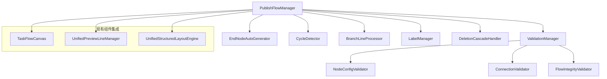

# 营销画布发布流程处理逻辑设计

## 1. 概述

本文档详细设计营销画布发布流程中的核心处理逻辑，包括未连接预览线的结束节点自动添加、节点配置校验、循环依赖检测、分流节点处理、预览线标签管理和节点删除级联处理等关键功能。

## 2. 发布流程核心组件架构

### 2.1 新增核心管理器



### 2.2 组件职责分工

| 组件名称 | 主要职责 | 与现有组件关系 |
|---------|---------|---------------|
| PublishFlowManager | 发布流程总控制器 | 协调所有现有组件 |
| ValidationManager | 校验管理器 | 调用TaskFlowCanvas获取节点数据 |
| EndNodeAutoGenerator | 结束节点自动生成器 | 与UnifiedPreviewLineManager协作 |
| CycleDetector | 循环检测器 | 独立算法模块 |
| BranchLineProcessor | 分支线处理器 | 深度集成UnifiedPreviewLineManager |
| LabelManager | 标签管理器 | 管理预览线标签状态 |
| DeletionCascadeHandler | 删除级联处理器 | 协调所有组件的清理工作 |

## 3. 未连接预览线结束节点自动添加

### 3.1 检测逻辑

```javascript
class EndNodeAutoGenerator {
  constructor(canvas, previewLineManager) {
    this.canvas = canvas;
    this.previewLineManager = previewLineManager;
    this.endNodeConfig = {
      type: 'END_NODE',
      shape: 'circle',
      size: { width: 60, height: 60 },
      style: {
        fill: '#ff6b6b',
        stroke: '#ff5252',
        strokeWidth: 2
      },
      label: '结束'
    };
  }

  // 检测未连接的预览线
  detectUnconnectedPreviewLines() {
    const previewLines = this.previewLineManager.getAllPreviewLines();
    const unconnectedLines = [];
    
    previewLines.forEach(line => {
      // 检查预览线的目标端是否连接到节点
      if (!line.target || !line.target.cell) {
        unconnectedLines.push(line);
      }
    });
    
    return unconnectedLines;
  }

  // 自动添加结束节点
  async autoAddEndNodes() {
    const unconnectedLines = this.detectUnconnectedPreviewLines();
    const addedEndNodes = [];
    
    for (const line of unconnectedLines) {
      try {
        const endNode = await this.createEndNodeForLine(line);
        addedEndNodes.push({
          line: line,
          endNode: endNode,
          connection: await this.connectLineToEndNode(line, endNode)
        });
      } catch (error) {
        console.error(`为预览线 ${line.id} 添加结束节点失败:`, error);
      }
    }
    
    return addedEndNodes;
  }

  // 为特定预览线创建结束节点
  async createEndNodeForLine(line) {
    // 计算结束节点位置（在预览线末端延伸100px）
    const endPosition = this.calculateEndNodePosition(line);
    
    const endNodeData = {
      ...this.endNodeConfig,
      id: `end_${line.id}_${Date.now()}`,
      position: endPosition,
      data: {
        isAutoGenerated: true,
        sourceLineId: line.id,
        nodeType: 'END_NODE'
      }
    };
    
    // 通过画布添加节点
    const endNode = this.canvas.addNode(endNodeData);
    
    // 更新预览线管理器
    this.previewLineManager.registerEndNode(line.id, endNode.id);
    
    return endNode;
  }

  // 计算结束节点位置
  calculateEndNodePosition(line) {
    const lineEndPoint = line.getTargetPoint();
    const lineDirection = line.getDirection();
    
    // 根据预览线方向计算结束节点位置
    const offset = 100;
    let endPosition;
    
    switch (lineDirection) {
      case 'horizontal':
        endPosition = {
          x: lineEndPoint.x + offset,
          y: lineEndPoint.y
        };
        break;
      case 'vertical':
        endPosition = {
          x: lineEndPoint.x,
          y: lineEndPoint.y + offset
        };
        break;
      default:
        // 默认水平延伸
        endPosition = {
          x: lineEndPoint.x + offset,
          y: lineEndPoint.y
        };
    }
    
    return endPosition;
  }

  // 连接预览线到结束节点
  async connectLineToEndNode(line, endNode) {
    const connection = this.canvas.addEdge({
      source: line.source,
      target: endNode.id,
      attrs: {
        line: {
          stroke: '#666',
          strokeWidth: 2,
          strokeDasharray: '5,5'
        }
      },
      data: {
        isAutoGenerated: true,
        type: 'END_CONNECTION'
      }
    });
    
    // 移除原预览线
    this.previewLineManager.removePreviewLine(line.id);
    
    return connection;
  }
}
```

### 3.2 结束节点管理策略

- **自动生成标识**: 所有自动生成的结束节点都标记 `isAutoGenerated: true`
- **位置计算**: 基于预览线方向和末端位置智能计算
- **样式统一**: 使用统一的结束节点样式配置
- **清理机制**: 发布取消时自动清理生成的结束节点

## 4. 节点配置完整性校验

### 4.1 校验管理器架构

```javascript
class ValidationManager {
  constructor(canvas) {
    this.canvas = canvas;
    this.validators = {
      nodeConfig: new NodeConfigValidator(),
      connection: new ConnectionValidator(),
      flowIntegrity: new FlowIntegrityValidator()
    };
    this.validationResults = new Map();
  }

  // 执行完整校验
  async validateAll() {
    const results = {
      isValid: true,
      errors: [],
      warnings: [],
      nodeValidations: new Map(),
      connectionValidations: [],
      flowValidations: []
    };

    try {
      // 1. 节点配置校验
      const nodeResults = await this.validateAllNodes();
      results.nodeValidations = nodeResults.validations;
      results.errors.push(...nodeResults.errors);
      results.warnings.push(...nodeResults.warnings);

      // 2. 连接校验
      const connectionResults = await this.validateConnections();
      results.connectionValidations = connectionResults.validations;
      results.errors.push(...connectionResults.errors);

      // 3. 流程完整性校验
      const flowResults = await this.validateFlowIntegrity();
      results.flowValidations = flowResults.validations;
      results.errors.push(...flowResults.errors);
      results.warnings.push(...flowResults.warnings);

      results.isValid = results.errors.length === 0;
      
    } catch (error) {
      results.isValid = false;
      results.errors.push({
        type: 'VALIDATION_ERROR',
        message: `校验过程发生错误: ${error.message}`,
        severity: 'error'
      });
    }

    this.validationResults.set('latest', results);
    return results;
  }

  // 校验所有节点
  async validateAllNodes() {
    const nodes = this.canvas.getNodes();
    const validations = new Map();
    const errors = [];
    const warnings = [];

    for (const node of nodes) {
      const nodeValidation = await this.validators.nodeConfig.validate(node);
      validations.set(node.id, nodeValidation);
      
      if (!nodeValidation.isValid) {
        errors.push(...nodeValidation.errors);
      }
      warnings.push(...nodeValidation.warnings);
    }

    return { validations, errors, warnings };
  }
}
```

### 4.2 节点配置校验器

```javascript
class NodeConfigValidator {
  constructor() {
    this.requiredFields = {
      'INPUT_NODE': ['dataSource', 'outputSchema'],
      'PROCESSING_NODE': ['processingLogic', 'inputSchema', 'outputSchema'],
      'OUTPUT_NODE': ['outputFormat', 'destination'],
      'DECISION_NODE': ['conditions', 'branches'],
      'END_NODE': [] // 结束节点无必填字段
    };
    
    this.validationRules = {
      dataSource: this.validateDataSource.bind(this),
      processingLogic: this.validateProcessingLogic.bind(this),
      conditions: this.validateConditions.bind(this),
      outputFormat: this.validateOutputFormat.bind(this)
    };
  }

  async validate(node) {
    const result = {
      nodeId: node.id,
      nodeType: node.getData()?.nodeType,
      isValid: true,
      errors: [],
      warnings: [],
      completeness: 0
    };

    try {
      const nodeData = node.getData();
      const nodeType = nodeData?.nodeType;
      
      if (!nodeType) {
        result.errors.push({
          field: 'nodeType',
          message: '节点类型未定义',
          severity: 'error'
        });
        result.isValid = false;
        return result;
      }

      // 检查必填字段
      const requiredFields = this.requiredFields[nodeType] || [];
      const missingFields = [];
      const validFields = [];

      for (const field of requiredFields) {
        if (!nodeData[field] || this.isEmpty(nodeData[field])) {
          missingFields.push(field);
          result.errors.push({
            field: field,
            message: `必填字段 '${field}' 未配置`,
            severity: 'error'
          });
        } else {
          // 执行字段特定校验
          if (this.validationRules[field]) {
            const fieldValidation = await this.validationRules[field](nodeData[field], nodeData);
            if (!fieldValidation.isValid) {
              result.errors.push(...fieldValidation.errors);
              result.warnings.push(...fieldValidation.warnings);
            } else {
              validFields.push(field);
            }
          } else {
            validFields.push(field);
          }
        }
      }

      // 计算完整度
      result.completeness = requiredFields.length > 0 
        ? (validFields.length / requiredFields.length) * 100 
        : 100;

      result.isValid = missingFields.length === 0 && result.errors.length === 0;

    } catch (error) {
      result.errors.push({
        field: 'general',
        message: `节点校验失败: ${error.message}`,
        severity: 'error'
      });
      result.isValid = false;
    }

    return result;
  }

  // 数据源校验
  async validateDataSource(dataSource, nodeData) {
    const result = { isValid: true, errors: [], warnings: [] };
    
    if (!dataSource.type) {
      result.errors.push({
        field: 'dataSource.type',
        message: '数据源类型未指定',
        severity: 'error'
      });
      result.isValid = false;
    }
    
    if (dataSource.type === 'database' && !dataSource.connectionString) {
      result.errors.push({
        field: 'dataSource.connectionString',
        message: '数据库连接字符串未配置',
        severity: 'error'
      });
      result.isValid = false;
    }
    
    return result;
  }

  // 处理逻辑校验
  async validateProcessingLogic(processingLogic, nodeData) {
    const result = { isValid: true, errors: [], warnings: [] };
    
    if (!processingLogic.code || processingLogic.code.trim() === '') {
      result.errors.push({
        field: 'processingLogic.code',
        message: '处理代码不能为空',
        severity: 'error'
      });
      result.isValid = false;
    }
    
    // 语法检查（简化版）
    if (processingLogic.language === 'python') {
      try {
        // 这里可以集成Python语法检查器
        // 暂时只做基础检查
        if (!processingLogic.code.includes('def ') && !processingLogic.code.includes('return')) {
          result.warnings.push({
            field: 'processingLogic.code',
            message: 'Python代码建议包含函数定义和返回值',
            severity: 'warning'
          });
        }
      } catch (error) {
        result.errors.push({
          field: 'processingLogic.code',
          message: `Python代码语法错误: ${error.message}`,
          severity: 'error'
        });
        result.isValid = false;
      }
    }
    
    return result;
  }

  isEmpty(value) {
    return value === null || value === undefined || 
           (typeof value === 'string' && value.trim() === '') ||
           (Array.isArray(value) && value.length === 0) ||
           (typeof value === 'object' && Object.keys(value).length === 0);
  }
}
```

## 5. 循环依赖检测

### 5.1 循环检测算法

```javascript
class CycleDetector {
  constructor(canvas) {
    this.canvas = canvas;
    this.visitedNodes = new Set();
    this.recursionStack = new Set();
    this.cycles = [];
  }

  // 检测所有循环
  detectAllCycles() {
    this.reset();
    const nodes = this.canvas.getNodes();
    
    for (const node of nodes) {
      if (!this.visitedNodes.has(node.id)) {
        this.dfsDetectCycle(node, []);
      }
    }
    
    return {
      hasCycles: this.cycles.length > 0,
      cycles: this.cycles,
      cycleCount: this.cycles.length
    };
  }

  // 深度优先搜索检测循环
  dfsDetectCycle(node, path) {
    this.visitedNodes.add(node.id);
    this.recursionStack.add(node.id);
    path.push(node.id);

    // 获取当前节点的所有出边
    const outgoingEdges = this.canvas.getOutgoingEdges(node);
    
    for (const edge of outgoingEdges) {
      const targetNode = edge.getTargetNode();
      
      if (!targetNode) continue;
      
      if (this.recursionStack.has(targetNode.id)) {
        // 发现循环
        const cycleStartIndex = path.indexOf(targetNode.id);
        const cycle = path.slice(cycleStartIndex).concat([targetNode.id]);
        
        this.cycles.push({
          id: `cycle_${this.cycles.length + 1}`,
          nodes: cycle,
          edges: this.getCycleEdges(cycle),
          severity: this.calculateCycleSeverity(cycle)
        });
      } else if (!this.visitedNodes.has(targetNode.id)) {
        this.dfsDetectCycle(targetNode, [...path]);
      }
    }

    this.recursionStack.delete(node.id);
    path.pop();
  }

  // 获取循环中的边
  getCycleEdges(cycle) {
    const edges = [];
    
    for (let i = 0; i < cycle.length - 1; i++) {
      const sourceId = cycle[i];
      const targetId = cycle[i + 1];
      
      const edge = this.canvas.getEdgesBetween(sourceId, targetId)[0];
      if (edge) {
        edges.push({
          id: edge.id,
          source: sourceId,
          target: targetId
        });
      }
    }
    
    return edges;
  }

  // 计算循环严重程度
  calculateCycleSeverity(cycle) {
    // 根据循环长度和节点类型判断严重程度
    if (cycle.length <= 3) {
      return 'high'; // 短循环，严重程度高
    } else if (cycle.length <= 6) {
      return 'medium';
    } else {
      return 'low';
    }
  }

  // 重置检测状态
  reset() {
    this.visitedNodes.clear();
    this.recursionStack.clear();
    this.cycles = [];
  }

  // 获取循环修复建议
  getCycleFixSuggestions(cycle) {
    const suggestions = [];
    
    // 分析循环中的节点类型
    const nodeTypes = cycle.map(nodeId => {
      const node = this.canvas.getCellById(nodeId);
      return node?.getData()?.nodeType;
    });
    
    // 根据节点类型提供修复建议
    if (nodeTypes.includes('DECISION_NODE')) {
      suggestions.push({
        type: 'condition_check',
        message: '检查决策节点的条件逻辑，确保有明确的退出条件',
        priority: 'high'
      });
    }
    
    if (cycle.length <= 3) {
      suggestions.push({
        type: 'add_condition',
        message: '在循环中添加条件节点以提供退出机制',
        priority: 'high'
      });
    }
    
    suggestions.push({
      type: 'restructure',
      message: '考虑重新设计流程结构，避免循环依赖',
      priority: 'medium'
    });
    
    return suggestions;
  }
}
```

## 6. 分流节点分支处理

### 6.1 分支线处理器

```javascript
class BranchLineProcessor {
  constructor(previewLineManager, labelManager) {
    this.previewLineManager = previewLineManager;
    this.labelManager = labelManager;
    this.branchStates = new Map(); // 存储分支状态
  }

  // 处理分流节点下的分支挂载
  async processBranchAttachment(decisionNodeId, attachedBranchId, targetNodeId) {
    try {
      const result = {
        success: true,
        attachedBranch: null,
        updatedPreviewLines: [],
        updatedLabels: [],
        errors: []
      };

      // 1. 获取决策节点的所有分支
      const branches = await this.getBranchesForDecisionNode(decisionNodeId);
      
      // 2. 处理已挂载的分支
      const attachedBranch = branches.find(b => b.id === attachedBranchId);
      if (attachedBranch) {
        await this.attachBranchToNode(attachedBranch, targetNodeId);
        result.attachedBranch = attachedBranch;
      }

      // 3. 处理其他未挂载的预览线
      const otherBranches = branches.filter(b => b.id !== attachedBranchId);
      for (const branch of otherBranches) {
        const processedLines = await this.processUnattachedBranch(branch, decisionNodeId);
        result.updatedPreviewLines.push(...processedLines);
      }

      // 4. 更新所有分支的标签
      const updatedLabels = await this.updateBranchLabels(decisionNodeId, branches);
      result.updatedLabels = updatedLabels;

      // 5. 更新分支状态
      this.updateBranchState(decisionNodeId, attachedBranchId, 'attached');

      return result;

    } catch (error) {
      console.error('处理分支挂载失败:', error);
      return {
        success: false,
        error: error.message,
        attachedBranch: null,
        updatedPreviewLines: [],
        updatedLabels: []
      };
    }
  }

  // 获取决策节点的所有分支
  async getBranchesForDecisionNode(decisionNodeId) {
    const node = this.canvas.getCellById(decisionNodeId);
    const nodeData = node?.getData();
    
    if (!nodeData || nodeData.nodeType !== 'DECISION_NODE') {
      throw new Error('节点不是决策节点');
    }

    const conditions = nodeData.conditions || [];
    const branches = [];

    conditions.forEach((condition, index) => {
      branches.push({
        id: `${decisionNodeId}_branch_${index}`,
        decisionNodeId: decisionNodeId,
        condition: condition,
        index: index,
        label: condition.label || `分支${index + 1}`,
        isAttached: false,
        targetNodeId: null,
        previewLineId: null
      });
    });

    // 添加默认分支（else分支）
    branches.push({
      id: `${decisionNodeId}_branch_default`,
      decisionNodeId: decisionNodeId,
      condition: { type: 'default', expression: 'else' },
      index: conditions.length,
      label: '默认分支',
      isAttached: false,
      targetNodeId: null,
      previewLineId: null
    });

    return branches;
  }

  // 将分支挂载到目标节点
  async attachBranchToNode(branch, targetNodeId) {
    // 1. 创建实际连接
    const connection = this.canvas.addEdge({
      source: {
        cell: branch.decisionNodeId,
        port: `output_${branch.index}`
      },
      target: {
        cell: targetNodeId,
        port: 'input'
      },
      attrs: {
        line: {
          stroke: '#1890ff',
          strokeWidth: 2
        }
      },
      data: {
        branchId: branch.id,
        condition: branch.condition,
        type: 'BRANCH_CONNECTION'
      }
    });

    // 2. 移除对应的预览线
    if (branch.previewLineId) {
      this.previewLineManager.removePreviewLine(branch.previewLineId);
    }

    // 3. 更新分支状态
    branch.isAttached = true;
    branch.targetNodeId = targetNodeId;
    branch.connectionId = connection.id;

    return connection;
  }

  // 处理未挂载的分支
  async processUnattachedBranch(branch, decisionNodeId) {
    const processedLines = [];

    try {
      // 1. 检查是否已有预览线
      let previewLine = this.previewLineManager.getPreviewLineByBranchId(branch.id);
      
      if (!previewLine) {
        // 2. 创建新的预览线
        previewLine = await this.createPreviewLineForBranch(branch, decisionNodeId);
      } else {
        // 3. 更新现有预览线
        await this.updatePreviewLineForBranch(previewLine, branch);
      }

      // 4. 确保预览线可见且可交互
      this.previewLineManager.setPreviewLineState(previewLine.id, 'interactive');
      
      processedLines.push(previewLine);
      branch.previewLineId = previewLine.id;

    } catch (error) {
      console.error(`处理分支 ${branch.id} 的预览线失败:`, error);
    }

    return processedLines;
  }

  // 为分支创建预览线
  async createPreviewLineForBranch(branch, decisionNodeId) {
    const sourceNode = this.canvas.getCellById(decisionNodeId);
    const sourcePosition = sourceNode.getPosition();
    const sourceSize = sourceNode.getSize();

    // 计算预览线起点（从决策节点的输出端口）
    const startPoint = {
      x: sourcePosition.x + sourceSize.width,
      y: sourcePosition.y + sourceSize.height / 2 + (branch.index * 30)
    };

    // 计算预览线终点（向右延伸150px）
    const endPoint = {
      x: startPoint.x + 150,
      y: startPoint.y
    };

    const previewLineConfig = {
      id: `preview_${branch.id}`,
      type: 'branch',
      source: {
        cell: decisionNodeId,
        port: `output_${branch.index}`,
        point: startPoint
      },
      target: {
        point: endPoint
      },
      branchId: branch.id,
      condition: branch.condition,
      label: branch.label,
      style: {
        stroke: '#52c41a',
        strokeWidth: 2,
        strokeDasharray: '8,4'
      }
    };

    return this.previewLineManager.createPreviewLine(previewLineConfig);
  }

  // 更新分支标签
  async updateBranchLabels(decisionNodeId, branches) {
    const updatedLabels = [];

    for (const branch of branches) {
      try {
        const labelConfig = {
          branchId: branch.id,
          text: branch.label,
          condition: branch.condition.expression || branch.condition.type,
          isAttached: branch.isAttached,
          style: {
            fontSize: 12,
            fill: branch.isAttached ? '#1890ff' : '#52c41a',
            fontWeight: branch.isAttached ? 'bold' : 'normal'
          }
        };

        const label = await this.labelManager.updateBranchLabel(branch.id, labelConfig);
        updatedLabels.push(label);

      } catch (error) {
        console.error(`更新分支 ${branch.id} 标签失败:`, error);
      }
    }

    return updatedLabels;
  }

  // 更新分支状态
  updateBranchState(decisionNodeId, branchId, state) {
    if (!this.branchStates.has(decisionNodeId)) {
      this.branchStates.set(decisionNodeId, new Map());
    }
    
    const nodeBranches = this.branchStates.get(decisionNodeId);
    nodeBranches.set(branchId, {
      state: state,
      timestamp: Date.now(),
      lastUpdate: new Date().toISOString()
    });
  }

  // 获取分支状态
  getBranchState(decisionNodeId, branchId) {
    const nodeBranches = this.branchStates.get(decisionNodeId);
    return nodeBranches?.get(branchId) || { state: 'unattached', timestamp: 0 };
  }
}
```

## 7. 预览线标签管理

### 7.1 标签管理器

```javascript
class LabelManager {
  constructor(canvas) {
    this.canvas = canvas;
    this.labels = new Map(); // 存储所有标签
    this.labelGroups = new Map(); // 按组管理标签
  }

  // 更新分支标签
  async updateBranchLabel(branchId, labelConfig) {
    try {
      let label = this.labels.get(branchId);
      
      if (!label) {
        // 创建新标签
        label = await this.createBranchLabel(branchId, labelConfig);
      } else {
        // 更新现有标签
        await this.updateExistingLabel(label, labelConfig);
      }

      // 更新标签状态
      this.updateLabelState(branchId, labelConfig.isAttached);
      
      return label;

    } catch (error) {
      console.error(`更新分支标签失败:`, error);
      throw error;
    }
  }

  // 创建分支标签
  async createBranchLabel(branchId, labelConfig) {
    const labelElement = this.canvas.addNode({
      shape: 'html',
      id: `label_${branchId}`,
      position: this.calculateLabelPosition(branchId),
      size: { width: 80, height: 24 },
      html: this.generateLabelHTML(labelConfig),
      data: {
        type: 'BRANCH_LABEL',
        branchId: branchId,
        isLabel: true
      },
      attrs: {
        body: {
          style: {
            pointerEvents: 'none',
            userSelect: 'none'
          }
        }
      }
    });

    const label = {
      id: labelElement.id,
      branchId: branchId,
      element: labelElement,
      config: labelConfig,
      isVisible: true,
      position: labelElement.getPosition()
    };

    this.labels.set(branchId, label);
    return label;
  }

  // 生成标签HTML
  generateLabelHTML(labelConfig) {
    const { text, condition, isAttached, style } = labelConfig;
    
    return `
      <div class="branch-label" style="
        font-size: ${style.fontSize}px;
        color: ${style.fill};
        font-weight: ${style.fontWeight};
        background: ${isAttached ? '#e6f7ff' : '#f6ffed'};
        border: 1px solid ${isAttached ? '#1890ff' : '#52c41a'};
        border-radius: 4px;
        padding: 2px 6px;
        white-space: nowrap;
        text-align: center;
        box-shadow: 0 1px 3px rgba(0,0,0,0.1);
      ">
        <div class="label-text">${text}</div>
        <div class="label-condition" style="
          font-size: 10px;
          opacity: 0.7;
          margin-top: 1px;
        ">${condition}</div>
      </div>
    `;
  }

  // 计算标签位置
  calculateLabelPosition(branchId) {
    // 根据分支ID和预览线位置计算标签位置
    const previewLine = this.previewLineManager.getPreviewLineByBranchId(branchId);
    
    if (previewLine) {
      const midPoint = previewLine.getMidPoint();
      return {
        x: midPoint.x - 40, // 标签宽度的一半
        y: midPoint.y - 20  // 标签上方
      };
    }
    
    // 默认位置
    return { x: 100, y: 100 };
  }

  // 更新现有标签
  async updateExistingLabel(label, labelConfig) {
    // 更新HTML内容
    const newHTML = this.generateLabelHTML(labelConfig);
    label.element.setHTML(newHTML);
    
    // 更新位置（如果需要）
    const newPosition = this.calculateLabelPosition(label.branchId);
    if (newPosition.x !== label.position.x || newPosition.y !== label.position.y) {
      label.element.setPosition(newPosition);
      label.position = newPosition;
    }
    
    // 更新配置
    label.config = labelConfig;
  }

  // 更新标签状态
  updateLabelState(branchId, isAttached) {
    const label = this.labels.get(branchId);
    if (label) {
      label.isAttached = isAttached;
      
      // 更新视觉状态
      const opacity = isAttached ? 0.8 : 1.0;
      label.element.attr('body/style/opacity', opacity);
    }
  }

  // 移除标签
  removeLabel(branchId) {
    const label = this.labels.get(branchId);
    if (label) {
      this.canvas.removeNode(label.element);
      this.labels.delete(branchId);
    }
  }

  // 批量更新标签位置
  async updateLabelsPosition(branchIds) {
    const updates = [];
    
    for (const branchId of branchIds) {
      const label = this.labels.get(branchId);
      if (label) {
        const newPosition = this.calculateLabelPosition(branchId);
        label.element.setPosition(newPosition);
        label.position = newPosition;
        updates.push({ branchId, position: newPosition });
      }
    }
    
    return updates;
  }
}
```

## 8. 节点删除级联处理

### 8.1 删除级联处理器

```javascript
class DeletionCascadeHandler {
  constructor(canvas, previewLineManager, labelManager, layoutEngine) {
    this.canvas = canvas;
    this.previewLineManager = previewLineManager;
    this.labelManager = labelManager;
    this.layoutEngine = layoutEngine;
    this.deletionHistory = []; // 删除历史记录
  }

  // 执行节点删除及级联处理
  async deleteNodeWithCascade(nodeId, options = {}) {
    const {
      confirmDeletion = true,
      updateLayout = true,
      preserveConnections = false
    } = options;

    try {
      // 1. 预删除检查
      const preDeleteCheck = await this.preDeleteValidation(nodeId);
      if (!preDeleteCheck.canDelete && confirmDeletion) {
        throw new Error(preDeleteCheck.reason);
      }

      // 2. 收集删除影响信息
      const impactAnalysis = await this.analyzeDeleteImpact(nodeId);
      
      // 3. 执行级联删除
      const deletionResult = await this.executeCascadeDeletion(nodeId, impactAnalysis, options);
      
      // 4. 后处理
      await this.postDeletionProcessing(deletionResult, options);
      
      // 5. 记录删除历史
      this.recordDeletionHistory(nodeId, deletionResult);
      
      return {
        success: true,
        nodeId: nodeId,
        deletionResult: deletionResult,
        impactAnalysis: impactAnalysis
      };

    } catch (error) {
      console.error(`删除节点 ${nodeId} 失败:`, error);
      return {
        success: false,
        nodeId: nodeId,
        error: error.message
      };
    }
  }

  // 预删除验证
  async preDeleteValidation(nodeId) {
    const node = this.canvas.getCellById(nodeId);
    if (!node) {
      return { canDelete: false, reason: '节点不存在' };
    }

    const nodeData = node.getData();
    
    // 检查是否为关键节点
    if (nodeData?.isCritical) {
      return { canDelete: false, reason: '关键节点不能删除' };
    }

    // 检查是否为起始节点
    const incomingEdges = this.canvas.getIncomingEdges(node);
    const outgoingEdges = this.canvas.getOutgoingEdges(node);
    
    if (incomingEdges.length === 0 && outgoingEdges.length > 0) {
      return { 
        canDelete: true, 
        reason: '删除起始节点将影响整个流程',
        warning: true 
      };
    }

    return { canDelete: true, reason: '可以安全删除' };
  }

  // 分析删除影响
  async analyzeDeleteImpact(nodeId) {
    const node = this.canvas.getCellById(nodeId);
    const impact = {
      nodeId: nodeId,
      nodeType: node.getData()?.nodeType,
      affectedConnections: [],
      affectedPreviewLines: [],
      affectedLabels: [],
      affectedBranches: [],
      downstreamNodes: [],
      upstreamNodes: []
    };

    // 1. 分析连接影响
    const incomingEdges = this.canvas.getIncomingEdges(node);
    const outgoingEdges = this.canvas.getOutgoingEdges(node);
    
    impact.affectedConnections = [...incomingEdges, ...outgoingEdges].map(edge => ({
      id: edge.id,
      source: edge.getSourceCellId(),
      target: edge.getTargetCellId(),
      type: edge.getData()?.type || 'normal'
    }));

    // 2. 分析预览线影响
    const relatedPreviewLines = this.previewLineManager.getPreviewLinesByNode(nodeId);
    impact.affectedPreviewLines = relatedPreviewLines.map(line => ({
      id: line.id,
      type: line.type,
      branchId: line.branchId
    }));

    // 3. 分析标签影响
    if (node.getData()?.nodeType === 'DECISION_NODE') {
      const branches = await this.getBranchesForNode(nodeId);
      impact.affectedBranches = branches;
      
      for (const branch of branches) {
        const label = this.labelManager.getLabel(branch.id);
        if (label) {
          impact.affectedLabels.push({
            id: label.id,
            branchId: branch.id
          });
        }
      }
    }

    // 4. 分析上下游节点
    impact.upstreamNodes = incomingEdges.map(edge => edge.getSourceCellId());
    impact.downstreamNodes = outgoingEdges.map(edge => edge.getTargetCellId());

    return impact;
  }

  // 执行级联删除
  async executeCascadeDeletion(nodeId, impactAnalysis, options) {
    const deletionResult = {
      deletedNode: nodeId,
      deletedConnections: [],
      deletedPreviewLines: [],
      deletedLabels: [],
      createdPreviewLines: [],
      reconnectedNodes: []
    };

    try {
      // 1. 删除相关标签
      for (const labelInfo of impactAnalysis.affectedLabels) {
        this.labelManager.removeLabel(labelInfo.branchId);
        deletionResult.deletedLabels.push(labelInfo.id);
      }

      // 2. 删除相关预览线
      for (const previewLineInfo of impactAnalysis.affectedPreviewLines) {
        this.previewLineManager.removePreviewLine(previewLineInfo.id);
        deletionResult.deletedPreviewLines.push(previewLineInfo.id);
      }

      // 3. 处理连接重建（如果需要）
      if (!options.preserveConnections && this.shouldReconnectNodes(impactAnalysis)) {
        const reconnections = await this.createReconnections(impactAnalysis);
        deletionResult.reconnectedNodes = reconnections;
      }

      // 4. 删除所有相关连接
      for (const connectionInfo of impactAnalysis.affectedConnections) {
        const edge = this.canvas.getCellById(connectionInfo.id);
        if (edge) {
          this.canvas.removeCell(edge);
          deletionResult.deletedConnections.push(connectionInfo.id);
        }
      }

      // 5. 创建新的预览线（为断开的连接）
      const newPreviewLines = await this.createPreviewLinesForBrokenConnections(impactAnalysis);
      deletionResult.createdPreviewLines = newPreviewLines;

      // 6. 最后删除节点本身
      this.canvas.removeCell(nodeId);

    } catch (error) {
      console.error('执行级联删除时发生错误:', error);
      throw error;
    }

    return deletionResult;
  }

  // 判断是否应该重连节点
  shouldReconnectNodes(impactAnalysis) {
    // 如果节点有一个输入和一个输出，且都是普通连接，则考虑重连
    const incomingNormalConnections = impactAnalysis.affectedConnections.filter(
      conn => conn.target === impactAnalysis.nodeId && conn.type === 'normal'
    );
    const outgoingNormalConnections = impactAnalysis.affectedConnections.filter(
      conn => conn.source === impactAnalysis.nodeId && conn.type === 'normal'
    );

    return incomingNormalConnections.length === 1 && outgoingNormalConnections.length === 1;
  }

  // 创建重连
  async createReconnections(impactAnalysis) {
    const reconnections = [];
    
    const incomingConnections = impactAnalysis.affectedConnections.filter(
      conn => conn.target === impactAnalysis.nodeId
    );
    const outgoingConnections = impactAnalysis.affectedConnections.filter(
      conn => conn.source === impactAnalysis.nodeId
    );

    // 简单情况：一对一重连
    if (incomingConnections.length === 1 && outgoingConnections.length === 1) {
      const sourceNodeId = incomingConnections[0].source;
      const targetNodeId = outgoingConnections[0].target;
      
      const newConnection = this.canvas.addEdge({
        source: sourceNodeId,
        target: targetNodeId,
        attrs: {
          line: {
            stroke: '#faad14',
            strokeWidth: 2,
            strokeDasharray: '4,4'
          }
        },
        data: {
          type: 'RECONNECTION',
          originalPath: [sourceNodeId, impactAnalysis.nodeId, targetNodeId],
          isAutoGenerated: true
        }
      });
      
      reconnections.push({
        id: newConnection.id,
        source: sourceNodeId,
        target: targetNodeId,
        type: 'direct_reconnection'
      });
    }

    return reconnections;
  }

  // 为断开的连接创建预览线
  async createPreviewLinesForBrokenConnections(impactAnalysis) {
    const newPreviewLines = [];
    
    // 为上游节点创建预览线
    for (const upstreamNodeId of impactAnalysis.upstreamNodes) {
      try {
        const previewLine = await this.createPreviewLineFromNode(upstreamNodeId);
        newPreviewLines.push(previewLine);
      } catch (error) {
        console.error(`为上游节点 ${upstreamNodeId} 创建预览线失败:`, error);
      }
    }

    return newPreviewLines;
  }

  // 从节点创建预览线
  async createPreviewLineFromNode(nodeId) {
    const node = this.canvas.getCellById(nodeId);
    const position = node.getPosition();
    const size = node.getSize();
    
    const previewLineConfig = {
      id: `preview_after_deletion_${nodeId}_${Date.now()}`,
      type: 'single',
      source: {
        cell: nodeId,
        port: 'output',
        point: {
          x: position.x + size.width,
          y: position.y + size.height / 2
        }
      },
      target: {
        point: {
          x: position.x + size.width + 150,
          y: position.y + size.height / 2
        }
      },
      style: {
        stroke: '#ff7875',
        strokeWidth: 2,
        strokeDasharray: '6,3'
      },
      data: {
        createdAfterDeletion: true,
        originalTargetDeleted: true
      }
    };
    
    return this.previewLineManager.createPreviewLine(previewLineConfig);
  }

  // 后处理
  async postDeletionProcessing(deletionResult, options) {
    // 1. 更新布局（如果需要）
    if (options.updateLayout) {
      await this.layoutEngine.applyLayout();
    }

    // 2. 清理孤立的预览线
    await this.cleanupOrphanedPreviewLines();

    // 3. 更新统计信息
    this.updateCanvasStatistics();
  }

  // 清理孤立的预览线
  async cleanupOrphanedPreviewLines() {
    const allPreviewLines = this.previewLineManager.getAllPreviewLines();
    const orphanedLines = [];
    
    for (const line of allPreviewLines) {
      if (line.source && line.source.cell) {
        const sourceNode = this.canvas.getCellById(line.source.cell);
        if (!sourceNode) {
          orphanedLines.push(line.id);
        }
      }
    }
    
    // 删除孤立的预览线
    for (const lineId of orphanedLines) {
      this.previewLineManager.removePreviewLine(lineId);
    }
  }

  // 记录删除历史
  recordDeletionHistory(nodeId, deletionResult) {
    this.deletionHistory.push({
      nodeId: nodeId,
      timestamp: Date.now(),
      deletionResult: deletionResult,
      canUndo: true
    });
    
    // 限制历史记录数量
    if (this.deletionHistory.length > 50) {
      this.deletionHistory.shift();
    }
  }

  // 撤销删除（简化版）
  async undoLastDeletion() {
    const lastDeletion = this.deletionHistory.pop();
    if (!lastDeletion || !lastDeletion.canUndo) {
      throw new Error('没有可撤销的删除操作');
    }
    
    // 这里需要实现复杂的撤销逻辑
    // 包括恢复节点、连接、预览线、标签等
    console.log('撤销删除功能需要进一步实现');
  }
}
```

## 9. 发布流程集成

### 9.1 发布流程管理器

```javascript
class PublishFlowManager {
  constructor(canvas, previewLineManager, layoutEngine) {
    this.canvas = canvas;
    this.previewLineManager = previewLineManager;
    this.layoutEngine = layoutEngine;
    
    // 初始化各个管理器
    this.validationManager = new ValidationManager(canvas);
    this.endNodeGenerator = new EndNodeAutoGenerator(canvas, previewLineManager);
    this.cycleDetector = new CycleDetector(canvas);
    this.branchProcessor = new BranchLineProcessor(previewLineManager, new LabelManager(canvas));
    this.deletionHandler = new DeletionCascadeHandler(canvas, previewLineManager, this.branchProcessor.labelManager, layoutEngine);
  }

  // 执行完整的发布流程
  async executePublishFlow() {
    const publishResult = {
      success: false,
      steps: [],
      errors: [],
      warnings: [],
      generatedEndNodes: [],
      validationResults: null,
      cycleDetectionResults: null
    };

    try {
      // 步骤1: 为未连接的预览线添加结束节点
      publishResult.steps.push('添加结束节点');
      const endNodeResults = await this.endNodeGenerator.autoAddEndNodes();
      publishResult.generatedEndNodes = endNodeResults;
      
      if (endNodeResults.length > 0) {
        publishResult.warnings.push(`自动添加了 ${endNodeResults.length} 个结束节点`);
      }

      // 步骤2: 执行循环检测
      publishResult.steps.push('循环依赖检测');
      const cycleResults = this.cycleDetector.detectAllCycles();
      publishResult.cycleDetectionResults = cycleResults;
      
      if (cycleResults.hasCycles) {
        publishResult.errors.push(`检测到 ${cycleResults.cycleCount} 个循环依赖`);
        return publishResult; // 有循环则停止发布
      }

      // 步骤3: 节点配置校验
      publishResult.steps.push('节点配置校验');
      const validationResults = await this.validationManager.validateAll();
      publishResult.validationResults = validationResults;
      
      if (!validationResults.isValid) {
        publishResult.errors.push(...validationResults.errors.map(e => e.message));
        return publishResult; // 校验失败则停止发布
      }
      
      if (validationResults.warnings.length > 0) {
        publishResult.warnings.push(...validationResults.warnings.map(w => w.message));
      }

      // 步骤4: 最终布局优化
      publishResult.steps.push('布局优化');
      await this.layoutEngine.applyLayout();

      // 步骤5: 生成发布配置
      publishResult.steps.push('生成发布配置');
      const publishConfig = await this.generatePublishConfig();
      publishResult.publishConfig = publishConfig;

      publishResult.success = true;
      
    } catch (error) {
      publishResult.errors.push(`发布流程执行失败: ${error.message}`);
    }

    return publishResult;
  }

  // 生成发布配置
  async generatePublishConfig() {
    const nodes = this.canvas.getNodes();
    const edges = this.canvas.getEdges();
    
    const config = {
      version: '1.0',
      timestamp: new Date().toISOString(),
      nodes: nodes.map(node => ({
        id: node.id,
        type: node.getData()?.nodeType,
        position: node.getPosition(),
        config: node.getData()
      })),
      edges: edges.map(edge => ({
        id: edge.id,
        source: edge.getSourceCellId(),
        target: edge.getTargetCellId(),
        data: edge.getData()
      })),
      metadata: {
        nodeCount: nodes.length,
        edgeCount: edges.length,
        hasEndNodes: nodes.some(n => n.getData()?.nodeType === 'END_NODE'),
        isValidated: true
      }
    };
    
    return config;
  }
}
```

## 10. 错误处理和最佳实践

### 10.1 错误处理策略

- **分层错误处理**: 每个管理器都有独立的错误处理机制
- **错误恢复**: 提供撤销和恢复功能
- **用户友好提示**: 将技术错误转换为用户可理解的提示
- **日志记录**: 详细记录所有操作和错误信息

### 10.2 性能优化

- **批量操作**: 尽可能批量处理节点和连接操作
- **异步处理**: 使用异步操作避免阻塞UI
- **缓存机制**: 缓存计算结果和状态信息
- **防抖处理**: 对频繁触发的操作进行防抖

### 10.3 扩展性设计

- **插件化架构**: 各个管理器可独立扩展
- **事件驱动**: 使用事件系统解耦组件间依赖
- **配置化**: 支持通过配置调整行为
- **版本兼容**: 考虑向后兼容性

## 11. 总结

本设计方案提供了营销画布发布流程的完整处理逻辑，包括：

1. **自动化处理**: 自动添加结束节点、检测循环、校验配置
2. **智能分支管理**: 处理分流节点的分支挂载和预览线管理
3. **完善的标签系统**: 动态更新和管理预览线标签
4. **级联删除处理**: 安全删除节点并处理相关影响
5. **错误处理和恢复**: 提供完善的错误处理和撤销机制

该方案与现有的TaskFlowCanvas、UnifiedPreviewLineManager、UnifiedStructuredLayoutEngine等组件深度集成，确保了系统的一致性和可维护性。

## 12. 实施建议

### 12.1 开发优先级

1. **第一阶段**: 实现基础的发布流程管理器和校验功能
2. **第二阶段**: 完善结束节点自动生成和循环检测
3. **第三阶段**: 实现分支处理和标签管理
4. **第四阶段**: 完善删除级联处理和错误恢复

### 12.2 测试策略

- **单元测试**: 每个管理器的核心功能
- **集成测试**: 组件间协作和数据流
- **端到端测试**: 完整发布流程
- **性能测试**: 大规模画布的处理能力

### 12.3 监控和维护

- **操作日志**: 记录所有关键操作
- **性能监控**: 监控处理时间和内存使用
- **错误追踪**: 自动收集和分析错误信息
- **用户反馈**: 收集用户使用体验反馈