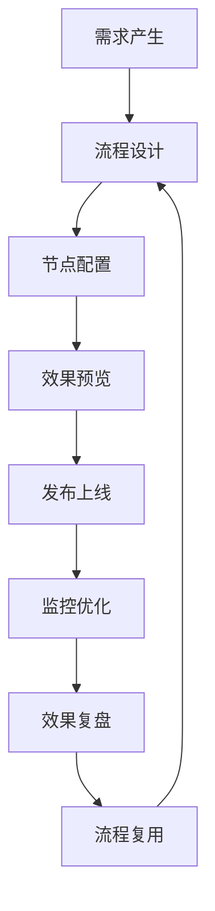

# 营销画布平台产品需求文档

## 1. 产品概述

营销画布平台是一个基于AntV X6图形引擎的可视化营销任务中心，让营销人员像搭积木一样设计复杂营销流程。平台通过直观的流程画布，让营销人员无需技术背景就能设计、管理和优化复杂的营销活动，将"技术实现"变成"业务设计"。

平台的核心价值在于降低营销活动设计的技术门槛，将营销活动设计时间从2周缩短至30分钟，提供一站式任务管理和实时数据反馈，支持团队协作和最佳实践复用，显著提升营销运营效率和活动成功率。

**技术特色**：集成统一结构化布局引擎，支持基于父子关联关系的分层分级自底向上定位系统，提供防抖机制、性能优化和智能缓存策略，确保复杂流程的流畅设计体验。

## 2. 核心功能

### 2.1 用户角色

| 角色 | 注册方式 | 核心权限 |
|------|----------|----------|
| 营销运营专员 | 企业邮箱注册 | 流程设计、活动配置、效果监控 |
| 产品经理 | 管理员分配 | 策略设计、A/B测试、数据分析 |
| 数据分析师 | 邀请码注册 | 数据洞察、效果分析、优化建议 |
| 技术运营 | 系统分配账号 | 系统配置、接口管理、模板维护 |

### 2.2 功能模块

营销画布平台包含以下核心页面：

1. **任务管理页面**：营销活动总览、任务状态监控、权限管理
2. **流程设计页面**：可视化流程设计器、节点配置、实时预览、统一布局引擎
3. **模板市场页面**：场景模板库、模板复用、最佳实践分享
4. **效果监控页面**：实时数据面板、节点级监控、异常预警
5. **协作管理页面**：团队协作、流程共享、权限控制
6. **系统配置页面**：接口管理、参数配置、日志查看

**核心技术组件**：
- **TaskFlowCanvas**：基于AntV X6的主画布组件，支持拖拽设计和实时交互
- **统一结构化布局引擎**：智能布局算法，自动优化节点位置和连线路径
- **节点配置抽屉系统**：模块化配置界面，支持不同节点类型的专用配置
- **预览线管理系统**：实时连接预览和路径优化，提升用户体验

### 2.3 页面详情

| 页面名称 | 模块名称 | 功能描述 |
|----------|----------|----------|
| 任务管理页面 | 活动总览 | 统一展示所有营销活动状态，支持快速筛选和批量操作 |
| 任务管理页面 | 状态监控 | 实时显示活动执行进度，提供状态变更通知和异常提醒 |
| 任务管理页面 | 模板复用 | 将成功活动保存为模板，支持一键复用和快速创建 |
| 流程设计页面 | 可视化设计器 | 拖拽式节点连接，支持多种营销节点类型和复杂流程设计 |
| 流程设计页面 | 节点配置 | 表单化节点参数配置，支持动态变量和条件表达式 |
| 流程设计页面 | 实时预览 | 设计过程中实时预览流程效果，支持流程验证和测试 |
| 流程设计页面 | 统一结构化布局 | 基于父子关联关系的分层分级自底向上定位系统，支持普通节点和endpoint虚拟节点的混合层级排列，集成防抖机制和性能优化 |
| 流程设计页面 | 布局方向切换 | 支持TB（上下）和LR（左右）布局方向动态切换，自动适应不同的流程设计需求 |
| 流程设计页面 | 画布交互控制 | 支持缩放控制、拖拽模式切换、小地图导航、撤销重做等完整的画布操作功能 |
| 模板市场页面 | 场景模板库 | 按行业和目的分类的营销流程模板，支持模板搜索和筛选 |
| 模板市场页面 | 模板评价 | 用户对模板使用效果进行评价，提供模板推荐和排序 |
| 模板市场页面 | 自定义模板 | 用户可将自己的流程保存为模板，支持模板分享和发布 |
| 效果监控页面 | 实时数据面板 | 展示活动执行数据，如触达人数、转化率等关键指标 |
| 效果监控页面 | 节点级监控 | 每个节点的执行数据单独展示，支持节点性能分析 |
| 效果监控页面 | 异常预警 | 流程异常时及时通知，支持自动暂停和人工干预 |
| 效果监控页面 | 对比分析 | 支持不同活动的效果对比，提供优化建议和改进方向 |
| 协作管理页面 | 团队协作 | 支持多人协同编辑，提供版本控制和冲突解决 |
| 协作管理页面 | 流程共享 | 可视化流程共享，支持权限控制和访问管理 |
| 协作管理页面 | 评论反馈 | 支持流程评论和反馈，促进团队沟通和知识分享 |
| 系统配置页面 | 接口管理 | 管理外部系统接口，配置数据连接和同步规则 |
| 系统配置页面 | 参数配置 | 系统级参数设置，支持个性化配置和环境切换 |
| 系统配置页面 | 日志查看 | 系统操作日志和错误日志查看，支持日志搜索和导出 |

## 3. 核心流程

### 主要用户操作流程

**营销运营专员流程**：登录系统 → 选择模板或新建流程 → 拖拽设计营销流程 → 配置节点参数 → 预览测试流程 → 发布上线 → 监控效果

**产品经理流程**：登录系统 → 分析用户需求 → 设计增长策略 → 配置A/B测试 → 监控测试效果 → 优化迭代策略

**数据分析师流程**：登录系统 → 查看活动数据 → 分析用户行为 → 识别优化机会 → 提供改进建议



## 4. 用户界面设计

### 4.1 设计风格

- **主色调**：#1890FF（科技蓝）、#52C41A（成功绿）
- **辅助色**：#FAAD14（警告黄）、#F5222D（错误红）、#722ED1（紫色）
- **按钮样式**：现代化圆角按钮，支持悬停动画效果
- **字体规范**：标题16px，正文14px，辅助文字12px，代码字体使用等宽字体
- **布局风格**：画布式主界面，左侧工具栏，右侧配置面板，顶部操作栏
- **图标风格**：线性图标为主，关键操作使用填充图标，统一使用Arco Design图标库

### 4.2 页面设计概览

| 页面名称 | 模块名称 | UI元素 |
|----------|----------|--------|
| 任务管理页面 | 活动总览 | 卡片式活动展示，支持网格和列表视图切换，提供快速操作按钮 |
| 流程设计页面 | 可视化设计器 | 大画布区域，左侧节点工具栏，右侧配置抽屉，支持缩放和平移 |
| 流程设计页面 | 节点配置 | 滑出式配置面板，表单化配置界面，支持实时验证和预览 |
| 模板市场页面 | 场景模板库 | 瀑布流式模板展示，支持分类筛选和搜索，提供模板预览功能 |
| 效果监控页面 | 实时数据面板 | 仪表盘式数据展示，支持图表交互和时间范围选择 |
| 协作管理页面 | 团队协作 | 用户头像展示，实时协作状态，支持评论气泡和版本对比 |

### 4.3 响应式设计

平台主要针对桌面端设计，画布操作需要大屏幕支持。支持平板设备的查看和基础编辑功能，移动端提供活动监控和审批功能。设计时优先考虑大屏幕的操作体验，确保复杂流程设计的可用性。

## 5. 技术架构深度解析

### 5.1 核心技术栈

- **前端框架**：Vue 3 (Composition API) + TypeScript
- **图形引擎**：AntV X6 - 专业的图编辑引擎
- **UI组件库**：Arco Design - 企业级设计语言
- **状态管理**：Vuex 4 - 集中式状态管理
- **构建工具**：Vite - 快速构建和热更新
- **路由管理**：Vue Router 4 - 单页应用路由

### 5.2 统一结构化布局引擎技术实现

#### 5.2.1 核心算法架构

**UnifiedStructuredLayoutEngine.js** 是平台的核心布局引擎，采用以下技术特性：

- **分层分级定位系统**：基于父子关联关系的自底向上定位算法
- **混合节点支持**：同时处理普通节点和endpoint虚拟节点的层级排列
- **性能优化机制**：
  - 布局计算防抖机制（300ms延迟）
  - 布局结果缓存系统
  - 分阶段执行优化
  - 性能监控指标收集

#### 5.2.2 布局执行流程

```javascript
// 核心执行流程
executeLayoutImmediate() {
  // 1. 数据预处理和验证
  // 2. 分层构建和节点分组
  // 3. 自底向上位置计算
  // 4. 层级内统一优化
  // 5. 全局平衡优化
  // 6. 位置应用到图形
}
```

#### 5.2.3 布局配置选项

- **层级配置**：垂直间距、水平间距、边距设置
- **节点配置**：最小尺寸、对齐方式、分组策略
- **优化配置**：启用性能优化、缓存策略、调试模式
- **性能配置**：最大执行时间、内存限制、监控阈值

### 5.3 TaskFlowCanvas 组件架构

#### 5.3.1 组件职责划分

- **画布容器管理**：X6 Graph实例初始化和配置
- **交互事件处理**：鼠标事件、键盘事件、拖拽事件
- **状态同步机制**：画布状态与Vue响应式状态的双向绑定
- **工具栏集成**：缩放、拖拽模式、布局控制、历史操作

#### 5.3.2 X6 图形引擎集成

```javascript
// X6 初始化配置
const graph = new Graph({
  container: canvasContainer.value,
  background: { color: '#f8f9fa' },
  grid: { size: 20, visible: true },
  selecting: { enabled: true, multiple: false },
  interacting: { nodeMovable: true, edgeMovable: false },
  scroller: { enabled: true, autoResize: true },
  mousewheel: { enabled: false }, // 禁用滚轮缩放
  connecting: {
    router: 'orth', // 正交路由
    connector: { name: 'rounded', args: { radius: 8 } }
  }
});
```

#### 5.3.3 事件系统设计

- **节点事件**：点击、拖拽开始、位置变更、删除确认
- **连接事件**：连接添加、连接删除、路径优化
- **画布事件**：缩放变更、视口移动、选择状态变更
- **布局事件**：布局开始、布局完成、布局错误

### 5.4 节点配置抽屉系统

#### 5.4.1 模块化设计

- **BaseDrawer**：基础抽屉组件，提供通用的打开/关闭逻辑
- **StartNodeConfigDrawer**：开始节点专用配置抽屉
- **UnifiedConfigDrawer**：通用节点配置抽屉
- **NodeTypeSelector**：节点类型选择器

#### 5.4.2 配置表单管理

- **动态表单生成**：根据节点类型动态生成配置表单
- **实时验证机制**：表单数据实时验证和错误提示
- **配置数据同步**：配置变更实时同步到图形节点

### 5.5 性能优化策略

#### 5.5.1 渲染性能优化

- **虚拟滚动**：大量节点时使用虚拟滚动技术
- **节点复用**：相同类型节点的DOM复用机制
- **批量更新**：多个节点变更时的批量DOM更新

#### 5.5.2 内存管理优化

- **智能缓存**：SmartCacheManager 提供LRU缓存策略
- **事件监听清理**：组件销毁时自动清理事件监听器
- **图实例管理**：Graph实例的正确创建和销毁

#### 5.5.3 交互性能优化

- **防抖机制**：布局计算、搜索输入等操作的防抖处理
- **异步加载**：大型流程图的分片加载机制
- **预加载策略**：常用节点类型和模板的预加载

## 6. 统一布局功能优化建议

### 6.1 算法性能优化

#### 6.1.1 当前性能瓶颈

- **大规模节点处理**：当节点数量超过100个时，布局计算时间显著增加
- **复杂连接关系**：多层级嵌套和循环引用的处理效率有待提升
- **实时布局更新**：节点拖拽时的实时布局计算影响交互流畅度

#### 6.1.2 优化策略建议

1. **分层并行计算**
   - 将布局计算拆分为独立的层级任务
   - 使用Web Workers进行并行计算
   - 实现增量布局更新，只重新计算受影响的区域

2. **智能缓存增强**
   - 实现布局结果的持久化缓存
   - 基于节点变更的智能缓存失效策略
   - 预计算常用布局模式

3. **算法优化**
   - 采用更高效的图遍历算法（如A*算法）
   - 实现自适应布局密度调整
   - 优化连线路径计算算法

### 6.2 用户体验优化

#### 6.2.1 交互体验改进

1. **布局预览功能**
   - 布局执行前提供预览效果
   - 支持布局方案的对比选择
   - 提供布局撤销和重做功能

2. **智能布局建议**
   - 基于流程复杂度自动推荐最佳布局方案
   - 提供布局质量评分和改进建议
   - 支持自定义布局规则配置

3. **渐进式布局动画**
   - 布局变更时的平滑过渡动画
   - 节点移动轨迹的可视化展示
   - 支持动画速度和效果的个性化设置

#### 6.2.2 可视化增强

1. **布局质量指标**
   - 实时显示布局质量评分
   - 提供布局优化建议面板
   - 支持布局性能监控和分析

2. **多视图支持**
   - 支持缩略图视图快速导航
   - 提供全屏布局编辑模式
   - 实现多窗口布局对比功能

### 6.3 技术架构优化

#### 6.3.1 模块化重构

1. **布局引擎解耦**
   - 将布局算法抽象为独立的服务模块
   - 支持插件化的布局算法扩展
   - 实现布局引擎的热插拔机制

2. **配置系统优化**
   - 提供可视化的布局参数配置界面
   - 支持布局配置的导入导出
   - 实现布局配置的版本管理

#### 6.3.2 扩展性设计

1. **API标准化**
   - 定义标准的布局引擎API接口
   - 支持第三方布局算法的集成
   - 提供布局引擎的SDK开发包

2. **国际化支持**
   - 支持多语言的布局方向适配
   - 提供RTL（从右到左）布局支持
   - 实现文化相关的布局偏好设置

### 6.4 监控和诊断

#### 6.4.1 性能监控

1. **实时性能指标**
   - 布局计算耗时监控
   - 内存使用情况追踪
   - 用户交互响应时间统计

2. **错误诊断系统**
   - 布局失败的自动诊断和修复
   - 异常情况的详细日志记录
   - 用户操作路径的回放功能

#### 6.4.2 用户行为分析

1. **使用模式分析**
   - 统计最常用的布局模式
   - 分析用户的布局偏好
   - 识别布局设计的最佳实践

2. **优化效果评估**
   - 布局优化前后的效果对比
   - 用户满意度调研和反馈收集
   - 持续改进的数据驱动决策