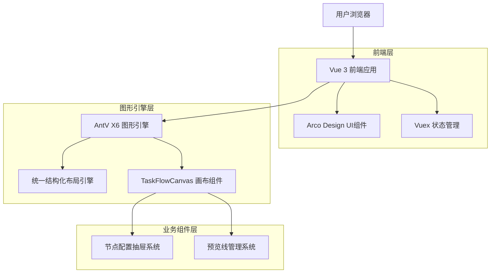

# 营销画布平台技术架构文档

## 1. 架构设计



## 2. 技术描述

- **前端框架**: Vue 3 (Composition API) + TypeScript + Vite
- **图形引擎**: AntV X6 - 专业图编辑引擎
- **UI组件库**: Arco Design - 企业级设计语言
- **状态管理**: Vuex 4 - 集中式状态管理
- **路由管理**: Vue Router 4 - 单页应用路由
- **构建工具**: Vite - 快速构建和热更新

## 3. 路由定义

| 路由 | 用途 |
|------|------|
| /marketing/tasks | 营销任务列表页面，展示所有营销活动和状态监控 |
| /marketing/tasks/create | 任务创建页面，提供流程设计器和节点配置功能 |
| /marketing/tasks/:id/edit | 任务编辑页面，支持现有流程的修改和优化 |
| /marketing/templates | 模板市场页面，提供场景模板库和模板管理 |
| /marketing/monitor | 效果监控页面，实时展示营销活动数据和分析 |
| /marketing/settings | 系统配置页面，管理接口配置和系统参数 |

## 4. 核心组件架构

### 4.1 TaskFlowCanvas 主画布组件

**组件职责**：
- X6 Graph实例的初始化和生命周期管理
- 画布交互事件的处理和状态同步
- 工具栏功能集成（缩放、拖拽、布局控制）
- 节点和连接的创建、编辑、删除操作

**核心配置**：
```javascript
const graph = new Graph({
  container: canvasContainer.value,
  background: { color: '#f8f9fa' },
  grid: { size: 20, visible: true },
  selecting: { enabled: true, multiple: false },
  interacting: { nodeMovable: true, edgeMovable: false },
  scroller: { enabled: true, autoResize: true },
  mousewheel: { enabled: false },
  connecting: {
    router: 'orth',
    connector: { name: 'rounded', args: { radius: 8 } }
  }
});
```

### 4.2 统一结构化布局引擎

**核心算法特性**：
- 基于父子关联关系的分层分级自底向上定位系统
- 支持普通节点和endpoint虚拟节点的混合层级排列
- 集成防抖机制（300ms延迟）和布局结果缓存系统
- 分阶段执行优化和性能监控指标收集

**布局执行流程**：
```javascript
executeLayoutImmediate() {
  // 1. 数据预处理和验证
  this.preprocessData();
  
  // 2. 分层构建和节点分组
  this.buildHierarchy();
  
  // 3. 自底向上位置计算
  this.calculatePositions();
  
  // 4. 层级内统一优化
  this.optimizeWithinLayers();
  
  // 5. 全局平衡优化
  this.globalOptimization();
  
  // 6. 位置应用到图形
  this.applyPositionsToGraph();
}
```

### 4.3 节点配置抽屉系统

**模块化设计**：
- **BaseDrawer**: 基础抽屉组件，提供通用的打开/关闭逻辑
- **StartNodeConfigDrawer**: 开始节点专用配置抽屉
- **UnifiedConfigDrawer**: 通用节点配置抽屉
- **NodeTypeSelector**: 节点类型选择器

**配置表单管理**：
- 动态表单生成：根据节点类型动态生成配置表单
- 实时验证机制：表单数据实时验证和错误提示
- 配置数据同步：配置变更实时同步到图形节点

## 5. 状态管理架构

### 5.1 Vuex Store 结构

```javascript
// 营销画布模块状态结构
const marketingCanvasModule = {
  namespaced: true,
  state: {
    // 画布状态
    graph: null,
    nodes: [],
    connections: [],
    selectedNodeId: null,
    
    // 布局状态
    currentScale: 1,
    layoutDirection: 'TB',
    isApplyingLayout: false,
    
    // 交互状态
    showNodeSelector: false,
    showConfigDrawer: false,
    isDragging: false,
    currentDragMode: 'select',
    
    // 历史状态
    canUndo: false,
    canRedo: false,
    showHistoryPanel: false
  },
  
  mutations: {
    SET_GRAPH(state, graph) {
      state.graph = graph;
    },
    UPDATE_NODES(state, nodes) {
      state.nodes = nodes;
    },
    SET_SELECTED_NODE(state, nodeId) {
      state.selectedNodeId = nodeId;
    }
    // ... 其他mutations
  },
  
  actions: {
    async applyUnifiedLayout({ commit, state }) {
      commit('SET_APPLYING_LAYOUT', true);
      try {
        await layoutEngine.executeLayout(state.graph);
      } finally {
        commit('SET_APPLYING_LAYOUT', false);
      }
    }
    // ... 其他actions
  }
};
```

### 5.2 响应式状态同步

**画布状态与Vue状态的双向绑定**：
- X6 Graph事件监听器自动更新Vue状态
- Vue状态变更通过watchers同步到X6 Graph
- 使用防抖机制避免频繁的状态更新

## 6. 性能优化架构

### 6.1 渲染性能优化

**虚拟滚动技术**：
- 大量节点时使用虚拟滚动，只渲染可视区域内的节点
- 节点进入/离开可视区域时的动态加载/卸载

**节点复用机制**：
- 相同类型节点的DOM元素复用
- 节点池管理，减少DOM创建和销毁开销

**批量更新策略**：
- 多个节点变更时的批量DOM更新
- 使用requestAnimationFrame优化渲染时机

### 6.2 内存管理优化

**智能缓存管理**：
```javascript
// SmartCacheManager 实现LRU缓存策略
class SmartCacheManager {
  constructor(maxSize = 100) {
    this.cache = new Map();
    this.maxSize = maxSize;
  }
  
  get(key) {
    if (this.cache.has(key)) {
      const value = this.cache.get(key);
      this.cache.delete(key);
      this.cache.set(key, value); // 移到最后
      return value;
    }
    return null;
  }
  
  set(key, value) {
    if (this.cache.size >= this.maxSize) {
      const firstKey = this.cache.keys().next().value;
      this.cache.delete(firstKey);
    }
    this.cache.set(key, value);
  }
}
```

**事件监听器管理**：
- 组件销毁时自动清理所有事件监听器
- 使用WeakMap避免内存泄漏
- Graph实例的正确创建和销毁流程

### 6.3 交互性能优化

**防抖机制**：
- 布局计算防抖（300ms延迟）
- 搜索输入防抖（200ms延迟）
- 窗口resize事件防抖（100ms延迟）

**异步加载策略**：
- 大型流程图的分片加载机制
- 节点配置数据的懒加载
- 模板数据的预加载和缓存

## 7. 数据模型设计

### 7.1 核心数据结构

```javascript
// 节点数据模型
interface FlowNode {
  id: string;
  type: 'start' | 'process' | 'decision' | 'end' | 'ai-call' | 'crowd-split';
  label: string;
  position: { x: number; y: number };
  size: { width: number; height: number };
  config: Record<string, any>;
  metadata: {
    createdAt: string;
    updatedAt: string;
    version: number;
  };
}

// 连接数据模型
interface FlowConnection {
  id: string;
  source: string;
  target: string;
  sourcePort?: string;
  targetPort?: string;
  label?: string;
  config: {
    condition?: string;
    priority?: number;
  };
}

// 流程数据模型
interface FlowProcess {
  id: string;
  name: string;
  description: string;
  nodes: FlowNode[];
  connections: FlowConnection[];
  layout: {
    direction: 'TB' | 'LR';
    spacing: { horizontal: number; vertical: number };
  };
  metadata: {
    createdBy: string;
    createdAt: string;
    updatedAt: string;
    version: number;
    status: 'draft' | 'published' | 'archived';
  };
}
```

### 7.2 布局引擎数据模型

```javascript
// 布局配置模型
interface LayoutConfig {
  hierarchy: {
    verticalSpacing: number;
    horizontalSpacing: number;
    margin: { top: number; right: number; bottom: number; left: number };
  };
  nodes: {
    minSize: { width: number; height: number };
    alignment: 'start' | 'center' | 'end';
    grouping: 'type' | 'level' | 'none';
  };
  optimization: {
    enablePerformanceOptimization: boolean;
    cacheStrategy: 'memory' | 'localStorage' | 'none';
    debugMode: boolean;
  };
  performance: {
    maxExecutionTime: number;
    memoryLimit: number;
    monitoringThreshold: number;
  };
}

// 布局结果模型
interface LayoutResult {
  positions: Map<string, { x: number; y: number }>;
  hierarchy: {
    levels: number;
    nodesPerLevel: number[];
    maxWidth: number;
    maxHeight: number;
  };
  performance: {
    executionTime: number;
    memoryUsage: number;
    cacheHitRate: number;
  };
  quality: {
    score: number;
    metrics: {
      alignment: number;
      spacing: number;
      overlap: number;
    };
  };
}
```

## 8. 错误处理和监控

### 8.1 错误处理策略

**分层错误处理**：
- **UI层错误**：用户友好的错误提示和恢复建议
- **业务逻辑错误**：详细的错误日志和自动重试机制
- **系统级错误**：错误上报和降级处理

**错误恢复机制**：
```javascript
// 布局引擎错误恢复
class LayoutErrorRecovery {
  static async handleLayoutError(error, graph) {
    console.error('布局计算失败:', error);
    
    // 尝试简化布局
    try {
      await this.applySimpleLayout(graph);
      return { success: true, method: 'simple' };
    } catch (simpleError) {
      // 回退到默认布局
      await this.applyDefaultLayout(graph);
      return { success: true, method: 'default' };
    }
  }
}
```

### 8.2 性能监控

**实时性能指标**：
- 布局计算耗时监控
- 内存使用情况追踪
- 用户交互响应时间统计
- 组件渲染性能分析

**监控数据收集**：
```javascript
// 性能监控工具
class PerformanceMonitor {
  static startTiming(operation) {
    return performance.now();
  }
  
  static endTiming(startTime, operation) {
    const duration = performance.now() - startTime;
    this.recordMetric(operation, duration);
    return duration;
  }
  
  static recordMetric(operation, value) {
    // 记录性能指标到监控系统
    console.log(`${operation}: ${value.toFixed(2)}ms`);
  }
}
```

## 9. 扩展性设计

### 9.1 插件化架构

**布局算法插件**：
- 标准化的布局算法接口
- 支持第三方布局算法的动态加载
- 布局算法的热插拔机制

**节点类型扩展**：
- 自定义节点类型的注册机制
- 节点配置界面的动态生成
- 节点行为的可扩展定义

### 9.2 国际化支持

**多语言适配**：
- 支持多语言的布局方向适配
- RTL（从右到左）布局支持
- 文化相关的布局偏好设置

**本地化配置**：
```javascript
// 国际化配置
const i18nConfig = {
  'zh-CN': {
    layoutDirection: 'TB',
    textDirection: 'ltr',
    dateFormat: 'YYYY-MM-DD'
  },
  'ar-SA': {
    layoutDirection: 'TB',
    textDirection: 'rtl',
    dateFormat: 'DD/MM/YYYY'
  }
};
```