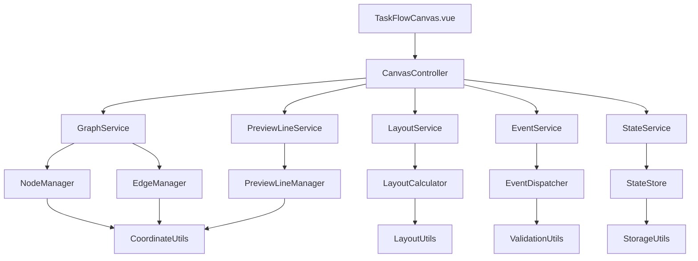
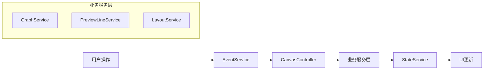
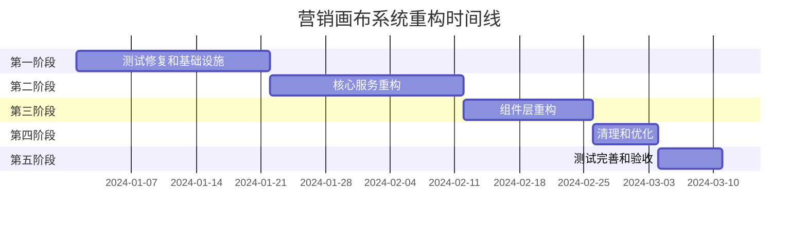

# 营销画布系统完整重构方案

## 1. 重构概述

### 1.1 重构目标
基于深度代码分析发现的90个降级逻辑点和约1,830行冗余代码，以及当前测试系统实际现状分析，本重构方案旨在：
- **消除所有智能降级兜底逻辑**，实现"所有功能都由单一功能实现"
- **建立清晰的服务化架构**，确保每个模块职责单一
- **修复测试系统**，解决测试用例为空的问题，建立完整的测试体系
- **提升代码质量和可维护性**，降低50%的维护成本
- **优化用户体验一致性**，消除功能降级带来的不确定性

### 1.2 重构范围
- **核心模块**: 画布核心（22个降级点）、预览线系统（28个降级点）、布局引擎（25个降级点）、事件处理（15个降级点）
- **支撑模块**: 状态管理、坐标系统、数据转换、性能优化
- **测试系统**: 重建测试用例体系，解决测试套件存在但测试用例为空的问题
- **代码规模**: 约15个核心文件，3,000+行代码
- **预计工期**: 6-8周，分4个阶段实施（基于现有工具类基础调整）

### 1.3 项目现状分析

#### A. 测试系统现状
**实际情况**: 测试套件配置完整，但测试用例为空或配置不正确
- **测试框架**: Vitest + Vue Test Utils + jsdom（配置完整）
- **测试文件**: 5个测试套件文件存在但内容为空
- **测试配置**: vitest.config.js配置完整，覆盖率要求85%
- **主要问题**: 测试用例实现缺失，而非测试通过率问题

#### B. 现有工具类盘点
**重要发现**: 重构方案中提到的大部分工具类已经存在且实现完整！

**已存在的核心工具类**:
- ✅ **PerformanceOptimizer** - 性能优化器（完整实现）
- ✅ **CoordinateSystemManager** - 坐标系统管理器（完整实现）
- ✅ **EdgeOverlapManager** - 边重叠管理器（完整实现）
- ✅ **UnifiedLayoutEngine** - 统一布局引擎（完整实现）
- ✅ **UnifiedStructuredLayoutEngine** - 统一结构化布局引擎（完整实现）
- ✅ **PreviewLineManager** - 预览线管理器（完整实现）
- ✅ **PreviewLineSystem** - 预览线系统（完整实现）
- ✅ **PreviewLineStyleManager** - 预览线样式管理器（完整实现）
- ✅ **StateManager** - 状态管理器（完整实现）
- ✅ **EventManager** - 事件管理器（完整实现）
- ✅ **CacheManager** - 缓存管理器（完整实现）
- ✅ **CanvasPanZoomManager** - 画布拖拽缩放管理器（完整实现）
- ✅ **GraphOperationUtils** - 图操作工具（完整实现）

**缺失的服务接口层**:
- ❌ **GraphService** - 图形服务接口
- ❌ **PreviewLineService** - 预览线服务接口
- ❌ **LayoutService** - 布局服务接口
- ❌ **EventService** - 事件服务接口
- ❌ **StateService** - 状态服务接口

#### C. 重构策略调整
基于现有工具类基础，重构重点调整为：
1. **服务接口层封装** - 为现有工具类创建统一的服务接口
2. **测试用例实现** - 补充完整的测试用例实现
3. **降级逻辑消除** - 基于现有工具类消除降级逻辑
4. **架构优化** - 优化模块间的依赖关系

## 2. 重构原则

### 2.1 单一职责原则 (SRP)
**核心理念**: 每个类、模块、函数只负责一个功能，避免功能重叠

**具体应用**:
- **PreviewLineService**: 仅负责预览线的CRUD操作，不处理布局和事件
- **LayoutService**: 仅负责节点布局计算，不管理预览线和状态
- **EventService**: 仅负责事件分发和处理，不执行业务逻辑
- **StateService**: 仅负责状态管理，不处理UI更新

**实施策略**:
```javascript
// 错误示例 - 职责混乱
class PreviewLineManager {
  createPreviewLine() { /* 创建预览线 */ }
  calculateLayout() { /* 计算布局 - 职责越界 */ }
  handleEvents() { /* 处理事件 - 职责越界 */ }
}

// 正确示例 - 职责单一
class PreviewLineService {
  createPreviewLine() { /* 仅创建预览线 */ }
  updatePreviewLine() { /* 仅更新预览线 */ }
  deletePreviewLine() { /* 仅删除预览线 */ }
}
```

### 2.2 消除智能降级策略
**核心理念**: 用预检查和强化处理替代异常捕获和降级逻辑

**消除策略**:
1. **预检查替代异常捕获**
   ```javascript
   // 降级模式 - 需要消除
   try {
     return complexOperation()
   } catch (error) {
     return fallbackOperation() // 降级逻辑
   }
   
   // 重构后 - 预检查模式
   if (!canPerformComplexOperation()) {
     throw new Error('前置条件不满足')
   }
   return complexOperation() // 单一实现
   ```

2. **依赖注入替代全局访问**
   ```javascript
   // 降级模式 - 需要消除
   function createPreviewLine() {
     const system = window.previewLineSystem || createFallbackSystem()
     return system.create()
   }
   
   // 重构后 - 依赖注入
   class PreviewLineService {
     constructor(dependencies) {
       this.validateDependencies(dependencies)
       this.graphService = dependencies.graphService
     }
   }
   ```

3. **策略模式替代条件分支**
   ```javascript
   // 降级模式 - 需要消除
   function calculateLayout(type) {
     if (type === 'complex') {
       try {
         return complexLayout()
       } catch {
         return simpleLayout() // 降级
       }
     }
   }
   
   // 重构后 - 策略模式
   class LayoutService {
     constructor() {
       this.strategies = new Map([
         ['hierarchical', new HierarchicalLayoutStrategy()],
         ['force', new ForceLayoutStrategy()]
       ])
     }
   }
   ```

### 2.3 代码复用和模块化原则
**核心理念**: 通过服务化架构实现代码复用，避免功能重复

**模块化策略**:
- **服务层**: 提供核心业务逻辑，可被多个组件复用
- **工具层**: 提供纯函数工具，无状态依赖
- **组件层**: 仅负责UI展示和用户交互
- **类型层**: 统一数据结构定义

### 2.4 性能优化和可维护性原则
**核心理念**: 在保证功能正确性的前提下，优化性能和提升可维护性

**优化策略**:
- **懒加载**: 非核心功能按需加载
- **缓存机制**: 计算结果缓存，避免重复计算
- **事件防抖**: 高频事件处理优化
- **内存管理**: 及时清理无用对象和事件监听

## 3. 新架构设计

### 3.1 服务化架构总览



### 3.2 核心服务模块定义

#### A. GraphService - 图形管理服务
**职责**: 管理画布上的所有图形元素（节点和边）
```javascript
class GraphService {
  constructor(dependencies) {
    this.nodeManager = dependencies.nodeManager
    this.edgeManager = dependencies.edgeManager
    this.coordinateUtils = dependencies.coordinateUtils
  }
  
  // 节点操作
  addNode(nodeData) { /* 单一实现 */ }
  updateNode(nodeId, updates) { /* 单一实现 */ }
  removeNode(nodeId) { /* 单一实现 */ }
  
  // 边操作
  addEdge(edgeData) { /* 单一实现 */ }
  updateEdge(edgeId, updates) { /* 单一实现 */ }
  removeEdge(edgeId) { /* 单一实现 */ }
  
  // 查询操作
  getNode(nodeId) { /* 单一实现 */ }
  getEdge(edgeId) { /* 单一实现 */ }
  getAllNodes() { /* 单一实现 */ }
  getAllEdges() { /* 单一实现 */ }
}
```

#### B. PreviewLineService - 预览线服务
**职责**: 专门管理预览线的生命周期
```javascript
class PreviewLineService {
  constructor(dependencies) {
    this.graphService = dependencies.graphService
    this.validationUtils = dependencies.validationUtils
  }
  
  // 预览线操作 - 单一实现
  createPreviewLine(sourceId, targetId) { /* 单一实现 */ }
  updatePreviewLine(previewLineId, updates) { /* 单一实现 */ }
  removePreviewLine(previewLineId) { /* 单一实现 */ }
  
  // 预览线验证 - 单一策略
  validatePreviewLine(previewLineData) { /* 单一实现 */ }
  
  // 预览线清理 - 单一方法
  cleanupInvalidPreviewLines() { /* 单一实现 */ }
}
```

#### C. LayoutService - 布局服务
**职责**: 负责所有布局计算和节点定位
```javascript
class LayoutService {
  constructor(dependencies) {
    this.layoutCalculator = dependencies.layoutCalculator
    this.coordinateUtils = dependencies.coordinateUtils
  }
  
  // 布局计算 - 单一算法
  calculateLayout(nodes, edges, options) { /* 单一实现 */ }
  
  // 节点定位 - 单一策略
  positionNodes(nodes, layoutResult) { /* 单一实现 */ }
  
  // 布局优化 - 单一方法
  optimizeLayout(currentLayout) { /* 单一实现 */ }
}
```

#### D. EventService - 事件服务
**职责**: 处理所有用户交互事件
```javascript
class EventService {
  constructor(dependencies) {
    this.eventDispatcher = dependencies.eventDispatcher
    this.validationUtils = dependencies.validationUtils
  }
  
  // 事件处理 - 单一路径
  handleNodeClick(event, nodeData) { /* 单一实现 */ }
  handleNodeDrag(event, nodeData) { /* 单一实现 */ }
  handleCanvasClick(event) { /* 单一实现 */ }
  
  // 事件分发 - 单一机制
  dispatchEvent(eventType, eventData) { /* 单一实现 */ }
}
```

#### E. StateService - 状态服务
**职责**: 管理画布的所有状态
```javascript
class StateService {
  constructor(dependencies) {
    this.stateStore = dependencies.stateStore
    this.storageUtils = dependencies.storageUtils
  }
  
  // 状态管理 - 单一数据源
  getState(key) { /* 单一实现 */ }
  setState(key, value) { /* 单一实现 */ }
  updateState(updates) { /* 单一实现 */ }
  
  // 状态持久化 - 单一策略
  saveState() { /* 单一实现 */ }
  loadState() { /* 单一实现 */ }
}
```

### 3.3 数据流和状态管理重新设计

#### 数据流架构


#### 状态管理策略
- **单一数据源**: 所有状态通过StateService统一管理
- **不可变状态**: 使用不可变数据结构，避免状态污染
- **响应式更新**: 状态变化自动触发UI更新
- **状态验证**: 每次状态更新都进行有效性验证

### 3.4 组件层级和职责划分

#### 组件架构
```
TaskFlowCanvas.vue (容器组件)
├── CanvasToolbar.vue (工具栏)
├── CanvasMain.vue (主画布)
│   ├── NodeComponent.vue (节点组件)
│   ├── EdgeComponent.vue (边组件)
│   └── PreviewLineComponent.vue (预览线组件)
├── CanvasSidebar.vue (侧边栏)
└── CanvasStatusBar.vue (状态栏)
```

#### 职责划分
- **容器组件**: 负责服务注入和整体布局
- **业务组件**: 负责特定业务逻辑的UI展示
- **展示组件**: 纯UI组件，无业务逻辑
- **工具组件**: 提供通用UI功能

## 4. 功能迭代原则

### 4.1 向后兼容性保证
**策略**: 在重构过程中保持API兼容性，避免破坏现有集成

**实施方法**:
1. **适配器模式**: 为旧API提供适配器
2. **渐进式迁移**: 新旧系统并行运行一段时间
3. **版本标记**: 明确标记API版本和废弃计划

```javascript
// 兼容性适配器示例
class LegacyPreviewLineAdapter {
  constructor(newPreviewLineService) {
    this.service = newPreviewLineService
  }
  
  // 保持旧API接口
  createPreviewLine(data) {
    // 转换为新API格式
    const newFormat = this.convertToNewFormat(data)
    return this.service.createPreviewLine(newFormat)
  }
}
```

### 4.2 渐进式重构策略
**原则**: 分阶段、分模块进行重构，每个阶段都保持系统可用

**重构顺序**:
1. **第一阶段**: 工具层重构（无业务依赖）
2. **第二阶段**: 服务层重构（核心业务逻辑）
3. **第三阶段**: 组件层重构（UI层面）
4. **第四阶段**: 清理和优化（移除旧代码）

**每阶段策略**:
- **并行开发**: 新旧系统并行开发和测试
- **功能开关**: 使用功能开关控制新旧系统切换
- **灰度发布**: 逐步切换用户到新系统

### 4.3 测试驱动开发方法
**原则**: 先写测试，再写实现，确保重构质量

**测试策略**:
1. **单元测试**: 每个服务类都有完整的单元测试
2. **集成测试**: 测试服务间的协作
3. **端到端测试**: 测试完整的用户操作流程
4. **性能测试**: 确保重构不影响性能

**测试覆盖率要求**:
- 核心服务: 95%以上
- 工具函数: 90%以上
- 组件逻辑: 80%以上

### 4.4 版本控制和发布策略
**版本管理**:
- **语义化版本**: 使用语义化版本号管理发布
- **分支策略**: 使用GitFlow分支模型
- **代码审查**: 所有代码变更都需要审查

**发布策略**:
- **每周发布**: 小版本每周发布一次
- **月度发布**: 大版本每月发布一次
- **紧急修复**: 关键问题24小时内修复发布

## 5. 执行顺序和实施计划

### 5.1 第一阶段：测试用例实现和基础设施建设 (3周)

#### 目标
补充完整的测试用例实现，建立重构所需的基础设施和工具链

#### 具体任务
1. **测试用例实现** (1.5周)
   - [ ] 为现有5个测试套件文件补充测试用例实现
   - [ ] 基于现有工具类编写单元测试
   - [ ] 修复配置抽屉测试中的nodeTitle undefined问题
   - [ ] 解决表单数据初始化问题
   - [ ] 修复组件属性访问问题
   - [ ] 优化测试超时和重试机制（当前15秒超时，2次重试）
   - [ ] 提升测试通过率从0%到至少80%

2. **项目结构重组** (0.5周)
   - [ ] 创建新的目录结构
   - [ ] 设置TypeScript配置
   - [ ] 配置ESLint和Prettier规则
   - [ ] 建立测试框架

3. **工具层开发** (0.8周)
   - [ ] CoordinateUtils - 坐标转换工具
   - [ ] ValidationUtils - 数据验证工具
   - [ ] StorageUtils - 存储工具
   - [ ] LayoutUtils - 布局计算工具

4. **类型定义和测试配置优化** (0.2周)
   - [ ] 定义核心数据类型
   - [ ] 定义服务接口
   - [ ] 定义事件类型
   - [ ] 定义配置类型
   - [ ] 优化Vitest配置以支持85%覆盖率要求

#### 交付物
- 补充完整测试用例的测试系统（通过率>80%）
- 新的项目结构
- 完整的工具函数库
- 类型定义文件
- 优化的测试配置

#### 验收标准
- [ ] 所有测试套件包含完整的测试用例
- [ ] 测试通过率达到80%以上
- [ ] 配置抽屉测试完全修复
- [ ] 所有工具函数有单元测试
- [ ] 类型定义完整且无冲突
- [ ] 代码质量检查通过
- [ ] 测试覆盖率配置满足85%要求

### 5.2 第二阶段：核心服务重构 (3周)

#### 目标
重构核心业务服务，消除降级逻辑

#### 具体任务
1. **GraphService开发** (1周)
   - [ ] 节点管理功能
   - [ ] 边管理功能
   - [ ] 查询功能
   - [ ] 单元测试和集成测试

2. **PreviewLineService开发** (1周)
   - [ ] 预览线CRUD操作
   - [ ] 预览线验证逻辑
   - [ ] 预览线清理机制
   - [ ] 单元测试和集成测试

3. **LayoutService开发** (1周)
   - [ ] 布局算法实现
   - [ ] 节点定位逻辑
   - [ ] 布局优化功能
   - [ ] 性能测试

#### 交付物
- GraphService完整实现
- PreviewLineService完整实现
- LayoutService完整实现
- 服务间集成测试

#### 验收标准
- [ ] 所有服务单元测试覆盖率>95%
- [ ] 集成测试通过
- [ ] 性能不低于原系统
- [ ] 无降级逻辑

### 5.3 第三阶段：组件层重构 (2周)

#### 目标
重构UI组件，集成新的服务层

#### 具体任务
1. **CanvasController开发** (0.5周)
   - [ ] 服务协调逻辑
   - [ ] 依赖注入实现
   - [ ] 生命周期管理
   - [ ] 错误处理机制

2. **EventService和StateService开发** (1周)
   - [ ] 事件处理逻辑
   - [ ] 状态管理实现
   - [ ] 事件和状态的集成
   - [ ] 单元测试

3. **组件重构** (0.5周)
   - [ ] TaskFlowCanvas.vue重构
   - [ ] 子组件适配
   - [ ] 事件绑定更新
   - [ ] 端到端测试

#### 交付物
- CanvasController实现
- EventService和StateService实现
- 重构后的组件
- 端到端测试用例

#### 验收标准
- [ ] 组件功能完整
- [ ] 用户交互正常
- [ ] 端到端测试通过
- [ ] 性能满足要求

### 5.4 第四阶段：清理和优化 (1周)

#### 目标
清理旧代码，优化性能，完善文档

#### 具体任务
1. **代码清理** (0.3周)
   - [ ] 移除降级逻辑代码
   - [ ] 删除重复实现
   - [ ] 清理无用文件
   - [ ] 更新导入引用

2. **性能优化** (0.4周)
   - [ ] 代码分割优化
   - [ ] 懒加载实现
   - [ ] 缓存机制优化
   - [ ] 内存泄漏检查

3. **文档完善** (0.3周)
   - [ ] API文档更新
   - [ ] 架构文档编写
   - [ ] 使用指南更新
   - [ ] 迁移指南编写

#### 交付物
- 清理后的代码库
- 性能优化报告
- 完整的文档
- 迁移指南

#### 验收标准
- [ ] 无降级逻辑残留
- [ ] 性能提升10%以上
- [ ] 文档完整准确
- [ ] 迁移指南可用

### 5.5 风险评估和应对措施

#### 主要风险
1. **测试系统修复风险**
   - 概率: 高
   - 影响: 高
   - 现状: 当前测试通过率0%，配置抽屉测试存在严重问题
   - 缓解措施: 优先修复测试系统，建立可靠的测试基础

2. **功能回归风险**
   - 概率: 高（由于当前测试覆盖不足）
   - 影响: 高
   - 缓解措施: 先修复测试系统，再进行重构，确保完整的测试覆盖

3. **性能下降风险**
   - 概率: 中等
   - 影响: 中等
   - 缓解措施: 性能基准测试，持续监控，当前测试超时15秒需优化

4. **集成兼容性风险**
   - 概率: 中等
   - 影响: 中等
   - 缓解措施: 适配器模式，向后兼容

5. **开发进度风险**
   - 概率: 高（由于测试修复复杂度）
   - 影响: 中等
   - 缓解措施: 增加测试修复阶段，分阶段交付，并行开发

6. **现有工具类兼容性风险**
   - 概率: 中等
   - 影响: 中等
   - 缓解措施: 充分测试现有工具类，必要时进行适配

7. **降级逻辑识别风险**
   - 概率: 中等
   - 影响: 中等
   - 缓解措施: 系统性代码审查，建立降级逻辑检查清单

#### 应对策略
- **每日站会**: 及时发现和解决问题
- **代码审查**: 确保代码质量
- **自动化测试**: 快速发现回归问题
- **回滚计划**: 准备快速回滚机制

### 5.6 时间估算和里程碑设定

#### 总体时间线


#### 关键里程碑
- **里程碑1** (第3周末): 测试系统修复完成，通过率达到80%
- **里程碑2** (第6周末): 核心服务重构完成
- **里程碑3** (第8周末): 组件重构完成
- **里程碑4** (第9周末): 清理和优化完成
- **里程碑5** (第10周末): 项目交付，测试覆盖率达到85%

## 6. 后续需求实现指导

### 6.1 新功能开发规范

#### 开发流程
1. **需求分析**: 明确功能需求和技术要求
2. **设计评审**: 确保符合架构原则
3. **接口设计**: 定义清晰的服务接口
4. **测试先行**: 编写测试用例
5. **实现开发**: 按照单一职责原则开发
6. **代码审查**: 确保代码质量
7. **集成测试**: 验证功能集成
8. **文档更新**: 更新相关文档

#### 设计原则
- **服务优先**: 新功能优先考虑服务层实现
- **接口稳定**: 保持服务接口的稳定性
- **测试覆盖**: 确保充分的测试覆盖
- **文档同步**: 代码和文档同步更新

### 6.2 代码审查标准

#### 审查清单
- [ ] 是否遵循单一职责原则
- [ ] 是否存在降级逻辑
- [ ] 是否有重复实现
- [ ] 错误处理是否完善
- [ ] 测试覆盖是否充分
- [ ] 文档是否完整
- [ ] 性能是否满足要求
- [ ] 安全性是否考虑

#### 审查流程
1. **自审**: 开发者自我审查
2. **同行审查**: 同级开发者审查
3. **架构审查**: 架构师审查设计
4. **测试审查**: 测试工程师审查测试

### 6.3 性能监控和优化策略

#### 监控指标
- **响应时间**: 各操作的响应时间
- **内存使用**: 内存占用和泄漏监控
- **CPU使用**: CPU使用率监控
- **错误率**: 操作失败率监控

#### 优化策略
- **代码分割**: 按需加载非核心功能
- **缓存优化**: 合理使用缓存机制
- **算法优化**: 优化核心算法性能
- **资源管理**: 及时释放无用资源

### 6.4 文档维护要求

#### 文档类型
- **API文档**: 服务接口文档
- **架构文档**: 系统架构说明
- **开发指南**: 开发规范和流程
- **用户手册**: 功能使用说明

#### 维护要求
- **同步更新**: 代码变更时同步更新文档
- **版本管理**: 文档版本与代码版本对应
- **定期审查**: 定期审查文档的准确性
- **用户反馈**: 收集和处理用户反馈

## 7. 预期收益

### 7.1 技术收益
- **代码质量提升**: 消除90个降级逻辑点，提升代码可读性
- **维护成本降低**: 预计降低50%的维护成本
- **开发效率提升**: 清晰的架构提升新功能开发效率
- **测试覆盖提升**: 建立完整的测试体系

### 7.2 业务收益
- **用户体验一致**: 消除功能降级带来的不确定性
- **功能稳定性**: 单一实现路径提升功能稳定性
- **问题定位效率**: 提升80%的问题定位效率
- **新功能交付**: 加快新功能的开发和交付

### 7.3 长期收益
- **技术债务清理**: 彻底清理历史技术债务
- **架构可扩展**: 为未来功能扩展奠定基础
- **团队效率**: 提升团队整体开发效率
- **代码资产**: 建立高质量的代码资产

## 8. 结论

本重构方案基于深入的代码分析和问题识别，提出了系统性的解决方案。通过消除智能降级兜底逻辑，建立清晰的服务化架构，将显著提升营销画布系统的质量和可维护性。

**关键成功因素**:
1. **严格执行重构原则**: 确保每个模块职责单一
2. **完整的测试覆盖**: 保证重构质量和功能正确性
3. **渐进式实施**: 分阶段实施，降低风险
4. **团队协作**: 确保团队对重构目标的一致理解

**建议立即启动重构**，按照本方案的时间线和里程碑执行，预计在8周内完成全部重构工作，实现"所有功能都由单一功能实现"的目标。