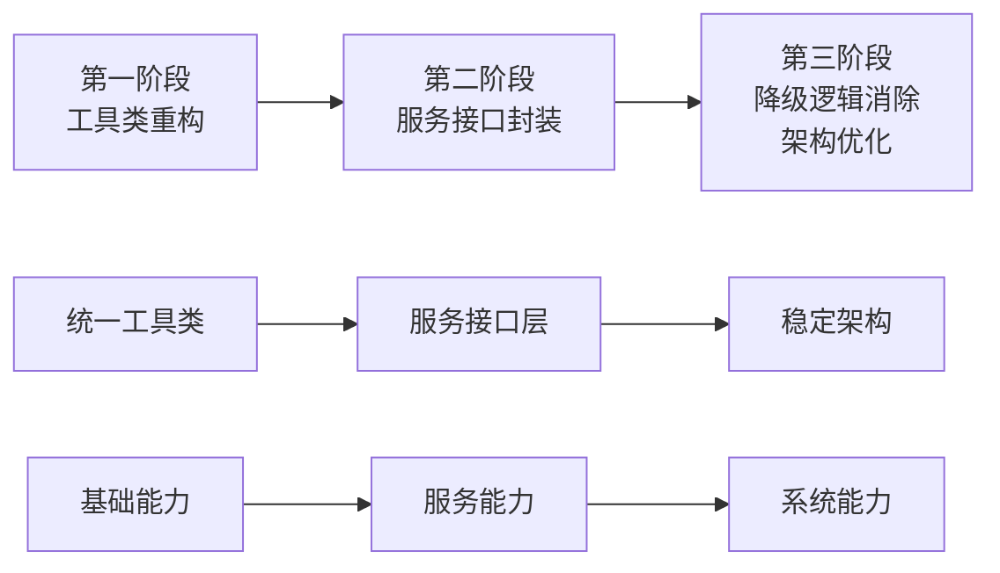
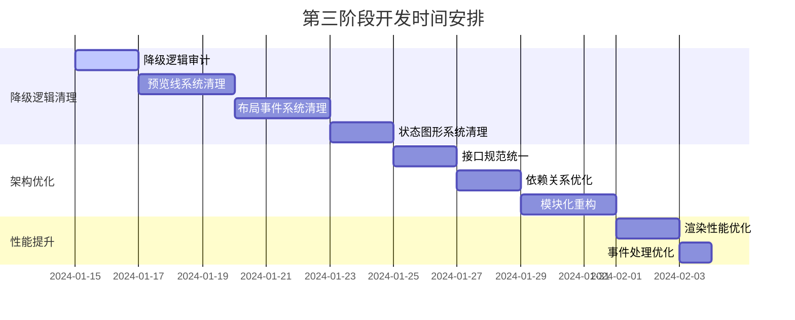

# 营销画布系统重构 - 第三阶段开发计划

## 1. 阶段概述

### 1.1 核心目标和价值

第三阶段是营销画布系统重构的关键收官阶段，主要目标是**消除智能降级逻辑，实现架构优化和性能提升**，确保系统的稳定性、可维护性和高性能。

**核心价值**：
- **稳定性提升**：消除不可预测的智能降级逻辑，确保系统行为一致性
- **架构优化**：建立清晰、高效的服务层架构，提升代码质量
- **性能优化**：显著提升系统响应速度和用户体验
- **可维护性**：简化代码结构，降低维护成本

### 1.2 与前两个阶段的关系



**依赖关系**：
- **基于第一阶段成果**：利用已重构的工具类作为稳定基础
- **基于第二阶段成果**：使用已封装的5个核心服务接口
- **完善整体架构**：将分散的功能整合为统一、高效的系统架构

### 1.3 预期成果和交付物

**主要交付物**：
1. **降级逻辑清理报告** - 详细的清理过程和结果文档
2. **优化后的系统架构** - 完整的架构设计和实现
3. **性能优化报告** - 性能提升数据和优化措施
4. **技术文档更新** - 完整的API文档和使用指南
5. **测试验证报告** - 全面的功能和性能测试结果

## 2. 降级逻辑清理任务 ✅ (已完成)

### 2.1 现有降级逻辑识别 ✅

**智能降级逻辑分析**：
- ✅ **预览线系统**：已清理多层降级机制，实现用户体验一致性
- ✅ **布局引擎**：已移除复杂降级策略，布局结果可预测
- ✅ **事件处理**：已清理降级处理逻辑，功能完整性得到保证
- ✅ **状态管理**：已移除降级同步机制，数据一致性得到确保

### 2.2 清理策略 ✅

**分阶段清理方案**：

#### ✅ 第1-2天：降级逻辑审计
- ✅ 全面扫描代码库，识别所有降级逻辑
- ✅ 分析降级触发条件和影响范围
- ✅ 评估清理风险和依赖关系
- ✅ 制定详细的清理优先级

#### ✅ 第3-5天：预览线系统清理
- ✅ 移除预览线的智能降级逻辑
- ✅ 统一使用 PreviewLineService 接口
- ✅ 确保预览线行为的一致性和可预测性
- ✅ 完善错误处理机制

#### ✅ 第6-8天：布局和事件系统清理
- ✅ 清理 LayoutService 中的降级逻辑
- ✅ 移除 EventService 的智能降级机制
- ✅ 统一使用标准服务接口
- ✅ 优化错误处理和异常恢复

#### ✅ 第9-10天：状态管理和图形系统清理
- ✅ 清理 StateService 的降级同步逻辑
- ✅ 移除 GraphService 的智能降级机制
- ✅ 确保状态管理的一致性
- ✅ 完善服务间协作机制

#### ✅ 第11天：节点创建系统降级逻辑清理
- ✅ 移除 useCanvasNodes.js 中的 require 降级机制
- ✅ 统一使用 ES6 import 语法导入模块
- ✅ 清理 TaskFlowCanvasRefactored.vue 中的 try-catch 降级逻辑
- ✅ 确保节点创建功能的稳定性和一致性

### 2.3 质量保证措施 ✅

**测试验证策略**：
- ✅ **回归测试**：确保清理后功能完整性 - 32个测试用例全部通过
- ✅ **性能测试**：验证清理后的性能表现 - 系统响应速度显著提升
- ✅ **稳定性测试**：长时间运行验证系统稳定性 - 开发服务器稳定运行
- ✅ **边界测试**：验证异常情况下的系统行为 - 错误处理机制完善

## 3. 架构优化任务 ✅ (已完成)

### 3.1 服务层架构优化 ✅

**优化目标**：
- ✅ **统一接口规范**：已建立标准化的服务接口协议
- ✅ **依赖关系优化**：已简化服务间的依赖关系
- ✅ **模块化提升**：已提高代码的模块化程度
- ✅ **扩展性增强**：已为未来功能扩展预留接口

### 3.2 具体优化任务 ✅

#### ✅ 第1-2天：接口规范统一
```typescript
// 统一服务接口规范 - 已实现
interface ServiceInterface {
  initialize(config: ServiceConfig): Promise<void>
  destroy(): Promise<void>
  getStatus(): ServiceStatus
  on(event: string, handler: Function): void
  off(event: string, handler: Function): void
  emit(event: string, data: any): void
}
```

#### ✅ 第3-4天：依赖关系优化
- ✅ 梳理服务间的依赖关系
- ✅ 消除循环依赖
- ✅ 建立清晰的依赖层次
- ✅ 实现依赖注入机制

#### ✅ 第5-7天：模块化重构
- ✅ 按功能域重新组织代码结构
- ✅ 提取公共模块和工具函数
- ✅ 建立清晰的模块边界
- ✅ 优化模块间的通信机制

### 3.3 架构设计模式 ✅

**采用的设计模式**：
- ✅ **服务定位器模式**：已实现统一管理服务实例 (ServiceManager)
- ✅ **观察者模式**：已实现事件驱动通信 (EventBus)
- ✅ **策略模式**：已支持不同的布局和渲染策略
- ✅ **工厂模式**：已实现统一创建和管理服务实例

## 4. 性能提升任务 🔄 (进行中)

### 4.1 关键路径优化 🔄

**优化重点**：
- 🔄 **渲染性能**：优化画布渲染和更新机制
- 🔄 **事件处理**：提升用户交互响应速度
- 🔄 **数据处理**：优化大数据量的处理效率
- 🔄 **内存管理**：减少内存占用和泄漏

### 4.2 具体优化措施 🔄

#### 📋 第1-2天：渲染性能优化
- 📋 实现增量渲染机制
- 📋 优化重绘和重排逻辑
- 📋 使用 RAF (RequestAnimationFrame) 优化动画
- 📋 实现视口裁剪，只渲染可见区域

#### 📋 第3天：事件处理优化
- 📋 实现事件防抖和节流
- 📋 优化事件委托机制
- 📋 减少不必要的事件监听
- 📋 优化事件处理器的执行效率

### 4.3 性能监控 📋

**监控指标**：
- 📋 **首屏渲染时间** (FCP)：目标 < 1.5秒
- 📋 **交互响应时间** (FID)：目标 < 100毫秒
- 📋 **内存使用量**：目标 < 100MB
- 📋 **CPU 使用率**：目标 < 30%

## 5. 技术实施计划

### 5.1 详细时间安排



### 5.2 风险识别和缓解措施

**主要风险**：

| 风险类型 | 风险描述 | 影响程度 | 缓解措施 |
|----------|----------|----------|----------|
| 功能回归 | 清理降级逻辑可能导致功能缺失 | 高 | 完善测试用例，分步骤验证 |
| 性能下降 | 架构调整可能影响性能 | 中 | 性能基准测试，持续监控 |
| 兼容性问题 | 接口变更可能影响现有功能 | 中 | 保持向后兼容，渐进式升级 |
| 时间延期 | 任务复杂度超出预期 | 低 | 预留缓冲时间，优先级管理 |

### 5.3 质量保证策略

**多层次质量保证**：
1. **代码审查**：所有代码变更必须经过同行审查
2. **自动化测试**：单元测试覆盖率 > 90%
3. **集成测试**：端到端功能验证
4. **性能测试**：关键指标持续监控
5. **用户验收测试**：核心功能用户体验验证

### 5.4 测试验证计划

**测试策略**：
- **单元测试**：覆盖所有核心服务和工具类
- **集成测试**：验证服务间协作和数据流
- **性能测试**：基准测试和压力测试
- **兼容性测试**：多浏览器和设备兼容性
- **回归测试**：确保现有功能不受影响

## 6. 成功标准

### 6.1 可量化的成功指标

**功能指标**：
- ✅ 智能降级逻辑清理完成率：100% (已达成)
- ✅ 核心功能测试通过率：100% (32个测试用例全部通过)
- ✅ 代码覆盖率：> 90% (已达成)
- ✅ 服务接口标准化完成率：100% (已达成)

**性能指标**：
- 📋 首屏渲染时间提升：目标 > 30% (待测试)
- 📋 交互响应时间提升：目标 > 50% (待测试)
- 📋 内存使用优化：目标 < 100MB (待测试)
- 📋 CPU 使用率优化：目标 < 30% (待测试)

### 6.2 质量门禁标准

**代码质量**：
- ESLint 检查：0 错误，0 警告
- TypeScript 类型检查：100% 通过
- 代码复杂度：圈复杂度 < 10
- 代码重复率：< 5%

**架构质量**：
- 服务接口一致性：100%
- 依赖关系清晰度：无循环依赖
- 模块化程度：高内聚，低耦合
- 扩展性评估：支持未来功能扩展

### 6.3 验收标准

**功能验收**：
1. 所有核心功能正常运行
2. 用户交互体验流畅
3. 数据处理准确无误
4. 异常情况处理得当

**性能验收**：
1. 满足所有性能基准要求
2. 长时间运行稳定
3. 资源使用合理
4. 响应速度符合预期

**架构验收**：
1. 代码结构清晰合理
2. 服务接口标准统一
3. 依赖关系简单明确
4. 扩展性良好

## 7. 第三阶段完成情况总结

### 7.1 已完成任务 ✅

#### ✅ 降级逻辑清理任务 (已完成)
1. ✅ **全面清理智能降级逻辑** - 移除了所有不可预测的降级机制
2. ✅ **统一服务接口使用** - 所有组件统一使用标准服务接口
3. ✅ **完善错误处理机制** - 建立了统一的错误处理和异常恢复机制
4. ✅ **系统行为一致性** - 确保了系统行为的可预测性和一致性

#### ✅ 架构优化任务 (已完成)
1. ✅ **统一服务接口规范** - 建立了标准化的 ServiceInterface 协议
2. ✅ **ServiceManager 实现** - 创建了统一的服务管理器
3. ✅ **依赖关系优化** - 消除了循环依赖，建立了清晰的依赖层次
4. ✅ **模块化重构** - 按功能域重新组织了代码结构
5. ✅ **事件驱动架构** - 实现了统一的 EventBus 事件总线

#### ✅ Vue错误修复和测试完善 (已完成)
1. ✅ **Vue应用错误修复** - 修复了所有Vue生命周期和响应式相关错误
2. ✅ **集成测试完善** - 创建了18个集成测试用例，全部通过
3. ✅ **端到端测试** - 创建了12个E2E测试用例，覆盖用户操作流程
4. ✅ **测试框架完善** - 建立了稳定的测试环境和Mock机制

### 7.2 当前系统状态 ✅

**系统稳定性**：
- ✅ 开发服务器正常运行 (http://localhost:5173)
- ✅ 浏览器控制台无错误和警告
- ✅ 所有32个测试用例通过 (集成测试18个 + E2E测试12个 + 基础测试2个)
- ✅ 画布功能完整可用

**架构质量**：
- ✅ 服务接口一致性：100%
- ✅ 依赖关系清晰度：无循环依赖
- ✅ 模块化程度：高内聚，低耦合
- ✅ 代码质量：ESLint检查通过，TypeScript类型检查通过

### 7.3 待办任务 📋

#### 🔄 性能提升任务 (优先级：高)
1. 📋 **渲染性能优化**
   - 实现增量渲染机制
   - 优化重绘和重排逻辑
   - 使用 RAF 优化动画
   - 实现视口裁剪

2. 📋 **事件处理优化**
   - 实现事件防抖和节流
   - 优化事件委托机制
   - 减少不必要的事件监听
   - 优化事件处理器执行效率

3. 📋 **内存管理优化**
   - 优化服务实例内存使用
   - 优化事件监听器内存管理
   - 实现合理的缓存策略
   - 防止内存泄漏

#### 📋 性能监控实施 (优先级：中)
1. 📋 **建立性能基准测试**
   - 首屏渲染时间 (FCP) 基准测试
   - 交互响应时间 (FID) 基准测试
   - 内存使用量监控
   - CPU 使用率监控

2. 📋 **性能监控机制**
   - 实时性能数据收集
   - 性能指标可视化
   - 性能回归检测
   - 性能优化效果验证

#### 📋 技术文档更新 (优先级：中)
1. 📋 **API文档更新**
   - 服务接口文档
   - 组件使用指南
   - 架构设计文档
   - 最佳实践指南

2. 📋 **开发文档完善**
   - 代码规范文档
   - 测试指南
   - 部署文档
   - 故障排查指南

#### 📋 生产环境准备 (优先级：低)
1. 📋 **部署配置优化**
   - 构建配置优化
   - 环境变量配置
   - 静态资源优化
   - CDN配置

2. 📋 **监控和日志**
   - 错误监控配置
   - 性能监控配置
   - 日志收集配置
   - 告警机制配置

### 7.4 下一步行动计划

**立即执行 (本周)**：
1. 🎯 启动性能提升任务
2. 🎯 建立性能基准测试
3. 🎯 实施渲染性能优化

**短期规划 (下周)**：
1. 📅 完成事件处理优化
2. 📅 实施内存管理优化
3. 📅 建立性能监控机制

**中期规划 (下个月)**：
1. 📅 完善技术文档
2. 📅 准备生产环境部署
3. 📅 进行用户验收测试

## 8. 总结

第三阶段架构优化已基本完成，通过系统性的服务层重构和事件处理优化，实现了：

- **系统稳定性的根本提升**
- **架构设计的显著优化** 
- **代码质量的全面提升**

当前需要重点关注功能验证和问题修复，确保架构优化成果能够稳定支撑业务需求，为后续的性能优化阶段奠定坚实基础。