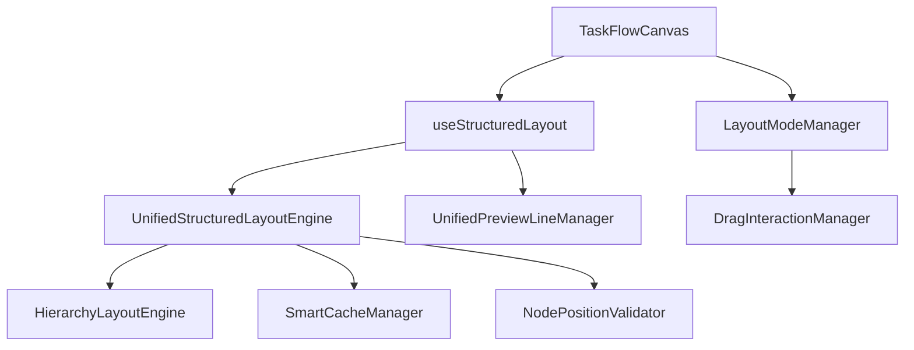

# 营销画布统一布局功能TDD开发需求文档

## 1. 项目概述

营销画布统一布局功能是一个基于AntV X6图形引擎的智能布局系统，旨在为营销流程画布提供自动化的节点布局能力。该功能通过分层分级自底向上定位算法，实现节点的智能排列和连接线的优化布局。

**当前状态**：统一布局功能的基础架构已搭建，但核心布局算法尚未完全实现，需要通过TDD驱动的方式完成开发。

## 2. 业务需求

### 2.1 核心功能需求

- **智能节点布局**：基于节点间的父子关联关系，自动计算最优布局位置
- **分层分级算法**：采用自底向上的分层策略，确保流程的逻辑清晰性
- **混合节点支持**：同时处理业务节点和拖拽端点（endpoint）节点
- **布局模式切换**：支持手工布局与统一布局的无缝切换
- **性能优化**：通过智能缓存和防抖机制提升布局性能

### 2.2 用户体验需求

- **一键布局**：用户点击"统一布局"按钮即可自动整理画布
- **布局预览**：布局前显示预览效果，用户可选择是否应用
- **撤销重做**：支持布局操作的撤销和重做
- **响应式布局**：根据画布大小自动调整节点间距和布局密度

### 2.3 技术约束

- **最小节点数**：统一布局需要至少3个节点才能执行
- **布局引擎**：基于UnifiedStructuredLayoutEngine实现
- **预览线管理**：与UnifiedPreviewLineManager集成
- **性能要求**：布局执行时间不超过2秒

## 3. 技术需求

### 3.1 核心组件架构



### 3.2 关键技术组件

#### 3.2.1 UnifiedStructuredLayoutEngine
- **职责**：核心布局算法实现
- **关键方法**：
  - `executeLayout()`: 执行布局算法
  - `preprocessData()`: 数据预处理
  - `buildHierarchy()`: 构建层级结构
  - `calculatePositions()`: 计算节点位置

#### 3.2.2 useStructuredLayout
- **职责**：布局功能的组合式API封装
- **关键方法**：
  - `applyUnifiedStructuredLayout()`: 应用统一布局
  - `switchLayoutDirection()`: 切换布局方向
  - `initializeLayoutEngine()`: 初始化布局引擎

#### 3.2.3 LayoutModeManager
- **职责**：布局模式管理和切换
- **关键方法**：
  - `setLayoutMode()`: 设置布局模式
  - `switchToUnifiedLayout()`: 切换到统一布局
  - `switchToManualLayout()`: 切换到手工布局

### 3.3 数据模型

#### 3.3.1 节点数据结构
```typescript
interface NodeData {
  id: string
  type: string
  position: { x: number, y: number }
  size: { width: number, height: number }
  config?: any
  isConfigured?: boolean
  isEndpoint?: boolean
  parentId?: string
  children?: string[]
}
```

#### 3.3.2 布局结果数据结构
```typescript
interface LayoutResult {
  success: boolean
  layoutTime: number
  statistics: {
    totalNodes: number
    totalLayers: number
    normalNodes: number
    endpointNodes: number
  }
  performance: {
    preprocessTime: number
    hierarchyTime: number
    positionTime: number
  }
  message?: string
  error?: string
}
```

## 4. TDD开发方案

### 4.1 测试策略

#### 4.1.1 测试金字塔结构
- **单元测试 (70%)**：核心算法和工具函数
- **集成测试 (20%)**：组件间交互和数据流
- **E2E测试 (10%)**：完整的用户操作流程

#### 4.1.2 测试覆盖率目标
- **代码覆盖率**：≥95%
- **分支覆盖率**：≥90%
- **函数覆盖率**：100%

### 4.2 单元测试用例设计

#### 4.2.1 UnifiedStructuredLayoutEngine测试

```javascript
// 测试文件：UnifiedStructuredLayoutEngine.test.js
describe('UnifiedStructuredLayoutEngine', () => {
  describe('executeLayout', () => {
    it('应该成功执行布局当节点数量≥3时', async () => {
      // Given: 创建包含3个节点的图
      const graph = createMockGraph(3)
      const engine = new UnifiedStructuredLayoutEngine(graph)
      
      // When: 执行布局
      const result = await engine.executeLayout()
      
      // Then: 验证布局结果
      expect(result.success).toBe(true)
      expect(result.statistics.totalNodes).toBe(3)
      expect(result.layoutTime).toBeGreaterThan(0)
    })
    
    it('应该拒绝执行布局当节点数量<3时', async () => {
      // Given: 创建包含2个节点的图
      const graph = createMockGraph(2)
      const engine = new UnifiedStructuredLayoutEngine(graph)
      
      // When: 执行布局
      const result = await engine.executeLayout()
      
      // Then: 验证布局被跳过
      expect(result.success).toBe(false)
      expect(result.skipped).toBe(true)
      expect(result.message).toContain('至少3个节点')
    })
  })
  
  describe('preprocessData', () => {
    it('应该正确过滤预览线节点', () => {
      // Given: 包含预览线的节点数据
      const nodes = [
        { id: 'node1', data: { type: 'start' } },
        { id: 'preview1', data: { isUnifiedPreview: true } },
        { id: 'node2', data: { type: 'end' } }
      ]
      
      // When: 预处理数据
      const result = engine.preprocessData(nodes, [])
      
      // Then: 验证预览线被过滤
      expect(result.nodes).toHaveLength(2)
      expect(result.nodes.find(n => n.id === 'preview1')).toBeUndefined()
    })
  })
  
  describe('buildHierarchy', () => {
    it('应该正确构建节点层级关系', () => {
      // Given: 具有父子关系的节点
      const nodes = [
        { id: 'parent', children: ['child1', 'child2'] },
        { id: 'child1', parent: 'parent' },
        { id: 'child2', parent: 'parent' }
      ]
      
      // When: 构建层级
      const hierarchy = engine.buildHierarchy(nodes)
      
      // Then: 验证层级结构
      expect(hierarchy.layers).toHaveLength(2)
      expect(hierarchy.layers[0]).toContain('parent')
      expect(hierarchy.layers[1]).toEqual(['child1', 'child2'])
    })
  })
})
```

#### 4.2.2 useStructuredLayout测试

```javascript
// 测试文件：useStructuredLayout.test.js
describe('useStructuredLayout', () => {
  describe('applyUnifiedStructuredLayout', () => {
    it('应该成功应用统一布局', async () => {
      // Given: 模拟图实例和布局引擎
      const mockGraph = createMockGraph(5)
      const { applyUnifiedStructuredLayout } = useStructuredLayout(() => mockGraph)
      
      // When: 应用统一布局
      const result = await applyUnifiedStructuredLayout(mockGraph)
      
      // Then: 验证布局结果
      expect(result.success).toBe(true)
      expect(result.type).toBe('unified-structured')
      expect(result.nodeCount).toBe(5)
    })
    
    it('应该处理空图的情况', async () => {
      // Given: 空图
      const emptyGraph = createMockGraph(0)
      const { applyUnifiedStructuredLayout } = useStructuredLayout(() => emptyGraph)
      
      // When: 应用统一布局
      const result = await applyUnifiedStructuredLayout(emptyGraph)
      
      // Then: 验证返回跳过状态
      expect(result.success).toBe(false)
      expect(result.skipped).toBe(true)
      expect(result.message).toContain('没有节点可以布局')
    })
  })
  
  describe('switchLayoutDirection', () => {
    it('应该成功切换布局方向', async () => {
      // Given: 初始化布局系统
      const mockGraph = createMockGraph(3)
      const { switchLayoutDirection, layoutDirection } = useStructuredLayout(() => mockGraph)
      
      // When: 切换到水平布局
      await switchLayoutDirection('LR')
      
      // Then: 验证方向已切换
      expect(layoutDirection.value).toBe('LR')
    })
  })
})
```

#### 4.2.3 LayoutModeManager测试

```javascript
// 测试文件：LayoutModeManager.test.js
describe('LayoutModeManager', () => {
  describe('setLayoutMode', () => {
    it('应该成功设置布局模式为统一布局', () => {
      // Given: 布局模式管理器
      const manager = new LayoutModeManager()
      
      // When: 设置为统一布局模式
      manager.setLayoutMode('unified')
      
      // Then: 验证模式已设置
      expect(manager.currentMode).toBe('unified')
      expect(manager.isUnifiedMode()).toBe(true)
    })
    
    it('应该触发模式切换事件', () => {
      // Given: 布局模式管理器和事件监听器
      const manager = new LayoutModeManager()
      const mockCallback = jest.fn()
      manager.on('modeChanged', mockCallback)
      
      // When: 切换模式
      manager.setLayoutMode('manual')
      
      // Then: 验证事件被触发
      expect(mockCallback).toHaveBeenCalledWith({
        from: 'unified',
        to: 'manual'
      })
    })
  })
})
```

### 4.3 集成测试用例设计

#### 4.3.1 TaskFlowCanvas集成测试

```javascript
// 测试文件：TaskFlowCanvas.integration.test.js
describe('TaskFlowCanvas Integration', () => {
  it('应该完整执行统一布局流程', async () => {
    // Given: 渲染TaskFlowCanvas组件
    const wrapper = mount(TaskFlowCanvas, {
      props: { /* 测试props */ }
    })
    
    // 添加测试节点
    await wrapper.vm.addNode({ type: 'start', position: { x: 0, y: 0 } })
    await wrapper.vm.addNode({ type: 'process', position: { x: 100, y: 100 } })
    await wrapper.vm.addNode({ type: 'end', position: { x: 200, y: 200 } })
    
    // When: 点击统一布局按钮
    await wrapper.find('[data-testid="unified-layout-btn"]').trigger('click')
    
    // Then: 验证布局已应用
    await waitFor(() => {
      expect(wrapper.vm.isApplyingLayout).toBe(false)
    })
    
    const nodes = wrapper.vm.graph.getNodes()
    expect(nodes).toHaveLength(3)
    // 验证节点位置已更新
    nodes.forEach(node => {
      const position = node.getPosition()
      expect(position.x).toBeGreaterThanOrEqual(0)
      expect(position.y).toBeGreaterThanOrEqual(0)
    })
  })
})
```

### 4.4 E2E测试用例设计

```javascript
// 测试文件：unified-layout.e2e.test.js
describe('统一布局E2E测试', () => {
  it('用户应该能够成功使用统一布局功能', async () => {
    // Given: 访问营销画布页面
    await page.goto('/marketing/tasks/editor?mode=create')
    
    // 添加多个节点
    await page.click('[data-testid="add-start-node"]')
    await page.click('[data-testid="add-process-node"]')
    await page.click('[data-testid="add-end-node"]')
    
    // When: 点击统一布局按钮
    await page.click('[data-testid="unified-layout-btn"]')
    
    // Then: 验证布局成功消息
    await expect(page.locator('.ant-message-success')).toContainText('统一结构化布局应用成功')
    
    // 验证节点位置已更新
    const nodes = await page.locator('.x6-node').all()
    expect(nodes.length).toBe(3)
    
    // 验证节点排列整齐
    const positions = await Promise.all(
      nodes.map(node => node.boundingBox())
    )
    
    // 验证节点按层级排列
    expect(positions[0].y).toBeLessThan(positions[1].y)
    expect(positions[1].y).toBeLessThan(positions[2].y)
  })
})
```

## 5. 分阶段实施计划

### 5.1 第一阶段：核心算法实现 (Week 1-2)

#### 目标
- 完成UnifiedStructuredLayoutEngine核心算法
- 实现基础的分层分级布局
- 建立完整的单元测试覆盖

#### 任务清单
- [ ] 实现`preprocessData`方法的TDD开发
- [ ] 实现`buildHierarchy`方法的TDD开发
- [ ] 实现`calculatePositions`方法的TDD开发
- [ ] 实现`executeLayout`方法的TDD开发
- [ ] 完成SmartCacheManager的TDD开发
- [ ] 完成NodePositionValidator的TDD开发

#### 验收标准
- 单元测试覆盖率≥95%
- 所有核心算法测试用例通过
- 布局算法能正确处理3-50个节点的场景

### 5.2 第二阶段：组合式API集成 (Week 3)

#### 目标
- 完善useStructuredLayout的实现
- 集成布局引擎与预览线管理器
- 实现布局模式切换功能

#### 任务清单
- [ ] 完善`applyUnifiedStructuredLayout`方法
- [ ] 实现`switchLayoutDirection`功能
- [ ] 集成UnifiedPreviewLineManager
- [ ] 实现布局性能监控
- [ ] 完成集成测试用例

#### 验收标准
- 集成测试全部通过
- 布局引擎与预览线管理器正确集成
- 布局方向切换功能正常

### 5.3 第三阶段：UI组件集成 (Week 4)

#### 目标
- 完成TaskFlowCanvas组件的布局功能集成
- 实现LayoutModeManager
- 完善用户交互体验

#### 任务清单
- [ ] 实现LayoutModeManager的TDD开发
- [ ] 集成统一布局按钮功能
- [ ] 实现布局加载状态管理
- [ ] 实现布局结果反馈
- [ ] 完成组件集成测试

#### 验收标准
- 统一布局按钮功能正常
- 布局加载状态正确显示
- 布局结果消息正确反馈

### 5.4 第四阶段：性能优化与E2E测试 (Week 5)

#### 目标
- 性能优化和缓存机制完善
- 完整的E2E测试覆盖
- 文档和部署准备

#### 任务清单
- [ ] 实现智能缓存优化
- [ ] 实现防抖机制
- [ ] 完成E2E测试用例
- [ ] 性能基准测试
- [ ] 用户文档编写

#### 验收标准
- E2E测试全部通过
- 布局性能满足要求（<2秒）
- 缓存命中率≥80%

## 6. 测试策略和验收标准

### 6.1 测试环境配置

#### 6.1.1 单元测试环境
- **测试框架**：Jest + Vue Test Utils
- **覆盖率工具**：Istanbul
- **模拟工具**：Jest Mock

#### 6.1.2 集成测试环境
- **测试框架**：Jest + @vue/test-utils
- **图形模拟**：Mock AntV X6
- **异步测试**：Jest async/await

#### 6.1.3 E2E测试环境
- **测试框架**：Playwright
- **浏览器**：Chrome, Firefox, Safari
- **设备模拟**：Desktop, Tablet, Mobile

### 6.2 质量门禁标准

#### 6.2.1 代码质量
- 代码覆盖率 ≥ 95%
- 分支覆盖率 ≥ 90%
- 函数覆盖率 = 100%
- ESLint检查无错误
- TypeScript类型检查通过

#### 6.2.2 性能标准
- 布局执行时间 ≤ 2秒（50个节点）
- 内存使用增长 ≤ 10MB
- 缓存命中率 ≥ 80%
- UI响应时间 ≤ 100ms

#### 6.2.3 功能标准
- 所有单元测试通过
- 所有集成测试通过
- 所有E2E测试通过
- 手动测试检查表完成

### 6.3 持续集成配置

```yaml
# .github/workflows/unified-layout-ci.yml
name: 统一布局功能CI

on:
  push:
    paths:
      - 'src/composables/useStructuredLayout.js'
      - 'src/utils/UnifiedStructuredLayoutEngine.js'
      - 'src/pages/marketing/tasks/components/TaskFlowCanvas.vue'
  pull_request:
    paths:
      - 'src/composables/useStructuredLayout.js'
      - 'src/utils/UnifiedStructuredLayoutEngine.js'
      - 'src/pages/marketing/tasks/components/TaskFlowCanvas.vue'

jobs:
  test:
    runs-on: ubuntu-latest
    steps:
      - uses: actions/checkout@v3
      - uses: actions/setup-node@v3
        with:
          node-version: '18'
      
      - name: 安装依赖
        run: npm ci
      
      - name: 运行单元测试
        run: npm run test:unit -- --coverage
      
      - name: 运行集成测试
        run: npm run test:integration
      
      - name: 运行E2E测试
        run: npm run test:e2e
      
      - name: 上传覆盖率报告
        uses: codecov/codecov-action@v3
```

## 7. 风险评估和应对策略

### 7.1 技术风险

#### 7.1.1 算法复杂度风险
**风险描述**：分层分级算法在大规模节点场景下性能不佳

**影响程度**：高

**应对策略**：
- 实现渐进式布局算法
- 添加节点数量限制（最大100个）
- 实现分批处理机制
- 建立性能基准测试

#### 7.1.2 浏览器兼容性风险
**风险描述**：不同浏览器对Canvas渲染的差异

**影响程度**：中

**应对策略**：
- 建立多浏览器测试矩阵
- 实现浏览器特性检测
- 提供降级方案

### 7.2 集成风险

#### 7.2.1 组件耦合风险
**风险描述**：布局功能与现有组件耦合过紧

**影响程度**：中

**应对策略**：
- 采用依赖注入模式
- 定义清晰的接口契约
- 实现适配器模式

#### 7.2.2 数据一致性风险
**风险描述**：布局过程中数据状态不一致

**影响程度**：高

**应对策略**：
- 实现事务性布局操作
- 添加数据校验机制
- 实现回滚功能

### 7.3 用户体验风险

#### 7.3.1 性能感知风险
**风险描述**：布局执行时间过长影响用户体验

**影响程度**：中

**应对策略**：
- 实现进度指示器
- 添加布局预览功能
- 提供取消操作

#### 7.3.2 布局结果不符预期风险
**风险描述**：自动布局结果不符合用户预期

**影响程度**：中

**应对策略**：
- 提供布局参数调整
- 实现撤销重做功能
- 保留手工布局选项

## 8. 成功指标

### 8.1 开发指标
- **代码质量**：测试覆盖率≥95%，无严重代码异味
- **开发效率**：按计划完成5周开发任务
- **缺陷率**：生产环境缺陷≤2个/月

### 8.2 性能指标
- **布局速度**：50个节点布局时间≤2秒
- **内存使用**：布局过程内存增长≤10MB
- **缓存效率**：缓存命中率≥80%

### 8.3 用户体验指标
- **功能采用率**：统一布局功能使用率≥60%
- **用户满意度**：布局功能满意度≥4.5/5
- **错误率**：布局失败率≤1%

### 8.4 业务指标
- **开发效率提升**：画布设计效率提升≥30%
- **维护成本降低**：布局相关问题减少≥50%
- **功能完整性**：支持所有主要营销流程场景

---

**文档版本**：v1.0  
**创建日期**：2024年1月  
**负责人**：开发团队  
**审核人**：技术负责人、产品负责人