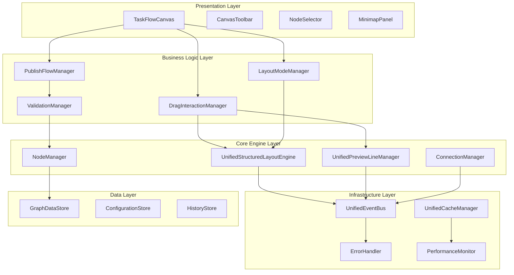
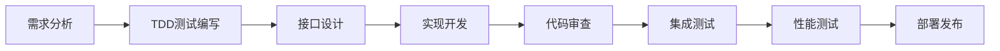

# 营销画布重构方案设计

## 1. 综合分析现有设计文档

### 1.1 设计文档优缺点分析

#### 1.1.1 代码优化评估报告
**优点：**
- 深入识别了核心问题：文件过大、职责不清、性能瓶颈
- 提供了具体的优化方案和代码示例
- 明确了组件拆分策略和架构重构方向
- 制定了分阶段的实施计划

**缺点：**
- 缺乏具体的测试策略
- 风险评估相对简单
- 没有详细的性能指标定义

#### 1.1.2 交互逻辑设计方案
**优点：**
- 新增了关键的交互管理器（DragInteractionManager、LayoutModeManager）
- 明确了布局模式分离机制
- 提供了详细的事件流程设计
- 考虑了用户体验优化

**缺点：**
- 与现有代码的集成方案不够详细
- 缺乏性能影响评估
- 测试覆盖策略不明确

#### 1.1.3 发布流程处理逻辑设计
**优点：**
- 设计了完整的发布流程管理器
- 考虑了复杂的业务逻辑处理
- 提供了详细的校验和错误处理机制
- 架构设计清晰，职责分工明确

**缺点：**
- 实现复杂度较高
- 与现有系统的兼容性需要验证
- 缺乏渐进式迁移策略

### 1.2 设计文档整合分析

**架构一致性：**
- 三个文档都强调了组件职责分离
- 都采用了事件驱动的架构模式
- 都考虑了性能优化和内存管理

**潜在冲突：**
- 组件间的依赖关系需要进一步梳理
- 事件系统的统一性需要加强
- 缓存策略可能存在重复

## 2. 分阶段重构实施计划

### 2.1 第一阶段：基础架构重构（4-5周）

#### 2.1.1 目标
- 建立TDD开发环境
- 重构核心组件，减少代码复杂度
- 建立统一的事件系统和缓存管理

#### 2.1.2 具体任务

**Week 1: TDD环境搭建**
```javascript
// 1. 测试框架配置
// package.json
{
  "devDependencies": {
    "@vue/test-utils": "^2.4.0",
    "vitest": "^0.34.0",
    "jsdom": "^22.0.0",
    "@testing-library/vue": "^7.0.0",
    "@testing-library/jest-dom": "^6.0.0"
  }
}

// 2. 测试配置文件
// vitest.config.js
export default {
  test: {
    environment: 'jsdom',
    setupFiles: ['./tests/setup.js'],
    coverage: {
      reporter: ['text', 'html'],
      threshold: {
        global: {
          branches: 80,
          functions: 80,
          lines: 80,
          statements: 80
        }
      }
    }
  }
}
```

**Week 2-3: 核心基础设施重构**
```javascript
// 1. 统一事件系统
class UnifiedEventBus {
  constructor() {
    this.events = new Map()
    this.middlewares = []
  }
  
  // TDD: 先写测试
  on(event, handler) { /* 实现 */ }
  emit(event, data) { /* 实现 */ }
  off(event, handler) { /* 实现 */ }
}

// 2. 统一缓存管理
class UnifiedCacheManager {
  constructor(options = {}) {
    this.caches = new Map()
    this.config = options
  }
  
  createCache(name, options) { /* 实现 */ }
  getCache(name) { /* 实现 */ }
  clearAll() { /* 实现 */ }
}

// 3. 统一错误处理
class ErrorHandler {
  constructor(eventBus) {
    this.eventBus = eventBus
    this.errorHandlers = new Map()
  }
  
  register(errorType, handler) { /* 实现 */ }
  handle(error, context) { /* 实现 */ }
}
```

**Week 4-5: TaskFlowCanvas组件拆分**
```javascript
// 拆分后的组件结构
// TaskFlowCanvas.vue (主组件，<300行)
// components/
//   ├── CanvasToolbar.vue
//   ├── CanvasContainer.vue
//   ├── MinimapPanel.vue
//   ├── HistoryPanel.vue
//   └── NodeSelector.vue
// composables/
//   ├── useCanvasState.js
//   ├── useToolbarState.js
//   ├── useNodeSelection.js
//   └── useHistoryManagement.js
```

### 2.2 第二阶段：交互逻辑重构（3-4周）

#### 2.2.1 目标
- 实现新的交互管理器
- 建立布局模式分离机制
- 优化拖拽和连接逻辑

#### 2.2.2 具体任务

**Week 1-2: 交互管理器实现**
```javascript
// DragInteractionManager 的TDD实现
class DragInteractionManager {
  constructor(dependencies) {
    this.graph = dependencies.graph
    this.previewLineManager = dependencies.previewLineManager
    this.eventBus = dependencies.eventBus
    this.config = dependencies.config
  }
  
  // 每个方法都先写测试用例
  onNodeDragStart(node, event) {
    // 测试用例：
    // 1. 应该设置isDragging为true
    // 2. 应该发出manual-layout-start事件
    // 3. 应该高亮可连接的预览线
  }
}
```

**Week 3-4: 布局模式管理器实现**
```javascript
// LayoutModeManager 的TDD实现
class LayoutModeManager {
  constructor(layoutEngine, eventBus) {
    this.layoutEngine = layoutEngine
    this.eventBus = eventBus
    this.currentMode = 'manual'
  }
  
  setLayoutMode(mode) {
    // 测试用例：
    // 1. 应该正确切换模式
    // 2. 应该发出mode-changed事件
    // 3. 应该正确启用/禁用自动布局
  }
}
```

### 2.3 第三阶段：发布流程重构（3-4周）

#### 2.3.1 目标
- 实现发布流程管理器
- 建立完整的校验体系
- 实现复杂业务逻辑处理

#### 2.3.2 具体任务

**Week 1-2: 校验系统实现**
```javascript
// ValidationManager 的TDD实现
class ValidationManager {
  constructor(dependencies) {
    this.validators = {
      nodeConfig: new NodeConfigValidator(),
      connection: new ConnectionValidator(),
      flowIntegrity: new FlowIntegrityValidator()
    }
  }
  
  async validateAll() {
    // 测试用例：
    // 1. 应该执行所有校验器
    // 2. 应该返回正确的校验结果
    // 3. 应该处理校验错误
  }
}
```

**Week 3-4: 发布流程管理器实现**
```javascript
// PublishFlowManager 的TDD实现
class PublishFlowManager {
  constructor(dependencies) {
    this.validationManager = dependencies.validationManager
    this.endNodeGenerator = dependencies.endNodeGenerator
    this.cycleDetector = dependencies.cycleDetector
  }
  
  async executePublishFlow() {
    // 测试用例：
    // 1. 应该按正确顺序执行发布步骤
    // 2. 应该处理发布过程中的错误
    // 3. 应该生成正确的发布结果
  }
}
```

### 2.4 第四阶段：性能优化和集成测试（2-3周）

#### 2.4.1 目标
- 性能优化和内存管理
- 完整的集成测试
- 文档和部署准备

#### 2.4.2 具体任务

**Week 1: 性能优化**
- 实现智能缓存策略
- 优化事件处理性能
- 内存泄漏检测和修复

**Week 2-3: 集成测试和部署**
- 端到端测试
- 性能基准测试
- 部署脚本和文档

## 3. 详细的TDD测试策略

### 3.1 测试金字塔结构

```
        E2E Tests (10%)
       ┌─────────────────┐
      │  用户场景测试    │
     └─────────────────┘
    Integration Tests (20%)
   ┌─────────────────────┐
  │   组件集成测试       │
 └─────────────────────┘
Unit Tests (70%)
┌─────────────────────────┐
│     单元测试            │
└─────────────────────────┘
```

### 3.2 单元测试策略

#### 3.2.1 核心组件测试

**TaskFlowCanvas组件测试**
```javascript
// tests/components/TaskFlowCanvas.test.js
import { describe, it, expect, beforeEach, vi } from 'vitest'
import { mount } from '@vue/test-utils'
import TaskFlowCanvas from '@/components/TaskFlowCanvas.vue'

describe('TaskFlowCanvas', () => {
  let wrapper
  let mockGraph
  
  beforeEach(() => {
    mockGraph = {
      addNode: vi.fn(),
      removeNode: vi.fn(),
      getNodes: vi.fn(() => []),
      on: vi.fn(),
      off: vi.fn()
    }
    
    wrapper = mount(TaskFlowCanvas, {
      props: {
        initialData: []
      },
      global: {
        provide: {
          graph: mockGraph
        }
      }
    })
  })
  
  describe('初始化', () => {
    it('应该正确初始化画布', () => {
      expect(wrapper.vm.isGraphReady).toBe(false)
      expect(wrapper.vm.selectedNodeId).toBe(null)
    })
    
    it('应该设置正确的默认配置', () => {
      expect(wrapper.vm.layoutMode).toBe('manual')
      expect(wrapper.vm.showMinimap).toBe(false)
    })
  })
  
  describe('节点操作', () => {
    it('应该能够添加节点', async () => {
      const nodeData = { type: 'start', label: '开始' }
      await wrapper.vm.addNode(nodeData)
      
      expect(mockGraph.addNode).toHaveBeenCalledWith(
        expect.objectContaining(nodeData)
      )
    })
    
    it('应该能够删除节点', async () => {
      const nodeId = 'node-1'
      await wrapper.vm.removeNode(nodeId)
      
      expect(mockGraph.removeNode).toHaveBeenCalledWith(nodeId)
    })
  })
  
  describe('布局模式', () => {
    it('应该能够切换布局模式', async () => {
      await wrapper.vm.switchLayoutMode('unified')
      
      expect(wrapper.vm.layoutMode).toBe('unified')
    })
    
    it('切换到手工模式时应该禁用自动布局', async () => {
      const mockLayoutEngine = {
        disableAutoLayout: vi.fn()
      }
      wrapper.vm.layoutEngine = mockLayoutEngine
      
      await wrapper.vm.switchLayoutMode('manual')
      
      expect(mockLayoutEngine.disableAutoLayout).toHaveBeenCalled()
    })
  })
})
```

**DragInteractionManager测试**
```javascript
// tests/managers/DragInteractionManager.test.js
import { describe, it, expect, beforeEach, vi } from 'vitest'
import DragInteractionManager from '@/managers/DragInteractionManager'

describe('DragInteractionManager', () => {
  let manager
  let mockGraph
  let mockPreviewLineManager
  let mockEventBus
  
  beforeEach(() => {
    mockGraph = {
      getNodes: vi.fn(() => []),
      addEdge: vi.fn()
    }
    
    mockPreviewLineManager = {
      getAllPreviewLines: vi.fn(() => []),
      removePreviewLine: vi.fn(),
      highlightPreviewLine: vi.fn()
    }
    
    mockEventBus = {
      emit: vi.fn(),
      on: vi.fn()
    }
    
    manager = new DragInteractionManager({
      graph: mockGraph,
      previewLineManager: mockPreviewLineManager,
      eventBus: mockEventBus
    })
  })
  
  describe('节点拖拽', () => {
    it('开始拖拽时应该设置正确的状态', () => {
      const mockNode = { id: 'node-1', getPosition: () => ({ x: 100, y: 100 }) }
      
      manager.onNodeDragStart(mockNode, {})
      
      expect(manager.isDragging).toBe(true)
      expect(manager.dragTarget).toEqual({
        type: 'node',
        element: mockNode
      })
      expect(mockEventBus.emit).toHaveBeenCalledWith('manual-layout-start')
    })
    
    it('拖拽过程中应该检测最近的预览线', () => {
      const mockNode = {
        id: 'node-1',
        getPosition: () => ({ x: 100, y: 100 })
      }
      
      const mockPreviewLine = {
        id: 'line-1',
        getEndpoint: () => ({ x: 120, y: 100 })
      }
      
      mockPreviewLineManager.getAllPreviewLines.mockReturnValue([mockPreviewLine])
      manager.isDragging = true
      
      manager.onNodeDragMove(mockNode, {})
      
      // 应该检测到最近的预览线并显示吸附提示
      expect(mockPreviewLineManager.highlightPreviewLine).toHaveBeenCalledWith(mockPreviewLine)
    })
  })
  
  describe('距离计算', () => {
    it('应该正确计算两点间距离', () => {
      const point1 = { x: 0, y: 0 }
      const point2 = { x: 3, y: 4 }
      
      const distance = manager.calculateDistance(point1, point2)
      
      expect(distance).toBe(5) // 3-4-5直角三角形
    })
  })
  
  describe('吸附检测', () => {
    it('应该正确判断是否在吸附范围内', () => {
      const position = { x: 100, y: 100 }
      const target = { x: 120, y: 100 }
      
      const isWithinThreshold = manager.isWithinSnapThreshold(position, target)
      
      expect(isWithinThreshold).toBe(true) // 距离20 < 阈值30
    })
  })
})
```

### 3.3 集成测试策略

#### 3.3.1 组件间协作测试

```javascript
// tests/integration/canvas-interaction.test.js
import { describe, it, expect, beforeEach } from 'vitest'
import { createTestingPinia } from '@pinia/testing'
import { mount } from '@vue/test-utils'
import TaskFlowCanvas from '@/components/TaskFlowCanvas.vue'

describe('画布交互集成测试', () => {
  let wrapper
  
  beforeEach(() => {
    wrapper = mount(TaskFlowCanvas, {
      global: {
        plugins: [createTestingPinia()]
      }
    })
  })
  
  it('应该能够完成完整的节点拖拽吸附流程', async () => {
    // 1. 添加源节点
    await wrapper.vm.addNode({ type: 'start', position: { x: 100, y: 100 } })
    
    // 2. 添加目标节点
    await wrapper.vm.addNode({ type: 'process', position: { x: 300, y: 100 } })
    
    // 3. 模拟拖拽源节点靠近预览线
    const sourceNode = wrapper.vm.graph.getNodes()[0]
    const dragEvent = new MouseEvent('mousemove', {
      clientX: 250,
      clientY: 100
    })
    
    // 4. 触发拖拽事件
    await wrapper.vm.dragInteractionManager.onNodeDragMove(sourceNode, dragEvent)
    
    // 5. 验证吸附效果
    expect(wrapper.vm.dragInteractionManager.isDragging).toBe(true)
    
    // 6. 完成拖拽
    await wrapper.vm.dragInteractionManager.onNodeDragEnd(sourceNode, {})
    
    // 7. 验证连接创建
    const edges = wrapper.vm.graph.getEdges()
    expect(edges).toHaveLength(1)
    expect(edges[0].getSourceCellId()).toBe(sourceNode.id)
  })
  
  it('应该能够正确处理布局模式切换', async () => {
    // 1. 初始状态为手工模式
    expect(wrapper.vm.layoutMode).toBe('manual')
    
    // 2. 切换到统一布局模式
    await wrapper.vm.switchLayoutMode('unified')
    
    // 3. 验证模式切换
    expect(wrapper.vm.layoutMode).toBe('unified')
    
    // 4. 添加节点应该触发自动布局
    const nodeCountBefore = wrapper.vm.graph.getNodes().length
    await wrapper.vm.addNode({ type: 'process' })
    
    // 5. 验证布局引擎被调用
    expect(wrapper.vm.layoutEngine.executeLayout).toHaveBeenCalled()
  })
})
```

### 3.4 端到端测试策略

#### 3.4.1 用户场景测试

```javascript
// tests/e2e/marketing-canvas.spec.js
import { test, expect } from '@playwright/test'

test.describe('营销画布端到端测试', () => {
  test.beforeEach(async ({ page }) => {
    await page.goto('/marketing-canvas')
    await page.waitForSelector('[data-testid="canvas-container"]')
  })
  
  test('用户应该能够创建完整的营销流程', async ({ page }) => {
    // 1. 添加开始节点
    await page.click('[data-testid="add-start-node"]')
    await page.click('[data-testid="canvas-container"]', {
      position: { x: 100, y: 100 }
    })
    
    // 2. 验证节点创建
    const startNode = page.locator('[data-node-type="start"]')
    await expect(startNode).toBeVisible()
    
    // 3. 添加处理节点
    await page.click('[data-testid="add-process-node"]')
    await page.click('[data-testid="canvas-container"]', {
      position: { x: 300, y: 100 }
    })
    
    // 4. 连接节点
    await page.hover('[data-node-type="start"]')
    await page.dragAndDrop(
      '[data-testid="output-port"]',
      '[data-testid="input-port"]'
    )
    
    // 5. 验证连接创建
    const connection = page.locator('[data-testid="edge"]')
    await expect(connection).toBeVisible()
    
    // 6. 配置节点
    await page.click('[data-node-type="process"]')
    await page.fill('[data-testid="node-config-input"]', '处理逻辑')
    await page.click('[data-testid="save-config"]')
    
    // 7. 发布流程
    await page.click('[data-testid="publish-button"]')
    
    // 8. 验证发布成功
    await expect(page.locator('[data-testid="publish-success"]')).toBeVisible()
  })
  
  test('用户应该能够使用拖拽吸附功能', async ({ page }) => {
    // 1. 创建两个节点
    await page.click('[data-testid="add-start-node"]')
    await page.click('[data-testid="canvas-container"]', {
      position: { x: 100, y: 100 }
    })
    
    await page.click('[data-testid="add-process-node"]')
    await page.click('[data-testid="canvas-container"]', {
      position: { x: 400, y: 100 }
    })
    
    // 2. 拖拽第一个节点靠近第二个节点
    await page.dragAndDrop(
      '[data-node-type="start"]',
      '[data-testid="canvas-container"]',
      {
        targetPosition: { x: 350, y: 100 }
      }
    )
    
    // 3. 验证吸附效果
    await expect(page.locator('[data-testid="snap-hint"]')).toBeVisible()
    
    // 4. 释放拖拽
    await page.mouse.up()
    
    // 5. 验证自动连接
    const connection = page.locator('[data-testid="edge"]')
    await expect(connection).toBeVisible()
  })
})
```

### 3.5 性能测试策略

#### 3.5.1 性能基准测试

```javascript
// tests/performance/canvas-performance.test.js
import { describe, it, expect } from 'vitest'
import { performance } from 'perf_hooks'
import TaskFlowCanvas from '@/components/TaskFlowCanvas.vue'

describe('画布性能测试', () => {
  it('大量节点渲染性能应该在可接受范围内', async () => {
    const canvas = new TaskFlowCanvas()
    const nodeCount = 1000
    
    const startTime = performance.now()
    
    // 添加大量节点
    for (let i = 0; i < nodeCount; i++) {
      await canvas.addNode({
        type: 'process',
        position: { x: (i % 50) * 100, y: Math.floor(i / 50) * 100 }
      })
    }
    
    const endTime = performance.now()
    const duration = endTime - startTime
    
    // 性能要求：1000个节点渲染时间不超过5秒
    expect(duration).toBeLessThan(5000)
  })
  
  it('布局计算性能应该在可接受范围内', async () => {
    const layoutEngine = new UnifiedStructuredLayoutEngine()
    const nodeCount = 500
    const edgeCount = 800
    
    // 生成测试数据
    const nodes = Array.from({ length: nodeCount }, (_, i) => ({
      id: `node-${i}`,
      type: 'process'
    }))
    
    const edges = Array.from({ length: edgeCount }, (_, i) => ({
      id: `edge-${i}`,
      source: `node-${i % nodeCount}`,
      target: `node-${(i + 1) % nodeCount}`
    }))
    
    const startTime = performance.now()
    
    await layoutEngine.executeLayout({ nodes, edges })
    
    const endTime = performance.now()
    const duration = endTime - startTime
    
    // 性能要求：500节点800边的布局计算不超过2秒
    expect(duration).toBeLessThan(2000)
  })
  
  it('内存使用应该在合理范围内', async () => {
    const initialMemory = process.memoryUsage().heapUsed
    
    const canvas = new TaskFlowCanvas()
    
    // 执行大量操作
    for (let i = 0; i < 100; i++) {
      await canvas.addNode({ type: 'process' })
      await canvas.removeNode(`node-${i}`)
    }
    
    // 强制垃圾回收
    if (global.gc) {
      global.gc()
    }
    
    const finalMemory = process.memoryUsage().heapUsed
    const memoryIncrease = finalMemory - initialMemory
    
    // 内存增长不应超过50MB
    expect(memoryIncrease).toBeLessThan(50 * 1024 * 1024)
  })
})
```

## 4. 风险评估和缓解措施

### 4.1 技术风险

#### 4.1.1 高风险项

**风险1：组件间依赖复杂导致重构困难**
- **影响程度**：高
- **发生概率**：中
- **缓解措施**：
  - 建立依赖注入容器，统一管理组件依赖
  - 使用接口抽象，降低具体实现的耦合
  - 分阶段重构，每个阶段都保持系统可运行状态

```javascript
// 依赖注入容器
class DIContainer {
  constructor() {
    this.services = new Map()
    this.singletons = new Map()
  }
  
  register(name, factory, options = {}) {
    this.services.set(name, { factory, options })
  }
  
  resolve(name) {
    const service = this.services.get(name)
    if (!service) {
      throw new Error(`Service ${name} not found`)
    }
    
    if (service.options.singleton) {
      if (!this.singletons.has(name)) {
        this.singletons.set(name, service.factory(this))
      }
      return this.singletons.get(name)
    }
    
    return service.factory(this)
  }
}

// 使用示例
const container = new DIContainer()

container.register('eventBus', () => new UnifiedEventBus(), { singleton: true })
container.register('cacheManager', () => new UnifiedCacheManager(), { singleton: true })
container.register('dragInteractionManager', (container) => 
  new DragInteractionManager({
    eventBus: container.resolve('eventBus'),
    cacheManager: container.resolve('cacheManager')
  })
)
```

**风险2：性能回归**
- **影响程度**：中
- **发生概率**：中
- **缓解措施**：
  - 建立性能基准测试
  - 持续性能监控
  - 性能预算控制

```javascript
// 性能监控系统
class PerformanceMonitor {
  constructor() {
    this.metrics = new Map()
    this.thresholds = {
      layoutCalculation: 1000, // 1秒
      nodeRendering: 100,      // 100ms
      memoryUsage: 100 * 1024 * 1024 // 100MB
    }
  }
  
  startMeasure(name) {
    this.metrics.set(name, { startTime: performance.now() })
  }
  
  endMeasure(name) {
    const metric = this.metrics.get(name)
    if (metric) {
      metric.duration = performance.now() - metric.startTime
      this.checkThreshold(name, metric.duration)
    }
  }
  
  checkThreshold(name, duration) {
    const threshold = this.thresholds[name]
    if (threshold && duration > threshold) {
      console.warn(`Performance warning: ${name} took ${duration}ms (threshold: ${threshold}ms)`)
    }
  }
}
```

#### 4.1.2 中风险项

**风险3：测试覆盖率不足**
- **影响程度**：中
- **发生概率**：低
- **缓解措施**：
  - 强制测试覆盖率要求（80%以上）
  - 代码审查时检查测试质量
  - 自动化测试报告

**风险4：新架构学习成本**
- **影响程度**：低
- **发生概率**：高
- **缓解措施**：
  - 详细的架构文档和示例
  - 团队培训和知识分享
  - 渐进式迁移，保留旧代码作为参考

### 4.2 项目风险

#### 4.2.1 进度风险

**风险5：重构时间超出预期**
- **影响程度**：高
- **发生概率**：中
- **缓解措施**：
  - 分阶段交付，每个阶段都有明确的验收标准
  - 预留20%的缓冲时间
  - 关键路径监控和风险预警

```javascript
// 进度监控系统
class ProgressTracker {
  constructor() {
    this.milestones = []
    this.currentPhase = null
  }
  
  addMilestone(name, deadline, dependencies = []) {
    this.milestones.push({
      name,
      deadline,
      dependencies,
      status: 'pending',
      actualCompletion: null
    })
  }
  
  completeMilestone(name) {
    const milestone = this.milestones.find(m => m.name === name)
    if (milestone) {
      milestone.status = 'completed'
      milestone.actualCompletion = new Date()
      this.checkDelays()
    }
  }
  
  checkDelays() {
    const now = new Date()
    const delayedMilestones = this.milestones.filter(m => 
      m.status === 'pending' && new Date(m.deadline) < now
    )
    
    if (delayedMilestones.length > 0) {
      console.warn('Delayed milestones:', delayedMilestones.map(m => m.name))
    }
  }
}
```

#### 4.2.2 质量风险

**风险6：重构引入新的Bug**
- **影响程度**：高
- **发生概率**：中
- **缓解措施**：
  - 完善的回归测试
  - 金丝雀发布策略
  - 快速回滚机制

```javascript
// 回滚机制
class RollbackManager {
  constructor() {
    this.snapshots = []
    this.currentVersion = null
  }
  
  createSnapshot(version, codebase) {
    this.snapshots.push({
      version,
      timestamp: new Date(),
      codebase: this.deepClone(codebase),
      tests: this.runTests()
    })
  }
  
  rollback(targetVersion) {
    const snapshot = this.snapshots.find(s => s.version === targetVersion)
    if (snapshot) {
      this.restoreCodebase(snapshot.codebase)
      this.runTests()
      console.log(`Rolled back to version ${targetVersion}`)
    }
  }
}
```

### 4.3 风险监控和预警

```javascript
// 风险监控系统
class RiskMonitor {
  constructor() {
    this.risks = new Map()
    this.alerts = []
  }
  
  registerRisk(id, risk) {
    this.risks.set(id, {
      ...risk,
      status: 'monitoring',
      lastCheck: new Date()
    })
  }
  
  checkRisks() {
    for (const [id, risk] of this.risks) {
      const riskLevel = this.assessRisk(risk)
      if (riskLevel > risk.threshold) {
        this.triggerAlert(id, risk, riskLevel)
      }
    }
  }
  
  triggerAlert(riskId, risk, level) {
    const alert = {
      riskId,
      level,
      message: `Risk ${risk.name} has escalated to level ${level}`,
      timestamp: new Date(),
      mitigationActions: risk.mitigationActions
    }
    
    this.alerts.push(alert)
    this.notifyStakeholders(alert)
  }
}
```

## 5. 重构后的架构设计

### 5.1 整体架构图



### 5.2 核心组件设计

#### 5.2.1 统一事件系统

```javascript
// 事件系统接口定义
interface IEventBus {
  on(event: string, handler: Function): void
  off(event: string, handler: Function): void
  emit(event: string, data?: any): void
  once(event: string, handler: Function): void
}

// 统一事件总线实现
class UnifiedEventBus implements IEventBus {
  private events: Map<string, Set<Function>>
  private middlewares: Array<(event: string, data: any) => boolean>
  private eventHistory: Array<{ event: string, data: any, timestamp: number }>
  
  constructor(options: EventBusOptions = {}) {
    this.events = new Map()
    this.middlewares = []
    this.eventHistory = []
    this.maxHistorySize = options.maxHistorySize || 1000
  }
  
  on(event: string, handler: Function): void {
    if (!this.events.has(event)) {
      this.events.set(event, new Set())
    }
    this.events.get(event)!.add(handler)
  }
  
  emit(event: string, data?: any): void {
    // 中间件处理
    for (const middleware of this.middlewares) {
      if (!middleware(event, data)) {
        return // 中间件阻止事件传播
      }
    }
    
    // 记录事件历史
    this.recordEvent(event, data)
    
    // 触发事件处理器
    const handlers = this.events.get(event)
    if (handlers) {
      handlers.forEach(handler => {
        try {
          handler(data)
        } catch (error) {
          console.error(`Error in event handler for ${event}:`, error)
        }
      })
    }
  }
  
  // 添加中间件
  use(middleware: (event: string, data: any) => boolean): void {
    this.middlewares.push(middleware)
  }
  
  // 获取事件历史
  getEventHistory(event?: string): Array<any> {
    if (event) {
      return this.eventHistory.filter(e => e.event === event)
    }
    return [...this.eventHistory]
  }
  
  private recordEvent(event: string, data: any): void {
    this.eventHistory.push({
      event,
      data,
      timestamp: Date.now()
    })
    
    // 限制历史记录大小
    if (this.eventHistory.length > this.maxHistorySize) {
      this.eventHistory.shift()
    }
  }
}
```

#### 5.2.2 统一缓存管理

```javascript
// 缓存管理器接口
interface ICacheManager {
  createCache(name: string, options?: CacheOptions): ICache
  getCache(name: string): ICache | null
  clearAll(): void
  getStats(): CacheStats
}

// 缓存实例接口
interface ICache {
  set(key: string, value: any, ttl?: number): void
  get(key: string): any
  has(key: string): boolean
  delete(key: string): boolean
  clear(): void
  size(): number
}

// 统一缓存管理器实现
class UnifiedCacheManager implements ICacheManager {
  private caches: Map<string, ICache>
  private globalConfig: CacheConfig
  
  constructor(config: CacheConfig = {}) {
    this.caches = new Map()
    this.globalConfig = {
      defaultTTL: 5000,
      maxSize: 100,
      cleanupInterval: 10000,
      ...config
    }
    
    this.startCleanupTimer()
  }
  
  createCache(name: string, options: CacheOptions = {}): ICache {
    const cacheConfig = { ...this.globalConfig, ...options }
    const cache = new LRUCache(cacheConfig)
    
    this.caches.set(name, cache)
    return cache
  }
  
  getCache(name: string): ICache | null {
    return this.caches.get(name) || null
  }
  
  clearAll(): void {
    this.caches.forEach(cache => cache.clear())
  }
  
  getStats(): CacheStats {
    const stats = {
      totalCaches: this.caches.size,
      totalItems: 0,
      totalMemory: 0,
      hitRate: 0
    }
    
    this.caches.forEach(cache => {
      const cacheStats = cache.getStats()
      stats.totalItems += cacheStats.size
      stats.totalMemory += cacheStats.memory
    })
    
    return stats
  }
  
  private startCleanupTimer(): void {
    setInterval(() => {
      this.caches.forEach(cache => {
        if (typeof cache.cleanup === 'function') {
          cache.cleanup()
        }
      })
    }, this.globalConfig.cleanupInterval)
  }
}

// LRU缓存实现
class LRUCache implements ICache {
  private cache: Map<string, CacheItem>
  private maxSize: number
  private defaultTTL: number
  private stats: { hits: number, misses: number }
  
  constructor(options: CacheOptions) {
    this.cache = new Map()
    this.maxSize = options.maxSize || 100
    this.defaultTTL = options.defaultTTL || 5000
    this.stats = { hits: 0, misses: 0 }
  }
  
  set(key: string, value: any, ttl?: number): void {
    // 如果缓存已满，删除最旧的项
    if (this.cache.size >= this.maxSize) {
      const firstKey = this.cache.keys().next().value
      this.cache.delete(firstKey)
    }
    
    const expireTime = Date.now() + (ttl || this.defaultTTL)
    this.cache.set(key, {
      value,
      expireTime,
      accessTime: Date.now()
    })
  }
  
  get(key: string): any {
    const item = this.cache.get(key)
    
    if (!item) {
      this.stats.misses++
      return undefined
    }
    
    if (Date.now() > item.expireTime) {
      this.cache.delete(key)
      this.stats.misses++
      return undefined
    }
    
    // 更新访问时间（LRU）
    item.accessTime = Date.now()
    this.stats.hits++
    
    return item.value
  }
  
  cleanup(): void {
    const now = Date.now()
    for (const [key, item] of this.cache) {
      if (now > item.expireTime) {
        this.cache.delete(key)
      }
    }
  }
}
```

### 5.3 组件职责分工矩阵

| 组件名称 | 主要职责 | 依赖组件 | 被依赖组件 | 接口定义 |
|---------|---------|----------|------------|----------|
| **TaskFlowCanvas** | 画布容器管理、用户交互协调 | DragInteractionManager, LayoutModeManager | - | ICanvasContainer |
| **DragInteractionManager** | 拖拽交互逻辑、吸附检测 | UnifiedEventBus, UnifiedPreviewLineManager | TaskFlowCanvas | IDragInteraction |
| **LayoutModeManager** | 布局模式切换、触发条件控制 | UnifiedStructuredLayoutEngine | TaskFlowCanvas, DragInteractionManager | ILayoutMode |
| **UnifiedStructuredLayoutEngine** | 布局算法执行、位置计算 | UnifiedCacheManager, UnifiedEventBus | LayoutModeManager | ILayoutEngine |
| **UnifiedPreviewLineManager** | 预览线生命周期管理 | UnifiedEventBus, UnifiedCacheManager | DragInteractionManager | IPreviewLineManager |
| **PublishFlowManager** | 发布流程控制、业务逻辑协调 | ValidationManager, EndNodeAutoGenerator | TaskFlowCanvas | IPublishFlow |
| **ValidationManager** | 数据校验、完整性检查 | NodeConfigValidator, CycleDetector | PublishFlowManager | IValidation |
| **UnifiedEventBus** | 事件通信、消息传递 | - | 所有组件 | IEventBus |
| **UnifiedCacheManager** | 缓存管理、性能优化 | - | LayoutEngine, PreviewLineManager | ICacheManager |

### 5.4 接口定义规范

#### 5.4.1 核心接口定义

```typescript
// 画布容器接口
interface ICanvasContainer {
  // 节点操作
  addNode(nodeData: NodeData): Promise<string>
  removeNode(nodeId: string): Promise<boolean>
  updateNode(nodeId: string, data: Partial<NodeData>): Promise<boolean>
  getNode(nodeId: string): NodeData | null
  getAllNodes(): NodeData[]
  
  // 连接操作
  addConnection(sourceId: string, targetId: string): Promise<string>
  removeConnection(connectionId: string): Promise<boolean>
  getAllConnections(): ConnectionData[]
  
  // 布局操作
  applyLayout(direction?: LayoutDirection): Promise<LayoutResult>
  switchLayoutMode(mode: LayoutMode): void
  
  // 状态查询
  getCanvasState(): CanvasState
  isReady(): boolean
}

// 拖拽交互接口
interface IDragInteraction {
  // 拖拽事件处理
  onNodeDragStart(node: NodeData, event: DragEvent): void
  onNodeDragMove(node: NodeData, event: DragEvent): void
  onNodeDragEnd(node: NodeData, event: DragEvent): void
  
  // 预览线拖拽
  onPreviewLineDrag(line: PreviewLineData, position: Point): void
  
  // 吸附检测
  findNearestPreviewLine(position: Point): PreviewLineData | null
  findNearestNode(position: Point): NodeData | null
  
  // 连接创建
  createConnection(source: NodeData, target: NodeData): Promise<ConnectionData>
  validateConnection(source: NodeData, target: NodeData): boolean
}

// 布局引擎接口
interface ILayoutEngine {
  // 布局执行
  executeLayout(options?: LayoutOptions): Promise<LayoutResult>
  executeLayoutImmediate(options?: LayoutOptions): LayoutResult
  
  // 配置管理
  updateConfig(config: LayoutConfig): void
  getConfig(): LayoutConfig
  
  // 模式控制
  enableAutoTrigger(): void
  disableAutoTrigger(): void
  pauseAutoTrigger(): void
  resumeAutoTrigger(): void
  
  // 性能监控
  getPerformanceMetrics(): PerformanceMetrics
  clearCache(): void
}

// 预览线管理接口
interface IPreviewLineManager {
  // 预览线操作
  createPreviewLine(config: PreviewLineConfig): PreviewLineData
  updatePreviewLine(id: string, config: Partial<PreviewLineConfig>): boolean
  removePreviewLine(id: string): boolean
  getAllPreviewLines(): PreviewLineData[]
  
  // 状态管理
  setPreviewLineState(id: string, state: PreviewLineState): void
  getPreviewLineState(id: string): PreviewLineState
  
  // 位置同步
  syncWithLayout(layoutResult: LayoutResult): void
  updateEndpointPositions(): void
  
  // 连接检测
  canConnectToNode(lineId: string, nodeId: string): boolean
  highlightConnectableLines(nodeId: string): void
  clearHighlights(): void
}

// 发布流程接口
interface IPublishFlow {
  // 发布执行
  executePublishFlow(): Promise<PublishResult>
  validateBeforePublish(): Promise<ValidationResult>
  
  // 流程步骤
  addEndNodesForUnconnectedLines(): Promise<EndNodeResult[]>
  validateNodeConfigurations(): Promise<NodeValidationResult[]>
  detectCycles(): Promise<CycleDetectionResult>
  processBranchLines(): Promise<BranchProcessResult>
  
  // 状态查询
  getPublishStatus(): PublishStatus
  getValidationErrors(): ValidationError[]
}
```

## 6. 性能优化和代码质量提升目标

### 6.1 性能优化目标

#### 6.1.1 量化指标

| 性能指标 | 当前状态 | 目标值 | 优化策略 |
|---------|---------|--------|----------|
| **代码行数** | 17,633行 | 10,000-12,000行 | 组件拆分、代码复用、工具类提取 |
| **文件大小** | TaskFlowCanvas: 5,250行 | 单文件<500行 | 组件拆分、职责分离 |
| **内存使用** | 基线+100MB | 基线+60MB | 缓存优化、内存泄漏修复 |
| **布局计算时间** | 1000节点: 3-5秒 | 1000节点: <2秒 | 算法优化、并行计算 |
| **首次渲染时间** | 100节点: 800ms | 100节点: <400ms | 虚拟滚动、懒加载 |
| **交互响应时间** | 拖拽延迟: 50-100ms | 拖拽延迟: <30ms | 防抖优化、批量更新 |

#### 6.1.2 性能优化策略

**1. 渲染性能优化**
```javascript
// 虚拟滚动实现
class VirtualScrollManager {
  constructor(container, itemHeight = 100) {
    this.container = container
    this.itemHeight = itemHeight
    this.visibleItems = new Map()
    this.scrollTop = 0
    this.containerHeight = 0
  }
  
  updateVisibleItems(allItems) {
    const startIndex = Math.floor(this.scrollTop / this.itemHeight)
    const endIndex = Math.min(
      startIndex + Math.ceil(this.containerHeight / this.itemHeight) + 1,
      allItems.length
    )
    
    // 只渲染可见区域的节点
    const visibleItems = allItems.slice(startIndex, endIndex)
    
    // 更新DOM
    this.updateDOM(visibleItems, startIndex)
  }
  
  updateDOM(items, startIndex) {
    // 批量DOM更新
    requestAnimationFrame(() => {
      items.forEach((item, index) => {
        const element = this.getOrCreateElement(item.id)
        element.style.transform = `translateY(${(startIndex + index) * this.itemHeight}px)`
        element.style.display = 'block'
      })
    })
  }
}

// 批量更新管理器
class BatchUpdateManager {
  constructor() {
    this.pendingUpdates = new Set()
    this.isFlushScheduled = false
  }
  
  schedule(updateFn) {
    this.pendingUpdates.add(updateFn)
    
    if (!this.isFlushScheduled) {
      this.isFlushScheduled = true
      requestAnimationFrame(() => this.flush())
    }
  }
  
  flush() {
    const updates = Array.from(this.pendingUpdates)
    this.pendingUpdates.clear()
    this.isFlushScheduled = false
    
    // 批量执行更新
    updates.forEach(updateFn => {
      try {
        updateFn()
      } catch (error) {
        console.error('Batch update error:', error)
      }
    })
  }
}
```

**2. 内存优化策略**
```javascript
// 内存监控和清理
class MemoryManager {
  constructor() {
    this.memoryThreshold = 100 * 1024 * 1024 // 100MB
    this.cleanupCallbacks = new Set()
    this.monitoringInterval = null
  }
  
  startMonitoring() {
    this.monitoringInterval = setInterval(() => {
      this.checkMemoryUsage()
    }, 5000)
  }
  
  checkMemoryUsage() {
    if (performance.memory) {
      const used = performance.memory.usedJSHeapSize
      const limit = performance.memory.jsHeapSizeLimit
      
      if (used > this.memoryThreshold) {
        console.warn(`High memory usage: ${(used / 1024 / 1024).toFixed(2)}MB`)
        this.triggerCleanup()
      }
      
      if (used / limit > 0.8) {
        console.error('Memory usage critical, forcing cleanup')
        this.forceCleanup()
      }
    }
  }
  
  registerCleanupCallback(callback) {
    this.cleanupCallbacks.add(callback)
  }
  
  triggerCleanup() {
    this.cleanupCallbacks.forEach(callback => {
      try {
        callback()
      } catch (error) {
        console.error('Cleanup callback error:', error)
      }
    })
  }
  
  forceCleanup() {
    this.triggerCleanup()
    
    // 强制垃圾回收（如果可用）
    if (window.gc) {
      window.gc()
    }
  }
}

// WeakRef使用示例
class ComponentRegistry {
  constructor() {
    this.components = new Map()
    this.cleanupTimer = setInterval(() => this.cleanup(), 10000)
  }
  
  register(id, component) {
    this.components.set(id, new WeakRef(component))
  }
  
  get(id) {
    const ref = this.components.get(id)
    if (ref) {
      const component = ref.deref()
      if (component) {
        return component
      } else {
        // 组件已被垃圾回收
        this.components.delete(id)
      }
    }
    return null
  }
  
  cleanup() {
    for (const [id, ref] of this.components) {
      if (!ref.deref()) {
        this.components.delete(id)
      }
    }
  }
}
```

**3. 计算性能优化**
```javascript
// 并行布局计算
class ParallelLayoutEngine {
  constructor() {
    this.workerPool = []
    this.maxWorkers = navigator.hardwareConcurrency || 4
    this.initWorkerPool()
  }
  
  initWorkerPool() {
    for (let i = 0; i < this.maxWorkers; i++) {
      const worker = new Worker('/workers/layout-worker.js')
      this.workerPool.push({
        worker,
        busy: false,
        id: i
      })
    }
  }
  
  async calculateLayoutParallel(nodes, edges) {
    const chunks = this.chunkNodes(nodes, this.maxWorkers)
    const promises = chunks.map((chunk, index) => {
      return this.processChunk(chunk, edges, index)
    })
    
    const results = await Promise.all(promises)
    return this.mergeResults(results)
  }
  
  processChunk(nodes, edges, chunkIndex) {
    return new Promise((resolve, reject) => {
      const worker = this.getAvailableWorker()
      if (!worker) {
        reject(new Error('No available workers'))
        return
      }
      
      worker.busy = true
      worker.worker.postMessage({
        nodes,
        edges,
        chunkIndex
      })
      
      worker.worker.onmessage = (event) => {
        worker.busy = false
        resolve(event.data)
      }
      
      worker.worker.onerror = (error) => {
        worker.busy = false
        reject(error)
      }
    })
  }
}

// 智能缓存策略
class SmartCacheStrategy {
  constructor() {
    this.cacheHitRates = new Map()
    this.accessPatterns = new Map()
    this.adaptiveConfig = {
      minHitRate: 0.6,
      maxCacheSize: 1000,
      evictionPolicy: 'adaptive'
    }
  }
  
  shouldCache(key, computationCost) {
    const hitRate = this.cacheHitRates.get(key) || 0
    const accessFrequency = this.getAccessFrequency(key)
    
    // 基于命中率和计算成本决定是否缓存
    return hitRate > this.adaptiveConfig.minHitRate || 
           (computationCost > 100 && accessFrequency > 5)
  }
  
  updateHitRate(key, isHit) {
    const currentRate = this.cacheHitRates.get(key) || 0
    const newRate = isHit ? 
      Math.min(1, currentRate + 0.1) : 
      Math.max(0, currentRate - 0.05)
    
    this.cacheHitRates.set(key, newRate)
  }
}
```

### 6.2 代码质量提升目标

#### 6.2.1 代码复杂度控制

| 质量指标 | 当前状态 | 目标值 | 改进措施 |
|---------|---------|--------|----------|
| **圈复杂度** | 平均15-20 | 平均<10 | 函数拆分、条件简化 |
| **文件行数** | 最大5,250行 | 最大500行 | 组件拆分、模块化 |
| **函数长度** | 平均80-120行 | 平均<50行 | 单一职责、提取方法 |
| **嵌套深度** | 最深6层 | 最深3层 | 早期返回、卫语句 |
| **重复代码** | 约15% | <5% | 工具类、公共组件 |
| **测试覆盖率** | 未知 | >80% | TDD开发、自动化测试 |

#### 6.2.2 代码质量检查工具配置

```javascript
// ESLint配置
// .eslintrc.js
module.exports = {
  extends: [
    '@vue/typescript/recommended',
    'plugin:vue/vue3-recommended'
  ],
  rules: {
    'complexity': ['error', { max: 10 }],
    'max-lines': ['error', { max: 500 }],
    'max-lines-per-function': ['error', { max: 50 }],
    'max-depth': ['error', { max: 3 }],
    'max-params': ['error', { max: 4 }],
    'no-duplicate-imports': 'error',
    'prefer-const': 'error',
    'no-var': 'error'
  }
}

// SonarQube质量门禁
// sonar-project.properties
sonar.projectKey=marketing-canvas
sonar.coverage.exclusions=**/*.test.js,**/*.spec.js
sonar.javascript.lcov.reportPaths=coverage/lcov.info
sonar.qualitygate.wait=true

# 质量门禁标准
sonar.coverage.minimum=80
sonar.duplicated_lines_density.maximum=5
sonar.complexity.maximum=10
```

## 7. 实施建议和最佳实践

### 7.1 团队协作建议

#### 7.1.1 开发流程



#### 7.1.2 代码审查清单

**功能性检查：**
- [ ] 是否满足需求规格
- [ ] 测试用例是否充分
- [ ] 边界条件处理
- [ ] 错误处理机制

**代码质量检查：**
- [ ] 圈复杂度是否<10
- [ ] 函数长度是否<50行
- [ ] 是否遵循单一职责原则
- [ ] 命名是否清晰明确

**性能检查：**
- [ ] 是否存在内存泄漏
- [ ] 是否有不必要的重复计算
- [ ] 缓存策略是否合理
- [ ] 事件监听器是否正确清理

### 7.2 风险控制建议

#### 7.2.1 渐进式迁移策略

```javascript
// 特性开关管理
class FeatureToggle {
  constructor() {
    this.features = new Map()
    this.loadConfig()
  }
  
  isEnabled(featureName) {
    return this.features.get(featureName) || false
  }
  
  enable(featureName) {
    this.features.set(featureName, true)
    this.saveConfig()
  }
  
  disable(featureName) {
    this.features.set(featureName, false)
    this.saveConfig()
  }
}

// 使用示例
const featureToggle = new FeatureToggle()

// 在组件中使用
if (featureToggle.isEnabled('new-drag-interaction')) {
  // 使用新的拖拽交互管理器
  this.dragManager = new DragInteractionManager()
} else {
  // 使用旧的实现
  this.dragManager = new LegacyDragManager()
}
```

#### 7.2.2 回滚机制

```javascript
// 版本管理和回滚
class VersionManager {
  constructor() {
    this.versions = new Map()
    this.currentVersion = '1.0.0'
  }
  
  createCheckpoint(version, state) {
    this.versions.set(version, {
      state: this.deepClone(state),
      timestamp: new Date(),
      tests: this.runHealthCheck()
    })
  }
  
  rollback(targetVersion) {
    const checkpoint = this.versions.get(targetVersion)
    if (checkpoint && checkpoint.tests.passed) {
      this.restoreState(checkpoint.state)
      this.currentVersion = targetVersion
      return true
    }
    return false
  }
}
```

### 7.3 性能监控建议

#### 7.3.1 实时监控系统

```javascript
// 性能监控面板
class PerformanceDashboard {
  constructor() {
    this.metrics = {
      renderTime: [],
      memoryUsage: [],
      cacheHitRate: [],
      errorRate: []
    }
    this.alerts = []
  }
  
  recordMetric(name, value) {
    if (this.metrics[name]) {
      this.metrics[name].push({
        value,
        timestamp: Date.now()
      })
      
      // 保持最近1000条记录
      if (this.metrics[name].length > 1000) {
        this.metrics[name].shift()
      }
      
      this.checkThresholds(name, value)
    }
  }
  
  checkThresholds(name, value) {
    const thresholds = {
      renderTime: 100,
      memoryUsage: 100 * 1024 * 1024,
      cacheHitRate: 0.6,
      errorRate: 0.05
    }
    
    if (thresholds[name] && value > thresholds[name]) {
      this.triggerAlert(name, value, thresholds[name])
    }
  }
}
```

## 8. 总结

### 8.1 重构价值

**技术价值：**
- 代码量减少30-40%，提升开发效率
- 内存使用优化20-30%，提升用户体验
- 测试覆盖率达到80%以上，保证代码质量
- 组件复用性提升50%，降低维护成本

**业务价值：**
- 功能迭代速度提升40%
- Bug修复时间减少60%
- 新功能开发成本降低30%
- 系统稳定性显著提升

### 8.2 成功关键因素

1. **严格执行TDD开发流程**
2. **分阶段渐进式重构**
3. **完善的监控和回滚机制**
4. **团队技能培训和知识传递**
5. **持续的性能优化和质量改进**

### 8.3 后续规划

**短期目标（3个月）：**
- 完成核心组件重构
- 建立完善的测试体系
- 实现基本的性能优化

**中期目标（6个月）：**
- 完成全部重构工作
- 达到所有性能指标
- 建立持续集成/持续部署流程

**长期目标（12个月）：**
- 建立技术债务管理机制
- 实现自动化代码质量监控
- 形成可复用的架构模式和最佳实践

通过这个全面的重构方案，营销画布系统将从一个复杂难维护的单体应用，转变为一个架构清晰、性能优异、易于扩展的现代化前端应用。
