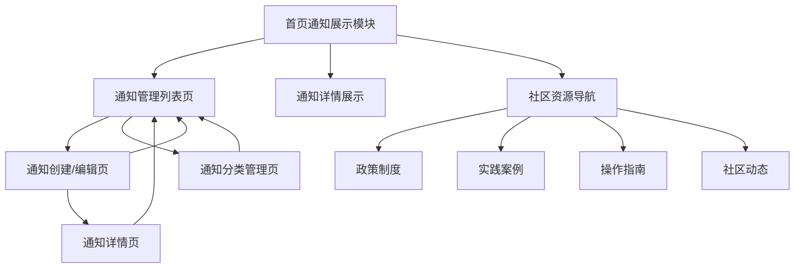

# 通知管理系统产品需求文档

## 1. 产品概述

数据社区平台通知管理系统是一个用于管理和发布社区通知内容的后台管理功能。系统支持管理员创建、编辑、分类和发布各类通知信息，为社区用户提供及时、准确的信息服务。

- 解决当前通知内容管理分散、更新不便的问题，为管理员提供统一的通知内容管理平台
- 主要服务于社区管理员、内容运营人员，帮助他们高效管理通知内容，提升用户体验
- 目标是建立完善的通知内容管理体系，提高信息传达效率，增强社区活跃度

## 2. 核心功能

### 2.1 用户角色

| 角色 | 注册方法 | 核心权限 |
|------|----------|----------|
| 管理员 | 系统内部分配 | 可创建、编辑、删除、发布所有类型通知 |
| 内容编辑 | 管理员邀请 | 可创建、编辑指定类型通知，需管理员审核发布 |
| 普通用户 | 无需注册 | 只能查看已发布的通知内容 |

### 2.2 功能模块

我们的通知管理系统包含以下主要页面：

1. **首页通知展示模块**：通知列表展示、新发布标记、快速管理入口
2. **通知管理列表页**：通知列表展示、搜索筛选、状态管理
3. **通知创建/编辑页**：通知内容编辑、文档上传、分类设置
4. **通知详情页**：通知内容预览、文档查看、操作记录
5. **通知分类管理页**：分类创建、编辑、排序管理

### 2.3 页面详情

| 页面名称 | 模块名称 | 功能描述 |
|----------|----------|----------|
| 首页通知展示模块 | 通知公告区域 | 展示最新发布的通知，支持分类筛选和时间排序 |
| 首页通知展示模块 | 新发布标记 | 对发布7天内的通知显示"NEW"标记，提醒用户关注 |
| 首页通知展示模块 | 管理入口 | 为管理员提供快速进入通知管理后台的入口按钮 |
| 首页通知展示模块 | 社区资源导航 | 更新为"政策制度、实践案例、操作指南、社区动态"四个分类 |
| 通知管理列表页 | 通知列表 | 展示所有通知，支持按类型、状态、时间筛选和搜索 |
| 通知管理列表页 | 操作工具栏 | 提供新建、批量删除、批量发布等操作功能 |
| 通知创建/编辑页 | 基本信息编辑 | 编辑通知标题、内容、发布时间、优先级等基本信息 |
| 通知创建/编辑页 | 分类选择 | 选择通知类型：社区动态、操作指南、实践案例、政策制度 |
| 通知创建/编辑页 | 文档上传 | 支持上传PDF、Word、图片等格式文档，预览功能 |
| 通知创建/编辑页 | 富文本编辑器 | 支持富文本编辑，插入图片、链接、表格等 |
| 通知详情页 | 内容预览 | 预览通知在前端的显示效果 |
| 通知详情页 | 文档管理 | 查看、下载、替换已上传的文档 |
| 通知详情页 | 操作日志 | 显示通知的创建、修改、发布等操作记录 |
| 通知分类管理页 | 分类列表 | 管理通知分类，支持增删改查和排序 |
| 通知分类管理页 | 分类设置 | 配置分类颜色、图标、显示顺序等属性 |

## 3. 核心流程

**管理员操作流程：**
管理员登录系统 → 首页点击通知管理入口或进入通知管理列表页 → 点击新建通知 → 填写通知基本信息 → 选择通知分类 → 编辑通知内容 → 上传相关文档 → 预览通知效果 → 保存并发布通知 → 通知在首页展示（7天内显示NEW标记）

**内容编辑操作流程：**
内容编辑登录系统 → 进入通知管理列表页 → 创建或编辑通知 → 提交审核 → 管理员审核 → 审核通过后发布

**用户查看流程：**
用户访问首页 → 查看通知公告区域（注意NEW标记） → 点击通知标题 → 查看通知详情 → 下载相关文档 → 通过社区资源导航访问不同分类内容

## 4. 用户界面设计

### 4.1 设计风格

- **主色调**：主色 #165dff（蓝色），辅助色 #722ed1（紫色）
- **按钮样式**：圆角按钮，支持渐变效果和悬停动画
- **字体**：系统默认字体，标题 16-24px，正文 14px，辅助文字 12px
- **布局风格**：卡片式布局，顶部导航 + 侧边栏，响应式设计
- **图标风格**：使用 Arco Design 图标库，线性风格，支持彩色状态图标

### 4.2 页面设计概览

| 页面名称 | 模块名称 | UI元素 |
|----------|----------|---------|
| 首页通知展示模块 | 通知公告区域 | 卡片式列表，标题、时间、分类标签，NEW标记（红色圆点+文字） |
| 首页通知展示模块 | 管理入口 | 管理员专用按钮，位于通知区域右上角，图标+文字样式 |
| 首页通知展示模块 | 社区资源导航 | 四个图标按钮，分别对应政策制度、实践案例、操作指南、社区动态 |
| 通知管理列表页 | 页面头部 | 面包屑导航、页面标题、新建按钮（主色调，圆角，悬停渐变效果） |
| 通知管理列表页 | 筛选区域 | 分类下拉选择、状态筛选、时间范围选择、搜索框（圆角边框） |
| 通知管理列表页 | 通知列表 | 表格布局，包含标题、类型标签、状态徽章、操作按钮 |
| 通知创建/编辑页 | 表单区域 | 卡片式表单，标签左对齐，输入框圆角设计，必填项红色星号 |
| 通知创建/编辑页 | 富文本编辑器 | 工具栏置顶，编辑区域白色背景，边框圆角 |
| 通知创建/编辑页 | 文档上传区 | 拖拽上传区域，虚线边框，支持文件预览缩略图 |
| 通知详情页 | 预览区域 | 模拟前端显示效果，白色卡片背景，阴影效果 |
| 通知分类管理页 | 分类列表 | 网格布局，每个分类卡片显示图标、名称、颜色 |

### 4.3 响应式设计

系统采用桌面优先设计，支持平板和移动端适配。在小屏幕设备上，侧边栏收缩为图标模式，表格转换为卡片列表，确保良好的触控交互体验。