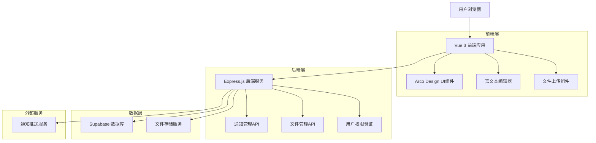
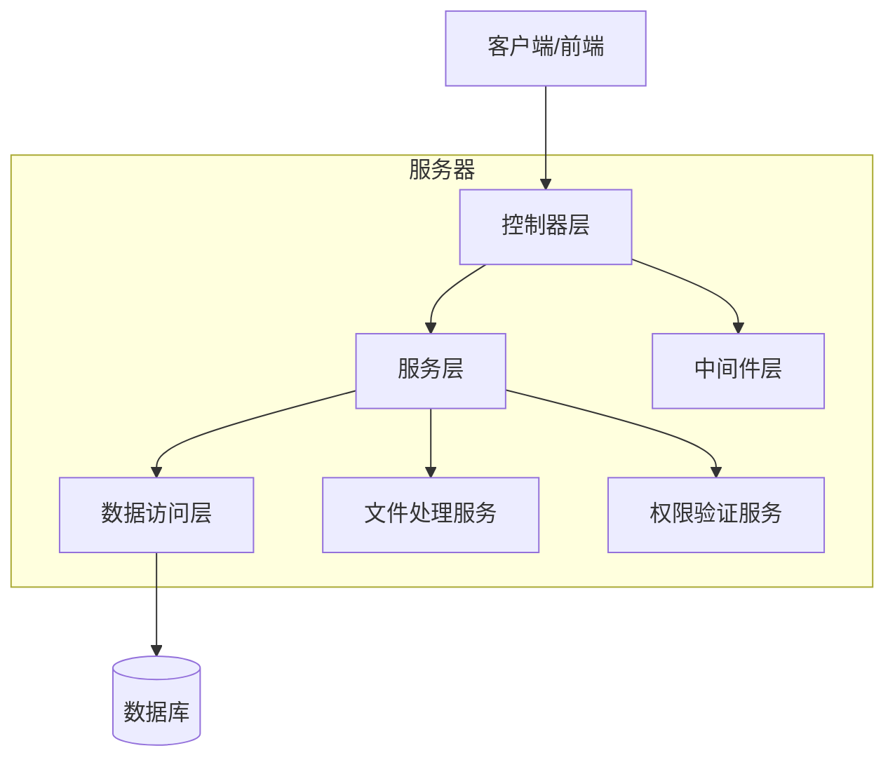
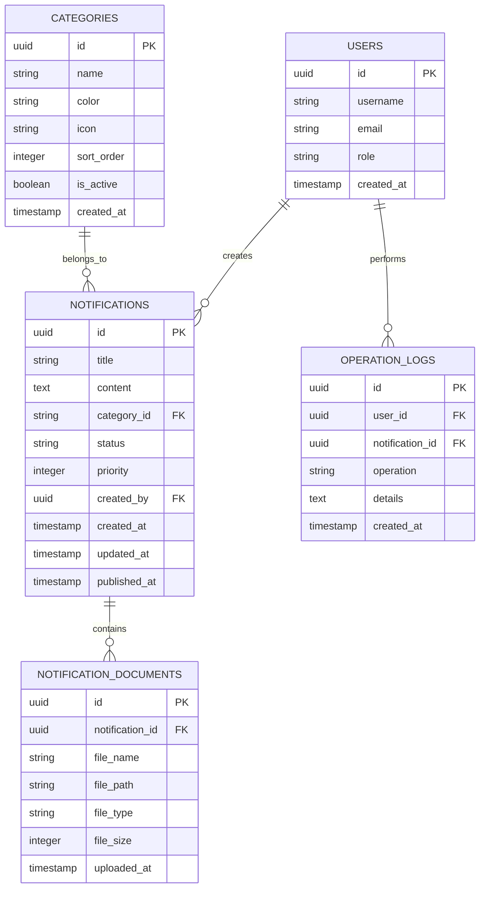

# 通知管理系统技术架构文档

## 1. 架构设计



## 2. 技术描述

- **前端**: Vue 3 + Composition API + Arco Design + Vite + TypeScript
- **后端**: Express.js + Node.js + JWT认证
- **数据库**: Supabase (PostgreSQL)
- **文件存储**: Supabase Storage
- **富文本编辑**: @wangeditor/editor
- **文件上传**: multer + 阿里云OSS

## 3. 路由定义

| 路由 | 用途 |
|------|------|
| /home | 首页，包含通知展示模块和管理入口 |
| /admin/notifications | 通知管理列表页，显示所有通知和管理操作 |
| /admin/notifications/create | 通知创建页，新建通知内容 |
| /admin/notifications/edit/:id | 通知编辑页，编辑指定通知 |
| /admin/notifications/detail/:id | 通知详情页，查看通知详情和操作日志 |
| /admin/notifications/categories | 通知分类管理页，管理通知分类 |
| /notifications/:id | 前端通知详情页，用户查看通知内容 |
| /community/:category | 社区资源分类页面，按类型展示内容 |

## 4. API定义

### 4.1 核心API

**通知管理相关**

```
GET /api/notifications
```

请求参数:
| 参数名称 | 参数类型 | 是否必需 | 描述 |
|----------|----------|----------|------|
| page | number | false | 页码，默认1 |
| pageSize | number | false | 每页数量，默认10 |
| category | string | false | 通知分类筛选 |
| status | string | false | 通知状态筛选 |
| keyword | string | false | 搜索关键词 |

响应数据:
| 参数名称 | 参数类型 | 描述 |
|----------|----------|------|
| success | boolean | 请求是否成功 |
| data | object | 通知列表数据 |
| total | number | 总数量 |

示例:
```json
{
  "success": true,
  "data": {
    "list": [
      {
        "id": "1",
        "title": "数据社区平台使用指南V2.0发布",
        "content": "详细内容...",
        "category": "使用指南",
        "status": "published",
        "createdAt": "2024-01-15T10:00:00Z",
        "documents": []
      }
    ],
    "total": 100
  }
}
```

```
POST /api/notifications
```

请求参数:
| 参数名称 | 参数类型 | 是否必需 | 描述 |
|----------|----------|----------|------|
| title | string | true | 通知标题 |
| content | string | true | 通知内容 |
| category | string | true | 通知分类 |
| priority | number | false | 优先级，默认0 |
| publishAt | string | false | 发布时间 |

```
PUT /api/notifications/:id
```

请求参数:
| 参数名称 | 参数类型 | 是否必需 | 描述 |
|----------|----------|----------|------|
| title | string | false | 通知标题 |
| content | string | false | 通知内容 |
| status | string | false | 通知状态 |

```
DELETE /api/notifications/:id
```

**文件上传相关**

```
POST /api/upload/documents
```

请求参数:
| 参数名称 | 参数类型 | 是否必需 | 描述 |
|----------|----------|----------|------|
| file | File | true | 上传的文件 |
| notificationId | string | false | 关联的通知ID |

响应数据:
| 参数名称 | 参数类型 | 描述 |
|----------|----------|------|
| success | boolean | 上传是否成功 |
| data | object | 文件信息 |

**分类管理相关**

```
GET /api/categories
```

```
POST /api/categories
```

```
PUT /api/categories/:id
```

```
DELETE /api/categories/:id
```

## 5. 服务器架构图



## 6. 数据模型

### 6.1 数据模型定义



### 6.2 数据定义语言

**通知表 (notifications)**
```sql
-- 创建通知表
CREATE TABLE notifications (
    id UUID PRIMARY KEY DEFAULT gen_random_uuid(),
    title VARCHAR(255) NOT NULL,
    content TEXT NOT NULL,
    category_id UUID REFERENCES categories(id),
    status VARCHAR(20) DEFAULT 'draft' CHECK (status IN ('draft', 'published', 'archived')),
    priority INTEGER DEFAULT 0,
    created_by UUID REFERENCES users(id),
    created_at TIMESTAMP WITH TIME ZONE DEFAULT NOW(),
    updated_at TIMESTAMP WITH TIME ZONE DEFAULT NOW(),
    published_at TIMESTAMP WITH TIME ZONE
);

-- 创建索引
CREATE INDEX idx_notifications_category ON notifications(category_id);
CREATE INDEX idx_notifications_status ON notifications(status);
CREATE INDEX idx_notifications_created_at ON notifications(created_at DESC);
CREATE INDEX idx_notifications_published_at ON notifications(published_at DESC);
```

**分类表 (categories)**
```sql
-- 创建分类表
CREATE TABLE categories (
    id UUID PRIMARY KEY DEFAULT gen_random_uuid(),
    name VARCHAR(100) NOT NULL UNIQUE,
    color VARCHAR(7) DEFAULT '#165dff',
    icon VARCHAR(50),
    sort_order INTEGER DEFAULT 0,
    is_active BOOLEAN DEFAULT true,
    created_at TIMESTAMP WITH TIME ZONE DEFAULT NOW()
);

-- 初始化分类数据
INSERT INTO categories (name, color, icon, sort_order) VALUES
('社区动态', '#722ed1', 'IconNotification', 1),
('操作指南', '#165dff', 'IconBook', 2),
('实践案例', '#00d084', 'IconFile', 3),
('政策制度', '#f53f3f', 'IconSafe', 4);
```

**通知文档表 (notification_documents)**
```sql
-- 创建通知文档表
CREATE TABLE notification_documents (
    id UUID PRIMARY KEY DEFAULT gen_random_uuid(),
    notification_id UUID REFERENCES notifications(id) ON DELETE CASCADE,
    file_name VARCHAR(255) NOT NULL,
    file_path VARCHAR(500) NOT NULL,
    file_type VARCHAR(50),
    file_size INTEGER,
    uploaded_at TIMESTAMP WITH TIME ZONE DEFAULT NOW()
);

-- 创建索引
CREATE INDEX idx_notification_documents_notification_id ON notification_documents(notification_id);
```

**操作日志表 (operation_logs)**
```sql
-- 创建操作日志表
CREATE TABLE operation_logs (
    id UUID PRIMARY KEY DEFAULT gen_random_uuid(),
    user_id UUID REFERENCES users(id),
    notification_id UUID REFERENCES notifications(id),
    operation VARCHAR(50) NOT NULL,
    details TEXT,
    created_at TIMESTAMP WITH TIME ZONE DEFAULT NOW()
);

-- 创建索引
CREATE INDEX idx_operation_logs_notification_id ON operation_logs(notification_id);
CREATE INDEX idx_operation_logs_created_at ON operation_logs(created_at DESC);
```

**权限设置**
```sql
-- 为匿名用户授予基本读取权限
GRANT SELECT ON notifications TO anon;
GRANT SELECT ON categories TO anon;

-- 为认证用户授予完整权限
GRANT ALL PRIVILEGES ON notifications TO authenticated;
GRANT ALL PRIVILEGES ON categories TO authenticated;
GRANT ALL PRIVILEGES ON notification_documents TO authenticated;
GRANT ALL PRIVILEGES ON operation_logs TO authenticated;
```