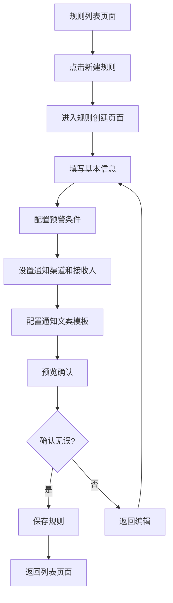
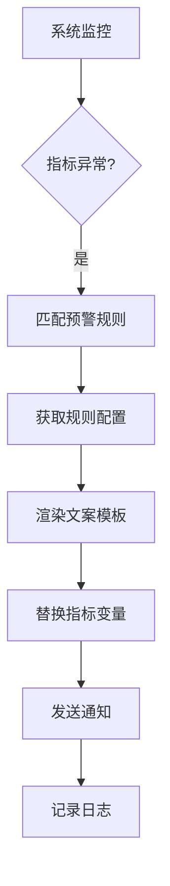

# 通知设置优化方案

## 1. 产品概述

优化现有的通知设置功能，将新建规则从弹窗改为独立页面，并增强通知文案的配置能力。通过引入指标绑定机制，使监控文案能够动态包含命中的指标信息，提升用户体验和通知的实用性。

## 2. 核心功能

### 2.1 用户角色

| 角色 | 注册方法 | 核心权限 |
|------|----------|----------|
| 管理员 | 系统内置 | 创建、编辑、删除所有通知规则 |
| 运营人员 | 管理员分配 | 创建、编辑自己负责的通知规则 |
| 观察员 | 管理员分配 | 仅查看通知规则和接收通知 |

### 2.2 功能模块

**通知规则管理：**
1. **规则列表页面**：展示所有通知规则，支持搜索、筛选、状态管理
2. **规则创建页面**：独立页面创建新规则，支持丰富的条件配置
3. **规则编辑页面**：独立页面编辑现有规则
4. **文案模板管理**：管理通知文案模板，支持变量绑定

**核心功能：**
- 规则类型配置（库存监控、过期监控、发放失败监控等）
- 条件设置（阈值、时间窗口、检查频率等）
- 通知渠道配置（企业微信、短信）
- 接收人管理
- 文案模板配置（支持指标变量绑定）

### 2.3 页面详情

| 页面名称 | 模块名称 | 功能描述 |
|----------|----------|----------|
| 规则列表页面 | 搜索筛选 | 按规则名称、类型、状态、创建时间筛选规则 |
| 规则列表页面 | 规则表格 | 展示规则名称、监控类型、预警条件、通知渠道、状态、操作 |
| 规则列表页面 | 状态切换 | 启用/禁用规则，实时生效 |
| 规则列表页面 | 批量操作 | 批量启用、禁用、删除规则 |
| 规则创建页面 | 基本信息 | 输入规则名称、选择监控类型 |
| 规则创建页面 | 条件配置 | 根据监控类型配置具体预警条件 |
| 规则创建页面 | 通知设置 | 选择通知渠道、配置接收人 |
| 规则创建页面 | 文案配置 | 配置通知文案模板，支持指标变量绑定 |
| 规则创建页面 | 预览确认 | 预览规则配置和文案效果 |
| 文案模板管理 | 模板列表 | 管理预设文案模板 |
| 文案模板管理 | 变量管理 | 管理可用的指标变量 |

## 3. 核心流程

### 3.1 创建通知规则流程



### 3.2 通知触发流程



## 4. 用户界面设计

### 4.1 设计规范

**颜色方案：**
- 主色调：#165dff（蓝色）
- 成功色：#00d084（绿色）
- 警告色：#ff7d00（橙色）
- 错误色：#f53f3f（红色）
- 中性色：#86909c（灰色）

**字体规范：**
- 标题：18px，font-weight: 600
- 正文：14px，font-weight: 400
- 辅助文字：12px，font-weight: 400

**布局风格：**
- 卡片式布局，间距16px
- 表单标签左对齐，输入框100%宽度
- 操作按钮右对齐

### 4.2 页面设计详情

**规则创建页面：**
- 页面标题：新建预警规则
- 步骤条：基本信息 → 条件配置 → 通知设置 → 文案配置 → 预览确认
- 左侧表单区域，右侧预览区域
- 文案编辑器支持变量插入（如：{{metricName}}、{{threshold}}、{{currentValue}}）

**文案模板配置：**
- 预设模板：库存预警模板、过期预警模板、失败率预警模板
- 自定义模板：支持用户创建个性化模板
- 变量提示：提供可用变量列表和说明

### 4.3 响应式设计

**桌面端（>768px）：**
- 左右分栏布局，左侧表单，右侧预览
- 完整展示所有功能和信息

**移动端（≤768px）：**
- 单列布局，上下结构
- 简化表单，隐藏非核心功能
- 适配触摸操作，按钮大小适中

## 5. 文案模板变量系统

### 5.1 可用变量

**通用变量：**
- `{{ruleName}}` - 规则名称
- `{{ruleType}}` - 监控类型
- `{{triggerTime}}` - 触发时间
- `{{checkInterval}}` - 检查频率

**指标相关变量：**
- `{{metricName}}` - 指标名称
- `{{threshold}}` - 设定阈值
- `{{currentValue}}` - 当前值
- `{{unit}}` - 单位（个、%、天等）
- `{{trend}}` - 趋势（上升、下降、持平）

**业务特定变量：**
- `{{couponName}}` - 券名称
- `{{inventoryName}}` - 库存名称
- `{{packageName}}` - 券包名称
- `{{failureRate}}` - 失败率
- `{{remainingDays}}` - 剩余天数

### 5.2 模板示例

**库存预警模板：**
```
【库存预警】{{inventoryName}}库存告急！
当前库存：{{currentValue}}{{unit}}
预警阈值：{{threshold}}{{unit}}
趋势：{{trend}}
请及时补充库存，避免影响业务。
触发时间：{{triggerTime}}
```

**过期预警模板：**
```
【过期提醒】{{couponName}}即将过期
剩余有效期：{{remainingDays}}天
预警设置：提前{{threshold}}天提醒
当前状态：{{currentValue}}张券将过期
请尽快处理，避免资源浪费。
```

**失败率预警模板：**
```
【失败率预警】{{packageName}}发放异常
当前失败率：{{failureRate}}%
预警阈值：{{threshold}}%
统计窗口：{{checkInterval}}
失败次数：{{currentValue}}
请检查系统状态并及时处理。
```

## 6. 技术实现要点

### 6.1 前端优化

1. **页面路由优化**
   - 新建规则：`/marketing/alert/rules/create`
   - 编辑规则：`/marketing/alert/rules/edit/:id`
   - 文案模板：`/marketing/alert/templates`

2. **组件拆分**
   - `RuleBasicInfo` - 基本信息配置
   - `RuleConditions` - 条件配置
   - `RuleNotifications` - 通知设置
   - `RuleContentTemplate` - 文案模板配置
   - `RulePreview` - 预览确认

3. **状态管理**
   - 使用Vuex管理规则配置状态
   - 支持草稿自动保存
   - 表单验证和错误提示

### 6.2 后端接口优化

1. **规则管理接口**
   - `GET /api/alert-rules` - 获取规则列表
   - `POST /api/alert-rules` - 创建规则
   - `PUT /api/alert-rules/:id` - 更新规则
   - `DELETE /api/alert-rules/:id` - 删除规则

2. **文案模板接口**
   - `GET /api/alert-templates` - 获取模板列表
   - `POST /api/alert-templates` - 创建模板
   - `PUT /api/alert-templates/:id` - 更新模板

3. **变量管理接口**
   - `GET /api/alert-variables` - 获取可用变量
   - `POST /api/alert-variables/validate` - 验证变量使用

### 6.3 文案渲染引擎

1. **变量解析**
   - 使用正则表达式解析模板变量
   - 支持嵌套对象属性访问
   - 提供默认值机制

2. **动态渲染**
   - 根据触发时的实际数据渲染文案
   - 支持条件判断和循环
   - 提供格式化函数（数字、日期、百分比等）

3. **性能优化**
   - 模板预编译缓存
   - 变量依赖分析
   - 增量更新机制

## 7. 用户体验优化

### 7.1 交互优化

1. **智能提示**
   - 输入时自动提示可用变量
   - 变量类型和格式验证
   - 实时预览渲染效果

2. **操作简化**
   - 一键应用预设模板
   - 拖拽调整变量位置
   - 批量编辑功能

3. **错误处理**
   - 友好的错误提示
   - 快速定位问题
   - 一键修复建议

### 7.2 可视化增强

1. **预览功能**
   - 实时预览文案效果
   - 模拟数据展示
   - 多设备适配预览

2. **模板推荐**
   - 根据监控类型推荐模板
   - 热门模板展示
   - 个性化推荐

## 8. 数据监控与分析

### 8.1 通知效果统计

1. **基础指标**
   - 通知发送成功率
   - 用户点击率
   - 规则触发频率

2. **深度分析**
   - 文案效果对比
   - 接收人响应情况
   - 业务影响评估

### 8.2 优化建议

1. **智能优化**
   - 基于历史数据优化阈值
   - 文案A/B测试
   - 发送时间优化

2. **预警机制**
   - 规则异常检测
   - 通知失败告警
   - 系统性能监控