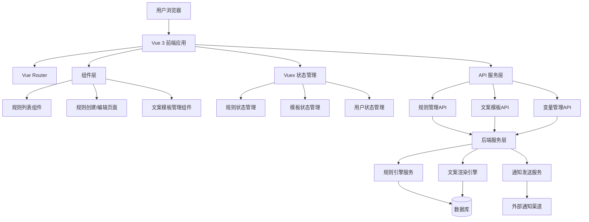

# 通知设置优化技术架构文档

## 1. 架构设计



## 2. 技术栈描述

- **前端框架**: Vue 3 (Composition API) + TypeScript
- **构建工具**: Vite
- **UI组件库**: Arco Design Vue
- **状态管理**: Vuex 4
- **路由管理**: Vue Router 4
- **图表引擎**: AntV X6 (用于规则关系图)
- **后端服务**: Node.js + Express (可选，用于复杂业务逻辑)
- **数据库**: PostgreSQL (通过 Supabase)
- **部署**: 支持 Docker 容器化部署

## 3. 路由定义

| 路由 | 用途 | 组件 |
|------|------|------|
| `/marketing/alert/rules` | 告警规则列表页面 | AlertRulesList.vue |
| `/marketing/alert/rules/create` | 创建新规则页面 | AlertRuleCreate.vue |
| `/marketing/alert/rules/edit/:id` | 编辑规则页面 | AlertRuleEdit.vue |
| `/marketing/alert/templates` | 文案模板管理页面 | ContentTemplateManager.vue |
| `/marketing/alert/templates/create` | 创建模板页面 | TemplateCreate.vue |
| `/marketing/alert/templates/edit/:id` | 编辑模板页面 | TemplateEdit.vue |

## 4. 组件架构

### 4.1 页面级组件

```
src/pages/marketing/alert/
├── rules/
│   ├── index.vue                 # 规则列表页面
│   ├── create.vue               # 规则创建页面
│   └── edit.vue                 # 规则编辑页面
├── templates/
│   ├── index.vue                # 模板管理页面
│   ├── create.vue               # 模板创建页面
│   └── edit.vue                 # 模板编辑页面
└── components/
    ├── RuleBasicInfo.vue        # 基本信息配置
    ├── RuleConditions.vue       # 条件配置组件
    ├── RuleNotifications.vue    # 通知设置组件
    ├── RuleContentTemplate.vue  # 文案模板配置
    ├── RulePreview.vue          # 规则预览组件
    ├── TemplateEditor.vue       # 模板编辑器
    ├── VariableSelector.vue     # 变量选择器
    └── ContentPreview.vue       # 文案预览组件
```

### 4.2 核心组件说明

**RuleContentTemplate.vue**
- 负责文案模板的配置和管理
- 支持变量插入和实时预览
- 提供模板推荐和变量提示功能

**VariableSelector.vue**
- 提供可用变量的选择和插入
- 支持变量分类和搜索
- 显示变量说明和使用示例

**ContentPreview.vue**
- 实时渲染文案模板效果
- 支持模拟数据填充
- 提供多设备预览功能

## 5. 状态管理设计

### 5.1 Vuex Store 结构

```typescript
// store/modules/alertRules.ts
interface AlertRulesState {
  rules: AlertRule[];
  templates: ContentTemplate[];
  variables: VariableDefinition[];
  currentRule: AlertRule | null;
  loading: boolean;
  error: string | null;
}

// store/modules/contentTemplates.ts
interface ContentTemplatesState {
  templates: ContentTemplate[];
  categories: TemplateCategory[];
  currentTemplate: ContentTemplate | null;
  variables: VariableDefinition[];
  previewData: PreviewData | null;
}
```

### 5.2 核心 Actions

```typescript
// 规则管理
actions: {
  async fetchRules(params: RuleQueryParams): Promise<void>;
  async createRule(rule: AlertRule): Promise<string>;
  async updateRule(id: string, rule: AlertRule): Promise<void>;
  async deleteRule(id: string): Promise<void>;
  async toggleRuleStatus(id: string, status: RuleStatus): Promise<void>;
}

// 模板管理
actions: {
  async fetchTemplates(params: TemplateQueryParams): Promise<void>;
  async createTemplate(template: ContentTemplate): Promise<string>;
  async updateTemplate(id: string, template: ContentTemplate): Promise<void>;
  async deleteTemplate(id: string): Promise<void>;
  async previewTemplate(template: string, data: PreviewData): Promise<string>;
}
```

## 6. API 接口设计

### 6.1 规则管理接口

```typescript
// 获取规则列表
GET /api/alert-rules
Response: {
  success: boolean;
  data: {
    list: AlertRule[];
    total: number;
    page: number;
    pageSize: number;
  };
}

// 创建规则
POST /api/alert-rules
Request: CreateRuleRequest
Response: {
  success: boolean;
  data: { id: string };
}

// 更新规则
PUT /api/alert-rules/:id
Request: UpdateRuleRequest
Response: {
  success: boolean;
  data: AlertRule;
}

// 删除规则
DELETE /api/alert-rules/:id
Response: {
  success: boolean;
  message: string;
}

// 切换规则状态
PUT /api/alert-rules/:id/status
Request: { status: 'active' | 'inactive' }
Response: {
  success: boolean;
  data: AlertRule;
}
```

### 6.2 文案模板接口

```typescript
// 获取模板列表
GET /api/content-templates
Response: {
  success: boolean;
  data: {
    list: ContentTemplate[];
    total: number;
  };
}

// 创建模板
POST /api/content-templates
Request: CreateTemplateRequest
Response: {
  success: boolean;
  data: { id: string };
}

// 预览模板
POST /api/content-templates/preview
Request: {
  template: string;
  variables: Record<string, any>;
  ruleType: string;
}
Response: {
  success: boolean;
  data: {
    renderedContent: string;
    usedVariables: string[];
    missingVariables: string[];
  };
}
```

### 6.3 变量管理接口

```typescript
// 获取可用变量
GET /api/variables
Query: { ruleType?: string; category?: string }
Response: {
  success: boolean;
  data: VariableDefinition[];
}

// 验证变量使用
POST /api/variables/validate
Request: {
  template: string;
  variables: VariableDefinition[];
}
Response: {
  success: boolean;
  data: {
    valid: boolean;
    errors: ValidationError[];
    warnings: ValidationWarning[];
  };
}
```

## 7. 文案渲染引擎设计

### 7.1 模板语法

```typescript
// 变量替换
{{variableName}} - 简单变量
{{object.property}} - 对象属性
{{array[0]}} - 数组元素

// 条件语句
{{#if condition}}
  条件为真时的内容
{{/if}}

{{#if score > 80}}
  优秀
{{else if score > 60}}
  及格
{{else}}
  不及格
{{/if}}

// 循环语句
{{#each items}}
  {{name}}: {{value}}
{{/each}}

// 格式化函数
{{formatNumber(amount, 'currency')}}
{{formatDate(date, 'YYYY-MM-DD')}}
{{formatPercent(rate, 2)}}
```

### 7.2 渲染引擎实现

```typescript
// utils/templateEngine.ts
class TemplateEngine {
  private variables: Record<string, any>;
  private helpers: Record<string, Function>;
  
  constructor(variables: Record<string, any>) {
    this.variables = variables;
    this.helpers = {
      formatNumber: this.formatNumber,
      formatDate: this.formatDate,
      formatPercent: this.formatPercent,
      // ... 其他辅助函数
    };
  }
  
  render(template: string): string {
    // 1. 解析模板语法
    // 2. 替换变量
    // 3. 执行条件判断
    // 4. 处理循环
    // 5. 应用格式化函数
    return renderedContent;
  }
  
  private parseTemplate(template: string): TemplateNode[] {
    // 解析模板为AST
  }
  
  private evaluateExpression(expression: string): any {
    // 安全地执行表达式
  }
}
```

### 7.3 变量定义规范

```typescript
interface VariableDefinition {
  name: string;
  type: 'string' | 'number' | 'boolean' | 'date' | 'object';
  category: string;
  description: string;
  example: any;
  required: boolean;
  format?: string;
  validation?: ValidationRule[];
}

// 示例变量定义
const metricVariables: VariableDefinition[] = [
  {
    name: 'metricName',
    type: 'string',
    category: 'metric',
    description: '指标名称',
    example: '库存量',
    required: true
  },
  {
    name: 'currentValue',
    type: 'number',
    category: 'metric',
    description: '当前值',
    example: 150,
    required: true,
    format: 'number'
  },
  {
    name: 'threshold',
    type: 'number',
    category: 'metric',
    description: '阈值',
    example: 200,
    required: true,
    format: 'number'
  },
  {
    name: 'unit',
    type: 'string',
    category: 'metric',
    description: '单位',
    example: '个',
    required: false
  }
];
```

## 8. 数据模型设计

### 8.1 规则数据模型

```typescript
interface AlertRule {
  id: string;
  name: string;
  type: RuleType;
  description?: string;
  conditions: RuleConditions;
  notificationConfig: NotificationConfig;
  status: 'active' | 'inactive';
  createdAt: string;
  updatedAt: string;
  createdBy: string;
  tags?: string[];
}

interface RuleConditions {
  type: string;
  threshold?: number;
  thresholdType?: 'absolute' | 'percentage';
  timeWindow?: string;
  checkInterval?: string;
  consecutiveCount?: number;
  // ... 其他条件配置
}

interface NotificationConfig {
  channels: NotificationChannel[];
  templates: Record<string, string>; // channel -> template
  recipients: NotificationRecipients;
}

interface NotificationChannel {
  type: 'wechat' | 'sms' | 'email';
  enabled: boolean;
  config: ChannelConfig;
}
```

### 8.2 模板数据模型

```typescript
interface ContentTemplate {
  id: string;
  name: string;
  category: string;
  content: string;
  variables: string[];
  description?: string;
  examples?: TemplateExample[];
  usageCount: number;
  createdAt: string;
  updatedAt: string;
  createdBy: string;
  tags?: string[];
  isPublic: boolean;
}

interface TemplateExample {
  name: string;
  data: Record<string, any>;
  expectedOutput: string;
}
```

## 9. 性能优化策略

### 9.1 前端优化

1. **组件懒加载**
   ```typescript
   const AlertRuleCreate = () => import('@/pages/marketing/alert/rules/create.vue');
   const ContentTemplateManager = () => import('@/pages/marketing/alert/templates/index.vue');
   ```

2. **虚拟滚动**
   - 规则列表使用虚拟滚动
   - 模板选择器支持虚拟滚动

3. **防抖和节流**
   - 搜索输入防抖（300ms）
   - 实时预览节流（500ms）

### 9.2 后端优化

1. **缓存策略**
   - 模板内容缓存（Redis，TTL: 1小时）
   - 变量定义缓存（内存缓存）
   - 规则配置缓存（本地缓存）

2. **数据库优化**
   - 规则表索引优化
   - 模板查询优化
   - 分页查询优化

3. **异步处理**
   - 模板渲染异步化
   - 大量数据批量处理
   - 通知发送队列化

## 10. 安全考虑

### 10.1 输入验证

1. **模板内容验证**
   - XSS攻击防护
   - SQL注入防护
   - 代码注入防护

2. **变量使用验证**
   - 变量白名单机制
   - 敏感信息过滤
   - 执行环境隔离

### 10.2 权限控制

1. **功能权限**
   - 规则管理权限
   - 模板管理权限
   - 系统配置权限

2. **数据权限**
   - 规则数据隔离
   - 模板数据隔离
   - 操作日志隔离

## 11. 监控与日志

### 11.1 性能监控

1. **前端性能**
   - 页面加载时间
   - 接口响应时间
   - 用户交互响应时间

2. **后端性能**
   - API响应时间
   - 数据库查询性能
   - 模板渲染性能

### 11.2 业务监控

1. **规则使用情况**
   - 规则创建/更新频率
   - 模板使用统计
   - 通知发送成功率

2. **错误监控**
   - 模板渲染错误
   - 变量解析错误
   - 接口调用错误

## 12. 部署方案

### 12.1 环境配置

```bash
# 开发环境
npm run dev

# 测试环境
npm run build:test
npm run preview

# 生产环境
npm run build
npm run preview
```

### 12.2 Docker 部署

```dockerfile
# Dockerfile
FROM node:18-alpine
WORKDIR /app
COPY package*.json ./
RUN npm ci --only=production
COPY . .
RUN npm run build
EXPOSE 3000
CMD ["npm", "run", "preview"]
```

### 12.3 环境变量

```bash
# 基础配置
VITE_API_BASE_URL=https://api.example.com
VITE_APP_TITLE=通知管理系统

# 功能开关
VITE_ENABLE_TEMPLATE_PREVIEW=true
VITE_ENABLE_BATCH_OPERATIONS=true
VITE_ENABLE_REAL_TIME_PREVIEW=true

# 性能配置
VITE_PREVIEW_DEBOUNCE_TIME=500
VITE_SEARCH_DEBOUNCE_TIME=300
VITE_MAX_TEMPLATE_SIZE=10240
```