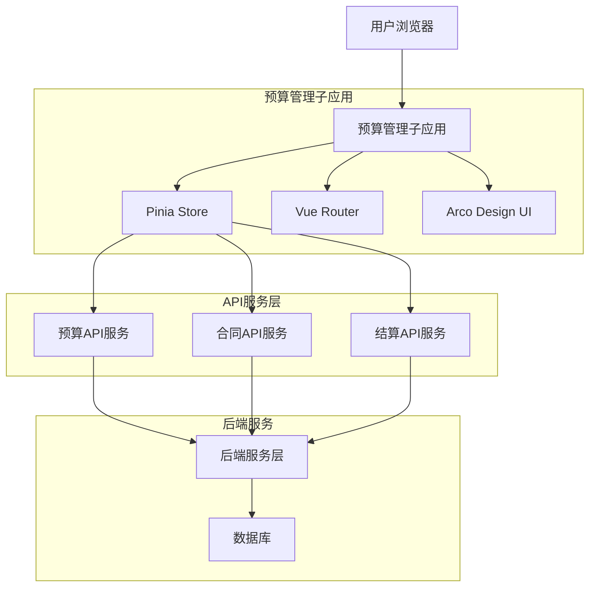
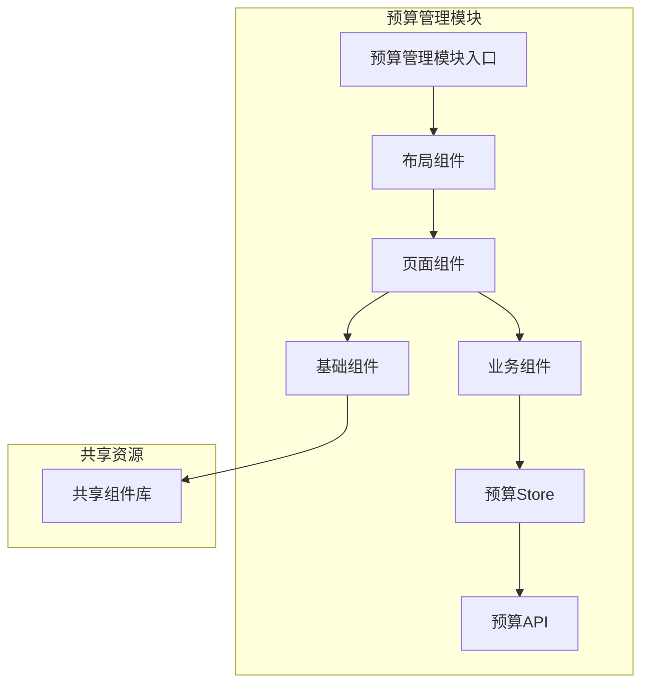
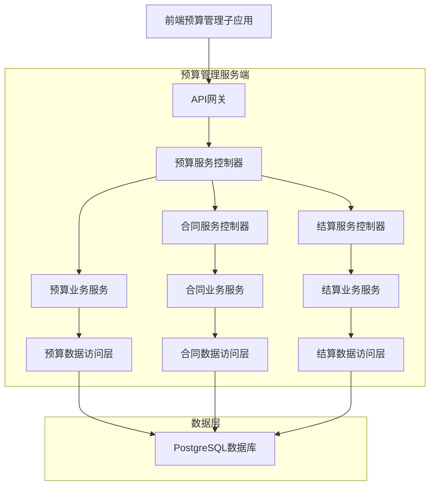
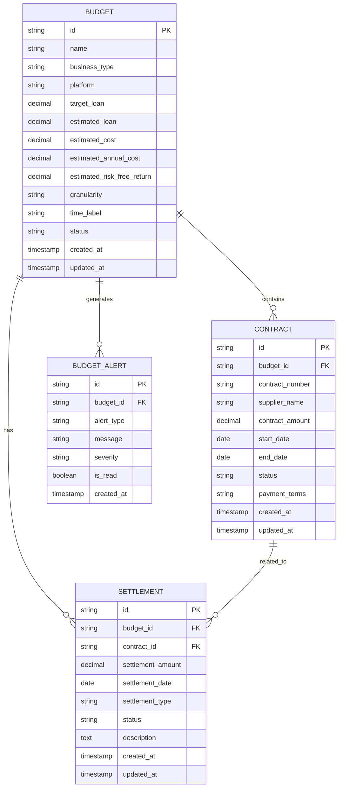

# 预算管理子应用技术架构文档

## 1. 架构设计

### 1.1 整体架构



### 1.2 模块架构



## 2. 技术描述

**前端技术栈：**
- 框架：Vue 3.3+ (Composition API)
- 构建工具：Vite 4.0+
- 状态管理：Pinia 2.1+
- 路由管理：Vue Router 4.2+
- UI组件：Arco Design Vue 2.5+
- 图表库：Chart.js / ECharts
- HTTP客户端：Axios 1.4+
- 类型系统：TypeScript 5.0+

**初始化工具：**
- vite-init (Vue 3 + TypeScript + Vite模板)

**后端服务：**
- 通过API接口与现有后端服务通信
- 使用统一的API网关进行请求转发

## 3. 路由定义

### 3.1 主路由配置

| 路由路径 | 页面组件 | 功能描述 |
|---------|----------|----------|
| /budget/overview | BudgetOverview.vue | 预算总览页面，显示预算概览和关键指标 |
| /budget/list | BudgetList.vue | 预算列表页面，显示所有预算项目 |
| /budget/create | BudgetCreate.vue | 新建预算页面，创建新的预算项目 |
| /budget/edit/:id | BudgetEdit.vue | 编辑预算页面，修改现有预算信息 |
| /budget/detail/:id | BudgetDetail.vue | 预算详情页面，显示预算详细信息 |
| /budget/monitor | BudgetMonitor.vue | 预算监控页面，实时监控预算执行情况 |
| /budget/contracts | ContractManagement.vue | 合同管理页面，管理相关合同信息 |
| /budget/contracts/:id | ContractDetail.vue | 合同详情页面，显示合同详细信息 |
| /budget/settlement | SettlementManagement.vue | 结算管理页面，处理预算结算相关事务 |

### 3.2 路由配置代码

```typescript
// modules/budget/router/index.ts
import { createRouter, createWebHistory, RouteRecordRaw } from 'vue-router'

const routes: RouteRecordRaw[] = [
  {
    path: '/budget',
    component: () => import('../layouts/BudgetLayout.vue'),
    children: [
      {
        path: '',
        redirect: '/budget/overview'
      },
      {
        path: 'overview',
        name: 'BudgetOverview',
        component: () => import('../pages/BudgetOverview.vue'),
        meta: { title: '预算总览', requiresAuth: true }
      },
      {
        path: 'list',
        name: 'BudgetList',
        component: () => import('../pages/BudgetList.vue'),
        meta: { title: '预算列表', requiresAuth: true }
      },
      {
        path: 'create',
        name: 'BudgetCreate',
        component: () => import('../pages/BudgetCreate.vue'),
        meta: { title: '新建预算', requiresAuth: true }
      },
      {
        path: 'edit/:id',
        name: 'BudgetEdit',
        component: () => import('../pages/BudgetEdit.vue'),
        meta: { title: '编辑预算', requiresAuth: true },
        props: true
      },
      {
        path: 'detail/:id',
        name: 'BudgetDetail',
        component: () => import('../pages/BudgetDetail.vue'),
        meta: { title: '预算详情', requiresAuth: true },
        props: true
      },
      {
        path: 'monitor',
        name: 'BudgetMonitor',
        component: () => import('../pages/BudgetMonitor.vue'),
        meta: { title: '预算监控', requiresAuth: true }
      },
      {
        path: 'contracts',
        name: 'ContractManagement',
        component: () => import('../pages/ContractManagement.vue'),
        meta: { title: '合同管理', requiresAuth: true }
      },
      {
        path: 'contracts/:id',
        name: 'ContractDetail',
        component: () => import('../pages/ContractDetail.vue'),
        meta: { title: '合同详情', requiresAuth: true },
        props: true
      },
      {
        path: 'settlement',
        name: 'SettlementManagement',
        component: () => import('../pages/SettlementManagement.vue'),
        meta: { title: '结算管理', requiresAuth: true }
      }
    ]
  }
]

export const budgetRouter = createRouter({
  history: createWebHistory(),
  routes
})
```

## 4. API定义

### 4.1 预算管理API

#### 预算基础API

```typescript
// modules/budget/api/budget.ts

// 预算数据类型定义
export interface Budget {
  id: string
  name: string
  businessType: string
  platform: string
  targetLoan: number
  estimatedLoan: number
  estimatedCost: number
  estimatedAnnualCost: number
  estimatedRiskFreeReturn: number
  granularity: 'year' | 'quarter' | 'month'
  timeLabel: string
  status: 'draft' | 'active' | 'completed' | 'cancelled'
  createdAt: string
  updatedAt: string
}

export interface BudgetListParams {
  page?: number
  pageSize?: number
  businessType?: string
  platform?: string
  status?: string
  startDate?: string
  endDate?: string
}

export interface BudgetCreateData {
  name: string
  businessType: string
  platform: string
  targetLoan: number
  estimatedLoan: number
  estimatedCost: number
  estimatedAnnualCost: number
  estimatedRiskFreeReturn: number
  granularity: 'year' | 'quarter' | 'month'
  timeLabel: string
}

// API接口定义
export const budgetApi = {
  // 获取预算列表
  getBudgets: (params: BudgetListParams) => 
    http.get<ApiResponse<Budget[]>>('/api/budgets', { params }),
  
  // 获取预算详情
  getBudget: (id: string) => 
    http.get<ApiResponse<Budget>>(`/api/budgets/${id}`),
  
  // 创建预算
  createBudget: (data: BudgetCreateData) => 
    http.post<ApiResponse<Budget>>('/api/budgets', data),
  
  // 更新预算
  updateBudget: (id: string, data: Partial<BudgetCreateData>) => 
    http.put<ApiResponse<Budget>>(`/api/budgets/${id}`, data),
  
  // 删除预算
  deleteBudget: (id: string) => 
    http.delete<ApiResponse<void>>(`/api/budgets/${id}`),
  
  // 获取预算统计
  getBudgetStats: () => 
    http.get<ApiResponse<BudgetStats>>('/api/budgets/stats'),
  
  // 导出预算数据
  exportBudgets: (params: BudgetListParams) => 
    http.get('/api/budgets/export', { params, responseType: 'blob' })
}
```

#### 预算监控API

```typescript
// modules/budget/api/monitor.ts

export interface BudgetMonitorData {
  budgetId: string
  currentUsage: number
  usagePercentage: number
  remainingAmount: number
  alertThreshold: number
  warningLevel: 'normal' | 'warning' | 'critical'
  lastUpdated: string
}

export interface BudgetAlert {
  id: string
  budgetId: string
  alertType: 'threshold' | 'anomaly' | 'deadline'
  message: string
  severity: 'info' | 'warning' | 'critical'
  createdAt: string
  isRead: boolean
}

export const monitorApi = {
  // 获取预算监控数据
  getMonitorData: (budgetId: string) => 
    http.get<ApiResponse<BudgetMonitorData>>(`/api/budgets/${budgetId}/monitor`),
  
  // 获取预算预警
  getBudgetAlerts: (budgetId?: string) => 
    http.get<ApiResponse<BudgetAlert[]>>('/api/budgets/alerts', { params: { budgetId } }),
  
  // 标记预警为已读
  markAlertAsRead: (alertId: string) => 
    http.put<ApiResponse<void>>(`/api/budgets/alerts/${alertId}/read`),
  
  // 获取预算执行趋势
  getBudgetTrend: (budgetId: string, period: 'week' | 'month' | 'quarter' | 'year') => 
    http.get<ApiResponse<BudgetTrendData>>(`/api/budgets/${budgetId}/trend`, { params: { period } })
}
```

#### 合同管理API

```typescript
// modules/budget/api/contract.ts

export interface Contract {
  id: string
  budgetId: string
  contractNumber: string
  supplierName: string
  contractAmount: number
  startDate: string
  endDate: string
  status: 'draft' | 'active' | 'completed' | 'terminated'
  paymentTerms: string
  createdAt: string
  updatedAt: string
}

export interface ContractCreateData {
  budgetId: string
  contractNumber: string
  supplierName: string
  contractAmount: number
  startDate: string
  endDate: string
  paymentTerms: string
}

export const contractApi = {
  // 获取合同列表
  getContracts: (budgetId?: string) => 
    http.get<ApiResponse<Contract[]>>('/api/contracts', { params: { budgetId } }),
  
  // 获取合同详情
  getContract: (id: string) => 
    http.get<ApiResponse<Contract>>(`/api/contracts/${id}`),
  
  // 创建合同
  createContract: (data: ContractCreateData) => 
    http.post<ApiResponse<Contract>>('/api/contracts', data),
  
  // 更新合同
  updateContract: (id: string, data: Partial<ContractCreateData>) => 
    http.put<ApiResponse<Contract>>(`/api/contracts/${id}`, data),
  
  // 终止合同
  terminateContract: (id: string, reason: string) => 
    http.put<ApiResponse<void>>(`/api/contracts/${id}/terminate`, { reason })
}
```

#### 结算管理API

```typescript
// modules/budget/api/settlement.ts

export interface Settlement {
  id: string
  budgetId: string
  contractId: string
  settlementAmount: number
  settlementDate: string
  settlementType: 'advance' | 'progress' | 'final'
  status: 'pending' | 'approved' | 'rejected' | 'paid'
  attachments: string[]
  description: string
  createdAt: string
  updatedAt: string
}

export interface SettlementCreateData {
  budgetId: string
  contractId: string
  settlementAmount: number
  settlementDate: string
  settlementType: 'advance' | 'progress' | 'final'
  description: string
  attachments?: string[]
}

export const settlementApi = {
  // 获取结算列表
  getSettlements: (params: { budgetId?: string; contractId?: string; status?: string }) => 
    http.get<ApiResponse<Settlement[]>>('/api/settlements', { params }),
  
  // 获取结算详情
  getSettlement: (id: string) => 
    http.get<ApiResponse<Settlement>>(`/api/settlements/${id}`),
  
  // 创建结算申请
  createSettlement: (data: SettlementCreateData) => 
    http.post<ApiResponse<Settlement>>('/api/settlements', data),
  
  // 更新结算
  updateSettlement: (id: string, data: Partial<SettlementCreateData>) => 
    http.put<ApiResponse<Settlement>>(`/api/settlements/${id}`, data),
  
  // 审批结算
  approveSettlement: (id: string, approved: boolean, comment?: string) => 
    http.put<ApiResponse<void>>(`/api/settlements/${id}/approve`, { approved, comment }),
  
  // 上传结算附件
  uploadSettlementAttachment: (id: string, file: File) => {
    const formData = new FormData()
    formData.append('file', file)
    return http.post<ApiResponse<string>>(`/api/settlements/${id}/attachments`, formData)
  }
}
```

## 5. 服务器架构

### 5.1 服务端分层架构



### 5.2 服务端技术栈

**后端技术：**
- 框架：Node.js + Express.js / Nest.js
- 数据库：PostgreSQL 14+
- 缓存：Redis 7+
- 消息队列：RabbitMQ / Apache Kafka
- 文件存储：MinIO / AWS S3

**服务端API示例：**
```typescript
// 预算服务控制器
@Controller('api/budgets')
export class BudgetController {
  constructor(private readonly budgetService: BudgetService) {}
  
  @Get()
  async getBudgets(@Query() params: BudgetListParams) {
    return this.budgetService.findAll(params)
  }
  
  @Get(':id')
  async getBudget(@Param('id') id: string) {
    return this.budgetService.findOne(id)
  }
  
  @Post()
  async createBudget(@Body() createData: BudgetCreateData) {
    return this.budgetService.create(createData)
  }
  
  @Put(':id')
  async updateBudget(@Param('id') id: string, @Body() updateData: Partial<BudgetCreateData>) {
    return this.budgetService.update(id, updateData)
  }
  
  @Delete(':id')
  async deleteBudget(@Param('id') id: string) {
    return this.budgetService.remove(id)
  }
}
```

## 6. 数据模型

### 6.1 数据库实体关系图



### 6.2 数据定义语言

#### 预算表
```sql
-- 预算表
CREATE TABLE budgets (
    id UUID PRIMARY KEY DEFAULT gen_random_uuid(),
    name VARCHAR(255) NOT NULL,
    business_type VARCHAR(100) NOT NULL,
    platform VARCHAR(100) NOT NULL,
    target_loan DECIMAL(15,2) NOT NULL DEFAULT 0,
    estimated_loan DECIMAL(15,2) NOT NULL DEFAULT 0,
    estimated_cost DECIMAL(15,2) NOT NULL DEFAULT 0,
    estimated_annual_cost DECIMAL(15,2) NOT NULL DEFAULT 0,
    estimated_risk_free_return DECIMAL(15,2) NOT NULL DEFAULT 0,
    granularity VARCHAR(20) CHECK (granularity IN ('year', 'quarter', 'month')),
    time_label VARCHAR(50),
    status VARCHAR(50) DEFAULT 'draft' CHECK (status IN ('draft', 'active', 'completed', 'cancelled')),
    created_at TIMESTAMP WITH TIME ZONE DEFAULT NOW(),
    updated_at TIMESTAMP WITH TIME ZONE DEFAULT NOW(),
    created_by UUID,
    updated_by UUID
);

-- 索引
CREATE INDEX idx_budgets_business_type ON budgets(business_type);
CREATE INDEX idx_budgets_platform ON budgets(platform);
CREATE INDEX idx_budgets_status ON budgets(status);
CREATE INDEX idx_budgets_created_at ON budgets(created_at DESC);
```

#### 合同表
```sql
-- 合同表
CREATE TABLE contracts (
    id UUID PRIMARY KEY DEFAULT gen_random_uuid(),
    budget_id UUID NOT NULL REFERENCES budgets(id) ON DELETE CASCADE,
    contract_number VARCHAR(100) UNIQUE NOT NULL,
    supplier_name VARCHAR(255) NOT NULL,
    contract_amount DECIMAL(15,2) NOT NULL DEFAULT 0,
    start_date DATE NOT NULL,
    end_date DATE NOT NULL,
    status VARCHAR(50) DEFAULT 'draft' CHECK (status IN ('draft', 'active', 'completed', 'terminated')),
    payment_terms TEXT,
    created_at TIMESTAMP WITH TIME ZONE DEFAULT NOW(),
    updated_at TIMESTAMP WITH TIME ZONE DEFAULT NOW(),
    created_by UUID,
    updated_by UUID
);

-- 索引
CREATE INDEX idx_contracts_budget_id ON contracts(budget_id);
CREATE INDEX idx_contracts_supplier_name ON contracts(supplier_name);
CREATE INDEX idx_contracts_status ON contracts(status);
CREATE INDEX idx_contracts_start_date ON contracts(start_date);
CREATE INDEX idx_contracts_end_date ON contracts(end_date);
```

#### 结算表
```sql
-- 结算表
CREATE TABLE settlements (
    id UUID PRIMARY KEY DEFAULT gen_random_uuid(),
    budget_id UUID NOT NULL REFERENCES budgets(id) ON DELETE CASCADE,
    contract_id UUID REFERENCES contracts(id) ON DELETE SET NULL,
    settlement_amount DECIMAL(15,2) NOT NULL DEFAULT 0,
    settlement_date DATE NOT NULL,
    settlement_type VARCHAR(50) CHECK (settlement_type IN ('advance', 'progress', 'final')),
    status VARCHAR(50) DEFAULT 'pending' CHECK (status IN ('pending', 'approved', 'rejected', 'paid')),
    description TEXT,
    attachments JSONB,
    created_at TIMESTAMP WITH TIME ZONE DEFAULT NOW(),
    updated_at TIMESTAMP WITH TIME ZONE DEFAULT NOW(),
    created_by UUID,
    updated_by UUID
);

-- 索引
CREATE INDEX idx_settlements_budget_id ON settlements(budget_id);
CREATE INDEX idx_settlements_contract_id ON settlements(contract_id);
CREATE INDEX idx_settlements_status ON settlements(status);
CREATE INDEX idx_settlements_settlement_date ON settlements(settlement_date);
```

#### 预算预警表
```sql
-- 预算预警表
CREATE TABLE budget_alerts (
    id UUID PRIMARY KEY DEFAULT gen_random_uuid(),
    budget_id UUID NOT NULL REFERENCES budgets(id) ON DELETE CASCADE,
    alert_type VARCHAR(50) CHECK (alert_type IN ('threshold', 'anomaly', 'deadline')),
    message TEXT NOT NULL,
    severity VARCHAR(20) CHECK (severity IN ('info', 'warning', 'critical')),
    is_read BOOLEAN DEFAULT FALSE,
    created_at TIMESTAMP WITH TIME ZONE DEFAULT NOW(),
    read_at TIMESTAMP WITH TIME ZONE
);

-- 索引
CREATE INDEX idx_budget_alerts_budget_id ON budget_alerts(budget_id);
CREATE INDEX idx_budget_alerts_severity ON budget_alerts(severity);
CREATE INDEX idx_budget_alerts_is_read ON budget_alerts(is_read);
CREATE INDEX idx_budget_alerts_created_at ON budget_alerts(created_at DESC);
```

## 7. 组件架构

### 7.1 页面组件结构

```
modules/budget/components/
├── layout/
│   ├── BudgetLayout.vue          # 预算管理布局
│   └── BudgetSidebar.vue         # 预算侧边导航
├── pages/
│   ├── BudgetOverview.vue        # 预算总览页面
│   ├── BudgetList.vue           # 预算列表页面
│   ├── BudgetCreate.vue         # 预算创建页面
│   ├── BudgetEdit.vue           # 预算编辑页面
│   ├── BudgetDetail.vue         # 预算详情页面
│   ├── BudgetMonitor.vue        # 预算监控页面
│   ├── ContractManagement.vue   # 合同管理页面
│   └── SettlementManagement.vue # 结算管理页面
├── business/
│   ├── BudgetCard.vue           # 预算卡片组件
│   ├── BudgetForm.vue          # 预算表单组件
│   ├── BudgetStats.vue         # 预算统计组件
│   ├── BudgetFilter.vue        # 预算筛选组件
│   ├── ContractCard.vue        # 合同卡片组件
│   ├── ContractForm.vue        # 合同表单组件
│   ├── SettlementCard.vue      # 结算卡片组件
│   └── SettlementForm.vue      # 结算表单组件
├── charts/
│   ├── BudgetTrendChart.vue     # 预算趋势图表
│   ├── BudgetUsageChart.vue     # 预算使用图表
│   └── BudgetComparisonChart.vue # 预算对比图表
└── common/
    ├── BudgetStatusBadge.vue     # 预算状态标签
    ├── ContractStatusBadge.vue   # 合同状态标签
    └── SettlementStatusBadge.vue # 结算状态标签
```

### 7.2 核心组件示例

#### BudgetLayout.vue
```vue
<template>
  <div class="budget-layout">
    <BudgetSidebar />
    <div class="budget-content">
      <router-view />
    </div>
  </div>
</template>

<script setup lang="ts">
import BudgetSidebar from './BudgetSidebar.vue'
</script>

<style scoped>
.budget-layout {
  display: flex;
  height: 100vh;
}

.budget-content {
  flex: 1;
  padding: 20px;
  overflow-y: auto;
}
</style>
```

#### BudgetOverview.vue
```vue
<template>
  <div class="budget-overview">
    <a-page-header title="预算总览" />
    
    <!-- 统计卡片 -->
    <a-row :gutter="16" class="stats-row">
      <a-col :span="6">
        <BudgetStatCard
          title="总预算"
          :value="stats.totalBudget"
          unit="元"
          trend="up"
        />
      </a-col>
      <a-col :span="6">
        <BudgetStatCard
          title="已使用"
          :value="stats.usedBudget"
          unit="元"
          :percentage="stats.usagePercentage"
        />
      </a-col>
      <a-col :span="6">
        <BudgetStatCard
          title="剩余预算"
          :value="stats.remainingBudget"
          unit="元"
        />
      </a-col>
      <a-col :span="6">
        <BudgetStatCard
          title="预算健康度"
          :value="stats.healthScore"
          unit="分"
          type="score"
        />
      </a-col>
    </a-row>
    
    <!-- 图表区域 -->
    <a-row :gutter="16" class="chart-row">
      <a-col :span="12">
        <BudgetTrendChart :data="trendData" />
      </a-col>
      <a-col :span="12">
        <BudgetUsageChart :data="usageData" />
      </a-col>
    </a-row>
    
    <!-- 最近预算 -->
    <a-card title="最近预算" class="recent-budgets">
      <BudgetListTable :data="recentBudgets" :loading="loading" />
    </a-card>
  </div>
</template>

<script setup lang="ts">
import { ref, onMounted } from 'vue'
import { useBudgetStore } from '../stores/budget'
import BudgetStatCard from '../components/business/BudgetStatCard.vue'
import BudgetTrendChart from '../components/charts/BudgetTrendChart.vue'
import BudgetUsageChart from '../components/charts/BudgetUsageChart.vue'
import BudgetListTable from '../components/business/BudgetListTable.vue'

const budgetStore = useBudgetStore()

const stats = ref({
  totalBudget: 0,
  usedBudget: 0,
  remainingBudget: 0,
  usagePercentage: 0,
  healthScore: 0
})

const trendData = ref([])
const usageData = ref([])
const recentBudgets = ref([])
const loading = ref(false)

onMounted(async () => {
  loading.value = true
  try {
    await Promise.all([
      loadStats(),
      loadTrendData(),
      loadUsageData(),
      loadRecentBudgets()
    ])
  } finally {
    loading.value = false
  }
})

async function loadStats() {
  const response = await budgetStore.getBudgetStats()
  stats.value = response.data
}

async function loadTrendData() {
  const response = await budgetStore.getBudgetTrend('month')
  trendData.value = response.data
}

async function loadUsageData() {
  const response = await budgetStore.getBudgetUsage()
  usageData.value = response.data
}

async function loadRecentBudgets() {
  const response = await budgetStore.getRecentBudgets(10)
  recentBudgets.value = response.data
}
</script>

<style scoped>
.stats-row {
  margin-bottom: 24px;
}

.chart-row {
  margin-bottom: 24px;
}

.recent-budgets {
  margin-top: 24px;
}
</style>
```

## 8. 状态管理

### 8.1 Budget Store

```typescript
// modules/budget/stores/budget.ts
import { defineStore } from 'pinia'
import { ref, computed } from 'vue'
import type { Budget, BudgetListParams, BudgetCreateData } from '../api/budget'
import { budgetApi } from '../api/budget'

export const useBudgetStore = defineStore('budget', () => {
  // 状态
  const budgets = ref<Budget[]>([])
  const currentBudget = ref<Budget | null>(null)
  const loading = ref(false)
  const error = ref<string | null>(null)
  const pagination = ref({
    page: 1,
    pageSize: 10,
    total: 0
  })

  // 计算属性
  const totalBudget = computed(() => 
    budgets.value.reduce((sum, budget) => sum + budget.estimatedAnnualCost, 0)
  )
  
  const activeBudgets = computed(() => 
    budgets.value.filter(budget => budget.status === 'active')
  )
  
  const budgetStats = computed(() => {
    const total = budgets.value.length
    const active = activeBudgets.value.length
    const completed = budgets.value.filter(b => b.status === 'completed').length
    const cancelled = budgets.value.filter(b => b.status === 'cancelled').length
    
    return { total, active, completed, cancelled }
  })

  // 方法
  const fetchBudgets = async (params?: BudgetListParams) => {
    loading.value = true
    error.value = null
    
    try {
      const response = await budgetApi.getBudgets(params || {})
      budgets.value = response.data.data
      pagination.value = {
        page: response.data.page,
        pageSize: response.data.pageSize,
        total: response.data.total
      }
    } catch (err) {
      error.value = err instanceof Error ? err.message : '获取预算列表失败'
      throw err
    } finally {
      loading.value = false
    }
  }

  const fetchBudget = async (id: string) => {
    loading.value = true
    error.value = null
    
    try {
      const response = await budgetApi.getBudget(id)
      currentBudget.value = response.data.data
      return response.data.data
    } catch (err) {
      error.value = err instanceof Error ? err.message : '获取预算详情失败'
      throw err
    } finally {
      loading.value = false
    }
  }

  const createBudget = async (data: BudgetCreateData) => {
    loading.value = true
    error.value = null
    
    try {
      const response = await budgetApi.createBudget(data)
      budgets.value.unshift(response.data.data)
      pagination.value.total++
      return response.data.data
    } catch (err) {
      error.value = err instanceof Error ? err.message : '创建预算失败'
      throw err
    } finally {
      loading.value = false
    }
  }

  const updateBudget = async (id: string, data: Partial<BudgetCreateData>) => {
    loading.value = true
    error.value = null
    
    try {
      const response = await budgetApi.updateBudget(id, data)
      const index = budgets.value.findIndex(b => b.id === id)
      if (index !== -1) {
        budgets.value[index] = response.data.data
      }
      if (currentBudget.value?.id === id) {
        currentBudget.value = response.data.data
      }
      return response.data.data
    } catch (err) {
      error.value = err instanceof Error ? err.message : '更新预算失败'
      throw err
    } finally {
      loading.value = false
    }
  }

  const deleteBudget = async (id: string) => {
    loading.value = true
    error.value = null
    
    try {
      await budgetApi.deleteBudget(id)
      budgets.value = budgets.value.filter(b => b.id !== id)
      pagination.value.total--
      if (currentBudget.value?.id === id) {
        currentBudget.value = null
      }
    } catch (err) {
      error.value = err instanceof Error ? err.message : '删除预算失败'
      throw err
    } finally {
      loading.value = false
    }
  }

  const setCurrentBudget = (budget: Budget | null) => {
    currentBudget.value = budget
  }

  const clearError = () => {
    error.value = null
  }

  return {
    // 状态
    budgets: readonly(budgets),
    currentBudget: readonly(currentBudget),
    loading: readonly(loading),
    error: readonly(error),
    pagination: readonly(pagination),
    
    // 计算属性
    totalBudget,
    activeBudgets,
    budgetStats,
    
    // 方法
    fetchBudgets,
    fetchBudget,
    createBudget,
    updateBudget,
    deleteBudget,
    setCurrentBudget,
    clearError
  }
})
```

### 8.2 Monitor Store

```typescript
// modules/budget/stores/monitor.ts
import { defineStore } from 'pinia'
import { ref, computed } from 'vue'
import type { BudgetMonitorData, BudgetAlert, BudgetTrendData } from '../api/monitor'
import { monitorApi } from '../api/monitor'

export const useMonitorStore = defineStore('budgetMonitor', () => {
  // 状态
  const monitorData = ref<Map<string, BudgetMonitorData>>(new Map())
  const alerts = ref<BudgetAlert[]>([])
  const trendData = ref<Map<string, BudgetTrendData>>(new Map())
  const loading = ref(false)
  const error = ref<string | null>(null)

  // 计算属性
  const unreadAlerts = computed(() => 
    alerts.value.filter(alert => !alert.isRead)
  )
  
  const criticalAlerts = computed(() => 
    alerts.value.filter(alert => alert.severity === 'critical')
  )
  
  const warningAlerts = computed(() => 
    alerts.value.filter(alert => alert.severity === 'warning')
  )

  // 方法
  const fetchMonitorData = async (budgetId: string) => {
    loading.value = true
    error.value = null
    
    try {
      const response = await monitorApi.getMonitorData(budgetId)
      monitorData.value.set(budgetId, response.data.data)
      return response.data.data
    } catch (err) {
      error.value = err instanceof Error ? err.message : '获取监控数据失败'
      throw err
    } finally {
      loading.value = false
    }
  }

  const fetchAlerts = async (budgetId?: string) => {
    loading.value = true
    error.value = null
    
    try {
      const response = await monitorApi.getBudgetAlerts(budgetId)
      alerts.value = response.data.data
    } catch (err) {
      error.value = err instanceof Error ? err.message : '获取预警列表失败'
      throw err
    } finally {
      loading.value = false
    }
  }

  const markAlertAsRead = async (alertId: string) => {
    try {
      await monitorApi.markAlertAsRead(alertId)
      const alert = alerts.value.find(a => a.id === alertId)
      if (alert) {
        alert.isRead = true
      }
    } catch (err) {
      error.value = err instanceof Error ? err.message : '标记预警已读失败'
      throw err
    }
  }

  const fetchTrendData = async (budgetId: string, period: 'week' | 'month' | 'quarter' | 'year') => {
    loading.value = true
    error.value = null
    
    try {
      const response = await monitorApi.getBudgetTrend(budgetId, period)
      trendData.value.set(`${budgetId}-${period}`, response.data.data)
      return response.data.data
    } catch (err) {
      error.value = err instanceof Error ? err.message : '获取趋势数据失败'
      throw err
    } finally {
      loading.value = false
    }
  }

  const clearAlerts = () => {
    alerts.value = []
  }

  const clearError = () => {
    error.value = null
  }

  return {
    // 状态
    monitorData: readonly(monitorData),
    alerts: readonly(alerts),
    trendData: readonly(trendData),
    loading: readonly(loading),
    error: readonly(error),
    
    // 计算属性
    unreadAlerts,
    criticalAlerts,
    warningAlerts,
    
    // 方法
    fetchMonitorData,
    fetchAlerts,
    markAlertAsRead,
    fetchTrendData,
    clearAlerts,
    clearError
  }
})
```

## 9. 部署配置

### 9.1 Vite配置

```typescript
// modules/budget/vite.config.ts
import { defineConfig } from 'vite'
import vue from '@vitejs/plugin-vue'
import vueJsx from '@vitejs/plugin-vue-jsx'
import { resolve } from 'path'

export default defineConfig({
  plugins: [vue(), vueJsx()],
  
  resolve: {
    alias: {
      '@': resolve(__dirname, 'src'),
      '@shared': resolve(__dirname, '../../shared'),
      '@core': resolve(__dirname, '../../core')
    }
  },
  
  server: {
    port: 3001,
    proxy: {
      '/api': {
        target: 'http://localhost:8080',
        changeOrigin: true,
        rewrite: (path) => path.replace(/^\/api/, '/api/budget')
      }
    }
  },
  
  build: {
    lib: {
      entry: resolve(__dirname, 'src/main.ts'),
      name: 'BudgetModule',
      fileName: 'budget-module',
      formats: ['es', 'umd']
    },
    rollupOptions: {
      external: ['vue', 'vue-router', 'pinia', '@arco-design/web-vue'],
      output: {
        globals: {
          vue: 'Vue',
          'vue-router': 'VueRouter',
          pinia: 'Pinia',
          '@arco-design/web-vue': 'ArcoDesignVue'
        }
      }
    }
  }
})
```

### 9.2 环境配置

```typescript
// modules/budget/config/env.ts
export interface EnvConfig {
  apiBaseUrl: string
  timeout: number
  retryCount: number
  enableMock: boolean
  mockDelay: number
}

const env = import.meta.env

export const config: EnvConfig = {
  apiBaseUrl: env.VITE_API_BASE_URL || '/api',
  timeout: Number(env.VITE_API_TIMEOUT) || 30000,
  retryCount: Number(env.VITE_API_RETRY_COUNT) || 3,
  enableMock: env.VITE_ENABLE_MOCK === 'true',
  mockDelay: Number(env.VITE_MOCK_DELAY) || 500
}
```

### 9.3 构建脚本

```json
// modules/budget/package.json
{
  "name": "@app/budget-module",
  "version": "1.0.0",
  "type": "module",
  "scripts": {
    "dev": "vite",
    "build": "vue-tsc && vite build",
    "build:watch": "vite build --watch",
    "preview": "vite preview",
    "test": "vitest",
    "test:ui": "vitest --ui",
    "lint": "eslint . --ext .vue,.js,.jsx,.cjs,.mjs,.ts,.tsx,.cts,.mts",
    "lint:fix": "eslint . --ext .vue,.js,.jsx,.cjs,.mjs,.ts,.tsx,.cts,.mts --fix"
  },
  "dependencies": {
    "vue": "^3.3.0",
    "vue-router": "^4.2.0",
    "pinia": "^2.1.0",
    "@arco-design/web-vue": "^2.52.0",
    "axios": "^1.4.0",
    "chart.js": "^4.3.0",
    "vue-chartjs": "^5.2.0"
  },
  "devDependencies": {
    "@vitejs/plugin-vue": "^4.2.0",
    "@vitejs/plugin-vue-jsx": "^3.0.0",
    "vite": "^4.4.0",
    "typescript": "^5.0.0",
    "vue-tsc": "^1.8.0",
    "vitest": "^0.34.0",
    "@vue/test-utils": "^2.4.0"
  }
}
```

这个技术架构文档详细描述了预算管理子应用的技术实现方案，包括架构设计、路由配置、API接口、数据模型、组件结构和部署配置等各个方面。整个架构遵循模块化、可维护、可扩展的原则，确保系统的稳定性和可维护性。