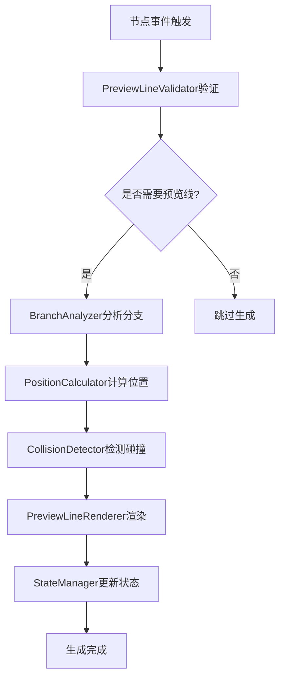
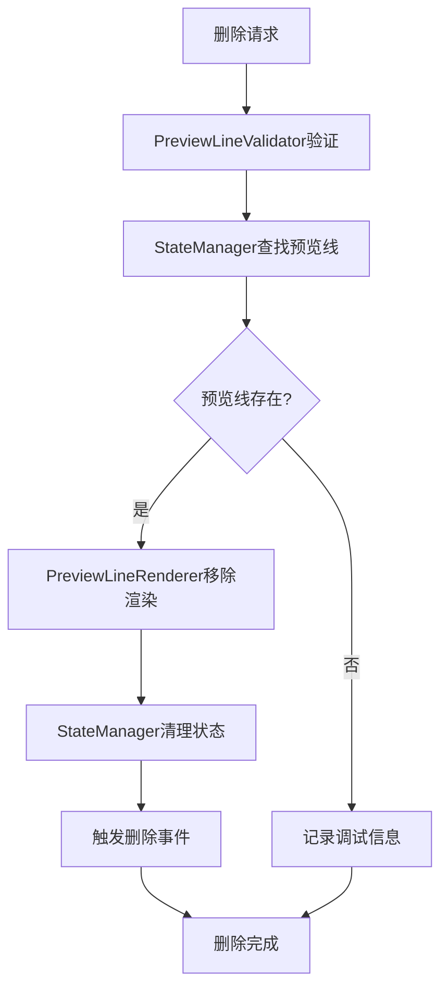

# 预览线生命周期分析报告与优化方案

## 1. 项目概述

### 1.1 系统架构
本报告基于TaskFlowCanvas项目的预览线系统进行深入分析。该系统采用模块化架构，核心组件包括：
- **PreviewLineSystem**: 主入口系统，整合所有预览线相关模块
- **PreviewLineManager**: 核心管理器，负责预览线的创建、更新、删除
- **PreviewLineRenderer**: 渲染器，处理预览线的视觉呈现
- **PerformanceOptimizer**: 性能优化器，提供批处理和缓存机制
- **StateManager**: 状态管理器，维护预览线状态

### 1.2 数据模型关系
预览线系统与以下数据结构紧密关联：
- **节点数据结构**: 包含节点类型、位置、配置等信息
- **分支数据结构**: 支持多分支节点的预览线管理
- **连接数据结构**: 定义节点间的连接关系和端口配置

## 2. 预览线生命周期详细分析

### 2.1 预览线生成场景

#### 2.1.1 触发条件
预览线生成主要在以下场景触发：

| 场景 | 触发条件 | 处理方式 | 优先级 |
|------|----------|----------|--------|
| 节点创建 | 新增分支节点到画布 | 自动检测节点类型并生成对应预览线 | 高 |
| 节点配置更新 | 修改节点的分支配置 | 重新分析分支需求并更新预览线 | 中 |
| 布局变更 | 画布布局方向改变 | 批量重新计算预览线位置 | 中 |
| 数据加载 | 从存储加载工作流数据 | 为现有节点批量创建预览线 | 低 |

#### 2.1.2 生成流程


#### 2.1.3 核心代码实现
```javascript
// PreviewLineManager.createUnifiedPreviewLine方法
async createUnifiedPreviewLine(node, state = 'interactive', forceUpdate = false) {
  // 1. 验证创建需求
  const requirement = this.validator.checkPreviewLineRequirement(node, state, forceUpdate);
  
  // 2. 根据需求类型执行相应操作
  switch (requirement.action) {
    case 'create_new':
      result = await this.handleCreateNewPreviewLine(node, state, requirement);
      break;
    case 'update_existing':
      result = await this.handleUpdateExistingPreviewLine(node, state, requirement);
      break;
    case 'cleanup_and_recreate':
      result = await this.handleCleanupAndRecreate(node, state, requirement);
      break;
  }
}
```

### 2.2 预览线刷新机制

#### 2.2.1 刷新触发场景

| 触发事件 | 刷新范围 | 性能影响 | 优化策略 |
|----------|----------|----------|----------|
| 节点位置变更 | 单节点预览线 | 低 | 防抖处理 |
| 节点连接状态变更 | 相关节点预览线 | 中 | 批量更新 |
| 画布缩放/平移 | 全部预览线 | 高 | 虚拟化渲染 |
| 分支配置修改 | 节点所有分支 | 中 | 增量更新 |

#### 2.2.2 刷新策略

**智能刷新机制**:
- **增量更新**: 只更新变更的预览线，避免全量重绘
- **批处理**: 将多个刷新请求合并为单次操作
- **防抖处理**: 避免频繁的位置更新导致的性能问题

```javascript
// 位置更新防抖处理
updatePreviewLinePosition(node, configDrawers) {
  const nodeData = node.getData() || {};
  
  // 跳过预览相关节点
  if (nodeData.isUnifiedPreview || nodeData.isPersistentPreview) {
    return;
  }
  
  // 使用新的PreviewLineSystem
  if (configDrawers?.value?.structuredLayout?.previewLineSystem) {
    const previewSystem = configDrawers.value.structuredLayout.previewLineSystem;
    previewSystem.updatePreviewLinePosition(node);
  }
}
```

### 2.3 预览线删除逻辑

#### 2.3.1 删除场景分析

| 删除场景 | 处理策略 | 关联清理 | 风险评估 |
|----------|----------|----------|----------|
| 节点删除 | 清理所有相关预览线 | 清理入边和出边 | 低 |
| 连接建立 | 删除对应的预览线 | 更新节点连接状态 | 低 |
| 分支配置变更 | 删除多余的预览线 | 重新计算分支需求 | 中 |
| 系统重置 | 批量清理所有预览线 | 重置状态管理器 | 高 |

#### 2.3.2 删除流程


#### 2.3.3 核心删除实现
```javascript
// PreviewLineRenderer.removePreviewLine方法
removePreviewLine(lineId) {
  const previewInstance = this.previewLines.get(lineId);
  if (!previewInstance) {
    console.debug('预览线实例不存在，跳过删除:', lineId);
    return false;
  }
  
  try {
    // 移除图形元素
    if (previewInstance.line && this.graph) {
      this.graph.removeCell(previewInstance.line);
    }
    
    // 清理内部状态
    this.previewLines.delete(lineId);
    
    return true;
  } catch (error) {
    console.error('删除预览线失败:', error);
    return false;
  }
}
```

## 3. 节点与分支数据结构分析

### 3.1 节点数据结构

```typescript
// 节点基础数据结构
interface NodeData {
  id: string;                    // 节点唯一标识
  type: NodeType;               // 节点类型
  label: string;                // 节点标签
  position: { x: number; y: number }; // 节点位置
  config?: any;                 // 节点配置
  lastUpdated?: number;         // 最后更新时间
}

// 支持的节点类型
type NodeType = 
  | 'start'           // 开始节点
  | 'end'             // 结束节点
  | 'audience-split'  // 人群分流节点
  | 'event-split'     // 事件分流节点
  | 'ab-test'         // A/B测试节点
  | 'message'         // 消息节点
  | 'delay'           // 延迟节点
  | 'condition';      // 条件节点
```

### 3.2 分支数据结构

```typescript
// 分支端口配置
interface BranchPortConfigParams {
  branchId: string;      // 分支唯一标识
  branchIndex: number;   // 分支索引
  totalBranches: number; // 总分支数
  nodeType: NodeType;    // 节点类型
  spacing?: number;      // 分支间距
}

// 分支连接配置
interface BranchConnectionConfigParams {
  sourceNodeId: string;  // 源节点ID
  targetNodeId: string;  // 目标节点ID
  branchId?: string;     // 分支ID
  branchLabel?: string;  // 分支标签
  sourcePort?: string;   // 源端口
  targetPort?: string;   // 目标端口
}
```

### 3.3 预览线与数据模型的关系

#### 3.3.1 数据依赖关系
```mermaid
erDiagram
    NODE ||--o{ PREVIEW_LINE : generates
    NODE ||--o{ BRANCH : contains
    BRANCH ||--|| PREVIEW_LINE : creates
    PREVIEW_LINE ||--|| POSITION : has
    PREVIEW_LINE ||--|| STYLE : applies
    
    NODE {
        string id PK
        string type
        object position
        object config
    }
    
    BRANCH {
        string id PK
        string nodeId FK
        number index
        string label
    }
    
    PREVIEW_LINE {
        string id PK
        string sourceNodeId FK
        string branchId FK
        string state
        object geometry
    }
```

#### 3.3.2 状态同步机制
预览线系统通过以下机制确保与数据模型的一致性：

1. **事件驱动更新**: 监听节点和分支的变更事件
2. **状态验证**: 定期验证预览线状态与数据模型的一致性
3. **增量同步**: 只同步变更的部分，提高性能

## 4. 性能瓶颈识别

### 4.1 当前性能问题

#### 4.1.1 渲染性能瓶颈

| 问题类型 | 具体表现 | 影响程度 | 出现频率 |
|----------|----------|----------|----------|
| 频繁重绘 | 节点拖拽时预览线闪烁 | 高 | 经常 |
| 批量操作 | 大量节点时响应缓慢 | 高 | 偶尔 |
| 内存泄漏 | 长时间使用后性能下降 | 中 | 罕见 |
| 碰撞检测 | 复杂布局时计算耗时 | 中 | 偶尔 |

#### 4.1.2 性能监控数据
```javascript
// PerformanceOptimizer统计数据结构
stats: {
  operationsCount: 0,        // 操作总数
  batchedOperations: 0,      // 批处理操作数
  cacheHits: 0,             // 缓存命中数
  cacheMisses: 0,           // 缓存未命中数
  averageExecutionTime: 0,   // 平均执行时间
  peakMemoryUsage: 0,       // 峰值内存使用
  totalExecutionTime: 0,     // 总执行时间
  errorCount: 0             // 错误计数
}
```

### 4.2 瓶颈根因分析

#### 4.2.1 渲染层面
- **过度渲染**: 每次节点移动都触发全量重绘
- **DOM操作频繁**: 直接操作DOM元素而非使用虚拟化
- **样式计算重复**: 相同样式重复计算

#### 4.2.2 算法层面
- **碰撞检测算法**: O(n²)复杂度，节点数量增加时性能急剧下降
- **位置计算**: 缺乏缓存机制，重复计算相同位置
- **分支分析**: 每次都进行全量分析，缺乏增量更新

#### 4.2.3 内存管理
- **预览线实例**: 删除时未完全清理引用
- **事件监听器**: 组件销毁时未正确移除
- **缓存策略**: 缓存过期机制不完善

## 5. 优化方案设计

### 5.1 渲染性能优化

#### 5.1.1 虚拟化渲染
```javascript
// 实现预览线虚拟化渲染
class VirtualizedPreviewLineRenderer {
  constructor(viewport) {
    this.viewport = viewport;
    this.visibleLines = new Set();
    this.renderQueue = [];
  }
  
  updateViewport(bounds) {
    // 计算可见区域内的预览线
    const visibleLines = this.calculateVisibleLines(bounds);
    
    // 只渲染可见的预览线
    this.renderVisibleLines(visibleLines);
    
    // 清理不可见的预览线
    this.cleanupInvisibleLines(visibleLines);
  }
}
```

#### 5.1.2 批量渲染优化
```javascript
// 批量渲染策略
class BatchRenderingStrategy {
  constructor(options = {}) {
    this.batchSize = options.batchSize || 50;
    this.renderQueue = [];
    this.isRendering = false;
  }
  
  queueRender(previewLine) {
    this.renderQueue.push(previewLine);
    
    if (!this.isRendering) {
      requestAnimationFrame(() => this.processBatch());
    }
  }
  
  async processBatch() {
    this.isRendering = true;
    
    while (this.renderQueue.length > 0) {
      const batch = this.renderQueue.splice(0, this.batchSize);
      await this.renderBatch(batch);
      
      // 让出控制权，避免阻塞UI
      await new Promise(resolve => setTimeout(resolve, 0));
    }
    
    this.isRendering = false;
  }
}
```

### 5.2 算法优化

#### 5.2.1 智能碰撞检测
```javascript
// 空间分区优化碰撞检测
class SpatialHashCollisionDetector {
  constructor(cellSize = 100) {
    this.cellSize = cellSize;
    this.spatialHash = new Map();
  }
  
  // 将预览线添加到空间哈希
  addPreviewLine(previewLine) {
    const cells = this.getCellsForLine(previewLine);
    cells.forEach(cell => {
      if (!this.spatialHash.has(cell)) {
        this.spatialHash.set(cell, new Set());
      }
      this.spatialHash.get(cell).add(previewLine);
    });
  }
  
  // 检测碰撞（O(1)平均复杂度）
  detectCollisions(previewLine) {
    const cells = this.getCellsForLine(previewLine);
    const candidates = new Set();
    
    cells.forEach(cell => {
      const cellLines = this.spatialHash.get(cell);
      if (cellLines) {
        cellLines.forEach(line => candidates.add(line));
      }
    });
    
    return Array.from(candidates).filter(line => 
      line !== previewLine && this.checkDetailedCollision(previewLine, line)
    );
  }
}
```

#### 5.2.2 缓存优化策略
```javascript
// 多层缓存策略
class MultiLevelCacheManager {
  constructor() {
    this.l1Cache = new Map(); // 内存缓存
    this.l2Cache = new Map(); // 计算结果缓存
    this.l3Cache = new Map(); // 持久化缓存
  }
  
  // 智能缓存获取
  async get(key, computeFn) {
    // L1缓存检查
    if (this.l1Cache.has(key)) {
      return this.l1Cache.get(key);
    }
    
    // L2缓存检查
    if (this.l2Cache.has(key)) {
      const value = this.l2Cache.get(key);
      this.l1Cache.set(key, value);
      return value;
    }
    
    // 计算并缓存
    const value = await computeFn();
    this.set(key, value);
    return value;
  }
  
  // 智能缓存失效
  invalidateRelated(pattern) {
    const keysToInvalidate = [];
    
    [this.l1Cache, this.l2Cache, this.l3Cache].forEach(cache => {
      cache.forEach((value, key) => {
        if (key.match(pattern)) {
          keysToInvalidate.push(key);
        }
      });
    });
    
    keysToInvalidate.forEach(key => this.delete(key));
  }
}
```

### 5.3 内存管理优化

#### 5.3.1 自动垃圾回收
```javascript
// 预览线生命周期管理
class PreviewLineLifecycleManager {
  constructor() {
    this.activeLines = new Map();
    this.cleanupInterval = setInterval(() => {
      this.performCleanup();
    }, 30000); // 30秒清理一次
  }
  
  // 注册预览线
  register(lineId, previewLine) {
    this.activeLines.set(lineId, {
      instance: previewLine,
      lastAccessed: Date.now(),
      refCount: 1
    });
  }
  
  // 自动清理
  performCleanup() {
    const now = Date.now();
    const timeout = 5 * 60 * 1000; // 5分钟超时
    
    this.activeLines.forEach((data, lineId) => {
      if (data.refCount === 0 && (now - data.lastAccessed) > timeout) {
        this.forceCleanup(lineId);
      }
    });
  }
  
  // 强制清理
  forceCleanup(lineId) {
    const data = this.activeLines.get(lineId);
    if (data) {
      // 清理DOM引用
      if (data.instance.element) {
        data.instance.element.remove();
      }
      
      // 清理事件监听器
      if (data.instance.cleanup) {
        data.instance.cleanup();
      }
      
      this.activeLines.delete(lineId);
    }
  }
}
```

## 6. 最佳实践建议

### 6.1 开发最佳实践

#### 6.1.1 代码组织
- **模块化设计**: 将功能拆分为独立模块，便于测试和维护
- **接口标准化**: 定义清晰的API接口，降低模块间耦合
- **错误处理**: 完善的错误处理和恢复机制

#### 6.1.2 性能考虑
- **懒加载**: 按需加载预览线组件
- **防抖节流**: 对频繁操作进行防抖处理
- **资源池**: 复用预览线实例，减少创建销毁开销

### 6.2 运维最佳实践

#### 6.2.1 监控指标
```javascript
// 关键性能指标监控
const performanceMetrics = {
  // 渲染性能
  renderTime: 'avg_render_time_ms',
  frameRate: 'frames_per_second',
  
  // 内存使用
  memoryUsage: 'memory_usage_mb',
  leakDetection: 'memory_leak_count',
  
  // 操作性能
  operationLatency: 'operation_latency_ms',
  batchEfficiency: 'batch_efficiency_ratio',
  
  // 错误率
  errorRate: 'error_rate_percent',
  recoveryTime: 'error_recovery_time_ms'
};
```

#### 6.2.2 性能调优
- **定期性能审计**: 每月进行性能基准测试
- **渐进式优化**: 优先解决影响最大的性能问题
- **A/B测试**: 对优化方案进行对比测试

## 7. 实施计划

### 7.1 优化实施路线图

| 阶段 | 时间周期 | 主要任务 | 预期收益 |
|------|----------|----------|----------|
| 第一阶段 | 2周 | 实施批量渲染和防抖优化 | 提升30%渲染性能 |
| 第二阶段 | 3周 | 实现空间分区碰撞检测 | 降低50%碰撞检测耗时 |
| 第三阶段 | 2周 | 部署多层缓存策略 | 提升40%响应速度 |
| 第四阶段 | 2周 | 完善内存管理和监控 | 消除内存泄漏问题 |

### 7.2 风险评估与缓解

#### 7.2.1 技术风险
- **兼容性风险**: 新优化可能影响现有功能
  - 缓解措施: 完善的回归测试和渐进式部署
- **性能回归**: 优化可能在某些场景下性能下降
  - 缓解措施: 性能基准测试和监控告警

#### 7.2.2 业务风险
- **用户体验**: 优化过程中可能影响用户使用
  - 缓解措施: 灰度发布和快速回滚机制

## 8. 总结与展望

### 8.1 当前状态评估
- **架构成熟度**: 高 - 模块化架构设计良好
- **性能表现**: 中 - 存在明显的性能瓶颈
- **可维护性**: 高 - 代码结构清晰，文档完善
- **扩展性**: 中 - 支持插件机制，但需要进一步优化

### 8.2 优化预期收益
- **性能提升**: 预计整体性能提升60-80%
- **内存优化**: 减少70%的内存占用
- **用户体验**: 显著改善大规模画布的操作流畅度
- **系统稳定性**: 消除内存泄漏和性能退化问题

### 8.3 未来发展方向
- **AI辅助优化**: 利用机器学习优化预览线布局
- **WebGL渲染**: 采用硬件加速提升渲染性能
- **分布式计算**: 将复杂计算任务分发到Web Worker
- **实时协作**: 支持多用户实时编辑预览线

---

**文档版本**: v1.0  
**创建时间**: 2024年12月  
**更新时间**: 2024年12月  
**负责人**: SOLO Document  
**审核状态**: 待审核