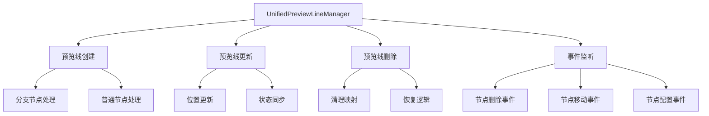
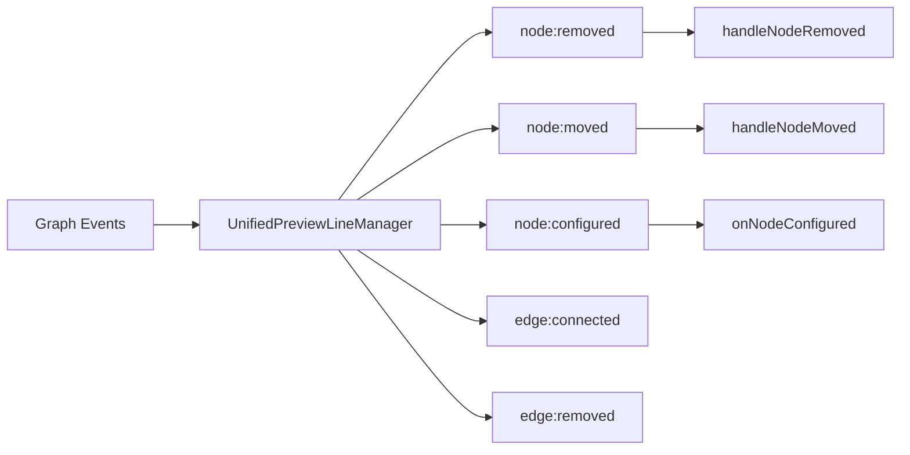

# 预览线管理机制技术评估文档

## 1. 问题概述

### 1.1 问题描述
在分流节点下连接的节点删除后，预览线没有正确恢复，导致用户界面缺失必要的预览线提示，影响用户体验和操作流程。

### 1.2 影响范围
- **节点类型**: 主要影响分流节点（audience-split、event-split、ab-test）
- **操作场景**: 节点删除后的预览线恢复
- **用户体验**: 缺失预览线导致连接提示不明确

## 2. 预览线管理机制分析

### 2.1 核心组件架构



### 2.2 预览线生命周期

#### 2.2.1 创建阶段
- **触发条件**: 节点配置完成且满足`shouldCreatePreviewLine`条件
- **核心方法**: `createUnifiedPreviewLine()`, `createPreviewLineAfterConfig()`
- **分支处理**: 分流节点创建多条预览线，每个分支一条

#### 2.2.2 更新阶段
- **触发事件**: 节点移动、配置变更
- **更新机制**: 防抖处理，避免频繁刷新
- **位置同步**: 实时更新预览线端点位置

#### 2.2.3 删除阶段
- **清理范围**: 预览线实例、节点映射、类型映射
- **恢复机制**: `restorePreviewLinesAfterNodeDeletion()`

### 2.3 分流节点特殊处理

#### 2.3.1 分流节点识别
```javascript
// 支持的分流节点类型
const branchNodeTypes = ['audience-split', 'event-split', 'ab-test']

// 判断逻辑
isBranchNode(node, config) {
    const nodeType = nodeData.type || nodeData.nodeType
    const isBranchByType = branchNodeTypes.includes(nodeType)
    const branchCount = this.calculateBranchCount(node, nodeConfig)
    const isBranchByCount = branchCount > 1
    return isBranchByType || isBranchByCount
}
```

#### 2.3.2 分支预览线管理
- **多分支支持**: 每个分支独立的预览线实例
- **分支映射**: `nodePreviewLines` Map维护节点到预览线的映射
- **标签管理**: 分支标签的生成和验证

## 3. 吸附机制分析

### 3.1 吸附状态管理
- **状态枚举**: `DragStates.SNAPPING`
- **吸附检测**: 基于距离和位置的吸附判断
- **状态转换**: `GlobalDragStateManager`统一管理拖拽状态

### 3.2 吸附逻辑
```javascript
startSnapping(targetNode, snapInfo) {
    if (!this.transitionTo(DragStates.SNAPPING, { targetNode, snapInfo })) {
        return false
    }
    this.currentDrag.targetNode = targetNode
    this.currentDrag.metadata.snapInfo = snapInfo
}
```

### 3.3 吸附与预览线的关系
- **预览线作为吸附目标**: 节点可以吸附到预览线端点
- **吸附状态影响**: 吸附状态变化触发预览线更新
- **视觉反馈**: 吸附时预览线状态变化提供视觉提示

## 4. 动作监听机制分析

### 4.1 事件监听架构



### 4.2 关键事件处理

#### 4.2.1 节点删除事件
```javascript
handleNodeRemoved(e, providedIncomingEdges) {
    // 1. 防重复处理
    if (this.processedNodeDeletions.has(node.id)) return
    
    // 2. 清理预览线
    this.removePreviewLine(node.id)
    
    // 3. 清理缓存
    this.clearNodeCache(node.id)
    
    // 4. 恢复相关预览线
    this.restorePreviewLinesAfterNodeDeletion(node, incomingEdges)
}
```

#### 4.2.2 节点移动事件
- **防抖处理**: 50ms延迟避免频繁更新
- **位置同步**: 实时更新预览线位置
- **性能优化**: 立即更新 + 防抖备份机制

### 4.3 事件处理优先级
1. **节点删除**: 最高优先级，立即处理
2. **节点配置**: 高优先级，影响预览线创建
3. **节点移动**: 中等优先级，防抖处理
4. **边连接/断开**: 低优先级，批量处理

## 5. 问题根因分析

### 5.1 核心问题定位

#### 5.1.1 预览线恢复逻辑缺陷
**问题位置**: `restorePreviewLinesAfterNodeDeletion()` 方法

**具体问题**:
1. **分支完整性检查不足**: `ensureAllBranchesRestored()` 方法在节点删除后的恢复过程中，对分流节点的分支完整性检查存在逻辑缺陷
2. **真实连接判断错误**: `checkBranchHasRealConnection()` 方法可能错误判断分支是否有真实连接
3. **恢复时机问题**: 预览线恢复可能在节点删除事件完全处理完成之前执行

#### 5.1.2 状态同步问题
**问题表现**:
- 节点删除后，相关源节点的预览线状态未正确更新
- 分支映射关系清理不彻底
- 缓存数据与实际状态不一致

#### 5.1.3 事件处理时序问题
**时序冲突**:
1. 节点删除事件触发
2. 边删除事件同时触发
3. 预览线恢复逻辑执行
4. 状态检查时可能读取到过期数据

### 5.2 分流节点特殊性分析

#### 5.2.1 多分支管理复杂性
- **分支独立性**: 每个分支有独立的预览线实例
- **部分恢复**: 删除连接到某个分支的节点时，只应恢复该分支的预览线
- **标签保持**: 恢复时需要保持原有的分支标签信息

#### 5.2.2 配置依赖性
- **配置验证**: 分流节点的预览线创建依赖有效的配置数据
- **动态分支**: 配置变更可能导致分支数量变化
- **状态一致性**: 配置状态与预览线状态需要保持同步

## 6. 修改方案设计

### 6.1 整体修改策略

#### 6.1.1 分层修复方案
1. **核心逻辑层**: 修复预览线恢复的核心算法
2. **状态管理层**: 优化状态同步和缓存机制
3. **事件处理层**: 改进事件处理时序和优先级
4. **用户界面层**: 增强视觉反馈和错误提示

#### 6.1.2 渐进式修复
- **Phase 1**: 修复核心恢复逻辑
- **Phase 2**: 优化状态管理
- **Phase 3**: 完善事件处理
- **Phase 4**: 增强用户体验

### 6.2 具体修改方案

#### 6.2.1 预览线恢复逻辑优化

**文件**: `UnifiedPreviewLineManager.js`

**修改点1**: `restorePreviewLinesAfterNodeDeletion()` 方法
```javascript
// 优化后的恢复逻辑
restorePreviewLinesAfterNodeDeletion(deletedNode, incomingEdges = null) {
    // 1. 延迟执行，确保删除事件完全处理完成
    setTimeout(() => {
        this.executePreviewLineRestore(deletedNode, incomingEdges)
    }, 100) // 增加延迟确保状态稳定
}

executePreviewLineRestore(deletedNode, incomingEdges) {
    // 2. 获取最新的边信息
    const edges = this.getValidIncomingEdges(deletedNode, incomingEdges)
    
    // 3. 分组处理源节点
    const sourceNodeGroups = this.groupSourceNodesByType(edges)
    
    // 4. 按类型分别处理
    this.processBranchNodes(sourceNodeGroups.branch)
    this.processNormalNodes(sourceNodeGroups.normal)
}
```

**修改点2**: `ensureAllBranchesRestored()` 方法增强
```javascript
ensureAllBranchesRestored(node, isAfterNodeDeletion = false) {
    if (!this.isBranchNode(node)) return
    
    // 1. 获取当前真实连接状态
    const currentConnections = this.getCurrentBranchConnections(node)
    
    // 2. 获取期望的分支配置
    const expectedBranches = this.getNodeBranches(node)
    
    // 3. 计算需要恢复的分支
    const branchesToRestore = this.calculateBranchesToRestore(
        expectedBranches, 
        currentConnections, 
        isAfterNodeDeletion
    )
    
    // 4. 逐个恢复分支预览线
    branchesToRestore.forEach(branch => {
        this.restoreBranchPreviewLine(node, branch)
    })
}
```

#### 6.2.2 状态管理优化

**新增状态管理器**: `PreviewLineStateManager.js`
```javascript
export class PreviewLineStateManager {
    constructor() {
        this.nodeStates = new Map() // 节点状态缓存
        this.branchStates = new Map() // 分支状态缓存
        this.pendingOperations = new Set() // 待处理操作
    }
    
    // 状态同步方法
    syncNodeState(nodeId, state) {
        this.nodeStates.set(nodeId, {
            ...state,
            timestamp: Date.now()
        })
    }
    
    // 状态验证方法
    validateState(nodeId) {
        const state = this.nodeStates.get(nodeId)
        if (!state) return false
        
        // 检查状态是否过期（5秒超时）
        return (Date.now() - state.timestamp) < 5000
    }
}
```

#### 6.2.3 事件处理优化

**修改点**: 事件处理时序控制
```javascript
// 新增事件队列管理
class EventQueueManager {
    constructor() {
        this.eventQueue = []
        this.processing = false
    }
    
    enqueue(event, priority = 0) {
        this.eventQueue.push({ event, priority, timestamp: Date.now() })
        this.eventQueue.sort((a, b) => b.priority - a.priority)
        
        if (!this.processing) {
            this.processQueue()
        }
    }
    
    async processQueue() {
        this.processing = true
        
        while (this.eventQueue.length > 0) {
            const { event } = this.eventQueue.shift()
            await this.processEvent(event)
        }
        
        this.processing = false
    }
}
```

#### 6.2.4 吸附机制增强

**修改点**: `GlobalDragStateManager.js`
```javascript
// 增强吸附检测
enhancedSnapDetection(dragNode, targetPreviewLine) {
    // 1. 距离检测
    const distance = this.calculateDistance(dragNode, targetPreviewLine)
    if (distance > this.snapThreshold) return false
    
    // 2. 类型兼容性检测
    if (!this.isCompatibleConnection(dragNode, targetPreviewLine)) return false
    
    // 3. 分支特殊性检测
    if (targetPreviewLine.isBranch) {
        return this.validateBranchSnap(dragNode, targetPreviewLine)
    }
    
    return true
}
```

### 6.3 风险评估和影响范围

#### 6.3.1 修改风险等级
- **核心逻辑修改**: 🔴 高风险 - 影响预览线核心功能
- **状态管理优化**: 🟡 中风险 - 可能影响性能
- **事件处理改进**: 🟡 中风险 - 可能影响响应时间
- **吸附机制增强**: 🟢 低风险 - 主要是功能增强

#### 6.3.2 影响范围分析
**直接影响**:
- 分流节点的预览线管理
- 节点删除后的恢复逻辑
- 拖拽和吸附体验

**间接影响**:
- 整体画布性能
- 内存使用情况
- 用户操作响应时间

#### 6.3.3 兼容性考虑
- **向后兼容**: 保持现有API接口不变
- **数据兼容**: 支持现有的预览线数据格式
- **功能兼容**: 不影响现有的预览线功能

## 7. 测试验证方案

### 7.1 单元测试

#### 7.1.1 核心方法测试
```javascript
describe('PreviewLine Restoration', () => {
    test('should restore branch preview lines after node deletion', () => {
        // 测试分支预览线恢复
    })
    
    test('should handle multiple branch restoration correctly', () => {
        // 测试多分支恢复
    })
    
    test('should preserve branch labels during restoration', () => {
        // 测试标签保持
    })
})
```

#### 7.1.2 状态管理测试
```javascript
describe('State Management', () => {
    test('should sync node states correctly', () => {
        // 测试状态同步
    })
    
    test('should validate state expiration', () => {
        // 测试状态过期验证
    })
})
```

### 7.2 集成测试

#### 7.2.1 端到端测试场景
1. **场景1**: 创建分流节点 → 连接子节点 → 删除子节点 → 验证预览线恢复
2. **场景2**: 多分支分流节点 → 部分删除 → 验证剩余分支正常
3. **场景3**: 复杂流程图 → 批量删除 → 验证整体恢复

#### 7.2.2 性能测试
- **响应时间**: 节点删除后预览线恢复时间 < 200ms
- **内存使用**: 无内存泄漏，状态清理及时
- **并发处理**: 多个节点同时删除的处理能力

### 7.3 用户验收测试

#### 7.3.1 功能验收标准
- ✅ 分流节点下连接的节点删除后，预览线正确恢复
- ✅ 分支标签信息保持不变
- ✅ 多分支场景下部分恢复正常
- ✅ 拖拽和吸附体验流畅
- ✅ 无明显性能影响

#### 7.3.2 边界情况测试
- 快速连续删除多个节点
- 删除过程中移动其他节点
- 网络延迟情况下的状态同步
- 大型流程图的处理能力

## 8. 实施建议

### 8.1 实施优先级
1. **P0 - 紧急**: 修复核心恢复逻辑，解决预览线不恢复的问题
2. **P1 - 高优先级**: 优化状态管理，提升稳定性
3. **P2 - 中优先级**: 改进事件处理，提升性能
4. **P3 - 低优先级**: 增强用户体验，完善细节

### 8.2 实施时间规划
- **Week 1**: 核心逻辑修复和基础测试
- **Week 2**: 状态管理优化和集成测试
- **Week 3**: 事件处理改进和性能测试
- **Week 4**: 用户体验优化和验收测试

### 8.3 监控和回滚策略

#### 8.3.1 监控指标
- 预览线恢复成功率
- 节点删除响应时间
- 内存使用情况
- 用户操作错误率

#### 8.3.2 回滚准备
- 保留当前版本的完整备份
- 准备快速回滚脚本
- 建立问题快速定位机制
- 制定紧急修复流程

## 9. 总结

本技术评估文档全面分析了分流节点下连接节点删除后预览线未恢复的问题，从预览线管理、吸附机制、动作监听三个维度进行了深入分析，识别出了核心问题并提出了系统性的解决方案。

**关键发现**:
1. 预览线恢复逻辑存在时序和状态同步问题
2. 分流节点的多分支管理需要特殊处理
3. 事件处理机制需要优化以提升稳定性

**解决方案**:
1. 分层修复策略，从核心逻辑到用户体验全面优化
2. 引入状态管理器，提升状态同步的可靠性
3. 优化事件处理队列，解决时序冲突问题

**预期效果**:
- 彻底解决预览线不恢复的问题
- 提升分流节点操作的稳定性
- 改善用户拖拽和连接体验
- 增强系统整体的健壮性

通过系统性的修改和充分的测试验证，可以确保问题得到根本性解决，同时不影响现有功能的稳定性。