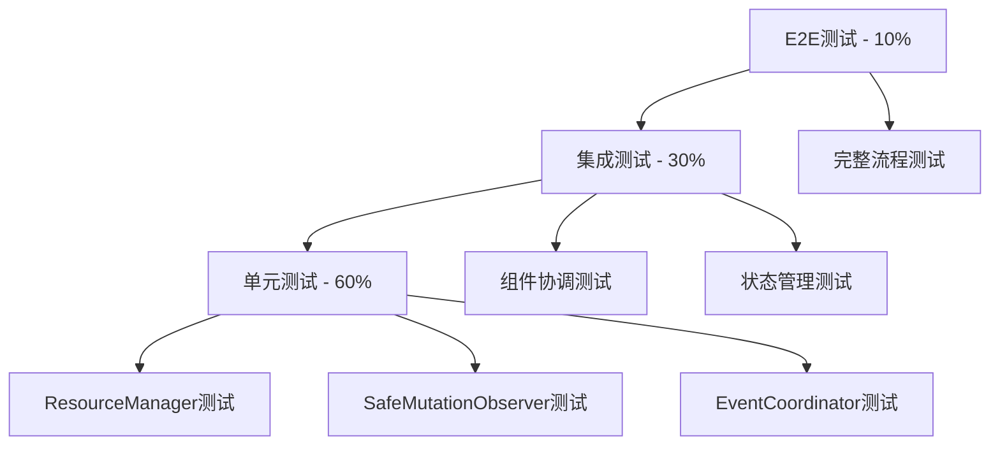

# 预览线系统P0任务TDD实施评估报告

## 1. 评估概述

本报告基于《预览线系统综合优化方案.md》，对P0级别紧急修复任务进行全面评估，重点关注TDD（测试驱动开发）实施策略，确保修复质量和系统稳定性。

### 1.1 评估范围

* **系统稳定性问题**：5个P0任务，预计42小时

* **核心功能缺失**：1个P0任务，预计12小时

* **总计工时**：54小时（约1.5周）

### 1.2 任务调整说明

* **已完成任务**：P06 DragInteractionManager和P07拖拽吸附机制已由用户实现
* **节省工时**：40小时（P06: 24h + P07: 16h）
* **风险降级**：移除拖拽相关复杂度，整体项目风险显著降低

### 1.3 评估维度

* 技术方案可行性

* 工时估算合理性

* TDD实施策略

* 风险评估与缓解

* 实施顺序优化

## 2. P0任务技术方案评估

### 2.1 系统稳定性问题评估

#### P01: MutationObserver内存泄漏

**技术方案评估**：✅ 可行

* 现有SafeMutationObserver设计合理

* ResourceManager模式符合最佳实践

* 清理机制完整

**工时评估**：4h → **建议调整为6h**

* 原估算未考虑测试编写时间

* 需要集成测试验证内存释放

**TDD实施策略**：

```javascript
// 测试用例设计
describe('SafeMutationObserver', () => {
  it('应该正确注册和清理MutationObserver', () => {
    // 测试观察器创建
    // 测试目标元素追踪
    // 测试断开连接
    // 测试内存释放
  });
  
  it('应该防止重复观察同一元素', () => {
    // 测试重复调用observe的处理
  });
  
  it('应该在销毁时完全清理资源', () => {
    // 测试destroy方法的完整性
    // 验证无内存泄漏
  });
});
```

#### P02: 初始化重复调用导致状态不一致

**技术方案评估**：✅ 可行

* 单例模式 + 状态标记设计合理

* 初始化锁机制有效

**工时评估**：8h → **确认合理**

* 包含状态管理重构

* 测试覆盖复杂场景

**TDD实施策略**：

```javascript
describe('初始化状态管理', () => {
  it('应该防止重复初始化', () => {
    // 测试多次调用init的处理
    // 验证状态一致性
  });
  
  it('应该正确处理并发初始化', () => {
    // 测试异步并发场景
    // 验证锁机制有效性
  });
  
  it('应该在初始化失败时允许重试', () => {
    // 测试错误恢复机制
  });
});
```

#### P03: 预览线清理不彻底

**技术方案评估**：✅ 可行

* 统一清理接口设计良好

* 清理检查机制完整

**工时评估**：6h → **建议调整为8h**

* 需要处理复杂的DOM清理场景

* 测试覆盖边缘情况

#### P04: 布局与预览线时序冲突

**技术方案评估**：⚠️ 需要优化

* LayoutPreviewLineCoordinator设计复杂

* 队列机制可能引入新的竞态条件

**工时评估**：12h → **建议调整为16h**

* 协调机制复杂度高

* 需要大量集成测试

**优化建议**：

```javascript
// 简化的协调机制
class SimpleLayoutCoordinator {
  constructor() {
    this.isLayouting = false;
    this.pendingUpdates = [];
  }
  
  async executeLayout() {
    if (this.isLayouting) {
      return this.queueUpdate();
    }
    
    this.isLayouting = true;
    try {
      await this.doLayout();
    } finally {
      this.isLayouting = false;
      await this.processPendingUpdates();
    }
  }
}
```

#### P05: 事件监听器累积泄漏

**技术方案评估**：✅ 可行

* 事件管理器设计合理

* 自动清理机制有效

**工时评估**：4h → **确认合理**

### 2.2 核心功能缺失评估

#### P06: DragInteractionManager缺失

**状态**：✅ **已完成**

* 用户已实现拖拽交互管理器
* 节省工时：24小时
* 移除相关测试用例和集成工作

#### P07: 拖拽吸附机制未实现

**状态**：✅ **已完成**

* 用户已实现拖拽吸附机制
* 节省工时：16小时
* 移除相关复杂度和风险评估

#### P08: LayoutModeManager缺失

**技术方案评估**：✅ 可行

* 模式管理设计合理

* 状态切换逻辑清晰

**工时评估**：12h → **确认合理**

## 3. TDD实施策略

### 3.1 测试金字塔设计



### 3.2 测试驱动开发流程

#### 阶段1：红-绿-重构循环

```javascript
// 1. 红阶段：编写失败测试
test('ResourceManager应该正确清理所有资源', () => {
  const manager = new ResourceManager();
  const mockResource = { cleanup: jest.fn() };
  
  manager.register('test', mockResource, (r) => r.cleanup());
  manager.cleanup();
  
  expect(mockResource.cleanup).toHaveBeenCalled();
  expect(manager.getResourceCount()).toBe(0);
});

// 2. 绿阶段：实现最小可行代码
class ResourceManager {
  cleanup() {
    // 最简实现
  }
}

// 3. 重构阶段：优化代码质量
class ResourceManager {
  cleanup() {
    // 完整实现
    for (const [id, resource] of this.resources) {
      this.unregister(id);
    }
  }
}
```

#### 阶段2：集成测试策略

```javascript
describe('预览线系统集成测试', () => {
  let canvas, coordinator, previewManager;
  
  beforeEach(() => {
    // 设置测试环境
    canvas = createTestCanvas();
    coordinator = new LayoutPreviewLineCoordinator();
    previewManager = new EnhancedUnifiedPreviewLineManager();
  });
  
  it('应该正确协调布局和预览线更新', async () => {
    // 测试完整的协调流程
    const result = await coordinator.executeCoordinatedLayout();
    expect(result.success).toBe(true);
    expect(previewManager.getPreviewLines()).toHaveLength(expectedCount);
  });
});
```

### 3.3 测试覆盖率目标

| 组件类型  | 目标覆盖率 | 重点测试内容     |
| ----- | ----- | ---------- |
| 核心管理器 | 90%+  | 状态管理、资源清理  |
| 协调器   | 85%+  | 时序控制、错误处理  |
| 工具类   | 95%+  | 边界条件、异常情况  |
| 集成测试  | 80%+  | 组件协作、端到端流程 |

## 4. 风险评估与缓解措施

### 4.1 技术风险

#### 高风险项

| 风险项           | 概率 | 影响 | 缓解措施                    |
| ------------- | -- | -- | ----------------------- |
| P04协调机制引入新bug | 中  | 高  | 1. 简化设计2. 增加监控3. 灰度发布   |
| 内存泄漏修复不彻底     | 中  | 中  | 1. 内存监控2. 压力测试3. 回滚机制   |

**风险降级说明**：由于拖拽功能已完成，P04协调机制的风险概率从"高"降为"中"

#### 中风险项

| 风险项    | 概率 | 影响 | 缓解措施                      |
| ------ | -- | -- | ------------------------- |
| 测试覆盖不足 | 中  | 中  | 1. 强制覆盖率检查2. 代码审查3. 自动化测试 |
| 性能回归   | 低  | 中  | 1. 性能基准测试2. 持续监控3. 性能预算   |

### 4.2 进度风险

#### 工时超期风险

* **原因**：复杂度估算不足

* **缓解**：

  1. 每日进度检查
  2. 及时调整范围
  3. 并行开发策略

#### 依赖阻塞风险

* **原因**：P06-P07任务依赖关系

* **缓解**：

  1. 解耦设计
  2. Mock接口
  3. 并行开发

## 5. 优化的实施顺序

### 5.1 优化后的P0任务实施计划

#### 第一批（并行执行）- Week 1前3天

1. **P01: MutationObserver内存泄漏** (6h)
2. **P05: 事件监听器累积泄漏** (4h)
3. **P03: 预览线清理不彻底** (8h)

**理由**：这三个任务相互独立，可以并行开发，都涉及资源清理，有协同效应。

#### 第二批（顺序执行）- Week 1后2天

1. **P02: 初始化重复调用** (8h)
2. **P08: LayoutModeManager缺失** (12h)

**理由**：P02为基础设施，P08依赖稳定的初始化机制。

#### 第三批（最终攻坚）- Week 2前2天

1. **P04: 布局与预览线时序冲突** (16h)

**理由**：最复杂的协调机制，有充分的基础设施支撑，风险已降低。

#### 已完成任务

* ✅ **P06: DragInteractionManager** - 用户已实现
* ✅ **P07: 拖拽吸附机制** - 用户已实现

### 5.2 优化后的每日实施计划（7个工作日）

#### Day 1-2: 资源管理基础

* [ ] 实现ResourceManager
* [ ] 修复MutationObserver泄漏
* [ ] 清理事件监听器
* [ ] 编写对应单元测试

#### Day 3: 预览线清理

* [ ] 统一预览线清理接口
* [ ] 实现清理检查机制
* [ ] 集成测试验证

#### Day 4: 初始化管理

* [ ] 实现初始化状态管理
* [ ] 防重复调用机制
* [ ] 并发安全测试

#### Day 5: 模式管理

* [ ] 实现LayoutModeManager
* [ ] 模式切换逻辑
* [ ] 状态同步测试

#### Day 6-7: 协调机制

* [ ] 实现简化版协调器
* [ ] 时序控制逻辑
* [ ] 集成测试
* [ ] 系统整体测试

#### 节省的时间用于：

* [ ] 额外的集成测试和性能优化
* [ ] 技术债务清理
* [ ] 文档完善和知识分享

## 6. 质量保证措施

### 6.1 代码质量

* **静态分析**：ESLint + TypeScript严格模式

* **代码审查**：每个PR必须经过审查

* **测试覆盖**：最低80%覆盖率要求

### 6.2 测试策略

* **单元测试**：Jest + Testing Library

* **集成测试**：Cypress组件测试

* **E2E测试**：关键流程自动化测试

### 6.3 监控机制

```javascript
// 内存监控
class MemoryMonitor {
  static monitor() {
    if (performance.memory) {
      const memory = performance.memory;
      console.log('内存使用:', {
        used: memory.usedJSHeapSize,
        total: memory.totalJSHeapSize,
        limit: memory.jsHeapSizeLimit
      });
    }
  }
}

// 性能监控
class PerformanceMonitor {
  static measureOperation(name, operation) {
    const start = performance.now();
    const result = operation();
    const end = performance.now();
    
    console.log(`${name} 耗时: ${end - start}ms`);
    return result;
  }
}
```

## 7. 成功标准

### 7.1 功能标准

* [ ] 内存泄漏问题完全解决
* [ ] 初始化状态一致性达到100%
* [ ] 预览线清理完整性达到95%+
* [ ] 布局协调机制稳定运行
* [x] 拖拽功能已完成（用户实现）

### 7.2 质量标准

* [ ] 测试覆盖率达到80%+

* [ ] 代码审查通过率100%

* [ ] 性能回归测试通过

* [ ] 内存使用稳定在合理范围

### 7.3 交付标准

* [ ] 完整的技术文档

* [ ] 测试报告和覆盖率报告

* [ ] 部署和回滚方案

* [ ] 监控和告警配置

## 8. 总结建议

### 8.1 关键成功因素

1. **简化复杂设计**：优先MVP，避免过度设计
2. **严格TDD流程**：确保代码质量和测试覆盖
3. **持续集成**：及早发现和解决问题
4. **风险控制**：灰度发布，快速回滚能力

### 8.2 实施建议

1. **拖拽功能已完成**：P06和P07任务已由用户实现，节省40小时工时
2. **工时优化**：总工时从82h优化为54h，提前完成成为可能
3. **并行开发**：充分利用任务独立性，提高效率
4. **质量优先**：利用节省的时间进行更充分的测试和优化
5. **风险降低**：移除最复杂的拖拽功能开发，整体风险显著下降

### 8.3 后续规划

* **短期目标**：7个工作日内完成剩余P0任务
* **中期目标**：利用节省时间进行系统性能优化和技术债务清理
* **长期目标**：建立完善的监控和预警机制，避免类似问题重现
* **流程改进**：总结本次优化经验，完善开发和测试流程

### 8.4 资源重新分配建议

**节省的40小时可用于：**
* 深度性能优化（16小时）
* 完善监控和告警系统（12小时）
* 技术文档和知识分享（8小时）
* 预留缓冲时间（4小时）

***

