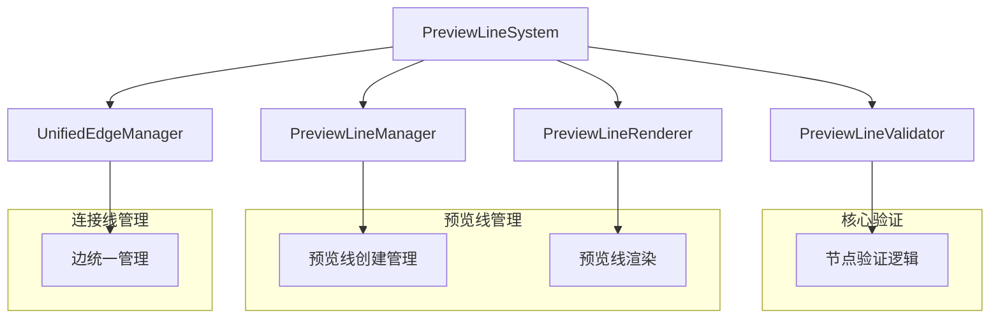
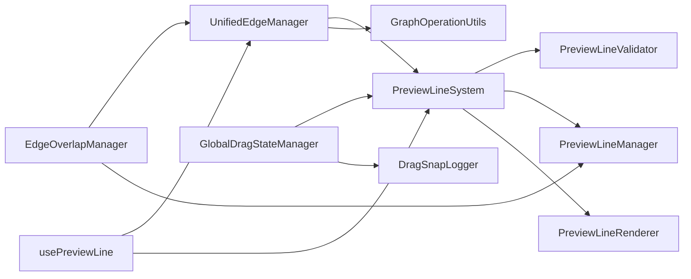
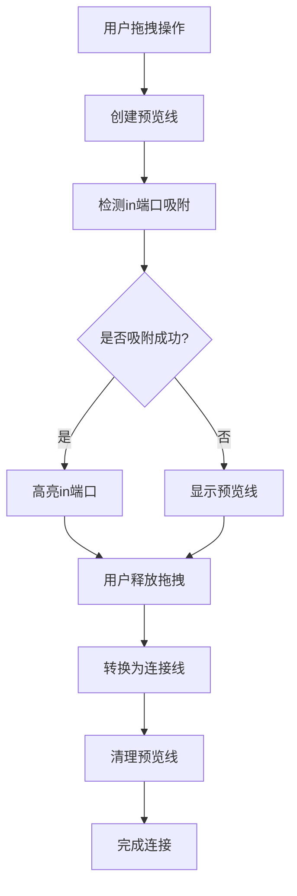

# 预览线系统技术分析报告

## 1. 系统概述

预览线系统是一个复杂的交互式图形编辑系统，主要负责在节点间创建临时的预览连接线，并在适当条件下将其转换为正式连接线。系统包含预览线生成、转换、连接线创建和吸附等核心功能模块。

### 1.1 核心组件架构



## 2. 预览线生成条件和触发逻辑

### 2.1 核心判断方法

**主要入口：** `PreviewLineSystem.shouldCreatePreviewLine(node)`

**触发条件检查流程：**

1. **基础验证**
   - 节点存在性检查：`node !== null && node !== undefined`
   - 节点类型验证：`typeof node === 'object'`
   - 节点ID有效性：`nodeId = node.id || node.getId?.()`

2. **节点数据验证**
   ```javascript
   // 获取节点数据的多种方式
   let nodeData = node.data || node.store?.data?.data || {};
   if ((!nodeData || Object.keys(nodeData).length === 0) && typeof node.getData === 'function') {
     nodeData = node.getData() || {};
   }
   ```

3. **节点类型检查**
   ```javascript
   const nodeType = nodeData.type || nodeData.nodeType;
   // 结束节点不需要预览线
   if (nodeType === 'end' || nodeType === 'finish' || nodeType === 'terminal') {
     return false;
   }
   ```

4. **配置状态验证**
   ```javascript
   const isConfigured = nodeData.isConfigured === true;
   if (!isConfigured) {
     return false; // 未配置节点不创建预览线
   }
   ```

5. **连接状态检查**
   ```javascript
   const hasRealConnections = this.checkNodeHasRealConnections(node);
   if (hasRealConnections) {
     // 分支节点特殊处理
     const branchTypes = ['audience-split', 'event-split', 'ab-test'];
     if (branchTypes.includes(nodeType)) {
       return this.checkBranchNodeNeedsPreviewLine(node);
     }
     return false;
   }
   ```

### 2.2 分支节点特殊逻辑

**分支节点预览线需求分析：** `PreviewLineValidator.checkBranchNodeRequirement()`

```javascript
// 分析分支配置
const branchAnalysis = this.analyzeBranchConfiguration(node);

// 验证分支分析结果
if (!branchAnalysis.isValid) {
  return this.createRequirementResult(false, `分支配置无效: ${branchAnalysis.reason}`);
}
```

**分支创建需求判断：**
- 检查每个分支是否已有连接
- 分析未连接分支数量
- 确定是否需要创建新的预览线

### 2.3 预览线创建触发事件

**主要触发点：**
1. **节点添加事件：** `node:added`
2. **节点配置完成事件：** `node:configured`
3. **手动触发：** `createPreviewLine()` 方法调用
4. **批量创建：** 系统初始化时的节点扫描

## 3. 预览线转换为连接线的条件和流程

### 3.1 转换触发条件

**核心方法：** `UnifiedEdgeManager.convertPreviewToConnection(previewId, targetNodeId, options)`

**前置验证：**
```javascript
// 1. 预览线存在性验证
const preview = this.previewLines.get(previewId);
if (!preview) {
  throw new Error('预览线不存在');
}

// 2. 转换有效性验证
const validation = await this.validatePreviewToConnectionConversion(preview, targetNodeId, options);
if (!validation.isValid) {
  throw new Error(`转换无效: ${validation.errors.join(', ')}`);
}
```

**验证规则：**
```javascript
async validatePreviewToConnectionConversion(preview, targetNodeId, options = {}) {
  const errors = [];
  
  if (!preview.isPreviewLine()) {
    errors.push('不是预览线');
  }
  
  if (!targetNodeId) {
    errors.push('缺少目标节点ID');
  }
  
  if (this.hasConnection(preview.source.nodeId, targetNodeId, preview.branch?.id)) {
    errors.push('连接已存在');
  }
  
  return {
    isValid: errors.length === 0,
    errors
  };
}
```

### 3.2 转换执行流程

**转换步骤：**
1. **预览线验证和获取**
2. **重复连接检查**
   ```javascript
   const existingConnection = await checkDuplicateConnection(sourceNodeId, targetNodeId, branchId);
   if (existingConnection) {
     throw new Error(`连接已存在: ${sourceNodeId} -> ${targetNodeId}`);
   }
   ```

3. **端口配置验证**
   ```javascript
   // 默认端口配置
   const sourcePort = options.sourcePort || 'out';
   const targetPort = options.targetPort || 'in';
   ```

4. **连接线创建**
   ```javascript
   const connectionData = {
     type: EdgeTypes.CONNECTION,
     source: { nodeId: sourceNodeId, port: sourcePort },
     target: { nodeId: targetNodeId, port: targetPort },
     isPreview: false,
     isConnected: true
   };
   ```

5. **预览线清理**
   ```javascript
   // 删除原预览线
   this.previewLines.delete(previewId);
   // 添加到连接线集合
   this.connections.set(connectionId, connection);
   ```

### 3.3 转换后清理机制

**自动清理逻辑：** `EdgeOverlapManager.handleEdgeAdded()`
```javascript
handleEdgeAdded(edge) {
  // 检查是否为真实连接线
  if (!edge.getData()?.isPreview) {
    // 清理相关预览线
    this.cleanupRelatedPreviewLines(edge);
  }
}

cleanupRelatedPreviewLines(edge) {
  const sourceNodeId = edge.getSourceCellId();
  // 删除源节点的所有预览线
  this.previewLineManager.batchRemovePreviewLines([sourceNodeId]);
}
```

## 4. 连接线生成的条件和逻辑

### 4.1 连接线创建方法

**主要入口：** `UnifiedEdgeManager.createConnection(sourceNodeId, targetNodeId, options)`

**创建配置：**
```javascript
const connectionData = {
  type: EdgeTypes.CONNECTION,
  source: { nodeId: sourceNodeId, port: options.sourcePort || 'out' },
  target: { nodeId: targetNodeId, port: options.targetPort || 'in' },
  state: ConnectionStates.ACTIVE,
  isPreview: false,
  isConnected: true,
  branchId: options.branchId,
  branchLabel: options.branchLabel,
  style: {
    stroke: options.stroke || '#1890ff',
    strokeWidth: options.strokeWidth || 2,
    opacity: 1
  }
};
```

### 4.2 端口配置统一管理

**端口管理核心原则：**
- **源端口统一：** 所有连接线的源端口固定为 `out`
- **目标端口统一：** 所有连接线的目标端口固定为 `in`
- **单向连接：** 连接方向始终为 `源节点.out → 目标节点.in`

**端口配置工厂：** `GraphOperationUtils.addEdge()`
```javascript
// 统一端口配置策略
const PORT_CONFIG = {
  SOURCE_PORT: 'out',    // 源端口标准名称
  TARGET_PORT: 'in',     // 目标端口标准名称
  DIRECTION: 'outbound'  // 连接方向标识
};

// 端口配置验证
function validatePortConfiguration(sourcePort, targetPort) {
  if (sourcePort !== PORT_CONFIG.SOURCE_PORT) {
    throw new Error(`源端口必须为 '${PORT_CONFIG.SOURCE_PORT}', 当前为: '${sourcePort}'`);
  }
  if (targetPort !== PORT_CONFIG.TARGET_PORT) {
    throw new Error(`目标端口必须为 '${PORT_CONFIG.TARGET_PORT}', 当前为: '${targetPort}'`);
  }
  return true;
}

// 统一边配置创建
function createEdgeConfig(sourceCellId, targetCellId, connectionData) {
  const sourcePort = PORT_CONFIG.SOURCE_PORT;
  const targetPort = PORT_CONFIG.TARGET_PORT;
  
  // 端口配置验证
  validatePortConfiguration(sourcePort, targetPort);
  
  return {
    id: connectionData.id,
    source: { cell: sourceCellId, port: sourcePort },
    target: { cell: targetCellId, port: targetPort },
    data: {
      ...connectionData,
      portConfig: {
        sourcePort,
        targetPort,
        validated: true,
        timestamp: Date.now()
      }
    }
  };
}
```

**端口兼容性检查：**
```javascript
// 节点端口兼容性验证
function validateNodePortCompatibility(sourceNode, targetNode) {
  const sourceHasOutPort = sourceNode.hasPort?.(PORT_CONFIG.SOURCE_PORT) ?? true;
  const targetHasInPort = targetNode.hasPort?.(PORT_CONFIG.TARGET_PORT) ?? true;
  
  if (!sourceHasOutPort) {
    throw new Error(`源节点 ${sourceNode.id} 缺少 '${PORT_CONFIG.SOURCE_PORT}' 端口`);
  }
  
  if (!targetHasInPort) {
    throw new Error(`目标节点 ${targetNode.id} 缺少 '${PORT_CONFIG.TARGET_PORT}' 端口`);
  }
  
  return { sourceHasOutPort, targetHasInPort };
}
```

### 4.3 连接线创建触发条件

**触发场景：**
1. **预览线转换：** 用户拖拽预览线到目标节点
2. **直接创建：** 通过API直接创建连接
3. **批量创建：** 系统导入或恢复时的批量操作
4. **分支连接：** 分支节点的多路径连接

**验证条件：**
- 源节点和目标节点都存在
- 不存在重复连接
- 端口配置有效
- 节点类型兼容

## 5. 吸附触发的条件和机制

### 5.1 吸附检测核心方法

**主要入口：** `PreviewLineSystem.checkNodeSnapToPreviewLines(nodeId, nodePosition, options)`

**吸附配置获取：**
```javascript
const snapConfig = this.getConfig('snap', {
  enabled: true,
  threshold: 40,           // 吸附距离阈值
  highlightThreshold: 60,  // 高亮显示阈值
  nodeSnap: true,         // 节点吸附开关
  enableNodeSnap: true    // 节点吸附启用标志
});
```

### 5.2 吸附条件检查

**启用状态验证：**
```javascript
const nodeSnapEnabled = snapConfig.enableNodeSnap !== undefined ? 
  snapConfig.enableNodeSnap : snapConfig.nodeSnap;

if (!snapConfig.enabled || !nodeSnapEnabled) {
  return {
    canSnap: false,
    reason: !snapConfig.enabled ? 'snap_disabled' : 'node_snap_disabled'
  };
}
```

**预览线存在性检查：**
```javascript
const previewLines = Array.from(this.previewLines.values());
if (!previewLines || previewLines.length === 0) {
  return {
    canSnap: false,
    reason: 'no_preview_lines'
  };
}
```

### 5.3 目标节点in端口吸附机制

**吸附目标限定：**
- **吸附对象：** 仅限目标节点的 `in` 端口
- **吸附方向：** 预览线终点 → 目标节点in端口
- **单一吸附：** 每个预览线只能吸附一个目标节点

**in端口位置计算：**
```javascript
// 获取节点in端口的精确坐标
function getNodeInPortPosition(node) {
  const nodePosition = node.getPosition();
  const nodeSize = node.getSize();
  
  // in端口通常位于节点左侧中央
  const inPortPosition = {
    x: nodePosition.x,                    // 节点左边缘
    y: nodePosition.y + nodeSize.height / 2,  // 节点垂直中心
    port: 'in',
    nodeId: node.id
  };
  
  return inPortPosition;
}

// 计算预览线终点到目标节点in端口的距离
function calculateSnapDistance(previewLineEndPoint, targetNodeInPort) {
  const dx = previewLineEndPoint.x - targetNodeInPort.x;
  const dy = previewLineEndPoint.y - targetNodeInPort.y;
  
  return {
    distance: Math.sqrt(dx * dx + dy * dy),
    deltaX: dx,
    deltaY: dy,
    angle: Math.atan2(dy, dx) * 180 / Math.PI
  };
}
```

**吸附检测优化逻辑：**
```javascript
// 优化的吸附检测算法
function checkNodeSnapToPreviewLines(nodeId, nodePosition, options = {}) {
  const snapConfig = this.getSnapConfig();
  
  // 获取目标节点的in端口位置
  const targetNode = this.graph.getCellById(nodeId);
  const inPortPosition = getNodeInPortPosition(targetNode);
  
  let bestSnapTarget = null;
  let minDistance = Infinity;
  
  // 遍历所有预览线
  this.previewLines.forEach((previewLine, previewId) => {
    // 获取预览线终点
    const endPoint = this.getPreviewLineEndPoint(previewLine);
    if (!endPoint) return;
    
    // 计算到in端口的距离
    const snapDistance = calculateSnapDistance(endPoint, inPortPosition);
    
    // 检查是否在吸附阈值内
    if (snapDistance.distance < snapConfig.threshold && 
        snapDistance.distance < minDistance) {
      
      minDistance = snapDistance.distance;
      bestSnapTarget = {
        previewLineId: previewId,
        previewLine: previewLine,
        targetPort: 'in',
        snapDistance: snapDistance,
        snapPosition: {
          x: inPortPosition.x - targetNode.getSize().width / 2,
          y: inPortPosition.y - targetNode.getSize().height / 2
        }
      };
    }
  });
  
  return {
    canSnap: bestSnapTarget !== null,
    snapTarget: bestSnapTarget,
    minDistance: minDistance,
    targetPort: 'in'  // 明确标识吸附目标为in端口
  };
}
```

**吸附视觉反馈：**
```javascript
// in端口吸附高亮效果
function highlightInPortForSnap(nodeId, snapInfo) {
  const node = this.graph.getCellById(nodeId);
  const inPortPosition = getNodeInPortPosition(node);
  
  // 创建in端口高亮效果
  const highlightConfig = {
    position: inPortPosition,
    radius: this.snapConfig.highlightRadius || 8,
    color: this.snapConfig.highlightColor || '#00ff00',
    opacity: 0.8,
    animation: 'pulse',
    duration: 200
  };
  
  // 应用高亮样式
  this.applyPortHighlight(nodeId, 'in', highlightConfig);
  
  // 显示吸附提示
  this.showSnapHint({
    message: `吸附到 ${nodeId} 的输入端口`,
    position: inPortPosition,
    distance: snapInfo.minDistance
  });
}
```

### 5.4 吸附状态管理

**拖拽状态管理：** `GlobalDragStateManager`
```javascript
// 开始吸附操作
startSnapping(targetNode, snapInfo = {}) {
  if (!this.transitionTo(DragStates.SNAPPING, { targetNode, snapInfo })) {
    return false;
  }
  
  this.currentDrag.targetNode = targetNode;
  this.currentDrag.metadata.snapInfo = snapInfo;
  
  // 触发吸附开始事件
  this.emit('snapStart', {
    targetNode: targetNode,
    drag: this.currentDrag,
    snapInfo: snapInfo
  });
}
```

**吸附日志管理：** `DragSnapLogger`
```javascript
// 记录吸附过程
export function endNodeDragLogging(sessionId, endPosition, nearestInPortCoord) {
  const session = dragSnapLogger.dragSessions.get(sessionId);
  if (!session) return;
  
  // 计算吸附结果
  const snapResult = {
    success: nearestInPortCoord !== null,
    endPosition,
    nearestInPortCoord,
    distance: nearestInPortCoord ? 
      Math.sqrt(Math.pow(endPosition.x - nearestInPortCoord.x, 2) + 
                Math.pow(endPosition.y - nearestInPortCoord.y, 2)) : null
  };
}
```

## 6. 各功能模块交互关系

### 6.1 模块依赖关系



### 6.2 事件流转机制

**事件触发链：**
1. **节点拖拽开始** → `GlobalDragStateManager.startDrag()`
2. **拖拽过程中** → `PreviewLineSystem.checkNodeSnapToPreviewLines()`
3. **吸附检测** → `PreviewLineSystem.highlightNearbyNodes()`
4. **拖拽结束** → `UnifiedEdgeManager.convertPreviewToConnection()`
5. **连接创建** → `EdgeOverlapManager.handleEdgeAdded()`
6. **预览线清理** → `PreviewLineManager.batchRemovePreviewLines()`

### 6.3 数据流向

**预览线生命周期：**
```
节点配置完成 → 预览线创建 → 拖拽吸附 → 转换连接 → 预览线删除
     ↓              ↓           ↓          ↓           ↓
PreviewLineValidator → PreviewLineManager → SnapSystem → UnifiedEdgeManager → EdgeOverlapManager
```

## 7. 关键配置参数和阈值

### 7.1 预览线配置

```javascript
// 预览线默认配置
const previewLineConfig = {
  // 创建配置
  creation: {
    autoCreate: true,           // 自动创建
    batchSize: 50,             // 批量处理大小
    debounceTime: 100          // 防抖时间(ms)
  },
  
  // 验证配置
  validation: {
    requireConfigured: true,    // 要求节点已配置
    excludeEndNodes: true,     // 排除结束节点
    checkExistingConnections: true // 检查现有连接
  },
  
  // 渲染配置
  rendering: {
    strokeWidth: 2,            // 线条宽度
    strokeColor: '#A2B1C3',    // 线条颜色
    strokeDasharray: '5,5',    // 虚线样式
    opacity: 0.8               // 透明度
  }
};
```

### 7.2 吸附配置

```javascript
// 吸附系统配置
const snapConfig = {
  // 基础开关
  enabled: true,               // 吸附功能总开关
  nodeSnap: true,             // 节点吸附开关
  enableNodeSnap: true,       // 节点吸附启用标志
  
  // 距离阈值配置
  threshold: 40,              // 吸附触发距离阈值(px)
  highlightThreshold: 60,     // 高亮显示距离阈值(px)
  maxCheckDistance: 200,      // 最大检查距离(px)
  
  // 端口特定配置
  portConfig: {
    targetPort: 'in',         // 吸附目标端口类型
    portRadius: 8,            // 端口检测半径
    portHighlightRadius: 12,  // 端口高亮半径
    portOffset: {             // 端口位置偏移
      x: 0,                   // 水平偏移
      y: 0                    // 垂直偏移
    }
  },
  
  // 视觉反馈配置
  visual: {
    highlightColor: '#00ff00',     // 高亮颜色
    highlightOpacity: 0.8,         // 高亮透明度
    animationType: 'pulse',        // 动画类型
    animationDuration: 200,        // 动画持续时间(ms)
    showDistance: true,            // 显示距离信息
    showSnapHint: true             // 显示吸附提示
  },
  
  // 性能优化配置
  performance: {
    debounceTime: 16,         // 防抖时间(约60fps)
    batchSize: 20,            // 批量处理大小
    enableCache: true,        // 启用缓存
    cacheTimeout: 1000        // 缓存超时时间(ms)
  },
  
  // 调试配置
  debug: {
    enabled: false,           // 调试模式开关
    logLevel: 'info',         // 日志级别
    showSnapArea: false,      // 显示吸附区域
    showDistanceInfo: false   // 显示距离信息
  }
};
```

### 7.3 连接线配置

```javascript
// 连接线统一配置
const connectionConfig = {
  // 端口配置 - 严格统一管理
  ports: {
    source: 'out',            // 源端口固定为out
    target: 'in',             // 目标端口固定为in
    direction: 'outbound',    // 连接方向标识
    enforceStandard: true,    // 强制端口标准
    allowCustomPorts: false   // 禁止自定义端口
  },
  
  // 端口验证规则
  portValidation: {
    strictMode: true,         // 严格模式
    validateExistence: true,  // 验证端口存在性
    validateCompatibility: true, // 验证端口兼容性
    errorOnMismatch: true,    // 端口不匹配时报错
    autoCorrect: false        // 禁止自动纠正端口
  },
  
  // 连接创建策略
  creation: {
    method: 'preview_conversion_only', // 仅通过预览线转换创建
    allowDirectCreation: false,        // 禁止直接创建
    requirePreviewLine: true,          // 必须先有预览线
    validateBeforeCreate: true         // 创建前验证
  },
  
  // 样式配置
  style: {
    stroke: '#1890ff',        // 连接线颜色
    strokeWidth: 2,           // 连接线宽度
    opacity: 1,               // 不透明度
    targetMarker: {           // 箭头标记配置
      name: 'block',
      width: 12,
      height: 8,
      fill: '#1890ff'
    },
    sourceMarker: null,       // 源端不显示标记
    animation: {              // 连接动画
      enabled: true,
      type: 'flow',
      duration: 2000,
      direction: 'forward'
    }
  },
  
  // 验证配置
  validation: {
    preventDuplicates: true,     // 防止重复连接
    validatePorts: true,         // 验证端口配置
    checkNodeTypes: true,        // 检查节点类型兼容性
    validatePortDirection: true, // 验证端口方向
    checkCircularReference: true, // 检查循环引用
    maxConnectionsPerNode: null   // 每节点最大连接数限制
  },
  
  // 错误处理
  errorHandling: {
    onPortMismatch: 'throw',     // 端口不匹配处理方式
    onDuplicateConnection: 'ignore', // 重复连接处理方式
    onValidationFail: 'throw',   // 验证失败处理方式
    logErrors: true,             // 记录错误日志
    showUserFeedback: true       // 显示用户反馈
  }
};
```

## 8. 性能优化和错误处理机制

### 8.1 性能优化策略

**1. 批量处理机制**
```javascript
// 批量删除预览线
async batchRemovePreviewLines(nodeIds, options = {}) {
  const batchSize = options.batchSize || 10;
  const results = [];
  
  for (let i = 0; i < nodeIds.length; i += batchSize) {
    const batch = nodeIds.slice(i, i + batchSize);
    const batchResults = await Promise.all(
      batch.map(nodeId => this.removePreviewLines(nodeId))
    );
    results.push(...batchResults);
  }
  
  return results;
}
```

**2. 防抖机制**
```javascript
// 防抖处理拖拽事件
const debouncedSnapCheck = debounce((nodeId, position) => {
  this.checkNodeSnapToPreviewLines(nodeId, position);
}, 16); // 约60fps
```

**3. 缓存机制**
```javascript
// 预览线缓存
const previewLineCache = new Map();
const cacheKey = `${nodeId}_${state}_${JSON.stringify(options)}`;
if (previewLineCache.has(cacheKey)) {
  return previewLineCache.get(cacheKey);
}
```

### 8.2 错误处理机制

**1. 分层错误处理**
```javascript
try {
  // 核心逻辑
  const result = await this.createPreviewLine(node, state);
  return result;
} catch (error) {
  // 记录错误
  this.log('error', `预览线创建失败: ${nodeId}`, {
    error: error.message,
    stack: error.stack,
    nodeId: nodeId,
    state: state
  });
  
  // 返回安全的默认值
  return this.createRequirementResult(false, `创建失败: ${error.message}`);
}
```

**2. 参数验证**
```javascript
// 增强参数验证
if (!node || typeof node !== 'object') {
  console.warn('[PreviewLineSystem] 节点参数无效', { 
    nodeType: typeof node,
    node: node 
  });
  return false;
}

const nodeId = node.id || node.getId?.();
if (!nodeId || typeof nodeId !== 'string') {
  console.warn('[PreviewLineSystem] 节点ID无效', { 
    nodeId, 
    nodeIdType: typeof nodeId 
  });
  return false;
}
```

**3. 降级处理**
```javascript
// 功能降级处理
if (!this.graph && !this.layoutEngine) {
  console.warn('[PreviewLineSystem] 图实例不可用，使用降级模式');
  return this.fallbackMode(node);
}
```

### 8.3 监控和调试

**1. 性能监控**
```javascript
// 性能统计
const startTime = performance.now();
// ... 执行逻辑
const duration = performance.now() - startTime;
this.stats.operationCount++;
this.stats.totalTime += duration;

console.log(`操作完成，耗时: ${duration.toFixed(2)}ms`);
```

**2. 调试日志**
```javascript
// 分级日志系统
log(level, message, context = {}) {
  if (!this.debugMode && level === 'debug') return;
  
  const logData = {
    timestamp: new Date().toISOString(),
    level: level,
    message: message,
    context: context
  };
  
  console[level](logData);
}
```

## 9. 系统架构优化建议

### 9.1 端口管理统一化改进

**当前实现问题：**
- 存在直接创建连接线和预览线转换两种路径
- 端口配置分散在多个模块中
- 缺乏统一的端口验证机制

**优化方案：**
```javascript
// 统一连接创建入口
class UnifiedConnectionManager {
  constructor() {
    this.portStandard = {
      SOURCE_PORT: 'out',
      TARGET_PORT: 'in'
    };
  }
  
  // 禁用直接创建连接线
  createConnection() {
    throw new Error('直接创建连接线已禁用，请使用预览线转换方式');
  }
  
  // 统一通过预览线转换创建连接
  async createConnectionFromPreview(previewId, targetNodeId) {
    // 1. 验证预览线存在
    const preview = await this.validatePreviewLine(previewId);
    
    // 2. 验证目标节点in端口
    const targetNode = await this.validateTargetNode(targetNodeId);
    
    // 3. 执行端口兼容性检查
    await this.validatePortCompatibility(preview.sourceNode, targetNode);
    
    // 4. 转换为连接线
    return await this.convertPreviewToConnection(preview, targetNode);
  }
}
```

### 9.2 吸附机制精简化

**优化原则：**
- 吸附仅针对目标节点的in端口
- 简化吸附检测逻辑，提高性能
- 统一吸附视觉反馈

**实现方案：**
```javascript
// 精简的吸附管理器
class SimplifiedSnapManager {
  constructor() {
    this.targetPortType = 'in';  // 固定吸附目标
  }
  
  // 仅检测in端口吸附
  checkInPortSnap(draggedNode, allNodes) {
    const inPortNodes = allNodes.filter(node => 
      node.id !== draggedNode.id && 
      this.hasInPort(node)
    );
    
    return this.findNearestInPort(draggedNode, inPortNodes);
  }
  
  // 统一in端口高亮
  highlightInPort(nodeId) {
    const node = this.graph.getCellById(nodeId);
    const inPortPosition = this.getInPortPosition(node);
    
    this.showPortHighlight(inPortPosition, {
      color: '#00ff00',
      radius: 8,
      animation: 'pulse'
    });
  }
}
```

## 10. 最佳实践和维护指南

### 10.1 端口管理最佳实践

**1. 端口命名规范**
```javascript
// 标准端口命名
const PORT_NAMES = {
  OUTPUT: 'out',    // 输出端口统一命名
  INPUT: 'in',      // 输入端口统一命名
};

// 禁止使用的端口名称
const FORBIDDEN_PORT_NAMES = [
  'output', 'input', 'source', 'target', 
  'from', 'to', 'start', 'end'
];
```

**2. 端口验证检查清单**
- [ ] 源节点必须有out端口
- [ ] 目标节点必须有in端口  
- [ ] 端口名称符合标准规范
- [ ] 端口位置计算正确
- [ ] 端口兼容性验证通过

**3. 连接创建流程规范**


### 10.2 性能优化指南

**1. 吸附检测优化**
```javascript
// 使用空间索引优化吸附检测
class SpatialIndexSnapManager {
  constructor() {
    this.spatialIndex = new QuadTree();  // 四叉树空间索引
  }
  
  // 仅检查附近节点的in端口
  findNearbyInPorts(position, radius = 100) {
    const nearbyNodes = this.spatialIndex.query({
      x: position.x - radius,
      y: position.y - radius,
      width: radius * 2,
      height: radius * 2
    });
    
    return nearbyNodes
      .filter(node => this.hasInPort(node))
      .map(node => this.getInPortPosition(node));
  }
}
```

**2. 缓存策略**
```javascript
// 端口位置缓存
class PortPositionCache {
  constructor() {
    this.cache = new Map();
    this.cacheTimeout = 1000; // 1秒缓存
  }
  
  getInPortPosition(nodeId) {
    const cacheKey = `${nodeId}_in_port`;
    const cached = this.cache.get(cacheKey);
    
    if (cached && Date.now() - cached.timestamp < this.cacheTimeout) {
      return cached.position;
    }
    
    const position = this.calculateInPortPosition(nodeId);
    this.cache.set(cacheKey, {
      position,
      timestamp: Date.now()
    });
    
    return position;
  }
}
```

### 10.3 错误处理和调试

**1. 分级错误处理**
```javascript
// 错误分级处理
class ConnectionErrorHandler {
  handleError(error, context) {
    switch (error.type) {
      case 'PORT_MISMATCH':
        this.showUserMessage('端口配置错误，请检查连接设置');
        break;
      case 'DUPLICATE_CONNECTION':
        this.showUserMessage('连接已存在，无需重复创建');
        break;
      case 'VALIDATION_FAILED':
        this.logError(error, context);
        this.showUserMessage('连接验证失败，请重试');
        break;
      default:
        this.logError(error, context);
        this.showUserMessage('连接创建失败，请联系技术支持');
    }
  }
}
```

**2. 调试工具**
```javascript
// 调试模式配置
const debugConfig = {
  enabled: process.env.NODE_ENV === 'development',
  showPortBounds: true,      // 显示端口边界
  showSnapAreas: true,       // 显示吸附区域
  logSnapEvents: true,       // 记录吸附事件
  highlightConnections: true // 高亮连接路径
};

// 调试信息显示
function showDebugInfo(nodeId, snapInfo) {
  if (!debugConfig.enabled) return;
  
  console.group(`[Debug] 节点 ${nodeId} 吸附信息`);
  console.log('吸附距离:', snapInfo.distance);
  console.log('目标端口:', snapInfo.targetPort);
  console.log('吸附位置:', snapInfo.snapPosition);
  console.groupEnd();
}
```

## 11. 总结

预览线系统经过优化后，形成了一个高度统一和规范化的交互式图形编辑系统。系统的核心特点包括：

### 11.1 技术优势
- **端口管理统一化**：所有连接严格遵循 `out → in` 的端口规范
- **吸附机制精简化**：仅针对目标节点in端口的单一吸附策略
- **连接创建规范化**：统一通过预览线转换创建连接线
- **性能优化完善**：采用空间索引、缓存、防抖等多重优化策略
- **错误处理健全**：分级错误处理和完善的降级机制

### 11.2 系统架构特点
1. **预览线生成**：基于节点配置状态和连接情况的智能判断
2. **in端口吸附**：精确的距离计算和实时视觉反馈
3. **转换流程**：严格的验证、清理和状态管理机制
4. **连接管理**：统一的端口配置和连接状态管理

### 11.3 维护和扩展建议
- **严格遵循端口规范**：确保所有新功能都遵循 `out → in` 的端口标准
- **定期性能监控**：监控吸附检测性能，及时优化算法
- **完善测试覆盖**：重点测试端口验证和吸附机制
- **保持文档更新**：及时更新配置参数和最佳实践文档

### 11.4 用户体验优势
- **操作一致性**：统一的拖拽-吸附-转换操作流程
- **视觉反馈清晰**：明确的in端口高亮和吸附提示
- **错误提示友好**：清晰的错误信息和操作指导
- **性能流畅**：优化的检测算法确保实时响应

该系统为用户提供了直观、流畅的图形编辑体验，同时通过严格的技术规范保证了数据的一致性和系统的稳定性。通过端口管理的统一化和吸附机制的精简化，系统在保持功能完整性的同时，显著提升了可维护性和扩展性。