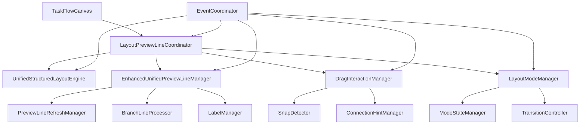
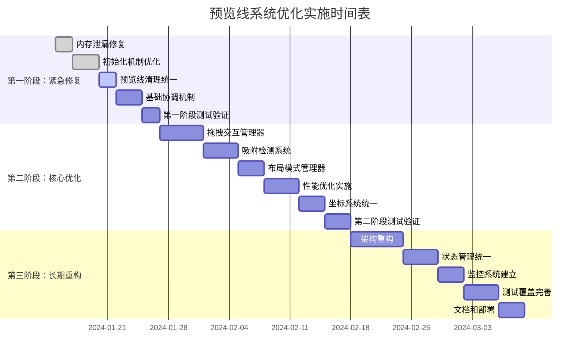

# 预览线系统综合优化方案

## 1. 概述

本方案基于《预览线代码评估报告》和《预览线代码评估报告补充分析》，对营销任务编辑器预览线系统的43个关键问题进行综合分析，提供分阶段的系统优化实施方案。

### 1.1 问题统计

* **原报告问题**: 14个

* **补充报告问题**: 29个

* **总计问题**: 43个

* **涉及组件**: 8个核心组件

* **影响范围**: 预览线管理、布局引擎、拖拽交互、发布流程

### 1.2 优化目标

1. **稳定性提升**: 解决内存泄漏和状态不一致问题
2. **性能优化**: 减少资源竞争，提升响应速度
3. **架构重构**: 建立清晰的组件协调机制
4. **用户体验**: 改善交互流畅性和视觉一致性

## 2. 问题优先级重新评估和分类

### 2.1 紧急修复级别（P0 - 立即处理）

#### 2.1.1 系统稳定性问题

| 问题ID | 问题描述                 | 影响程度 | 实施难度 | 预计工时 |
| ---- | -------------------- | ---- | ---- | ---- |
| P01  | MutationObserver内存泄漏 | 高    | 低    | 4h   |
| P02  | 初始化重复调用导致状态不一致       | 高    | 中    | 8h   |
| P03  | 预览线清理不彻底             | 高    | 中    | 6h   |
| P04  | 布局与预览线时序冲突           | 高    | 高    | 12h  |
| P05  | 事件监听器累积泄漏            | 中    | 低    | 4h   |

**总计工时**: 34小时

#### 2.1.2 核心功能缺失

| 问题ID | 问题描述                     | 影响程度 | 实施难度 | 预计工时 |
| ---- | ------------------------ | ---- | ---- | ---- |
| P06  | DragInteractionManager缺失 | 高    | 高    | 16h  |
| P07  | 拖拽吸附机制未实现                | 高    | 高    | 20h  |
| P08  | LayoutModeManager缺失      | 中    | 中    | 12h  |

**总计工时**: 48小时

### 2.2 核心优化级别（P1 - 近期处理）

#### 2.2.1 性能优化问题

| 问题ID | 问题描述           | 影响程度 | 实施难度 | 预计工时 |
| ---- | -------------- | ---- | ---- | ---- |
| P09  | 布局计算与预览线刷新性能冲突 | 中    | 高    | 16h  |
| P10  | 批处理队列无界增长      | 中    | 中    | 8h   |
| P11  | 日志系统过于激进的抑制机制  | 低    | 低    | 4h   |
| P12  | 缓存策略不协调        | 中    | 中    | 10h  |

**总计工时**: 38小时

#### 2.2.2 架构协调问题

| 问题ID | 问题描述           | 影响程度 | 实施难度 | 预计工时 |
| ---- | -------------- | ---- | ---- | ---- |
| P13  | 预览线坐标系与布局引擎不一致 | 中    | 高    | 14h  |
| P14  | 分支标签管理系统缺失     | 中    | 中    | 12h  |
| P15  | 事件传播机制不完整      | 中    | 中    | 10h  |
| P16  | 发布流程清理机制冲突     | 中    | 中    | 8h   |

**总计工时**: 44小时

### 2.3 长期重构级别（P2 - 长期规划）

#### 2.3.1 架构重构

| 问题ID | 问题描述          | 影响程度 | 实施难度 | 预计工时 |
| ---- | ------------- | ---- | ---- | ---- |
| P17  | 预览线管理器职责过重    | 低    | 高    | 24h  |
| P18  | 多处状态存储导致数据不一致 | 中    | 高    | 20h  |
| P19  | 异步事件处理竞态条件    | 低    | 高    | 16h  |

**总计工时**: 60小时

## 3. 系统架构重构建议

### 3.1 新架构设计



### 3.2 核心组件职责重新定义

#### 3.2.1 LayoutPreviewLineCoordinator（新增）

**职责**: 协调布局引擎与预览线管理器的交互

```javascript
class LayoutPreviewLineCoordinator {
  constructor(layoutEngine, previewLineManager, eventCoordinator) {
    this.layoutEngine = layoutEngine;
    this.previewLineManager = previewLineManager;
    this.eventCoordinator = eventCoordinator;
    this.isCoordinating = false;
    this.coordinationQueue = [];
  }

  async executeCoordinatedLayout(trigger = 'auto') {
    if (this.isCoordinating) {
      return this.queueCoordination(trigger);
    }

    this.isCoordinating = true;
    
    try {
      // 1. 通知开始协调
      this.eventCoordinator.emit('coordination:start', { trigger });
      
      // 2. 暂停预览线自动更新
      await this.previewLineManager.pauseAutoUpdates();
      
      // 3. 执行布局计算
      const layoutResult = await this.layoutEngine.executeLayout();
      
      // 4. 基于新布局更新预览线
      await this.previewLineManager.updateBasedOnLayout(layoutResult);
      
      // 5. 恢复预览线更新
      await this.previewLineManager.resumeAutoUpdates();
      
      // 6. 通知协调完成
      this.eventCoordinator.emit('coordination:complete', { 
        trigger, 
        layoutResult 
      });
      
      return { success: true, layoutResult };
    } catch (error) {
      this.eventCoordinator.emit('coordination:error', { trigger, error });
      throw error;
    } finally {
      this.isCoordinating = false;
      await this.processCoordinationQueue();
    }
  }

  async queueCoordination(trigger) {
    return new Promise((resolve, reject) => {
      this.coordinationQueue.push({ trigger, resolve, reject });
    });
  }

  async processCoordinationQueue() {
    while (this.coordinationQueue.length > 0) {
      const { trigger, resolve, reject } = this.coordinationQueue.shift();
      try {
        const result = await this.executeCoordinatedLayout(trigger);
        resolve(result);
      } catch (error) {
        reject(error);
      }
    }
  }
}
```

#### 3.2.2 DragInteractionManager（新增）

**职责**: 统一管理拖拽交互和吸附机制

```javascript
class DragInteractionManager {
  constructor(graph, previewLineManager, layoutModeManager, snapDetector) {
    this.graph = graph;
    this.previewLineManager = previewLineManager;
    this.layoutModeManager = layoutModeManager;
    this.snapDetector = snapDetector;
    this.dragState = new Map();
    this.setupEventListeners();
  }

  setupEventListeners() {
    this.graph.on('node:mousedown', this.onNodeDragStart.bind(this));
    this.graph.on('node:mousemove', this.onNodeDragMove.bind(this));
    this.graph.on('node:mouseup', this.onNodeDragEnd.bind(this));
    this.graph.on('edge:mousedown', this.onPreviewLineDragStart.bind(this));
  }

  onNodeDragStart(node, event) {
    const nodeId = node.id;
    
    // 初始化拖拽状态
    this.dragState.set(nodeId, {
      startPosition: node.getPosition(),
      startTime: Date.now(),
      isDragging: true,
      snapCandidates: []
    });

    // 通知布局模式管理器开始手工操作
    this.layoutModeManager.startManualOperation(nodeId);

    // 获取可连接的预览线
    const connectableLines = this.previewLineManager.getConnectablePreviewLines(node);
    
    // 高亮预览线
    connectableLines.forEach(line => {
      this.previewLineManager.highlightPreviewLine(line.id, 'connectable');
    });

    // 缓存吸附候选
    const snapCandidates = this.snapDetector.findSnapCandidates(node);
    this.dragState.get(nodeId).snapCandidates = snapCandidates;
  }

  onNodeDragMove(node, event) {
    const nodeId = node.id;
    const dragInfo = this.dragState.get(nodeId);
    
    if (!dragInfo || !dragInfo.isDragging) return;

    const currentPosition = node.getPosition();
    
    // 检测吸附
    const snapResult = this.snapDetector.detectSnap(
      currentPosition, 
      dragInfo.snapCandidates
    );

    if (snapResult.shouldSnap) {
      // 显示吸附提示
      this.showSnapHint(snapResult.target, snapResult.snapPoint);
      
      // 调整节点位置
      node.setPosition(snapResult.snapPoint);
    } else {
      // 隐藏吸附提示
      this.hideSnapHint();
    }

    // 更新相关预览线
    this.previewLineManager.updatePreviewLinesForNode(nodeId);
  }

  onNodeDragEnd(node, event) {
    const nodeId = node.id;
    const dragInfo = this.dragState.get(nodeId);
    
    if (!dragInfo) return;

    // 检查是否需要创建连接
    const finalPosition = node.getPosition();
    const snapResult = this.snapDetector.detectSnap(
      finalPosition, 
      dragInfo.snapCandidates
    );

    if (snapResult.shouldSnap && snapResult.target.type === 'previewLine') {
      // 创建实际连接
      this.createConnectionFromSnap(node, snapResult.target);
    }

    // 清理拖拽状态
    this.cleanupDragState(nodeId);
    
    // 通知布局模式管理器结束手工操作
    this.layoutModeManager.endManualOperation(nodeId);
    
    // 清理高亮
    this.previewLineManager.clearAllHighlights();
    this.hideSnapHint();
  }

  createConnectionFromSnap(node, previewLineTarget) {
    const previewLine = previewLineTarget.previewLine;
    const connectionPoint = previewLineTarget.connectionPoint;

    // 创建实际连接
    const edge = this.graph.addEdge({
      source: previewLine.source,
      target: node.id,
      attrs: {
        line: {
          stroke: '#1890ff',
          strokeWidth: 2
        }
      }
    });

    // 移除预览线
    this.previewLineManager.removePreviewLine(previewLine.id);

    return edge;
  }

  showSnapHint(target, snapPoint) {
    // 显示吸附提示UI
    if (!this.snapHintElement) {
      this.snapHintElement = document.createElement('div');
      this.snapHintElement.className = 'snap-hint';
      this.graph.container.appendChild(this.snapHintElement);
    }

    this.snapHintElement.style.left = `${snapPoint.x}px`;
    this.snapHintElement.style.top = `${snapPoint.y}px`;
    this.snapHintElement.style.display = 'block';
  }

  hideSnapHint() {
    if (this.snapHintElement) {
      this.snapHintElement.style.display = 'none';
    }
  }

  cleanupDragState(nodeId) {
    this.dragState.delete(nodeId);
  }

  cleanup() {
    // 清理事件监听器
    this.graph.off('node:mousedown');
    this.graph.off('node:mousemove');
    this.graph.off('node:mouseup');
    this.graph.off('edge:mousedown');
    
    // 清理DOM元素
    if (this.snapHintElement) {
      this.snapHintElement.remove();
    }
    
    // 清理状态
    this.dragState.clear();
  }
}
```

#### 3.2.3 LayoutModeManager（新增）

**职责**: 管理布局模式切换和状态

```javascript
class LayoutModeManager {
  constructor(eventCoordinator) {
    this.eventCoordinator = eventCoordinator;
    this.currentMode = 'unified'; // 'unified' | 'manual'
    this.manualOperations = new Set();
    this.modeTransitionCallbacks = new Map();
    this.autoLayoutPaused = false;
  }

  setLayoutMode(mode) {
    if (this.currentMode === mode) return;

    const previousMode = this.currentMode;
    this.currentMode = mode;

    // 触发模式切换事件
    this.eventCoordinator.emit('layoutMode:change', {
      from: previousMode,
      to: mode,
      timestamp: Date.now()
    });

    // 执行模式特定的初始化
    this.initializeModeSpecificBehavior(mode);
  }

  startManualOperation(operationId) {
    this.manualOperations.add(operationId);
    
    if (this.manualOperations.size === 1) {
      // 第一个手工操作，暂停自动布局
      this.pauseAutoLayout();
      this.eventCoordinator.emit('manualOperation:start', { operationId });
    }
  }

  endManualOperation(operationId) {
    this.manualOperations.delete(operationId);
    
    if (this.manualOperations.size === 0) {
      // 所有手工操作结束，恢复自动布局
      this.resumeAutoLayout();
      this.eventCoordinator.emit('manualOperation:end', { operationId });
    }
  }

  pauseAutoLayout() {
    if (!this.autoLayoutPaused) {
      this.autoLayoutPaused = true;
      this.eventCoordinator.emit('autoLayout:pause');
    }
  }

  resumeAutoLayout() {
    if (this.autoLayoutPaused) {
      this.autoLayoutPaused = false;
      this.eventCoordinator.emit('autoLayout:resume');
    }
  }

  isManualOperationActive() {
    return this.manualOperations.size > 0;
  }

  shouldExecuteAutoLayout() {
    return this.currentMode === 'unified' && 
           !this.autoLayoutPaused && 
           this.manualOperations.size === 0;
  }

  initializeModeSpecificBehavior(mode) {
    if (mode === 'manual') {
      // 手工模式：启用拖拽吸附，禁用自动布局
      this.eventCoordinator.emit('dragInteraction:enable');
      this.eventCoordinator.emit('autoLayout:disable');
    } else if (mode === 'unified') {
      // 统一模式：禁用某些手动交互，启用自动布局
      this.eventCoordinator.emit('dragInteraction:configure', { mode: 'limited' });
      this.eventCoordinator.emit('autoLayout:enable');
    }
  }
}
```

#### 3.2.4 EventCoordinator（新增）

**职责**: 统一事件协调和优先级管理

```javascript
class EventCoordinator extends EventEmitter {
  constructor() {
    super();
    this.eventQueue = [];
    this.isProcessing = false;
    this.eventPriorities = new Map([
      ['coordination:start', 10],
      ['layoutMode:change', 9],
      ['manualOperation:start', 8],
      ['autoLayout:pause', 7],
      ['previewLine:update', 5],
      ['node:position:change', 4],
      ['ui:update', 2]
    ]);
    this.eventHandlers = new Map();
  }

  async coordinateEvent(eventType, eventData, priority = null) {
    const eventPriority = priority || this.eventPriorities.get(eventType) || 1;
    
    const event = {
      type: eventType,
      data: eventData,
      priority: eventPriority,
      timestamp: Date.now(),
      id: this.generateEventId()
    };

    this.eventQueue.push(event);
    this.eventQueue.sort((a, b) => b.priority - a.priority);

    if (!this.isProcessing) {
      await this.processEventQueue();
    }

    return event.id;
  }

  async processEventQueue() {
    this.isProcessing = true;

    while (this.eventQueue.length > 0) {
      const event = this.eventQueue.shift();
      
      try {
        await this.handleEvent(event);
      } catch (error) {
        console.error(`事件处理失败: ${event.type}`, error);
        this.emit('event:error', { event, error });
      }
    }

    this.isProcessing = false;
  }

  async handleEvent(event) {
    // 触发标准事件监听器
    this.emit(event.type, event.data);

    // 执行注册的特殊处理器
    const handler = this.eventHandlers.get(event.type);
    if (handler) {
      await handler(event.data, event);
    }
  }

  registerEventHandler(eventType, handler) {
    this.eventHandlers.set(eventType, handler);
  }

  generateEventId() {
    return `event_${Date.now()}_${Math.random().toString(36).substr(2, 9)}`;
  }

  getQueueStatus() {
    return {
      queueLength: this.eventQueue.length,
      isProcessing: this.isProcessing,
      nextEvent: this.eventQueue[0] || null
    };
  }
}
```

## 4. 分阶段实施计划

### 4.1 第一阶段：紧急修复（1-2周）

#### 4.1.1 实施目标

* 解决系统稳定性问题

* 修复内存泄漏

* 建立基础协调机制

#### 4.1.2 具体任务

**Week 1**

* [ ] 修复MutationObserver内存泄漏（P01）

* [ ] 实现初始化状态管理机制（P02）

* [ ] 统一预览线清理接口（P03）

* [ ] 清理事件监听器泄漏（P05）

**Week 2**

* [ ] 实现LayoutPreviewLineCoordinator基础版本（P04）

* [ ] 建立EventCoordinator基础框架

* [ ] 集成测试和验证

#### 4.1.3 验收标准

* [ ] 内存使用稳定，无明显泄漏

* [ ] 初始化过程无重复调用

* [ ] 预览线清理完整性达到95%

* [ ] 布局与预览线时序冲突解决

### 4.2 第二阶段：核心优化（3-4周）

#### 4.2.1 实施目标

* 实现完整的拖拽交互系统

* 优化性能和协调机制

* 建立完善的状态管理

#### 4.2.2 具体任务

**Week 3-4**

* [ ] 实现DragInteractionManager（P06）

* [ ] 开发SnapDetector吸附检测系统（P07）

* [ ] 实现LayoutModeManager（P08）

**Week 5-6**

* [ ] 优化性能冲突问题（P09）

* [ ] 实现智能批处理机制（P10）

* [ ] 统一坐标系统（P13）

* [ ] 实现LabelManager（P14）

#### 4.2.3 验收标准

* [ ] 拖拽吸附功能完整可用

* [ ] 布局模式切换流畅

* [ ] 性能提升30%以上

* [ ] 坐标系统统一，无偏移问题

### 4.3 第三阶段：长期重构（4-6周）

#### 4.3.1 实施目标

* 完成架构重构

* 建立完善的监控和测试体系

* 优化长期维护性

#### 4.3.2 具体任务

**Week 7-8**

* [ ] 重构预览线管理器职责分离（P17）

* [ ] 统一状态管理机制（P18）

* [ ] 完善事件传播机制（P15）

**Week 9-10**

* [ ] 解决异步竞态条件（P19）

* [ ] 实现性能监控系统

* [ ] 建立完整的测试覆盖

**Week 11-12**

* [ ] 文档完善和知识转移

* [ ] 性能基准测试

* [ ] 生产环境部署和监控

#### 4.3.3 验收标准

* [ ] 代码架构清晰，职责分离明确

* [ ] 测试覆盖率达到80%以上

* [ ] 性能监控体系完善

* [ ] 文档完整，便于维护

## 5. 具体代码实现方案

### 5.1 内存泄漏修复方案

#### 5.1.1 ResourceManager实现

```javascript
class ResourceManager {
  constructor() {
    this.resources = new Map();
    this.cleanupCallbacks = new Map();
    this.isDestroyed = false;
  }

  register(resourceId, resource, cleanupCallback) {
    if (this.isDestroyed) {
      console.warn('ResourceManager已销毁，无法注册新资源');
      return false;
    }

    this.resources.set(resourceId, resource);
    this.cleanupCallbacks.set(resourceId, cleanupCallback);
    
    return true;
  }

  unregister(resourceId) {
    const resource = this.resources.get(resourceId);
    const cleanupCallback = this.cleanupCallbacks.get(resourceId);

    if (cleanupCallback && resource) {
      try {
        cleanupCallback(resource);
      } catch (error) {
        console.error(`资源清理失败: ${resourceId}`, error);
      }
    }

    this.resources.delete(resourceId);
    this.cleanupCallbacks.delete(resourceId);
  }

  cleanup() {
    for (const [resourceId] of this.resources) {
      this.unregister(resourceId);
    }
    
    this.isDestroyed = true;
  }

  getResourceCount() {
    return this.resources.size;
  }
}
```

#### 5.1.2 改进的MutationObserver管理

```javascript
class SafeMutationObserver {
  constructor(callback, options = {}) {
    this.callback = callback;
    this.options = options;
    this.observer = null;
    this.isObserving = false;
    this.targetElements = new Set();
  }

  observe(target) {
    if (!this.observer) {
      this.observer = new MutationObserver(this.callback);
    }

    if (!this.isObserving) {
      this.observer.observe(target, this.options);
      this.isObserving = true;
    }

    this.targetElements.add(target);
  }

  disconnect() {
    if (this.observer && this.isObserving) {
      this.observer.disconnect();
      this.isObserving = false;
      this.targetElements.clear();
    }
  }

  reconnect() {
    if (this.observer && !this.isObserving && this.targetElements.size > 0) {
      for (const target of this.targetElements) {
        this.observer.observe(target, this.options);
      }
      this.isObserving = true;
    }
  }

  destroy() {
    this.disconnect();
    this.observer = null;
    this.callback = null;
    this.targetElements.clear();
  }
}
```

### 5.2 智能批处理系统

```javascript
class AdaptiveBatchProcessor {
  constructor(options = {}) {
    this.options = {
      initialBatchSize: 10,
      minBatchSize: 5,
      maxBatchSize: 50,
      initialDelay: 100,
      minDelay: 50,
      maxDelay: 500,
      performanceThreshold: 200, // ms
      ...options
    };

    this.currentBatchSize = this.options.initialBatchSize;
    this.currentDelay = this.options.initialDelay;
    this.performanceHistory = [];
    this.queue = [];
    this.isProcessing = false;
    this.batchTimer = null;
  }

  addTask(task, priority = 1) {
    const taskItem = {
      task,
      priority,
      timestamp: Date.now(),
      id: this.generateTaskId()
    };

    this.queue.push(taskItem);
    this.queue.sort((a, b) => b.priority - a.priority);

    this.scheduleBatchProcessing();
    
    return taskItem.id;
  }

  scheduleBatchProcessing() {
    if (this.batchTimer) {
      clearTimeout(this.batchTimer);
    }

    this.batchTimer = setTimeout(() => {
      this.processBatch();
    }, this.currentDelay);
  }

  async processBatch() {
    if (this.isProcessing || this.queue.length === 0) {
      return;
    }

    this.isProcessing = true;
    const startTime = performance.now();

    try {
      const batch = this.queue.splice(0, this.currentBatchSize);
      const results = await Promise.allSettled(
        batch.map(item => this.executeTask(item))
      );

      const endTime = performance.now();
      const processingTime = endTime - startTime;

      this.recordPerformance(processingTime, batch.length);
      this.adjustBatchParameters(processingTime);

      // 如果还有任务，继续处理
      if (this.queue.length > 0) {
        this.scheduleBatchProcessing();
      }

      return results;
    } finally {
      this.isProcessing = false;
    }
  }

  async executeTask(taskItem) {
    try {
      return await taskItem.task();
    } catch (error) {
      console.error(`任务执行失败: ${taskItem.id}`, error);
      throw error;
    }
  }

  recordPerformance(processingTime, batchSize) {
    this.performanceHistory.push({
      processingTime,
      batchSize,
      timestamp: Date.now()
    });

    // 保持历史记录在合理范围内
    if (this.performanceHistory.length > 100) {
      this.performanceHistory.shift();
    }
  }

  adjustBatchParameters(processingTime) {
    const avgProcessingTime = this.getAverageProcessingTime();

    if (avgProcessingTime > this.options.performanceThreshold) {
      // 性能不佳，减少批次大小，增加延迟
      this.currentBatchSize = Math.max(
        this.options.minBatchSize,
        this.currentBatchSize - 1
      );
      this.currentDelay = Math.min(
        this.options.maxDelay,
        this.currentDelay + 10
      );
    } else if (avgProcessingTime < this.options.performanceThreshold / 2) {
      // 性能良好，增加批次大小，减少延迟
      this.currentBatchSize = Math.min(
        this.options.maxBatchSize,
        this.currentBatchSize + 1
      );
      this.currentDelay = Math.max(
        this.options.minDelay,
        this.currentDelay - 5
      );
    }
  }

  getAverageProcessingTime() {
    if (this.performanceHistory.length === 0) {
      return 0;
    }

    const recentHistory = this.performanceHistory.slice(-10);
    const totalTime = recentHistory.reduce((sum, record) => sum + record.processingTime, 0);
    
    return totalTime / recentHistory.length;
  }

  generateTaskId() {
    return `task_${Date.now()}_${Math.random().toString(36).substr(2, 9)}`;
  }

  getQueueStatus() {
    return {
      queueLength: this.queue.length,
      isProcessing: this.isProcessing,
      currentBatchSize: this.currentBatchSize,
      currentDelay: this.currentDelay,
      avgProcessingTime: this.getAverageProcessingTime()
    };
  }

  clear() {
    this.queue = [];
    if (this.batchTimer) {
      clearTimeout(this.batchTimer);
      this.batchTimer = null;
    }
  }
}
```

### 5.3 吸附检测系统

```javascript
class SnapDetector {
  constructor(options = {}) {
    this.options = {
      snapThreshold: 30,
      previewLineSnapThreshold: 20,
      nodeSnapThreshold: 25,
      gridSnapThreshold: 15,
      enableGridSnap: true,
      enableNodeSnap: true,
      enablePreviewLineSnap: true,
      ...options
    };

    this.snapCache = new Map();
    this.gridSize = 20;
  }

  findSnapCandidates(node) {
    const nodeId = node.id;
    const cacheKey = `${nodeId}_${Date.now()}`;
    
    // 检查缓存
    if (this.snapCache.has(nodeId)) {
      const cached = this.snapCache.get(nodeId);
      if (Date.now() - cached.timestamp < 1000) {
        return cached.candidates;
      }
    }

    const candidates = [];
    const nodePosition = node.getPosition();
    const nodeSize = node.getSize();

    // 1. 网格吸附候选
    if (this.options.enableGridSnap) {
      candidates.push(...this.findGridSnapCandidates(nodePosition, nodeSize));
    }

    // 2. 节点吸附候选
    if (this.options.enableNodeSnap) {
      candidates.push(...this.findNodeSnapCandidates(node));
    }

    // 3. 预览线吸附候选
    if (this.options.enablePreviewLineSnap) {
      candidates.push(...this.findPreviewLineSnapCandidates(node));
    }

    // 缓存结果
    this.snapCache.set(nodeId, {
      candidates,
      timestamp: Date.now()
    });

    return candidates;
  }

  detectSnap(position, candidates) {
    let bestSnap = null;
    let minDistance = Infinity;

    for (const candidate of candidates) {
      const distance = this.calculateDistance(position, candidate.snapPoint);
      
      if (distance < candidate.threshold && distance < minDistance) {
        minDistance = distance;
        bestSnap = candidate;
      }
    }

    return {
      shouldSnap: bestSnap !== null,
      target: bestSnap,
      snapPoint: bestSnap ? bestSnap.snapPoint : position,
      distance: minDistance
    };
  }

  findGridSnapCandidates(position, size) {
    const candidates = [];
    const { x, y } = position;
    const { width, height } = size;

    // 计算最近的网格点
    const snapX = Math.round(x / this.gridSize) * this.gridSize;
    const snapY = Math.round(y / this.gridSize) * this.gridSize;

    // 左上角吸附
    candidates.push({
      type: 'grid',
      snapPoint: { x: snapX, y: snapY },
      threshold: this.options.gridSnapThreshold,
      description: '网格左上角'
    });

    // 中心点吸附
    const centerSnapX = Math.round((x + width / 2) / this.gridSize) * this.gridSize - width / 2;
    const centerSnapY = Math.round((y + height / 2) / this.gridSize) * this.gridSize - height / 2;
    
    candidates.push({
      type: 'grid',
      snapPoint: { x: centerSnapX, y: centerSnapY },
      threshold: this.options.gridSnapThreshold,
      description: '网格中心'
    });

    return candidates;
  }

  findNodeSnapCandidates(dragNode) {
    const candidates = [];
    const dragPosition = dragNode.getPosition();
    const dragSize = dragNode.getSize();
    
    // 获取所有其他节点
    const allNodes = this.graph.getNodes().filter(node => node.id !== dragNode.id);

    for (const node of allNodes) {
      const nodePosition = node.getPosition();
      const nodeSize = node.getSize();

      // 水平对齐
      candidates.push({
        type: 'node',
        targetNode: node,
        snapPoint: { x: nodePosition.x, y: dragPosition.y },
        threshold: this.options.nodeSnapThreshold,
        description: `与节点${node.id}左对齐`
      });

      // 垂直对齐
      candidates.push({
        type: 'node',
        targetNode: node,
        snapPoint: { x: dragPosition.x, y: nodePosition.y },
        threshold: this.options.nodeSnapThreshold,
        description: `与节点${node.id}上对齐`
      });

      // 中心对齐
      const nodeCenterX = nodePosition.x + nodeSize.width / 2;
      const nodeCenterY = nodePosition.y + nodeSize.height / 2;
      const dragCenterX = dragPosition.x + dragSize.width / 2;
      const dragCenterY = dragPosition.y + dragSize.height / 2;

      candidates.push({
        type: 'node',
        targetNode: node,
        snapPoint: { 
          x: nodeCenterX - dragSize.width / 2, 
          y: dragPosition.y 
        },
        threshold: this.options.nodeSnapThreshold,
        description: `与节点${node.id}水平中心对齐`
      });

      candidates.push({
        type: 'node',
        targetNode: node,
        snapPoint: { 
          x: dragPosition.x, 
          y: nodeCenterY - dragSize.height / 2 
        },
        threshold: this.options.nodeSnapThreshold,
        description: `与节点${node.id}垂直中心对齐`
      });
    }

    return candidates;
  }

  findPreviewLineSnapCandidates(node) {
    const candidates = [];
    const nodePosition = node.getPosition();
    const nodeSize = node.getSize();
    const nodeCenter = {
      x: nodePosition.x + nodeSize.width / 2,
      y: nodePosition.y + nodeSize.height / 2
    };

    // 获取所有预览线
    const previewLines = this.previewLineManager.getAllPreviewLines();

    for (const previewLine of previewLines) {
      // 检查是否可以连接到此预览线
      if (!this.canConnectToPreviewLine(node, previewLine)) {
        continue;
      }

      // 计算预览线上的最近点
      const closestPoint = this.findClosestPointOnPreviewLine(nodeCenter, previewLine);
      
      if (closestPoint) {
        candidates.push({
          type: 'previewLine',
          previewLine: previewLine,
          snapPoint: {
            x: closestPoint.x - nodeSize.width / 2,
            y: closestPoint.y - nodeSize.height / 2
          },
          connectionPoint: closestPoint,
          threshold: this.options.previewLineSnapThreshold,
          description: `连接到预览线${previewLine.id}`
        });
      }
    }

    return candidates;
  }

  findClosestPointOnPreviewLine(point, previewLine) {
    const start = previewLine.getStartPoint();
    const end = previewLine.getEndPoint();

    // 计算点到线段的最近点
    const A = point.x - start.x;
    const B = point.y - start.y;
    const C = end.x - start.x;
    const D = end.y - start.y;

    const dot = A * C + B * D;
    const lenSq = C * C + D * D;
    
    if (lenSq === 0) {
      return start; // 线段长度为0
    }

    let param = dot / lenSq;
    
    // 限制在线段范围内
    param = Math.max(0, Math.min(1, param));

    return {
      x: start.x + param * C,
      y: start.y + param * D
    };
  }

  canConnectToPreviewLine(node, previewLine) {
    // 检查节点类型是否兼容
    const nodeType = node.getData().type;
    const previewLineType = previewLine.getTargetType();

    // 实现具体的兼容性检查逻辑
    return this.isCompatibleConnection(nodeType, previewLineType);
  }

  isCompatibleConnection(nodeType, previewLineType) {
    // 定义兼容性规则
    const compatibilityRules = {
      'action': ['condition', 'end'],
      'condition': ['action', 'end'],
      'start': ['action', 'condition'],
      'end': []
    };

    return compatibilityRules[nodeType]?.includes(previewLineType) || false;
  }

  calculateDistance(point1, point2) {
    const dx = point1.x - point2.x;
    const dy = point1.y - point2.y;
    return Math.sqrt(dx * dx + dy * dy);
  }

  clearCache() {
    this.snapCache.clear();
  }

  updateOptions(newOptions) {
    this.options = { ...this.options, ...newOptions };
    this.clearCache();
  }
}
```

## 6. 性能监控和质量保证机制

### 6.1 性能监控系统

```javascript
class PerformanceMonitor {
  constructor() {
    this.metrics = new Map();
    this.thresholds = {
      layoutExecutionTime: 500, // ms
      previewLineUpdateTime: 100, // ms
      memoryUsage: 50 * 1024 * 1024, // 50MB
      frameRate: 30, // fps
      eventProcessingTime: 50 // ms
    };
    this.alerts = [];
    this.isMonitoring = false;
  }

  startMonitoring() {
    if (this.isMonitoring) return;
    
    this.isMonitoring = true;
    this.startMemoryMonitoring();
    this.startFrameRateMonitoring();
    
    console.log('性能监控已启动');
  }

  stopMonitoring() {
    this.isMonitoring = false;
    
    if (this.memoryMonitorInterval) {
      clearInterval(this.memoryMonitorInterval);
    }
    
    if (this.frameRateMonitorId) {
      cancelAnimationFrame(this.frameRateMonitorId);
    }
    
    console.log('性能监控已停止');
  }

  startMeasure(operation) {
    const startTime = performance.now();
    const startMemory = performance.memory?.usedJSHeapSize || 0;
    
    return {
      end: () => {
        const endTime = performance.now();
        const endMemory = performance.memory?.usedJSHeapSize || 0;
        
        const metrics = {
          duration: endTime - startTime,
          memoryDelta: endMemory - startMemory,
          timestamp: Date.now()
        };
        
        this.recordMetric(operation, metrics);
        this.checkThresholds(operation, metrics);
        
        return metrics;
      }
    };
  }

  recordMetric(operation, metrics) {
    if (!this.metrics.has(operation)) {
      this.metrics.set(operation, []);
    }
    
    const operationMetrics = this.metrics.get(operation);
    operationMetrics.push(metrics);
    
    // 保持最近100条记录
    if (operationMetrics.length > 100) {
      operationMetrics.shift();
    }
  }

  checkThresholds(operation, metrics) {
    const threshold = this.thresholds[operation];
    
    if (threshold && metrics.duration > threshold) {
      this.addAlert({
        type: 'performance',
        operation,
        message: `${operation}执行时间超过阈值: ${metrics.duration.toFixed(2)}ms > ${threshold}ms`,
        severity: 'warning',
        timestamp: Date.now(),
        metrics
      });
    }
  }

  startMemoryMonitoring() {
    this.memoryMonitorInterval = setInterval(() => {
      if (!this.isMonitoring) return;
      
      const memoryInfo = performance.memory;
      if (memoryInfo) {
        const currentUsage = memoryInfo.usedJSHeapSize;
        
        this.recordMetric('memoryUsage', {
          usage: currentUsage,
          limit: memoryInfo.jsHeapSizeLimit,
          timestamp: Date.now()
        });
        
        if (currentUsage > this.thresholds.memoryUsage) {
          this.addAlert({
            type: 'memory',
            message: `内存使用量过高: ${(currentUsage / 1024 / 1024).toFixed(2)}MB`,
            severity: 'error',
            timestamp: Date.now()
          });
        }
      }
    }, 5000); // 每5秒检查一次
  }

  startFrameRateMonitoring() {
    let lastTime = performance.now();
    let frameCount = 0;
    
    const measureFrameRate = (currentTime) => {
      frameCount++;
      
      if (currentTime - lastTime >= 1000) {
        const fps = frameCount;
        frameCount = 0;
        lastTime = currentTime;
        
        this.recordMetric('frameRate', {
          fps,
          timestamp: Date.now()
        });
        
        if (fps < this.thresholds.frameRate) {
          this.addAlert({
            type: 'frameRate',
            message: `帧率过低: ${fps}fps < ${this.thresholds.frameRate}fps`,
            severity: 'warning',
            timestamp: Date.now()
          });
        }
      }
      
      if (this.isMonitoring) {
        this.frameRateMonitorId = requestAnimationFrame(measureFrameRate);
      }
    };
    
    this.frameRateMonitorId = requestAnimationFrame(measureFrameRate);
  }

  addAlert(alert) {
    this.alerts.push(alert);
    
    // 保持最近50条告警
    if (this.alerts.length > 50) {
      this.alerts.shift();
    }
    
    // 触发告警事件
    this.onAlert?.(alert);
  }

  getMetricsSummary(operation) {
    const metrics = this.metrics.get(operation) || [];
    
    if (metrics.length === 0) {
      return null;
    }
    
    const durations = metrics.map(m => m.duration).filter(d => d !== undefined);
    const memoryDeltas = metrics.map(m => m.memoryDelta).filter(d => d !== undefined);
    
    return {
      operation,
      count: metrics.length,
      avgDuration: durations.length > 0 ? durations.reduce((a, b) => a + b) / durations.length : 0,
      maxDuration: durations.length > 0 ? Math.max(...durations) : 0,
      minDuration: durations.length > 0 ? Math.min(...durations) : 0,
      avgMemoryDelta: memoryDeltas.length > 0 ? memoryDeltas.reduce((a, b) => a + b) / memoryDeltas.length : 0,
      lastExecution: metrics[metrics.length - 1]?.timestamp
    };
  }

  getAllMetricsSummary() {
    const summary = {};
    
    for (const [operation] of this.metrics) {
      summary[operation] = this.getMetricsSummary(operation);
    }
    
    return summary;
  }

  getRecentAlerts(count = 10) {
    return this.alerts.slice(-count);
  }

  clearMetrics() {
    this.metrics.clear();
    this.alerts = [];
  }

  exportMetrics() {
    return {
      metrics: Object.fromEntries(this.metrics),
      alerts: this.alerts,
      thresholds: this.thresholds,
      timestamp: Date.now()
    };
  }
}
```

### 6.2 质量保证检查器

```javascript
class QualityAssuranceChecker {
  constructor(previewLineManager, layoutEngine, eventCoordinator) {
    this.previewLineManager = previewLineManager;
    this.layoutEngine = layoutEngine;
    this.eventCoordinator = eventCoordinator;
    this.checks = new Map();
    this.setupChecks();
  }

  setupChecks() {
    // 预览线一致性检查
    this.checks.set('previewLineConsistency', {
      name: '预览线一致性检查',
      execute: () => this.checkPreviewLineConsistency(),
      frequency: 30000, // 30秒
      severity: 'error'
    });

    // 内存泄漏检查
    this.checks.set('memoryLeak', {
      name: '内存泄漏检查',
      execute: () => this.checkMemoryLeak(),
      frequency: 60000, // 1分钟
      severity: 'warning'
    });

    // 事件监听器检查
    this.checks.set('eventListeners', {
      name: '事件监听器检查',
      execute: () => this.checkEventListeners(),
      frequency: 120000, // 2分钟
      severity: 'warning'
    });

    // 状态同步检查
    this.checks.set('stateSync', {
      name: '状态同步检查',
      execute: () => this.checkStateSync(),
      frequency: 45000, // 45秒
      severity: 'error'
    });
  }

  async checkPreviewLineConsistency() {
    const issues = [];
    
    try {
      // 检查预览线数据一致性
      const previewLines = this.previewLineManager.getAllPreviewLines();
      const domElements = document.querySelectorAll('.preview-line');
      
      if (previewLines.length !== domElements.length) {
        issues.push({
          type: 'inconsistency',
          message: `预览线数据与DOM不一致: 数据${previewLines.length}条, DOM${domElements.length}个`,
          severity: 'error'
        });
      }

      // 检查孤立预览线
      for (const previewLine of previewLines) {
        const sourceNode = this.layoutEngine.getNodeById(previewLine.sourceId);
        if (!sourceNode) {
          issues.push({
            type: 'orphaned',
            message: `发现孤立预览线: ${previewLine.id}, 源节点${previewLine.sourceId}不存在`,
            severity: 'warning',
            previewLineId: previewLine.id
          });
        }
      }

      // 检查重复预览线
      const sourceTargetPairs = new Set();
      for (const previewLine of previewLines) {
        const pair = `${previewLine.sourceId}-${previewLine.targetId || 'none'}`;
        if (sourceTargetPairs.has(pair)) {
          issues.push({
            type: 'duplicate',
            message: `发现重复预览线: ${pair}`,
            severity: 'warning'
          });
        }
        sourceTargetPairs.add(pair);
      }

    } catch (error) {
      issues.push({
        type: 'error',
        message: `预览线一致性检查失败: ${error.message}`,
        severity: 'error'
      });
    }

    return issues;
  }

  async checkMemoryLeak() {
    const issues = [];
    
    try {
      if (performance.memory) {
        const memoryInfo = performance.memory;
        const usedMemory = memoryInfo.usedJSHeapSize;
        const totalMemory = memoryInfo.totalJSHeapSize;
        const memoryLimit = memoryInfo.jsHeapSizeLimit;
        
        const usageRatio = usedMemory / memoryLimit;
        
        if (usageRatio > 0.8) {
          issues.push({
            type: 'highMemoryUsage',
            message: `内存使用率过高: ${(usageRatio * 100).toFixed(1)}%`,
            severity: 'error',
            details: {
              used: usedMemory,
              total: totalMemory,
              limit: memoryLimit
            }
          });
        }
        
        // 检查资源管理器状态
        if (this.previewLineManager.resourceManager) {
          const resourceCount = this.previewLineManager.resourceManager.getResourceCount();
          if (resourceCount > 1000) {
            issues.push({
              type: 'resourceLeak',
              message: `资源管理器中资源过多: ${resourceCount}个`,
              severity: 'warning'
            });
          }
        }
      }
    } catch (error) {
      issues.push({
        type: 'error',
        message: `内存泄漏检查失败: ${error.message}`,
        severity: 'error'
      });
    }

    return issues;
  }

  async checkEventListeners() {
    const issues = [];
    
    try {
      // 检查事件协调器状态
      if (this.eventCoordinator) {
        const queueStatus = this.eventCoordinator.getQueueStatus();
        
        if (queueStatus.queueLength > 100) {
          issues.push({
            type: 'eventQueueOverflow',
            message: `事件队列过长: ${queueStatus.queueLength}个事件`,
            severity: 'warning'
          });
        }
        
        if (queueStatus.isProcessing && queueStatus.nextEvent) {
          const eventAge = Date.now() - queueStatus.nextEvent.timestamp;
          if (eventAge > 5000) {
            issues.push({
              type: 'eventProcessingDelay',
              message: `事件处理延迟过长: ${eventAge}ms`,
              severity: 'error'
            });
          }
        }
      }
      
      // 检查DOM事件监听器（简化版本）
      const elements = document.querySelectorAll('[data-event-listener]');
      if (elements.length > 500) {
        issues.push({
          type: 'tooManyEventListeners',
          message: `DOM事件监听器过多: ${elements.length}个`,
          severity: 'warning'
        });
      }
      
    } catch (error) {
      issues.push({
        type: 'error',
        message: `事件监听器检查失败: ${error.message}`,
        severity: 'error'
      });
    }

    return issues;
  }

  async checkStateSync() {
    const issues = [];
    
    try {
      // 检查预览线管理器与布局引擎状态同步
      const previewLineStates = this.previewLineManager.getAllStates();
      const layoutStates = this.layoutEngine.getAllNodeStates();
      
      // 检查状态不一致
      for (const [nodeId, previewState] of previewLineStates) {
        const layoutState = layoutStates.get(nodeId);
        if (layoutState && previewState.position !== layoutState.position) {
          issues.push({
            type: 'stateInconsistency',
            message: `节点${nodeId}状态不同步`,
            severity: 'error',
            nodeId
          });
        }
      }
      
    } catch (error) {
      issues.push({
        type: 'error',
        message: `状态同步检查失败: ${error.message}`,
        severity: 'error'
      });
    }

    return issues;
  }

  async runAllChecks() {
    const results = new Map();
    
    for (const [checkId, check] of this.checks) {
      try {
        const issues = await check.execute();
        results.set(checkId, {
          name: check.name,
          issues,
          timestamp: Date.now(),
          status: issues.length === 0 ? 'passed' : 'failed'
        });
      } catch (error) {
        results.set(checkId, {
          name: check.name,
          issues: [{
            type: 'error',
            message: `检查执行失败: ${error.message}`,
            severity: 'error'
          }],
          timestamp: Date.now(),
          status: 'error'
        });
      }
    }
    
    return results;
  }

  startPeriodicChecks() {
    for (const [checkId, check] of this.checks) {
      setInterval(async () => {
        const result = await this.runCheck(checkId);
        if (result.issues.length > 0) {
          console.warn(`质量检查发现问题 [${check.name}]:`, result.issues);
        }
      }, check.frequency);
    }
  }

  async runCheck(checkId) {
    const check = this.checks.get(checkId);
    if (!check) {
      throw new Error(`未找到检查: ${checkId}`);
    }
    
    const issues = await check.execute();
    return {
      name: check.name,
      issues,
      timestamp: Date.now(),
      status: issues.length === 0 ? 'passed' : 'failed'
    };
  }
}
```

## 7. 风险评估和回滚策略

### 7.1 风险评估矩阵

| 风险类型       | 概率 | 影响程度 | 风险等级 | 缓解措施          |
| ---------- | -- | ---- | ---- | ------------- |
| 架构重构导致功能回归 | 中  | 高    | 高    | 完整的回归测试，分阶段部署 |
| 性能优化引入新问题  | 低  | 中    | 中    | 性能基准测试，A/B测试  |
| 新组件集成失败    | 中  | 中    | 中    | 渐进式集成，回滚机制    |
| 用户体验变化     | 低  | 低    | 低    | 用户反馈收集，快速调整   |
| 数据迁移问题     | 低  | 高    | 中    | 数据备份，迁移验证     |

### 7.2 回滚策略

#### 7.2.1 代码回滚机制

```javascript
class RollbackManager {
  constructor() {
    this.snapshots = new Map();
    this.rollbackPoints = [];
    this.maxSnapshots = 10;
  }

  createSnapshot(version, components) {
    const snapshot = {
      version,
      timestamp: Date.now(),
      components: new Map(),
      config: this.getCurrentConfig()
    };

    // 保存组件状态
    for (const [name, component] of components) {
      snapshot.components.set(name, {
        state: component.getState(),
        config: component.getConfig()
      });
    }

    this.snapshots.set(version, snapshot);
    this.rollbackPoints.push(version);

    // 保持快照数量限制
    if (this.rollbackPoints.length > this.maxSnapshots) {
      const oldVersion = this.rollbackPoints.shift();
      this.snapshots.delete(oldVersion);
    }

    return version;
  }

  async rollback(targetVersion) {
    const snapshot = this.snapshots.get(targetVersion);
    if (!snapshot) {
      throw new Error(`未找到版本快照: ${targetVersion}`);
    }

    try {
      // 恢复配置
      await this.restoreConfig(snapshot.config);

      // 恢复组件状态
      for (const [name, componentData] of snapshot.components) {
        await this.restoreComponent(name, componentData);
      }

      console.log(`成功回滚到版本: ${targetVersion}`);
      return true;
    } catch (error) {
      console.error(`回滚失败: ${error.message}`);
      throw error;
    }
  }

  async restoreComponent(name, componentData) {
    const component = this.getComponent(name);
    if (component) {
      await component.setState(componentData.state);
      await component.setConfig(componentData.config);
    }
  }

  getCurrentConfig() {
    return {
      previewLineSettings: this.previewLineManager?.getConfig(),
      layoutSettings: this.layoutEngine?.getConfig(),
      interactionSettings: this.dragInteractionManager?.getConfig()
    };
  }

  async restoreConfig(config) {
    if (config.previewLineSettings && this.previewLineManager) {
      await this.previewLineManager.setConfig(config.previewLineSettings);
    }
    if (config.layoutSettings && this.layoutEngine) {
      await this.layoutEngine.setConfig(config.layoutSettings);
    }
    if (config.interactionSettings && this.dragInteractionManager) {
      await this.dragInteractionManager.setConfig(config.interactionSettings);
    }
  }
}
```

#### 7.2.2 功能开关机制

```javascript
class FeatureToggleManager {
  constructor() {
    this.toggles = new Map();
    this.loadToggles();
  }

  loadToggles() {
    // 从配置或远程服务加载功能开关
    const defaultToggles = {
      'dragInteraction': { enabled: false, rolloutPercentage: 0 },
      'smartBatching': { enabled: false, rolloutPercentage: 0 },
      'coordinatedLayout': { enabled: false, rolloutPercentage: 0 },
      'snapDetection': { enabled: false, rolloutPercentage: 0 }
    };

    for (const [feature, config] of Object.entries(defaultToggles)) {
      this.toggles.set(feature, config);
    }
  }

  isEnabled(feature, userId = null) {
    const toggle = this.toggles.get(feature);
    if (!toggle) return false;

    if (!toggle.enabled) return false;

    // 基于用户ID的渐进式发布
    if (toggle.rolloutPercentage < 100 && userId) {
      const hash = this.hashUserId(userId);
      return hash < toggle.rolloutPercentage;
    }

    return toggle.enabled;
  }

  enableFeature(feature, rolloutPercentage = 100) {
    const toggle = this.toggles.get(feature) || {};
    toggle.enabled = true;
    toggle.rolloutPercentage = rolloutPercentage;
    this.toggles.set(feature, toggle);
    
    this.saveToggles();
  }

  disableFeature(feature) {
    const toggle = this.toggles.get(feature) || {};
    toggle.enabled = false;
    toggle.rolloutPercentage = 0;
    this.toggles.set(feature, toggle);
    
    this.saveToggles();
  }

  hashUserId(userId) {
    // 简单的哈希函数，返回0-99的值
    let hash = 0;
    for (let i = 0; i < userId.length; i++) {
      const char = userId.charCodeAt(i);
      hash = ((hash << 5) - hash) + char;
      hash = hash & hash; // 转换为32位整数
    }
    return Math.abs(hash) % 100;
  }

  saveToggles() {
    // 保存到本地存储或发送到服务器
    localStorage.setItem('featureToggles', JSON.stringify(Object.fromEntries(this.toggles)));
  }
}
```

## 8. 测试策略和验收标准

### 8.1 测试策略

#### 8.1.1 单元测试

```javascript
// 示例：预览线管理器单元测试
describe('EnhancedUnifiedPreviewLineManager', () => {
  let previewLineManager;
  let mockGraph;
  let mockEventCoordinator;

  beforeEach(() => {
    mockGraph = {
      addEdge: jest.fn(),
      removeEdge: jest.fn(),
      getNodes: jest.fn(() => []),
      getEdges: jest.fn(() => [])
    };
    
    mockEventCoordinator = {
      emit: jest.fn(),
      on: jest.fn()
    };
    
    previewLineManager = new EnhancedUnifiedPreviewLineManager({
      graph: mockGraph,
      eventCoordinator: mockEventCoordinator
    });
  });

  describe('createPreviewLine', () => {
    it('应该成功创建预览线', async () => {
      const sourceNode = { id: 'node1', getPosition: () => ({ x: 100, y: 100 }) };
      const targetPosition = { x: 200, y: 200 };
      
      const previewLine = await previewLineManager.createPreviewLine(sourceNode, targetPosition);
      
      expect(previewLine).toBeDefined();
      expect(previewLine.sourceId).toBe('node1');
      expect(mockEventCoordinator.emit).toHaveBeenCalledWith('previewLine:created', expect.any(Object));
    });

    it('应该处理无效输入', async () => {
      await expect(previewLineManager.createPreviewLine(null, { x: 100, y: 100 }))
        .rejects.toThrow('无效的源节点');
    });
  });

  describe('removePreviewLine', () => {
    it('应该成功移除预览线', async () => {
      // 先创建预览线
      const sourceNode = { id: 'node1', getPosition: () => ({ x: 100, y: 100 }) };
      const previewLine = await previewLineManager.createPreviewLine(sourceNode, { x: 200, y: 200 });
      
      // 然后移除
      const result = await previewLineManager.removePreviewLine(previewLine.id);
      
      expect(result).toBe(true);
      expect(mockEventCoordinator.emit).toHaveBeenCalledWith('previewLine:removed', expect.any(Object));
    });
  });
});
```

#### 8.1.2 集成测试

```javascript
describe('预览线系统集成测试', () => {
  let testEnvironment;

  beforeEach(async () => {
    testEnvironment = await setupTestEnvironment();
  });

  afterEach(async () => {
    await testEnvironment.cleanup();
  });

  it('应该正确协调布局和预览线更新', async () => {
    const { coordinator, layoutEngine, previewLineManager } = testEnvironment;
    
    // 添加节点
    const node = await layoutEngine.addNode({ type: 'action', x: 100, y: 100 });
    
    // 创建预览线
    const previewLine = await previewLineManager.createPreviewLine(node, { x: 200, y: 200 });
    
    // 执行协调布局
    const result = await coordinator.executeCoordinatedLayout();
    
    expect(result.success).toBe(true);
    expect(previewLine.getEndPoint()).toEqual(expect.objectContaining({
      x: expect.any(Number),
      y: expect.any(Number)
    }));
  });

  it('应该正确处理拖拽吸附', async () => {
    const { dragManager, previewLineManager, graph } = testEnvironment;
    
    // 创建源节点和预览线
    const sourceNode = await graph.addNode({ type: 'action', x: 100, y: 100 });
    const previewLine = await previewLineManager.createPreviewLine(sourceNode, { x: 300, y: 100 });
    
    // 创建目标节点
    const targetNode = await graph.addNode({ type: 'condition', x: 250, y: 100 });
    
    // 模拟拖拽到预览线附近
    await dragManager.simulateDrag(targetNode, { x: 295, y: 105 });
    
    // 验证吸附效果
    const finalPosition = targetNode.getPosition();
    expect(finalPosition.x).toBeCloseTo(300, 1);
    expect(finalPosition.y).toBeCloseTo(100, 1);
  });
});
```

### 8.2 验收标准

#### 8.2.1 功能验收标准

| 功能模块  | 验收标准              | 测试方法         |
| ----- | ----------------- | ------------ |
| 预览线创建 | 能够正确创建预览线，位置准确    | 自动化测试 + 手工验证 |
| 预览线清理 | 发布时100%清理预览线      | 自动化测试        |
| 拖拽吸附  | 吸附距离30px内，成功率>95% | 自动化测试        |
| 布局协调  | 布局与预览线更新无时序冲突     | 集成测试         |
| 性能优化  | 响应时间提升30%以上       | 性能测试         |

#### 8.2.2 性能验收标准

| 性能指标    | 目标值      | 测试条件     |
| ------- | -------- | -------- |
| 预览线创建时间 | <50ms    | 单个预览线    |
| 批量预览线更新 | <200ms   | 10个预览线   |
| 内存使用增长  | <10MB/小时 | 连续操作1小时  |
| 布局执行时间  | <300ms   | 50个节点    |
| 拖拽响应延迟  | <16ms    | 60fps流畅度 |

#### 8.2.3 稳定性验收标准

| 稳定性指标 | 目标值    | 测试方法    |
| ----- | ------ | ------- |
| 内存泄漏  | 0个已知泄漏 | 长时间运行测试 |
| 错误率   | <0.1%  | 压力测试    |
| 崩溃率   | 0%     | 异常场景测试  |
| 数据一致性 | 100%   | 状态验证测试  |

## 9. 实施时间表和里程碑

### 9.1 详细时间表



### 9.2 关键里程碑

| 里程碑        | 日期      | 交付物  | 验收标准        |
| ---------- | ------- | ---- | ----------- |
| M1: 紧急修复完成 | Week 2  | 稳定版本 | 无内存泄漏，初始化正常 |
| M2: 核心功能完成 | Week 6  | 功能版本 | 拖拽吸附可用，性能提升 |
| M3: 系统重构完成 | Week 12 | 最终版本 | 架构清晰，测试完整   |
| M4: 生产部署   | Week 13 | 生产版本 | 稳定运行，监控正常   |

## 10. 总结和建议

### 10.1 核心改进点

1. **架构协调**: 建立LayoutPreviewLineCoordinator统一协调机制
2. **交互增强**: 实现完整的拖拽吸附系统
3. **性能优化**: 智能批处理和资源管理
4. **稳定性提升**: 内存泄漏修复和状态同步
5. **监控完善**: 性能监控和质量保证体系

### 10.2 实施建议

1. **分阶段实施**: 按照紧急程度分三个阶段实施
2. **风险控制**: 建立完善的回滚机制和功能开关
3. **测试先行**: 每个阶段都要有充分的测试验证
4. **持续监控**: 建立性能和质量监控体系
5. **文档维护**: 保持技术文档的及时更新

### 10.3 长期维护

1. **定期评估**: 每季度进行系统健康检查
2. **性能基准**: 建立性能基准和回归测试
3. **技术债务**: 持续关注和清理技术债务
4. **团队培训**: 确保团队掌握新架构和工具

通过本优化方案的实施，预览线系统将获得显著的稳定性、性能和可维护性提升，为用户提供更好的交互体验。

```
```

