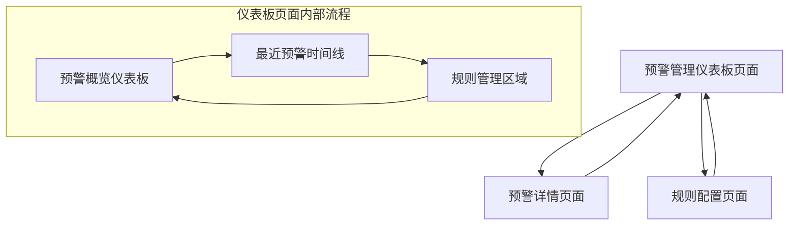

# 预警管理页面仪表板式布局产品需求文档

## 1. 产品概述

预警管理页面采用仪表板式布局设计，为营销系统提供直观、高效的预警监控和规则管理功能。通过数据可视化和优化的交互设计，帮助运营人员快速掌握系统预警状态，及时响应异常情况，提升营销活动的稳定性和效率。

该产品旨在解决传统预警管理界面信息密度高、操作复杂、缺乏数据洞察的问题，为运营团队提供更直观的决策支持工具。

## 2. 核心功能

### 2.1 用户角色

| 角色 | 注册方式 | 核心权限 |
|------|----------|----------|
| 运营管理员 | 系统内部账号 | 查看所有预警数据、管理预警规则、配置通知渠道 |
| 运营专员 | 系统内部账号 | 查看预警历史、处理预警事件、查看规则详情 |

### 2.2 功能模块

我们的预警管理系统包含以下主要页面：
1. **预警管理仪表板页面**：预警概览仪表板、最近预警时间线、规则管理区域
2. **预警详情页面**：预警事件详细信息、处理记录、相关数据分析
3. **规则配置页面**：预警规则创建、编辑、测试功能

### 2.3 页面详情

| 页面名称 | 模块名称 | 功能描述 |
|----------|----------|----------|
| 预警管理仪表板页面 | 预警概览仪表板 | 显示今日预警数量、活跃规则数量、预警级别分布、规则触发频率统计，提供预警趋势图表展示 |
| 预警管理仪表板页面 | 最近预警时间线 | 按时间顺序展示最近预警事件，支持优先级颜色编码、快速筛选、一键处理操作 |
| 预警管理仪表板页面 | 规则管理区域 | 以卡片网格形式展示预警规则，支持快速启用/禁用、编辑、删除、批量操作功能 |
| 预警详情页面 | 预警事件详情 | 展示预警触发原因、影响范围、数据快照、处理建议等详细信息 |
| 预警详情页面 | 处理记录模块 | 记录预警处理过程、操作人员、处理结果、备注信息 |
| 规则配置页面 | 规则创建向导 | 分步骤引导创建预警规则，包括监控对象选择、条件配置、通知设置 |
| 规则配置页面 | 规则测试模块 | 提供规则逻辑验证、模拟数据测试、预期结果预览功能 |

## 3. 核心流程

**运营管理员流程：**
用户登录系统后，首先进入预警管理仪表板页面，通过概览仪表板快速了解当前预警状态和趋势。查看最近预警时间线，识别需要处理的紧急预警。在规则管理区域对预警规则进行维护，包括创建新规则、修改现有规则、批量管理等操作。

**运营专员流程：**
用户登录后查看预警管理仪表板，重点关注最近预警时间线中的待处理事件。点击预警事件进入详情页面，了解具体情况并进行处理。处理完成后返回仪表板继续监控其他预警。

## 4. 用户界面设计

### 4.1 设计风格

- **主色调**：蓝色系 (#1890FF) 作为主色，红色 (#FF4D4F) 用于高优先级预警，橙色 (#FA8C16) 用于中优先级，绿色 (#52C41A) 用于正常状态
- **辅助色**：灰色系 (#F5F5F5, #D9D9D9) 用于背景和分割线
- **按钮样式**：圆角按钮 (border-radius: 6px)，主要按钮采用实心样式，次要按钮采用边框样式
- **字体**：系统默认字体，标题使用 16px-20px，正文使用 14px，辅助信息使用 12px
- **布局风格**：卡片式设计，采用阴影效果 (box-shadow: 0 2px 8px rgba(0,0,0,0.1))
- **图标风格**：使用 Arco Design 图标库，线性风格，保持一致性

### 4.2 页面设计概览

| 页面名称 | 模块名称 | UI元素 |
|----------|----------|---------|
| 预警管理仪表板页面 | 预警概览仪表板 | 4个统计卡片（今日预警、活跃规则、级别分布、触发频率），预警趋势折线图，采用网格布局，卡片背景白色，数字突出显示 |
| 预警管理仪表板页面 | 最近预警时间线 | 垂直时间线组件，左侧时间轴，右侧预警卡片，颜色编码（红/橙/绿），快速操作按钮，支持展开/收起详情 |
| 预警管理仪表板页面 | 规则管理区域 | 3列网格布局，规则卡片包含标题、状态标签、监控对象、操作按钮，支持拖拽排序，批量选择工具栏 |
| 预警详情页面 | 预警事件详情 | 面包屑导航，详情卡片布局，数据表格，状态时间线，处理按钮组 |
| 规则配置页面 | 规则创建向导 | 步骤条导航，表单区域，预览面板，底部操作按钮，实时验证提示 |

### 4.3 响应式设计

产品采用桌面优先的响应式设计：
- **桌面端 (≥1200px)**：三列布局，概览仪表板占据顶部，下方左右分布时间线和规则管理
- **平板端 (768px-1199px)**：两列布局，概览仪表板保持顶部，时间线和规则管理垂直堆叠
- **移动端 (<768px)**：单列布局，所有模块垂直排列，卡片宽度自适应
- 支持触摸操作优化，按钮最小点击区域44px，滑动操作流畅响应