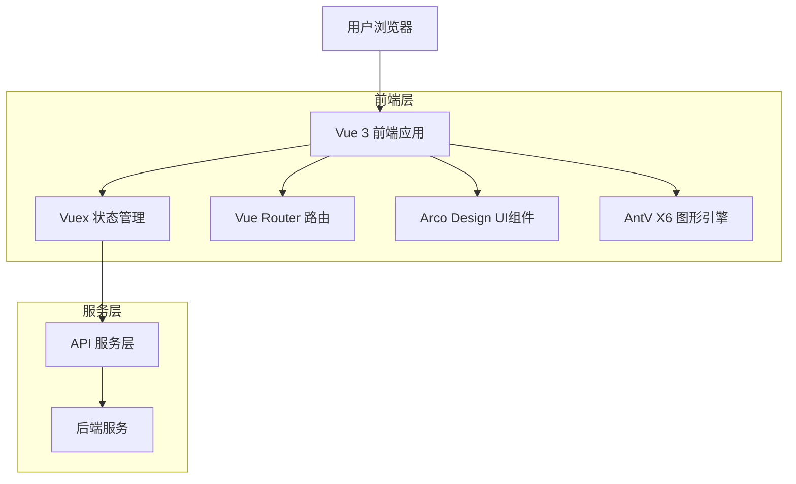
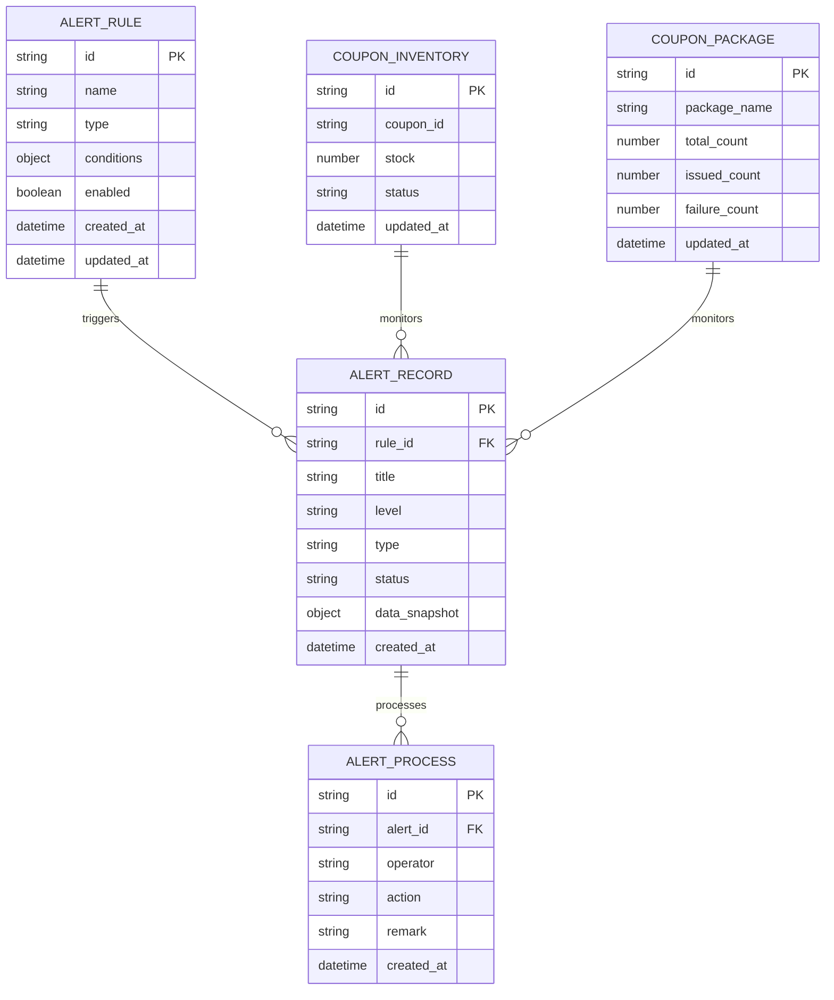
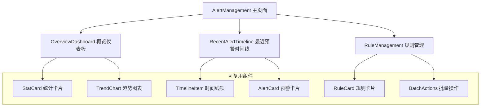

# 预警管理页面技术架构文档

## 1. 架构设计



## 2. 技术描述

- 前端：Vue 3 (Composition API) + Vite + TypeScript + Arco Design + AntV X6
- 状态管理：Vuex
- 路由管理：Vue Router
- 构建工具：Vite
- 后端：现有营销系统API服务

## 3. 路由定义

| 路由 | 用途 |
|------|-----|
| /marketing/alert/management | 预警管理仪表板主页面，包含概览、时间线、规则管理 |
| /marketing/alert/detail/:id | 预警详情页面，显示具体预警事件信息 |
| /marketing/alert/rule/create | 预警规则创建页面，分步骤创建新规则 |
| /marketing/alert/rule/edit/:id | 预警规则编辑页面，修改现有规则配置 |

## 4. API定义

### 4.1 核心API

预警数据获取相关
```
GET /api/marketing/alert/overview
```

Response:
| 参数名称 | 参数类型 | 描述 |
|----------|----------|------|
| todayAlerts | number | 今日预警数量 |
| activeRules | number | 活跃规则数量 |
| levelDistribution | object | 预警级别分布统计 |
| triggerFrequency | object | 规则触发频率统计 |

示例：
```json
{
  "todayAlerts": 15,
  "activeRules": 8,
  "levelDistribution": {
    "high": 3,
    "medium": 7,
    "low": 5
  },
  "triggerFrequency": {
    "inventory": 8,
    "expiry": 4,
    "failure": 3
  }
}
```

预警趋势数据获取
```
GET /api/marketing/alert/trend
```

Request:
| 参数名称 | 参数类型 | 是否必需 | 描述 |
|----------|----------|----------|------|
| days | number | false | 查询天数，默认7天 |
| type | string | false | 预警类型筛选 |

Response:
| 参数名称 | 参数类型 | 描述 |
|----------|----------|------|
| dates | array | 日期数组 |
| data | array | 对应日期的预警数量 |

最近预警列表获取
```
GET /api/marketing/alert/recent
```

Request:
| 参数名称 | 参数类型 | 是否必需 | 描述 |
|----------|----------|----------|------|
| limit | number | false | 返回数量限制，默认10 |
| status | string | false | 状态筛选 |

Response:
| 参数名称 | 参数类型 | 描述 |
|----------|----------|------|
| id | string | 预警ID |
| title | string | 预警标题 |
| level | string | 预警级别 |
| type | string | 预警类型 |
| createTime | string | 创建时间 |
| status | string | 处理状态 |

预警规则管理
```
GET /api/marketing/alert/rules
POST /api/marketing/alert/rules
PUT /api/marketing/alert/rules/:id
DELETE /api/marketing/alert/rules/:id
```

## 5. 数据模型

### 5.1 数据模型定义



### 5.2 前端状态管理结构

```typescript
// Vuex Store 结构
interface AlertState {
  // 概览数据
  overview: {
    todayAlerts: number;
    activeRules: number;
    levelDistribution: Record<string, number>;
    triggerFrequency: Record<string, number>;
  };
  
  // 趋势数据
  trendData: {
    dates: string[];
    data: number[];
  };
  
  // 最近预警
  recentAlerts: AlertRecord[];
  
  // 预警规则
  rules: AlertRule[];
  
  // 加载状态
  loading: {
    overview: boolean;
    trend: boolean;
    recent: boolean;
    rules: boolean;
  };
}

interface AlertRecord {
  id: string;
  title: string;
  level: 'high' | 'medium' | 'low';
  type: 'inventory' | 'expiry' | 'failure';
  createTime: string;
  status: 'pending' | 'processing' | 'resolved';
  dataSnapshot?: Record<string, any>;
}

interface AlertRule {
  id: string;
  name: string;
  type: 'inventory' | 'expiry' | 'failure' | 'global';
  conditions: Record<string, any>;
  enabled: boolean;
  createdAt: string;
  updatedAt: string;
}
```

## 6. 组件架构设计

### 6.1 组件层次结构



### 6.2 核心组件说明

- **OverviewDashboard**: 概览仪表板组件，负责展示统计数据和趋势图表
- **RecentAlertTimeline**: 时间线组件，展示最近预警事件
- **RuleManagement**: 规则管理组件，提供规则的增删改查功能
- **StatCard**: 可复用的统计卡片组件
- **TrendChart**: 基于AntV G2的趋势图表组件
- **AlertCard**: 预警事件卡片组件
- **RuleCard**: 预警规则卡片组件