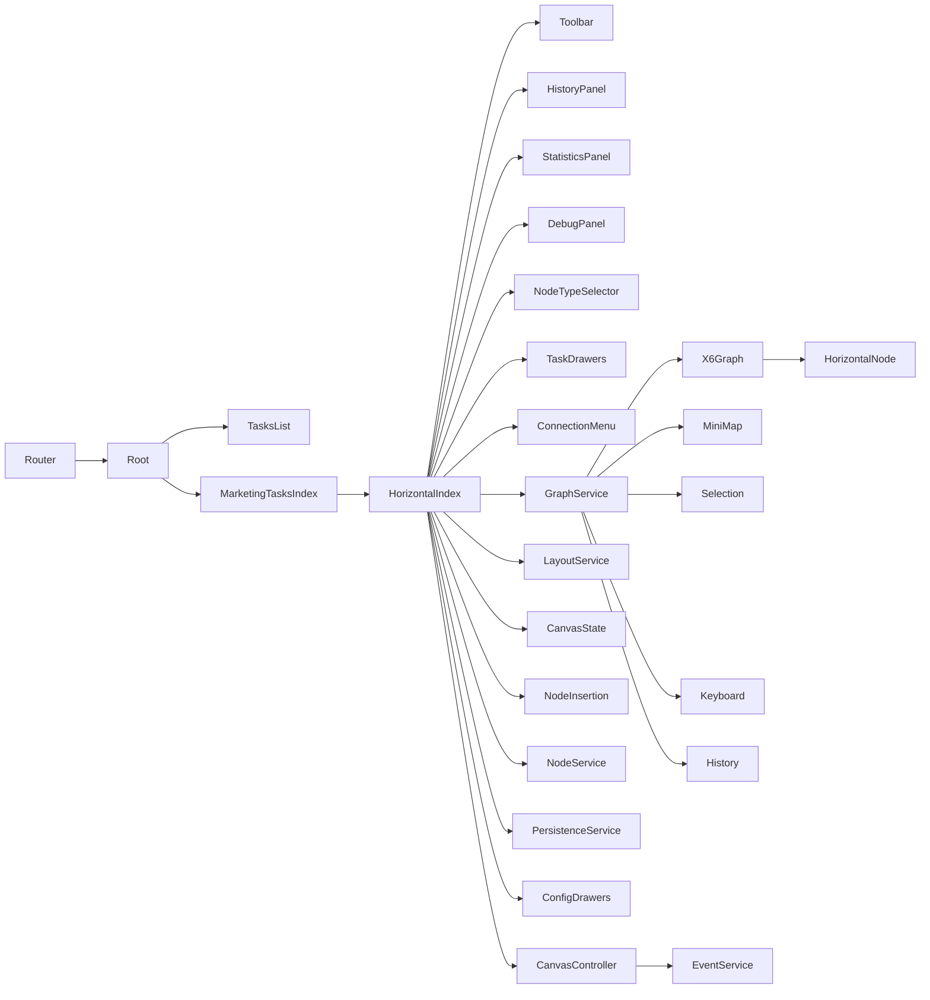

# 横版画布架构说明

> 版本记录
> - 2025-11-27：更新为最新服务化架构，替换 CanvasController/EventService；增加 GraphService/LayoutService/useCanvasState/useNodeInsertion/DebugHelpers 描述；统一术语与示例代码；移除预览线。

## 技术栈与约定
- 前端：Vue 3（Composition API）+ Vite
- 图形引擎：AntV X6（横向布局规则）
- 路由：`src/router.ts`
- 别名：`@` → `/src`（`apps/horizontal-canvas/vite.config.ts:8`）
- 端口：`5175`

## 模块划分
- 页面（完整罗列）
  - 根页：`apps/horizontal-canvas/src/pages/Root.vue`
  - 任务列表：`apps/horizontal-canvas/src/pages/tasks/TasksList.vue`
  - 营销任务入口页：`apps/horizontal-canvas/src/pages/marketing/tasks/index.vue`
  - 横版任务画布页：`apps/horizontal-canvas/src/pages/marketing/tasks/horizontal/index.vue`
  - 横版节点视图：`apps/horizontal-canvas/src/pages/marketing/tasks/horizontal/HorizontalNode.vue`
- 组件
  - 工具栏：`apps/horizontal-canvas/src/components/toolbar/CanvasToolbar.vue`
  - 历史面板：`apps/horizontal-canvas/src/components/history/CanvasHistoryPanel.vue`
  - 调试面板：`apps/horizontal-canvas/src/components/debug/CanvasDebugPanel.vue`
  - 统计面板：`apps/horizontal-canvas/src/components/statistics/CanvasStatisticsPanel.vue`
  - 配置抽屉：`apps/horizontal-canvas/src/components/task/TaskFlowConfigDrawers.vue` 及各节点抽屉
  - 节点类型选择器：`apps/horizontal-canvas/src/components/canvas/NodeTypeSelector.vue`
  - 连线右键菜单：`apps/horizontal-canvas/src/components/canvas/ConnectionContextMenu.vue`
- 服务与工具
  - 图服务：`apps/horizontal-canvas/src/pages/marketing/tasks/horizontal/graph/GraphService.ts`
  - 布局服务：`apps/horizontal-canvas/src/pages/marketing/tasks/horizontal/layout/LayoutService.ts`
  - 状态服务：`apps/horizontal-canvas/src/pages/marketing/tasks/horizontal/state/useCanvasState.ts`
  - 节点插入：`apps/horizontal-canvas/src/pages/marketing/tasks/horizontal/composables/useNodeInsertion.ts`
  - 调试辅助：`apps/horizontal-canvas/src/pages/marketing/tasks/horizontal/debug/DebugHelpers.ts`
  - 节点服务：`apps/horizontal-canvas/src/pages/marketing/tasks/horizontal/node/NodeService.ts`
  - 持久化服务：`apps/horizontal-canvas/src/pages/marketing/tasks/horizontal/persistence/PersistenceService.ts`
  - 事件服务：`apps/horizontal-canvas/src/pages/marketing/tasks/horizontal/services/EventService.js`
  - 画布控制器：`apps/horizontal-canvas/src/pages/marketing/tasks/horizontal/services/CanvasController.js`
  - 端口工厂：`apps/horizontal-canvas/src/pages/marketing/tasks/horizontal/utils/portConfigFactoryHorizontal.js`
  - 样式常量：`apps/horizontal-canvas/src/pages/marketing/tasks/horizontal/styles/nodeStyles.js`
  - 数据存储/Mock：`apps/horizontal-canvas/src/utils/taskStorage.js`
  - （已移除）预览线系统：不再引入
  - 历史：`apps/horizontal-canvas/src/composables/canvas/useCanvasHistory.js`
  - 快速布局引擎：`apps/horizontal-canvas/src/pages/marketing/tasks/horizontal/utils/quickLayout.js`
  - 性能监控：`apps/horizontal-canvas/src/pages/marketing/tasks/horizontal/utils/performanceMonitor.js`
  - 端口验证组合式：`apps/horizontal-canvas/src/pages/marketing/tasks/horizontal/composables/usePortValidation.js`
  - 抽屉组合式：`apps/horizontal-canvas/src/composables/canvas/useConfigDrawers.js`

## 组件关系（Mermaid）


## 数据流与状态管理
- 画布事件：X6 触发 → 页面监听与服务方法处理（`GraphService`/`LayoutService`/`useCanvasState`） → 状态更新与 UI 联动。
- 节点点击：
  - 编辑模式：打开抽屉（`openConfigDrawer`）。
  - 查看模式统计：设置统计面板焦点并保持抽屉可打开（已取消互斥）。
- 统计数据：`RuntimeStatsMock` 提供：
  - `getNodeDailyStats(taskId, nodeId)`：节点每日进入/出。
  - `getCanvasDailyStats(taskId)`：画布每日聚合进入/结束。
  - `getNodeDailyBranchStats(taskId, nodeId, branches)`：分支每日出人数。

## 部署架构与依赖
- 本地开发：
  - `npm run dev`（端口 `5175`）
  - 别名 `@` 指向 `/src`
- 主要依赖：
  - `@antv/x6`、`@antv/x6-vue-shape`
  - `@arco-design/web-vue`
  - `vue`、`vite`

## 路由关系
- 定义位置：`apps/horizontal-canvas/src/router.ts`
- 典型映射：
  - `'/marketing/tasks'` → `apps/horizontal-canvas/src/pages/marketing/tasks/index.vue`
  - `'/marketing/tasks/horizontal'` → `apps/horizontal-canvas/src/pages/marketing/tasks/horizontal/index.vue`
  - `'/tasks'` → `apps/horizontal-canvas/src/pages/tasks/TasksList.vue`

## 重要代码参考
- 查看模式删除屏蔽：右键菜单删除、端口菜单删除、快捷键删除统一屏蔽（`horizontal/index.vue`）。
- 统计面板停靠与自适应：`useCanvasState.updateStatisticsPanelTop/updateDebugDockBounds` 与 `setupPanelResizeListeners/setupPanelWatchers`。
- 分支统计：`CanvasStatisticsPanel.vue` 提供路径构建与高亮触发，按分支列展示。
- 插件管理：`GraphService.useHistory/useKeyboard/useSelection/toggleMinimap`；快捷键：`GraphService.bindDefaultShortcuts`；选择门控：`GraphService.configureSelectionRubberbandGate`。
- 布局：`LayoutService.applyQuickLayout/applyStructuredLayout` 与 `cleanupEdgeVertices`。

## 关键代码片段

### 路由定义
`apps/horizontal-canvas/src/router.ts`
```ts
import { createRouter, createWebHistory } from 'vue-router'

const TasksList = () => import('./pages/tasks/TasksList.vue')
const MarketingTasks = () => import('./pages/marketing/tasks/index.vue')
const MarketingHorizontal = () => import('./pages/marketing/tasks/horizontal/index.vue')

export const router = createRouter({
  history: createWebHistory(),
  routes: [
    { path: '/', redirect: '/marketing/tasks' },
    { path: '/tasks', name: 'tasks-list', component: TasksList },
    { path: '/editor', name: 'editor', component: MarketingHorizontal },
    { path: '/marketing/tasks', name: 'marketing-tasks', component: MarketingTasks },
    { path: '/marketing/tasks/horizontal', name: 'marketing-horizontal', component: MarketingHorizontal }
  ]
})
```

### 图初始化与插件注册
`apps/horizontal-canvas/src/pages/marketing/tasks/horizontal/graph/GraphService.ts`
```ts
export function createGraph(container: HTMLElement, options: any = {}) { /* 背景/网格/滚轮/高亮等默认配置 */ }
export function useHistory(graph: any, options: any = {}) { /* 注册 History */ }
export function useKeyboard(graph: any, options: any = {}) { /* 注册 Keyboard */ }
export function useSelection(graph: any, options: any = {}) { /* 注册 Selection */ }
export function toggleMinimap(graph: any, container: HTMLElement | null, visible: boolean) { /* 小地图显隐 */ }
export function bindDefaultShortcuts(graph: any, handlers: any) { /* 撤销/重做/缩放/删除/适配/快速布局 */ }
export function configureSelectionRubberbandGate(selectionPlugin: any, graph: any) { /* Ctrl/Meta 橡皮框门控 */ }
```

### 节点插入流程（收尾）
`apps/horizontal-canvas/src/pages/marketing/tasks/horizontal/composables/useNodeInsertion.ts`
```ts
export function insertNodeAndFinalize(graph, nodeType, pendingPoint, pendingInsertionEdge, getNodeLabel, createVueShapeNode, finalize?) {
  // 插入节点、修正端口、历史入栈与持久化回调
}
```

### 统计面板停靠与尺寸更新
`apps/horizontal-canvas/src/pages/marketing/tasks/horizontal/state/useCanvasState.ts`
```ts
function setupPanelResizeListeners(/* ... */) { /* 绑定 window.resize 并返回 detach */ }
function setupPanelWatchers(/* ... */) { /* 侦听显隐与宽度联动更新 */ }
```

### 历史栈监听与撤销重做
`apps/horizontal-canvas/src/composables/canvas/useCanvasHistory.js`
```js
export function useCanvasHistory(graph) { /* 提供历史栈/监听/跳转 */ }
```

### 调试辅助：保留入口与常用方法
`apps/horizontal-canvas/src/pages/marketing/tasks/horizontal/debug/DebugHelpers.ts`
```js
// testQuickLayout/testConnectionRules/runTestDebugFunction/runSimpleDebugNode 等入口
```

### 端口工厂：绝对定位右侧输出端口
`apps/horizontal-canvas/src/pages/marketing/tasks/horizontal/utils/portConfigFactoryHorizontal.js:54–66`
```js
ids.forEach((id, idx) => {
  const n = Math.max(1, ids.length)
  const contentH = end - start
  let yRel
  if (evenDistribution && contentH > 0) {
    const step = contentH / n
    yRel = start + (idx + 0.5) * step
  } else {
    yRel = start + idx * NODE_DIMENSIONS.ROW_HEIGHT + Math.floor(NODE_DIMENSIONS.ROW_HEIGHT / 2)
  }
  const args = { x: NODE_DIMENSIONS.WIDTH, y: yRel }
  items.push({ id, group: 'out', args, attrs: { circle: { 'data-port': id, 'data-port-group': 'out', 'port': id, 'port-group': 'out', class: 'x6-port-body' } }, markup: [{ tagName: 'circle', selector: 'circle' }] })
})
```

### 节点统一更新：尺寸、端口映射与数据写回
- 页面统一函数：`horizontal/index.vue` 中的 `updateNodeFromConfigUnified`
- 服务层实现：`node/NodeService.ts` 中的 `updateNodeUnified`
- 要点：根据 `displayLines` 重建或差异更新 `out-N` 端口；写回 `data/nodeType/headerTitle/displayLines` 并触发 `change:data`

### 节点样式与渲染（当前实现）
- 样式常量来源：`styles/nodeStyles.js`（`WIDTH/MIN_HEIGHT/HEADER_HEIGHT/ROW_HEIGHT/CONTENT_PADDING/ROW_GAP/CONTENT_SPACING/TYPOGRAPHY.CONTENT_BASELINE_ADJUST`）
- Vue Shape 组件：`HorizontalNode.vue`
- 内容容器：`horizontal-node__content`，自适应模式使用 `flex` 布局（`ADAPTIVE_CONTENT_LAYOUT`），非自适应按绝对定位行高渲染
- 行定位：`rowEvenStyle(idx)` 非自适应时按 `top = idx * (ROW_HEIGHT + ROW_GAP)` 定位；`start` 节点将所有行合并显示
- 端口位置：自适应模式下通过 DOM 测量行几何中心，写回 `verticalOffsets` 并以 `{ x: WIDTH, y: yRel }` 绝对定位右侧端口
- 图标：使用 Arco Icons 映射，类名 `arco-icon--node`
- AB 实验标签：已移除 `.ab-test__experiment` 与对应内容展示
- 行样式：`port-indicator/port-indicator--out/port-indicator__label` 渐变背景与细边框、悬停轻微提升

### 菜单行为（当前实现）
- 节点菜单跟随：监听 `node:moved` 并重算 `node-actions-menu` 的 `left/top`
- 空白关闭：监听 `blank:click` 与 `window.click`，非菜单区域点击关闭；模板增加透明遮罩 `node-actions-menu__backdrop`

### 本地任务存储：创建与更新
`apps/horizontal-canvas/src/utils/taskStorage.js:23–38`
```js
updateTask(id, data) {
  const list = this.getAllTasks()
  const idx = list.findIndex(t => String(t.id) === String(id))
  if (idx >= 0) {
    const merged = { ...list[idx], ...data, id: list[idx].id, canvasData: migrateCanvasData(data.canvasData || list[idx].canvasData) }
    list[idx] = merged
    localStorage.setItem(KEY, JSON.stringify(list))
    return merged
  }
  const created = { id: String(id), ...data, canvasData: migrateCanvasData(data.canvasData) }
  list.push(created)
  localStorage.setItem(KEY, JSON.stringify(list))
  return created
},
createTask(task) { const t = { id: String(Date.now()), ...task }; this.saveTask(t); return t }
```

### 统计面板：从节点构建路径高亮
`apps/horizontal-canvas/src/components/statistics/CanvasStatisticsPanel.vue:175–179`
```js
function highlightFromNode(id) {
  const path = buildPathFromNode(id)
  emit('path-highlight', { canvasId: props.canvasId, path })
}
```
### 快速布局引擎集成
`apps/horizontal-canvas/src/pages/marketing/tasks/horizontal/layout/LayoutService.ts`
```ts
export async function applyQuickLayout(graph: GraphLike, options: any = {}) {
  const instance = options.quickLayout || new HorizontalQuickLayout({})
  const result = await instance.executeHierarchyTreeLayout(graph, {/* 省略参数 */})
  cleanupEdgeVertices(graph)
}
```

### 性能监控测量闭包
`apps/horizontal-canvas/src/pages/marketing/tasks/horizontal/utils/performanceMonitor.js`
```js
const endMeasure = performanceMonitor.measure('updateNodeFromConfigUnified')
// ... 执行节点统一更新逻辑
endMeasure()
```
### 端口验证（使能与结果）
`apps/horizontal-canvas/src/pages/marketing/tasks/horizontal/utils/portConfigFactoryHorizontal.js`
```js
const portConfig = createHorizontalPortConfig(outCount, {
  includeIn: true,
  includeOut: true,
  outIds,
  contentStart, contentEnd,
  contentLines,
  evenDistribution: true,
  enableValidation: true // 使能位置与ID校验
})
// 校验结果附加在 portConfig._validation
```

## Utils 目录说明
- `quickLayout.js`：提供横向层次布局引擎（executeHierarchyTreeLayout），由 `LayoutService.applyQuickLayout` 统一调用。
- `performanceMonitor.js`：性能测量与统计工具，开发/测试环境默认开启，支持同步/异步与装饰器式测量。
- `portConfigFactoryHorizontal.js`：生成左进右出端口配置，支持行中点或均匀分布定位，并附加端口位置与ID校验。
