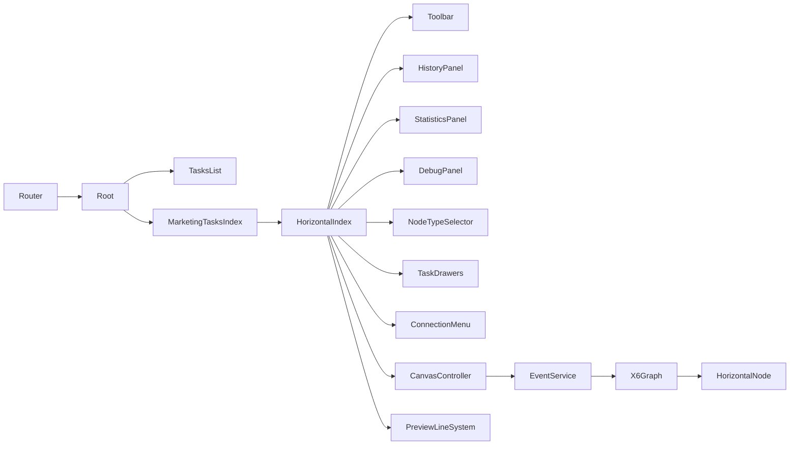

# 横版画布架构说明

## 技术栈与约定
- 前端：Vue 3（Composition API）+ Vite
- 图形引擎：AntV X6（横向布局规则）
- 路由：`src/router.ts`
- 别名：`@` → `/src`（`apps/horizontal-canvas/vite.config.ts:8`）
- 端口：`5175`

## 模块划分
- 页面（完整罗列）
  - 根页：`apps/horizontal-canvas/src/pages/Root.vue`
  - 任务列表：`apps/horizontal-canvas/src/pages/tasks/TasksList.vue`
  - 营销任务入口页：`apps/horizontal-canvas/src/pages/marketing/tasks/index.vue`
  - 横版任务画布页：`apps/horizontal-canvas/src/pages/marketing/tasks/horizontal/index.vue`
  - 横版节点视图：`apps/horizontal-canvas/src/pages/marketing/tasks/horizontal/HorizontalNode.vue`
- 组件
  - 工具栏：`apps/horizontal-canvas/src/components/toolbar/CanvasToolbar.vue`
  - 历史面板：`apps/horizontal-canvas/src/components/history/CanvasHistoryPanel.vue`
  - 调试面板：`apps/horizontal-canvas/src/components/debug/CanvasDebugPanel.vue`
  - 统计面板：`apps/horizontal-canvas/src/components/statistics/CanvasStatisticsPanel.vue`
  - 配置抽屉：`apps/horizontal-canvas/src/components/task/TaskFlowConfigDrawers.vue` 及各节点抽屉
  - 节点类型选择器：`apps/horizontal-canvas/src/components/canvas/NodeTypeSelector.vue`
  - 连线右键菜单：`apps/horizontal-canvas/src/components/canvas/ConnectionContextMenu.vue`
- 服务与工具
  - 控制器：`apps/horizontal-canvas/src/pages/marketing/tasks/horizontal/services/CanvasController.js`
  - 事件绑定：`apps/horizontal-canvas/src/pages/marketing/tasks/horizontal/services/EventService.js`
  - 端口工厂：`apps/horizontal-canvas/src/pages/marketing/tasks/horizontal/utils/portConfigFactoryHorizontal.js`
  - 样式常量：`apps/horizontal-canvas/src/pages/marketing/tasks/horizontal/styles/nodeStyles.js`
  - 数据存储/Mock：`apps/horizontal-canvas/src/utils/taskStorage.js`
  - 预览线系统：`apps/horizontal-canvas/src/utils/preview-line/PreviewLineSystem.js`
  - 结构化布局：`apps/horizontal-canvas/src/composables/canvas/useStructuredLayout.js`
  - 历史：`apps/horizontal-canvas/src/composables/canvas/useCanvasHistory.js`

## 组件关系（Mermaid）


## 数据流与状态管理
- 画布事件：X6 触发 → `EventService` 解析 → 回调到 `CanvasController`/页面状态。
- 节点点击：
  - 编辑模式：打开抽屉（`openConfigDrawer`）。
  - 查看模式统计：设置统计面板焦点并保持抽屉可打开（已取消互斥）。
- 统计数据：`RuntimeStatsMock` 提供：
  - `getNodeDailyStats(taskId, nodeId)`：节点每日进入/出。
  - `getCanvasDailyStats(taskId)`：画布每日聚合进入/结束。
  - `getNodeDailyBranchStats(taskId, nodeId, branches)`：分支每日出人数。

## 部署架构与依赖
- 本地开发：
  - `npm run dev`（端口 `5175`）
  - 别名 `@` 指向 `/src`
- 主要依赖：
  - `@antv/x6`、`@antv/x6-vue-shape`
  - `@arco-design/web-vue`
  - `vue`、`vite`

## 路由关系
- 定义位置：`apps/horizontal-canvas/src/router.ts`
- 典型映射：
  - `'/marketing/tasks'` → `apps/horizontal-canvas/src/pages/marketing/tasks/index.vue`
  - `'/marketing/tasks/horizontal'` → `apps/horizontal-canvas/src/pages/marketing/tasks/horizontal/index.vue`
  - `'/tasks'` → `apps/horizontal-canvas/src/pages/tasks/TasksList.vue`

## 重要代码参考
- 查看模式禁止删除连线：
  - 右键菜单入口屏蔽：`apps/horizontal-canvas/src/pages/marketing/tasks/horizontal/index.vue:1616–1634`
  - 端口菜单删除屏蔽：`apps/horizontal-canvas/src/pages/marketing/tasks/horizontal/index.vue:2346–2353`
  - 键盘删除屏蔽：`apps/horizontal-canvas/src/pages/marketing/tasks/horizontal/index.vue:1260–1275`
- 统计面板底部停靠与自适应：`apps/horizontal-canvas/src/pages/marketing/tasks/horizontal/index.vue:171–186, 4505–4533`
- 分支统计整合：`apps/horizontal-canvas/src/components/statistics/CanvasStatisticsPanel.vue:122–213`

## 关键代码片段

### 路由定义
`apps/horizontal-canvas/src/router.ts`
```ts
import { createRouter, createWebHistory } from 'vue-router'

const TasksList = () => import('./pages/tasks/TasksList.vue')
const MarketingTasks = () => import('./pages/marketing/tasks/index.vue')
const MarketingHorizontal = () => import('./pages/marketing/tasks/horizontal/index.vue')

export const router = createRouter({
  history: createWebHistory(),
  routes: [
    { path: '/', redirect: '/marketing/tasks' },
    { path: '/tasks', name: 'tasks-list', component: TasksList },
    { path: '/editor', name: 'editor', component: MarketingHorizontal },
    { path: '/marketing/tasks', name: 'marketing-tasks', component: MarketingTasks },
    { path: '/marketing/tasks/horizontal', name: 'marketing-horizontal', component: MarketingHorizontal }
  ]
})
```

### 图初始化的连接校验
`apps/horizontal-canvas/src/pages/marketing/tasks/horizontal/index.vue:1130–1201`
```js
validateConnection({ sourceMagnet, targetMagnet, sourceView, targetView, edge }) {
  if (isPanning.value) return false
  if (isViewMode.value) return false
  if (!sourceMagnet || !targetMagnet) {
    return false
  }
  const sg = sourceMagnet.getAttribute('port-group') || sourceMagnet.getAttribute('data-port-group')
  const tg = targetMagnet.getAttribute('port-group') || targetMagnet.getAttribute('data-port-group')
  if (sg !== 'out' || tg !== 'in') {
    return false
  }
  const srcCell = sourceView?.cell
  const sourcePortId = sourceMagnet.getAttribute('port') || sourceMagnet.getAttribute('data-port') || sourceMagnet.getAttribute('data-port-id')
  const exists = (graph.getOutgoingEdges?.(srcCell) || []).some(e => {
    try {
      if (edge && e.id === edge.id) return false
      return e.getSourcePortId?.() === sourcePortId
    } catch { return false }
  })
  if (exists) {
    return false
  }
  return true
}
```

### 键盘删除屏蔽（查看模式）
`apps/horizontal-canvas/src/pages/marketing/tasks/horizontal/index.vue:1260–1275`
```js
graph.bindKey(['delete', 'backspace'], () => {
  try {
    const cells = graph.getSelectedCells?.() || []
    if (!cells.length) return false
    cells.forEach(cell => {
      try {
        if (cell.isNode?.()) {
          deleteNodeCascade(cell.id)
        } else if (cell.isEdge?.()) {
          if (isViewMode.value) return
          graph.removeEdge(cell)
        }
      } catch {}
    })
    try { graph.cleanSelection && graph.cleanSelection() } catch {}
  } catch {}
  return false
})
```

### 统计面板停靠与尺寸更新
`apps/horizontal-canvas/src/pages/marketing/tasks/horizontal/index.vue:1484–1487`
```js
watch(showStatisticsPanel, async () => { await nextTick(); updateStatisticsPanelTop() })
watch([showStatisticsPanel, statisticsPanelWidth], async () => { await nextTick(); updateDebugDockBounds() })
```

### 历史栈监听与撤销重做
`apps/horizontal-canvas/src/pages/marketing/tasks/horizontal/index.vue:1329–1346`
```js
const {
  historyStack,
  jumpToHistoryState,
  setupHistoryListeners,
  updateHistoryStack
} = useCanvasHistory(graph)

setupHistoryListeners()
updateHistoryStack()

graph.on('history:change', () => {
  try {
    canUndo.value = typeof graph.canUndo === 'function' ? graph.canUndo() : false
    canRedo.value = typeof graph.canRedo === 'function' ? graph.canRedo() : false
    updateHistoryStack()
  } catch {}
})
```

### 事件服务：节点点击与菜单区域识别
`apps/horizontal-canvas/src/pages/marketing/tasks/horizontal/services/EventService.js:88–139`
```js
graph.on('node:click', ({ e, node }) => {
  const target = e?.target || null
  const selector = target && target.getAttribute 
    ? (target.getAttribute('selector') || target.getAttribute('data-selector'))
    : null
  const region = getClickRegion(e, node)
  const isMenuIcon = selector && (selector === 'menu-dot-0' || selector === 'menu-dot-1' || selector === 'menu-dot-2')
  if (!readOnly && !this.isStatisticsMode() && (isMenuIcon || region.inDotArea)) {
    const bbox = node.getBBox()
    const uiPos = toContainerCoords({ x: bbox.x + bbox.width - 28, y: bbox.y + 12 })
    this.setNodeActionsMenu({ visible: true, x: uiPos.x, y: uiPos.y, nodeId: node.id })
    return
  }
  this.setNodeActionsMenu({ visible: false, x: 0, y: 0, nodeId: null })
  const isHeader = selector && (
    selector === 'header' || selector === 'header-icon' || selector === 'header-icon-text' || selector === 'header-title'
  ) || region.inHeader
  if (isHeader) {
    if (this.isStatisticsMode()) { this.onNodeClickForStats(node) }
    try { if (!(node.isSelected && node.isSelected())) { graph.select(node) } } catch {}
    return
  }
  const isContent = selector && (selector === 'content-area' || /^row-\d+$/.test(selector)) || (!region.inHeader)
  if (isContent) {
    if (this.isStatisticsMode()) { this.onNodeClickForStats(node) }
    const d = node.getData ? node.getData() : {}
    const t = d?.type || d?.nodeType
    if (t) this.openConfigDrawer(t, node, d)
  }
})
```

### 端口工厂：绝对定位右侧输出端口
`apps/horizontal-canvas/src/pages/marketing/tasks/horizontal/utils/portConfigFactoryHorizontal.js:54–66`
```js
ids.forEach((id, idx) => {
  const n = Math.max(1, ids.length)
  const contentH = end - start
  let yRel
  if (evenDistribution && contentH > 0) {
    const step = contentH / n
    yRel = start + (idx + 0.5) * step
  } else {
    yRel = start + idx * NODE_DIMENSIONS.ROW_HEIGHT + Math.floor(NODE_DIMENSIONS.ROW_HEIGHT / 2)
  }
  const args = { x: NODE_DIMENSIONS.WIDTH, y: yRel }
  items.push({ id, group: 'out', args, attrs: { circle: { 'data-port': id, 'data-port-group': 'out', 'port': id, 'port-group': 'out', class: 'x6-port-body' } }, markup: [{ tagName: 'circle', selector: 'circle' }] })
})
```

### 节点统一更新：尺寸、端口映射与数据写回
`apps/horizontal-canvas/src/pages/marketing/tasks/horizontal/index.vue:2167–2251`
```js
async function updateNodeFromConfigUnified(node, nodeType, config) {
  try {
    const pos = node.getPosition?.() || { x: 0, y: 0 }
    const label = config?.nodeName || getNodeLabel(nodeType) || nodeType
    const spec = createVueShapeNode({
      id: node.id,
      x: pos.x,
      y: pos.y,
      label,
      data: { type: nodeType, nodeType: nodeType, config, isConfigured: true }
    })
    node.resize(spec.width, spec.height)
    const existingPorts = node.getPorts ? node.getPorts() : []
    const existingIds = new Set((existingPorts || []).map(p => p.id))
    const specIds = new Set((spec.ports.items || []).map(p => p.id))
    if (node.setProp) node.setProp('ports/groups', spec.ports.groups)
    ;(existingPorts || []).forEach(p => {
      if (!specIds.has(p.id)) {
        try {
          const isOut = p.group === 'out'
          const edges = graph?.getConnectedEdges?.(node) || []
          const outgoing = edges.filter(e => {
            try { return e.getSourceCellId?.() === node.id && e.getSourcePortId?.() === p.id } catch { return false }
          })
          let targetNewPortId = null
          if (isOut) {
            const match = /^out-(\d+)$/.exec(p.id)
            const newOutIds = Array.from(specIds).filter(id => /^out-\d+$/.test(String(id))).sort((a,b)=>{
              return Number(a.split('-')[1]) - Number(b.split('-')[1])
            })
            if (match) {
              const num = Number(match[1])
              const clamped = Math.max(0, Math.min(num, newOutIds.length - 1))
              targetNewPortId = newOutIds[clamped] || newOutIds[0] || null
            } else {
              targetNewPortId = newOutIds[0] || null
            }
          } else {
            targetNewPortId = specIds.has('in') ? 'in' : null
          }
          if (targetNewPortId) {
            outgoing.forEach(e => { try { e.setSource({ cell: node.id, port: targetNewPortId }) } catch {} })
          }
          node.removePort?.(p.id)
        } catch {}
      }
    })
    if (spec.ports.items && spec.ports.items.length) {
      spec.ports.items.forEach(it => {
        if (existingIds.has(it.id)) {
          try {
            node.setPortProp?.(it.id, 'group', it.group)
            if (it.args != null) node.setPortProp?.(it.id, 'args', it.args)
            if (it.attrs?.circle) {
              const c = it.attrs.circle
              if (c['data-port'] != null) node.setPortProp?.(it.id, 'attrs/circle/data-port', c['data-port'])
              if (c['data-port-group'] != null) node.setPortProp?.(it.id, 'attrs/circle/data-port-group', c['data-port-group'])
              if (c['data-port-type'] != null) node.setPortProp?.(it.id, 'attrs/circle/data-port-type', c['data-port-type'])
            }
          } catch {}
        } else {
          node.addPort && node.addPort(it)
        }
      })
    }
    if (node.setProp) {
      if (node.setData) { node.setData(spec.data) }
      node.prop('data', spec.data)
      node.prop('nodeType', spec.data.nodeType)
      node.prop('headerTitle', spec.data.headerTitle)
      node.prop('displayLines', spec.data.displayLines)
      node.trigger('change:data', { current: spec.data, previous: node.getData?.() })
    }
  } catch (e) {}
}
```

### 本地任务存储：创建与更新
`apps/horizontal-canvas/src/utils/taskStorage.js:23–38`
```js
updateTask(id, data) {
  const list = this.getAllTasks()
  const idx = list.findIndex(t => String(t.id) === String(id))
  if (idx >= 0) {
    const merged = { ...list[idx], ...data, id: list[idx].id, canvasData: migrateCanvasData(data.canvasData || list[idx].canvasData) }
    list[idx] = merged
    localStorage.setItem(KEY, JSON.stringify(list))
    return merged
  }
  const created = { id: String(id), ...data, canvasData: migrateCanvasData(data.canvasData) }
  list.push(created)
  localStorage.setItem(KEY, JSON.stringify(list))
  return created
},
createTask(task) { const t = { id: String(Date.now()), ...task }; this.saveTask(t); return t }
```

### 统计面板：从节点构建路径高亮
`apps/horizontal-canvas/src/components/statistics/CanvasStatisticsPanel.vue:175–179`
```js
function highlightFromNode(id) {
  const path = buildPathFromNode(id)
  emit('path-highlight', { canvasId: props.canvasId, path })
}
```
