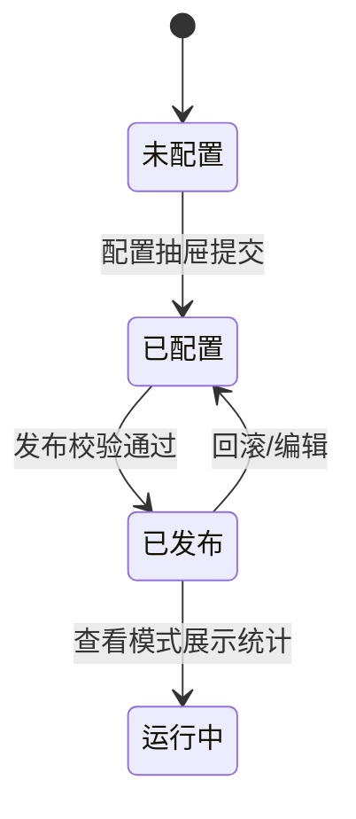
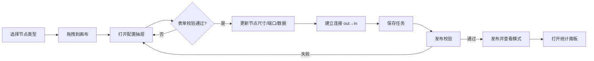
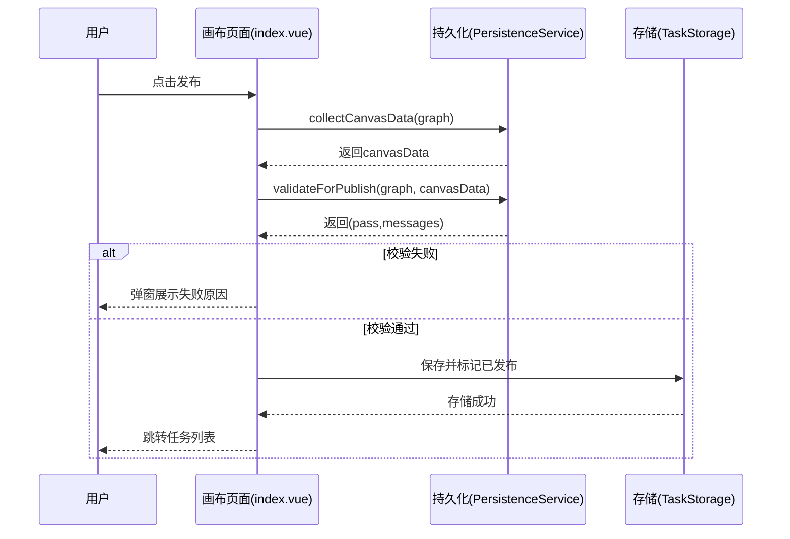

# 横版画布应用需求说明（PRD）

## 背景与目标
- 目标：提供基于 AntV X6 的横向营销任务编排画布，支持节点配置、连线规则、统计分析与发布流程。
- 用户价值：降低运营搭建营销策略的门槛；提供策略运行监控与复盘能力；为开发与分析协作提供统一界面。

## 用户角色与使用场景
- 运营（主用户）：搭建与维护营销任务流（新增节点、配置内容、发布策略）。
- 数据分析：查看统计面板、分析用户路径与节点表现，导出数据。
- 开发/实施：扩展节点类型、抽屉表单与样式，修复问题与上线。

场景示例：
- 新活动上线：运营复用画布模板 → 修改节点配置 → 发布新版本。
- 运行监控：分析查看统计看板的运行天数、累计进入人次、策略结束等 KPI → 针对分流/AB 节点观测分支出人数。
- 策略迭代：对某节点（如短信）配置内容更新 → 回归测试 → 发布。

## 术语定义与名词解释
- 节点：策略中的处理单元，如“开始/结束/人群分流/事件分流/AB 实验/短信/AI 外呼/人工外呼/等待/权益”等。
- 端口：用于连接的锚点，分为输入端口（in）与输出端口（out）；连接仅允许 out→in。
- 分支：分流或实验节点的多个输出路径，通常与节点显示行对应，每个分支应至少有一条连线。
- 分流节点：根据人群或事件条件将用户分配到不同分支的节点。
- AB 实验节点：按设定流量占比将用户分配至各实验分支的节点。
- 连接：节点间的有向边，用于表达执行路径；同一源端口仅允许一条连接。
- 模式：编辑模式允许编排与删除；查看模式只读，允许统计与查询，不允许连接/删除/编辑。
- KPI：关键指标，如运行天数、累计进入人次、策略结束次数等，用于策略监控与复盘。

## 需求范围
- 范围内（本版本目标）
  - 画布编辑：节点添加/拖拽/配置抽屉/撤销重做/快捷键操作（含复制/粘贴）
  - 连接规则：仅允许 `out→in`、同一源端口唯一；查看模式禁止连接与删除；右向连接通过端口与布局引导
  - 节点类型：开始、结束、人群分流、事件分流、AB 实验、短信、AI 外呼、人工外呼、等待、权益
  - 发布流程：画布数据采集、发布前校验、状态切换至查看模式
  - 统计看板：画布级 KPI、节点每日进入/流出趋势、分支出人数统计、时间范围筛选、用户路径查询与高亮
  - 持久化与迁移：基于浏览器 `localStorage` 的任务读写与数据迁移
  - 路由与任务列表：任务列表跳转、版本选择、查看/编辑模式切换
- 范围外（本版本不包含）
  - 多人协同编辑与实时冲突解决
  - 服务端持久化、角色鉴权与组织管理体系
  - 真实生产数据对接与离线/实时指标计算管道
  - 与第三方触达/CRM/数据平台的真实接口集成
  - 完整国际化（i18n）与跨时区自动转换方案
  - 移动端适配与触控交互优化
- 用户角色与场景覆盖
  - 运营（主用户）：策略搭建与发布、复用模板/版本管理（列表）
  - 数据分析：查看模式统计看板与路径分析；数据导出（规划中）
  - 开发/实施：节点类型扩展、抽屉表单与样式/布局优化
- 交付物与不包含内容
  - 交付物：可运行的前端应用（编辑/查看/统计面板）、本地任务存储与数据迁移、需求文档与流程/时序图
  - 不包含：后端服务与数据管道、灰度发布的服务端实现（当前为策略说明）
- 依赖与边界
  - 技术栈：Vue 3、Vite、AntV X6、Arco Design
  - 存储：浏览器 `localStorage`（单机、非协同）
  - 运行态：`RuntimeStatsMock`（模拟统计与路径）
  - 兼容：现代 Chromium 系浏览器
- 版本与发布
  - 当前版本 v1：单用户本地编排与发布；发布校验规则按文档执行
  - 后续规划：灰度发布、服务端化、多用户协同与数据导出落地
- 性能与兼容（范围目标）
  - 在 100+ 节点、约 300 条连线下保持操作流畅；统计刷新 ≤ 100ms；发布校验 ≤ 200ms；单节点更新 ≤ 16ms
- 权限与安全（范围内）
  - 查看模式只读门控；编辑模式删除需确认；不写入敏感信息，禁止日志泄露
- 数据导出（范围规划）
  - 统计面板 CSV 导出入口（查看模式）；导出口径与展示一致（待实现）

## 功能性需求

以下内容从产品经理视角对齐业务叙述与研发实现，按模块拆分并补充评审材料。

### 核心功能

#### 画布与节点编排
- 需求背景
  - 解决在营销策略编排中“搭建难、协作成本高”的问题，提供可视化横向编排，降低运营上手门槛。
- 用户旅程
  - 新建任务 → 在画布添加节点 → 配置节点 → 建立右向连接 → 保存 → 发布 → 查看运行态与复盘。
- 验收标准
  - 允许添加并配置支持的节点类型；`out→in` 方向约束生效；同一源端口唯一；查看模式禁止连接/删除。
  - 性能：单次节点更新 ≤ 16ms；端口重算 ≤ 8ms；帧渲染 ≤ 16ms。
- 关联系统
  - 图形引擎：AntV X6；UI：Arco；状态：组合式；存储：`TaskStorage(localStorage)`；运行态模拟：`RuntimeStatsMock`。
 

#### 连接与分支规则
- 需求背景
  - 显式表达人群/事件/AB 分支路径，保证编排的可理解性与统计可归因。
- 用户旅程
  - 在分流/AB 节点完成配置 → 系统生成与显示行一致的 `out` 端口 → 用户按右向规则连接各分支。
- 验收标准
  - 分流/AB 节点每个分支至少有一条连线；发布校验拦截端口/分支不完整。
  - 分支缩减时清理：当已配置分流/AB 节点的分支数量减少，自动删除被移除 `out` 端口的连线；对保留端口的重复连线进行去重，仅保留一条。
  - 数据公式：`分支出人数 = 节点出人数 × 分支百分比/权重`（来源：`RuntimeStatsMock.getNodeDailyBranchStats`）。
- 关联系统
  - 抽屉配置组件；`PersistenceService.validateForPublish`；`RuntimeStatsMock`。
 
 - 字段与规则细化
   - AB 分支字段说明：
     - `id`：分支唯一标识，字符串，按创建顺序生成，用于统计与连线标记。
     - `name`：分支名称，用户可编辑，用于配置与界面展示。
     - `percentage`：流量占比，数值型，单位为百分比，范围 0.1–100，保留一位小数；所有分支占比之和需接近 100%（容差 0.1）。
     - `label`：展示标签，通常与 `name` 一致，用于节点展示与面板统计。
   - AB 分支占比调整规则：
     - 当总占比不为 100 时，采用比例缩放：`factor = 100 / total`；`percentage_i := round(percentage_i × factor, 1)`。
     - 如仍存在余差，补偿至首个分支，以保证总和为 100。
   - 人群分流字段说明：
     - `crowdLayers`：分层数组，按优先级顺序匹配用户。
       - `id`：层级唯一标识，字符串。
       - `order`：层级顺序，从 1 开始递增，用于界面显示行与端口排列。
       - `crowdId`：人群标识，来源人群库，不可与其他层级重复。
       - `crowdName`：人群名称，用于展示与审阅。
     - `unmatchBranch`：未命中分支，用于未满足任何层级条件的用户。
       - `id`：固定或默认标识，用于区分该分支。
       - `name`：分支名称，必填，用于界面展示与统计。
       - `isDefault`：是否默认未命中分支，布尔值。
   - 人群分流约束规则：
     - 所有已配置层级的 `crowdId` 必须唯一，不得重复。
     - `unmatchBranch.name` 必填；未命中分支不可删除。
     - 序号 `order` 影响显示与端口排列，建议从 1 递增以保持一致性。

#### 配置抽屉（类型化表单）
- 需求背景
  - 将复杂配置项（人群分层、实验分支、短信内容等）标准化，保障数据完整性。
- 用户旅程
  - 选中节点 → 打开对应抽屉 → 填写表单 → 校验通过 → 节点尺寸与端口重建 → 保留既有连线（端口重映射）。
- 验收标准
  - 表单必填与约束生效：AB 至少 2 分支；人群不可重复且“未命中分支”必填。
  - 节点更新后连线仍有效；`isConfigured=true`。
- 关联系统
  - 抽屉基类：`useBaseDrawer`；更新服务：`NodeService.updateNodeUnified`。
 
 - 字段定义与校验明细
   - AB 实验：`experimentName` 必填且长度 2–50；`branches.length≥2`；`branch.percentage∈[0.1,100]` 且总和≈`100%`。
   - 人群分流：`crowdLayers.length≥1`；所有层级 `crowdId` 必选且不可重复；`unmatchBranch.name` 必填。
   - 事件分流：`eventType` 必选；若为 `custom` 则 `customEventName` 必填；`yes/no` 标签可定制；`timeout` 单位分钟，默认 `60`。
   - 短信：需选择预设模板（营销/活动/验证码/订单/系统）；支持内容预览，提交后写入配置。
 - 异常与反馈
   - 校验失败在抽屉内联提示；保存成功显示成功消息。

#### 发布与查看模式
- 需求背景
  - 将编排转为可运行策略，确保上线前的完整性与可观测性。
- 用户旅程
  - 编辑完成 → 点击发布 → 校验失败则修复并重试 → 成功后进入查看模式 → 可查看统计面板。
- 验收标准
  - 发布校验包含：开始节点存在、所有必配节点已配置、无无出边节点、所有 `out` 端口均连通、分支完整。
  - 查看模式：删除/连接操作被禁止；仅可观测与查询路径。
- 关联系统
  - `PersistenceService`、`TaskStorage`、路由与列表页。
 
 - 失败原因枚举（示例）
   - `缺少开始节点/未配置节点/无出边节点/端口不完整/分支不完整/数据结构异常`。
 - 提示文案与交互
   - 发布失败弹窗逐条展示；发布成功后跳回列表并提示成功。
 - SLO
   - 校验 ≤ `200ms`（100+ 节点），跳转即时；查看模式下所有破坏性操作均被门控。
 - 提示文案与错误分级
   - 信息（Info）：保存成功、发布成功、统计刷新完成等普通提示。
   - 警告（Warn）：连接方向错误、源端口已存在连接、查看模式禁止操作等用户可修复问题。
   - 错误（Error）：发布校验失败（缺少开始、端口/分支不完整、未配置节点、数据结构异常等）；统一在弹窗中逐条列出，并提供修复建议（如“为该节点补充配置”“为该分支补充连线”“确保每个 out 端口均连通”）。

### 辅助功能

#### 底部统计看板
- 需求背景
  - 提供运行态的 KPI、趋势与分支表现，支持时间筛选与用户路径查询。
- 用户旅程
  - 查看模式进入 → 打开统计面板 → 选择时间范围 → 查看节点趋势与分支表 → 按用户 ID 查询路径并高亮。
- 验收标准
  - KPI 指标显示正确：运行天数、累计进入人次、策略结束次数；趋势条高度按最大值比例；分支表与节点出人数一致。
  - 性能：统计刷新 ≤ 100ms；图事件监听不阻塞交互。
- 关联系统
  - `RuntimeStatsMock`、图事件绑定、`CanvasStatisticsPanel`。
 
 - 数据口径与时间范围
   - 日统计窗口默认近 7 天；筛选范围影响折线/柱形渲染。
 - 路径查询与高亮
   - 用户路径优先读取模拟数据；缺失时按画布拓扑进行推导并触发路径高亮。
 - SLO
   - 面板刷新 ≤ `100ms`；图事件监听与刷新解耦。
 - 指标口径表
   - 画布级：
     - 运行天数：按自然日统计，默认近 7 天；无数据日显示为 0。
     - 累计进入人次：进入开始节点的人次累计；按所选时间范围汇总。
     - 策略结束次数：进入结束节点的人次累计；按所选时间范围汇总。
   - 节点级：
     - 每日进入：该节点每天进入的人次；同一用户重复进入计数为人次。
     - 每日流出：该节点每天流出的人次；多分支同时流出按各分支分别统计。
   - 分支级：
     - 分支出人数：在分流/AB 节点，按分支的每日或范围汇总口径统计；当未配置权重时，依显示行或端口进行均分或按规则拆分。
   - 时间范围：
     - 默认近 7 天；支持用户选择范围；图表与表格同步按范围渲染与汇总。

#### 快速布局/小地图/快捷键
- 需求背景
  - 提升画布操作效率与空间感知，降低大图编排难度。
- 用户旅程
  - 通过工具栏触发快速布局与居中；使用小地图导航；使用键盘快捷键进行撤销/重做/缩放/删除（编辑模式）。
- 验收标准
  - 快速布局后内容居中，窗口变化时面板尺寸更新；删除仅在编辑模式生效并有确认反馈。
- 关联系统
  - `useCanvasState`、`LayoutService`、`GraphService.bindDefaultShortcuts`。

 - 快速布局计算方式说明
   - 输入参数与默认值：
     - 起始横坐标（默认 120）、起始纵坐标（默认容器高度的 30%，至少 120）
     - 列间距（默认 280）、泳道间距（默认 240）
     - 列缩放系数（默认 6）、行缩放系数（默认 6）
     - 横向/纵向拉伸系数（默认 1）、按深度扩展的水平偏移（默认 0）
   - 尺寸采集与基础间距：
     - 遍历节点采集实际宽高并计算最大宽高
     - 基础列间距＝在“配置列间距”和“最大节点宽度＋160”二者中取较大值
     - 基础行间距＝在“配置泳道间距”和“最大节点高度＋120”二者中取较大值
     - 有效列间距＝基础列间距×列缩放系数；有效行间距＝基础行间距×行缩放系数
   - 子序与主父选择：
     - 子序按输出端口编号顺序（如 out-0/out-1/…）排列，同一源节点的目标按端口序排列并去重
     - 多父节点时，选择该节点在各父节点端口序中“序号最靠前”的父为主父；若并列则按父节点标识进行稳定排序
   - 树构造与布局：
     - 自动识别根节点：存在“开始”节点或入度为 0 的节点则作为根；多个根时构造虚拟根统一布局
     - 基于主父关系构造树，采用横向（从左到右）紧凑盒布局计算坐标，节点宽高与有效间距参与计算
   - 坐标偏移与拉伸：
     - 所有节点坐标在布局结果基础上加上起始横纵坐标
     - 支持整体拉伸与扩展：横向/纵向拉伸系数按相对坐标缩放；水平扩展偏移按树深度线性递增
     - 对“开始”节点的首个子节点在水平方向做适度微调（例如＋80），提升首段可读性
   - 清理与适配：
     - 布局过程中暂时关闭吸附线，完成后重新开启
     - 清理边的折线顶点以还原为直连样式
     - 小地图延时刷新，适配布局范围变化
   - 输出：返回布局范围（最小/最大横纵坐标），用于内容居中与视图适配

### 管理功能

#### 持久化与数据迁移
- 需求背景
  - 保证任务数据跨会话可用，并对旧版本数据进行兼容。
- 用户旅程
  - 保存/发布任务写入存储；加载任务时进行端口与分支修复；种子数据初始化示例任务。
- 验收标准
  - 任务读取/写入成功；AB 分支、`isConfigured` 与 `branchId` 修复正确；超出 `localStorage` 容量时报错并提示。
- 关联系统
  - `TaskStorage(localStorage)`；`PersistenceService.load/collect`；迁移逻辑。
 
 - 数据结构（规范）
   - `nodes:{ id,type,x,y,label,config,isConfigured,branches? }`；`connections:{ id,source,target,sourcePortId,targetPortId,branchId? }`。
 - 迁移策略
   - AB 分支 `branchId` 与 `out-N` 映射补齐、`isConfigured` 推导。
 - 异常与回退
   - `localStorage` 超限抛错；解析失败提示；加载后延时居中。

#### 路由导航与任务列表
- 需求背景
  - 提供任务入口与版本切换，支持从列表跳转到编辑/查看页面。
- 用户旅程
  - 列表页选择任务 → 选择版本 → 跳转编辑或查看；删除任务并反馈。
- 验收标准
  - 跳转参数包含 `mode/id/version`；删除操作有状态提示与异常处理。
- 关联系统
  - Vue Router；列表页组件；`TaskStorage`。
 

#### 数据埋点需求（待实现）
- 采集事件
  - 节点：新增/删除/配置提交/配置失败；
  - 连线：创建/删除/校验失败（重复端口、方向错误、查看模式）；
  - 发布：校验通过/失败原因枚举；
  - 统计：面板打开/时间筛选变更/用户路径查询。
- 字段建议
  - `taskId,nodeId,nodeType,edgeId,sourcePortId,targetPortId,branchId,action,result,errorCode,timestamp`。
 

#### 数据导出需求（待实现）
- 导出粒度：支持导出画布级 KPI、节点级每日趋势、分支级统计表；格式为 CSV。
- 字段规范：时间窗口（起止日期）、任务标识、节点/分支标识、指标名称、数值、单位。
- 入口：统计面板增加“导出”按钮；查看模式可用，编辑模式隐藏。
- 口径一致性：导出数据与界面展示一致；受时间范围筛选影响。
#### 灰度发布策略（说明）
- 策略
  - 使用任务 `version` 参数与状态字段，在列表页进行版本筛选与选择；对运行态统计仅对已发布/运行中任务开启。
- 约束
  - 现阶段为本地存储模型，灰度需要服务端与多版本策略管理支持，本文为设计说明，代码未内置完整灰度控制。
 

#### 权限控制与角色
- 运营：允许编辑画布、配置节点、建立/删除连接（编辑模式）、发起发布。
- 数据分析：允许查看模式、打开统计面板、进行用户路径查询；禁止编辑与删除操作。
- 开发/实施：扩展节点类型与表单、样式与布局优化；在查看模式下与分析角色一致。
- 模式门控：查看模式为只读权限，屏蔽新建连接、删除连接与节点编辑；保留统计与查询能力；编辑模式开放编排，破坏性操作需确认。
### 研发对齐要素

#### 状态机图（任务生命周期）

#### 关键业务规则的数据公式
- 分支拆分：`branchExit(t, b) = nodeExit(t) × weight(b)`；权重来源为 AB 百分比或分流规则。
- KPI 聚合：`canvasEnterTotal = Σ enter(start_nodes)`；`canvasEndEnterTotal = Σ enter(end_nodes)`。
- 连接唯一性：`∀sourcePortId,|edges(sourcePortId)| ≤ 1`。

#### 异常处理场景
- 发布校验失败：缺少开始、未配置节点、无出边、端口/分支不完整 → 弹窗列举并阻止发布。
- 连接无效：方向错误/重复端口/查看模式 → 阻断并提示。
- 存储异常：`localStorage` 超限或解析失败 → 抛错并由调用方提示。

#### 性能指标
- 渲染与交互：单节点更新 ≤ 16ms；端口重算 ≤ 8ms；渲染帧 ≤ 16ms。
- 统计刷新：≤ 100ms；发布校验：≤ 200ms（100+ 节点）。

### 评审准备材料

#### 评审验收清单（Checklist）
- 画布与连接：仅允许 out→in；同一源端口唯一；分流/AB 每个分支均至少一条连线。
- 节点配置：必填项与约束全部生效（AB 至少 2 分支；人群不可重复且未命中必填；事件类型/自定义名称/超时校验；短信模板选择等）。
- 发布校验：开始节点存在；无无出边节点；所有 out 端口连通；分支完整；失败弹窗逐条列出并指引修复。
- 统计看板：KPI/趋势/分支统计口径一致；时间范围更改即时生效；用户路径查询与高亮正常。
- 交互与快捷键：快捷键与门控（查看模式禁用）一致；拖拽吸附与端口高亮反馈清晰。
- 并发与数据：100+ 节点与约 300 条连线下操作流畅；localStorage 容量限制有说明与回退提示。
#### 流程图（端到端）

#### 时序图（发布流程）

#### 与现有功能的冲突分析
- 查看模式屏蔽删除/连接，与“编辑态快捷删除”冲突：通过查看模式门控统一处理，非冲突。
- AB 分支最少 2 与端口唯一性：端口重新映射与发布校验共同保证一致性。
- 布局居中与小地图尺寸更新：通过状态监听窗口变化避免相互覆盖。

## 交互说明
- 用户与系统交互流程
  - 典型流程：选择节点类型 → 拖拽到画布 → 配置抽屉填写并提交 → 校验通过更新节点 → 建立连接（右向、`out→in`）→ 持久化保存 → 发布校验 → 发布并进入查看模式 → 打开底部统计面板观测运行态与分支表现。
 
- 界面元素的操作方式与反馈机制
  - 右键菜单提供“删除连接线/端口连接”等操作，仅编辑模式可执行；执行前弹出确认对话框，成功后更新图并关闭菜单；查看模式点击仅关闭菜单不动作。
  - 抽屉表单使用 Arco 组件并在 `readOnly` 下禁用控件；提交失败进行内联错误提示或阻止提交。
  - 快捷键约定：
    - 撤销/重做：`Ctrl/Cmd+Z` 撤销；`Ctrl/Cmd+Shift+Z` 或 `Ctrl/Cmd+Y` 重做
    - 缩放：`Ctrl/Cmd+Plus` 放大；`Ctrl/Cmd+-` 缩小；`Ctrl/Cmd+0` 重置缩放
    - 视图：`Ctrl/Cmd+F` 适配内容；`Ctrl/Cmd+L` 快速布局并居中
    - 删除：`Delete/Backspace` 删除选中元素（仅编辑模式；建议弹窗确认）
    - 复制/粘贴：`Ctrl/Cmd+C` 复制选中节点；`Ctrl/Cmd+V` 粘贴为偏移副本（仅编辑模式）；统一通过 `GraphService.bindDefaultShortcuts` 绑定。
    - 门控：查看模式下快捷删除与连接操作均被禁用
  - 连接与拖拽反馈：端口靠近时高亮与吸附提示；拖拽显示吸附线，网格用于对齐与定位。
  - 无效连接或重复连接通过提示消息进行即时反馈。

### 场景与快捷键说明

#### 新建与编辑场景
- 新建节点
  - 操作：从节点选择器拖拽到画布，松开即创建；根据配置抽屉更新尺寸与端口
  - 快捷键：撤销/重做，缩放，视图适配与快速布局
- 节点编辑
  - 操作：选中节点 → 打开对应抽屉 → 提交后更新节点尺寸、端口与数据（`isConfigured=true`）
  - 分支增加：依据显示行重建 `out-N` 端口（按行几何中点对齐），原有连接按端口序尽量保留与重映射；新增分支的端口需用户补充连接；发布校验要求每个分支至少一条连线。
  - 分支减少：移除被删除的 `out` 端口，并自动删除该端口上的连线；对保留端口的重复连线进行去重，仅保留一条；连接唯一性由创建阶段与更新阶段共同保证。
  - 端口映射规则：按 `out-N` 规则进行映射，优先同序号保留；无法匹配时回退到最低序号（如 `out-0`）；输入端口统一映射到 `in`（若存在）。
  - 连接唯一性：`∀sourcePortId, |edges(sourcePortId)| ≤ 1`；查看模式禁止新建/删除连接。
- 连接线
  - 操作：从 `out` 端口拖拽至目标节点 `in` 端口；方向仅允许 `out→in`，源端口唯一；端口靠近时高亮与吸附
  - 快捷键：通用缩放与视图；连接本身依靠拖拽与吸附提示完成
- 删除节点
  - 操作：右键菜单删除（弹窗确认）；或选中后按 `Delete/Backspace` 删除；级联移除相关连线
  - 快捷键：`Delete/Backspace` 删除选中节点
- 删除连接线
  - 操作：右键菜单删除（弹窗确认）；或选中边后按 `Delete/Backspace` 删除
  - 快捷键：`Delete/Backspace` 删除选中连线
- 选中
  - 操作：单击选中；按住 `Ctrl/Cmd` 启用橡皮框选择并暂时禁用平移，松开恢复；支持多选后统一删除或布局
  - 快捷键：`Ctrl/Cmd` 橡皮框门控；通用缩放与视图

#### 查看场景
- 新建节点/连接线/删除节点/删除连接线
  - 操作：均被禁止（只读门控）；保留统计面板与路径查询
  - 快捷键：缩放（`Ctrl/Cmd+Plus`、`Ctrl/Cmd+-`、`Ctrl/Cmd+0`）、视图适配（`Ctrl/Cmd+F`）、快速布局（`Ctrl/Cmd+L`）
- 选中
  - 操作：允许选中用于查看信息与统计高亮，但不可删除与编辑
  - 快捷键：通用视图与缩放

#### 通用场景
- 快捷键
  - 撤销/重做：`Ctrl/Cmd+Z` 撤销；`Ctrl/Cmd+Shift+Z` 或 `Ctrl/Cmd+Y` 重做
  - 缩放：`Ctrl/Cmd+Plus` 放大；`Ctrl/Cmd+-` 缩小；`Ctrl/Cmd+0` 重置缩放
  - 视图：`Ctrl/Cmd+F` 适配内容；`Ctrl/Cmd+L` 快速布局并居中
  - 删除：`Delete/Backspace`（仅编辑模式，建议弹窗确认）
  - 选择门控：按住 `Ctrl/Cmd` 开启橡皮框选择并暂时禁用平移，松开恢复
- 异常情况处理流程
  - 发布校验失败：弹窗列出所有失败项（缺少开始、未配置节点、无出边、端口/分支不完整等），阻止发布并保留编辑态。
  - 连接无效：在查看模式或端口方向错误时拒绝并提示，不产生边数据。
- 系统与外部服务交互协议
  - 本地存储：使用 `localStorage` 键 `horizontal_canvas_tasks` 存取任务与画布数据，包含迁移逻辑保证旧数据可用。
  - 运行态模拟：通过模拟运行态服务提供统计与用户路径数据，无真实网络调用。

## 限制说明
- 技术约束与业务规则
  - 前端技术栈：Vue 3 + Vite + AntV X6 + Arco；状态以组合式管理（未使用 Vuex）；路由使用 Vue Router。
  - 连接规则：仅允许 `out→in`；同一源端口唯一；查看模式禁止连接与删除。
  - 分支规则：AB 至少保留 2 个分支；人群分流需提供“未命中”分支且人群不可重复。
- 兼容性要求与限制条件
  - 现代 Chromium 系浏览器；触控与非精确指针设备未作专门优化。
 - 时区与时间范围约定
   - 时间口径默认使用浏览器本地时区；统计窗口默认近 7 天，可通过筛选修改。
   - 跨时区使用时，以展示终端的本地时区为准；如需统一时区应在系统设置中明确约定。
- 并发量与规模假设
  - 单页面单用户交互；在 100+ 节点、约 300 条连线规模下保持可用。
  - 多窗口同时编辑会共享浏览器存储，存在数据覆盖风险；建议通过发布与版本选择进行序列化控制。
- 数据格式与大小限制
  - 画布数据结构：`nodes:{id,type,x,y,label,config,isConfigured,branches?}` 与 `connections:{id,source,target,sourcePortId,targetPortId,branchId?}`；序列化存储于 `localStorage`。
  - 容量受浏览器 `localStorage` 限制；当前实现未进行分片与压缩，超限写入将抛出异常并由调用方处理。
- 安全性与权限控制
  - 本地开发不含敏感秘钥；生产部署禁止日志泄露；查看模式作为只读权限策略，屏蔽破坏性操作。

## 流程图与状态转换图说明

## 非功能性需求
- 兼容性：现代浏览器（Chromium 系）。
- 性能：在 100+ 节点下保持可用；操作流畅，统计查询常量时间合成。
- 可维护性：模块清晰，节点样式与配置分层。
- 安全性：本地开发不含敏感秘钥；生产部署禁止日志泄露。

## 数据与接口
- 本地开发使用 `RuntimeStatsMock` 与 `TaskStorage`（localStorage）模拟运行态数据与任务存储。
- 画布数据结构：
  - `nodes`: `{ id, type, x, y, label, config, isConfigured, branches? }`
  - `connections`: `{ id, source, target, sourcePortId, targetPortId, branchId? }`

## 版本历史与变更日志
- v1.0.0（2025-11-26）
  - 初版 PRD；统计面板重构为底部固定面板，支持分支统计与时间筛选。
  - 查看模式禁止删除连线（右键菜单/端口菜单/键盘删除）。
  - 趋势图加入双柱与轴说明；KPI 文案统一（累计进入人次/策略结束）。
