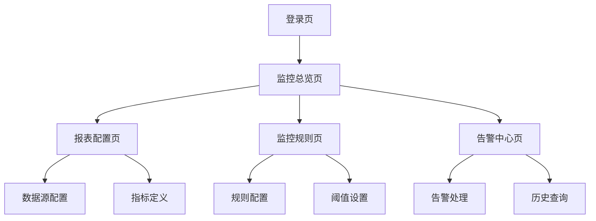

## 1. 产品概述
内网报表监控应用旨在为企业提供实时数据监控、异常告警和可视化分析能力。通过配置化的监控模型和灵活的告警机制，帮助运维和业务团队及时发现数据异常，保障业务稳定运行。

目标用户包括数据分析师、运维工程师、业务管理员等需要监控数据指标的人员。

## 2. 核心功能

### 2.1 用户角色
| 角色 | 注册方式 | 核心权限 |
|------|----------|----------|
| 普通用户 | LDAP统一认证 | 查看报表、接收告警 |
| 管理员 | LDAP统一认证 | 配置监控规则、管理用户权限、系统设置 |
| 超级管理员 | 系统初始化创建 | 全局配置、数据源管理、审计日志 |

### 2.2 功能模块
报表监控应用包含以下核心页面：
1. **监控总览页**：数据概览、运行状态、告警统计
2. **报表配置页**：数据源配置、指标定义、报表设计
3. **监控规则页**：规则配置、阈值设置、告警策略
4. **告警中心页**：告警列表、处理流程、历史记录
5. **系统管理页**：用户管理、权限配置、系统日志

### 2.3 页面详情
| 页面名称 | 模块名称 | 功能描述 |
|----------|----------|----------|
| 监控总览页 | 数据概览面板 | 展示核心指标实时数据、趋势图表、健康度评分 |
| 监控总览页 | 运行状态监控 | 显示系统运行状态、数据源连接状态、任务执行情况 |
| 监控总览页 | 告警统计 | 展示当日告警数量、级别分布、处理状态统计 |
| 报表配置页 | 数据源管理 | 配置数据库连接、API接口、文件数据源等连接信息 |
| 报表配置页 | 指标定义 | 定义监控指标、计算公式、数据维度、更新频率 |
| 报表配置页 | 报表设计器 | 使用拖拽式设计报表布局、图表类型、筛选条件 |
| 监控规则页 | 规则配置 | 创建监控规则、设置触发条件、定义规则作用范围 |
| 监控规则页 | 阈值设置 | 配置告警阈值、设置多级阈值、定义阈值调整策略 |
| 监控规则页 | 告警策略 | 配置通知方式、设置告警升级、定义静默期规则 |
| 告警中心页 | 告警列表 | 展示实时告警、支持筛选排序、批量处理告警 |
| 告警中心页 | 处理流程 | 告警确认、处理指派、解决方案记录、关闭流程 |
| 告警中心页 | 历史记录 | 查询历史告警、生成分析报告、导出处理记录 |
| 系统管理页 | 用户管理 | 用户增删改查、角色分配、权限组管理 |
| 系统管理页 | 权限配置 | 功能权限设置、数据权限控制、操作日志审计 |
| 系统管理页 | 系统日志 | 记录用户操作、系统事件、异常日志、审计追踪 |

## 3. 核心流程

### 管理员流程
管理员登录系统后，首先配置数据源连接信息，然后定义监控指标和报表模板。接着设置监控规则和告警阈值，配置通知渠道。日常工作中处理告警事件，查看系统运行状态。

### 普通用户流程
普通用户登录后查看监控总览，关注自己负责的报表和指标。接收告警通知，查看告警详情，协助处理相关问题。

## 4. 用户界面设计

### 4.1 设计风格
- **主色调**：深蓝色 (#1E3A8A) 为主，橙色 (#F97316) 为辅
- **按钮样式**：圆角矩形，主要操作用实心按钮，次要操作用描边按钮
- **字体规范**：中文使用PingFang SC，英文使用Inter，正文字号14px
- **布局风格**：左侧导航 + 右侧内容区的经典管理后台布局
- **图标风格**：使用简洁的线性图标，保持视觉一致性

### 4.2 页面设计概览
| 页面名称 | 模块名称 | UI元素 |
|----------|----------|--------|
| 监控总览页 | 数据卡片 | 使用卡片式布局展示关键指标，包含数值、趋势图和状态指示器 |
| 监控总览页 | 图表区域 | 采用AntV X6绘制实时图表，支持缩放、筛选、导出功能 |
| 报表配置页 | 配置面板 | 左侧树形结构展示数据源，右侧表单区域配置详细信息 |
| 监控规则页 | 规则列表 | 表格形式展示规则，支持拖拽排序、批量操作 |
| 告警中心页 | 告警看板 | 看板式布局，按状态分组展示告警，支持快速处理操作 |

### 4.3 响应式设计
采用桌面端优先的设计策略，主界面针对1920×1080分辨率优化。支持响应式适配，在1366×768及以上分辨率都能正常显示。移动端提供简化版本，支持主要查看功能。