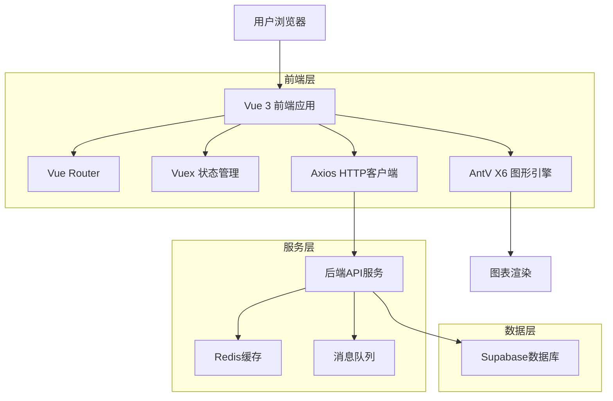
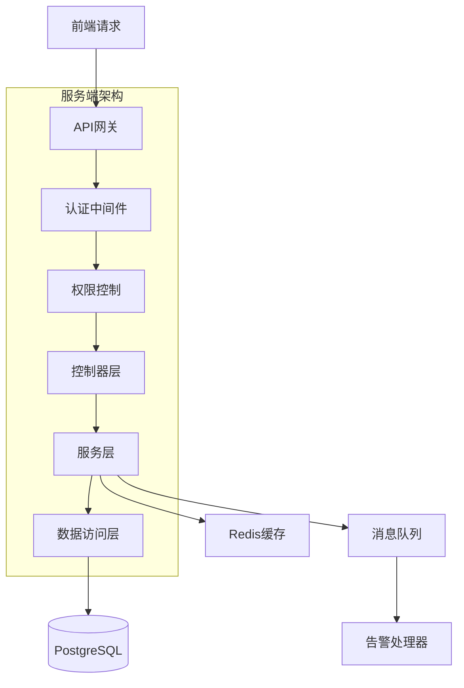
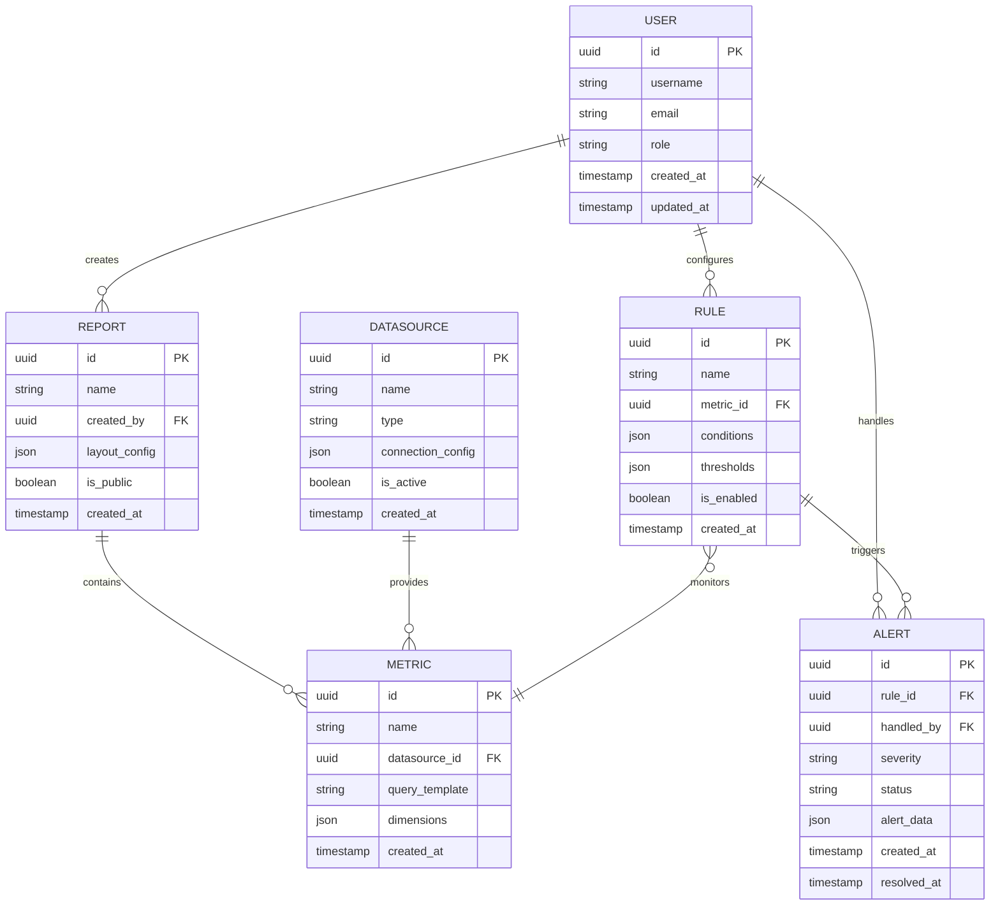

## 1. 架构设计



## 2. 技术描述

- **前端框架**: Vue 3 (Composition API) + TypeScript
- **构建工具**: Vite
- **图形引擎**: AntV X6 (用于流程图和监控图表)
- **状态管理**: Vuex 4
- **路由管理**: Vue Router 4
- **UI组件库**: Arco Design Vue
- **HTTP客户端**: Axios
- **初始化工具**: vite-init
- **后端服务**: Node.js + Express
- **数据库**: Supabase (PostgreSQL)
- **缓存**: Redis
- **消息队列**: Bull (基于Redis)

## 3. 路由定义

| 路由 | 用途 |
|------|------|
| / | 监控总览首页 |
| /dashboard | 监控总览仪表板 |
| /reports | 报表列表页面 |
| /reports/create | 创建新报表 |
| /reports/:id/edit | 编辑报表配置 |
| /reports/:id/view | 查看报表详情 |
| /rules | 监控规则管理 |
| /rules/create | 创建监控规则 |
| /rules/:id/edit | 编辑监控规则 |
| /alerts | 告警中心 |
| /alerts/:id | 告警详情 |
| /system/users | 用户管理 |
| /system/roles | 角色权限管理 |
| /system/logs | 系统日志 |
| /profile | 用户个人设置 |

## 4. API定义

### 4.1 认证相关
```
POST /api/auth/login
```

请求参数：
| 参数名 | 参数类型 | 是否必需 | 描述 |
|--------|----------|----------|------|
| username | string | 是 | 用户名 |
| password | string | 是 | 密码 |

响应：
| 参数名 | 参数类型 | 描述 |
|--------|----------|------|
| token | string | JWT令牌 |
| user | object | 用户信息 |

### 4.2 数据源管理
```
GET /api/datasources
POST /api/datasources
PUT /api/datasources/:id
DELETE /api/datasources/:id
```

### 4.3 监控指标
```
GET /api/metrics
POST /api/metrics
PUT /api/metrics/:id
DELETE /api/metrics/:id
GET /api/metrics/:id/data
```

### 4.4 监控规则
```
GET /api/rules
POST /api/rules
PUT /api/rules/:id
DELETE /api/rules/:id
POST /api/rules/:id/enable
POST /api/rules/:id/disable
```

### 4.5 告警管理
```
GET /api/alerts
PUT /api/alerts/:id/acknowledge
PUT /api/alerts/:id/resolve
GET /api/alerts/statistics
```

## 5. 服务端架构



## 6. 数据模型

### 6.1 实体关系图


### 6.2 数据定义语言

用户表 (users)
```sql
CREATE TABLE users (
  id UUID PRIMARY KEY DEFAULT gen_random_uuid(),
  username VARCHAR(50) UNIQUE NOT NULL,
  email VARCHAR(255) UNIQUE NOT NULL,
  password_hash VARCHAR(255) NOT NULL,
  role VARCHAR(20) DEFAULT 'user' CHECK (role IN ('user', 'admin', 'super_admin')),
  is_active BOOLEAN DEFAULT true,
  created_at TIMESTAMP WITH TIME ZONE DEFAULT NOW(),
  updated_at TIMESTAMP WITH TIME ZONE DEFAULT NOW()
);

CREATE INDEX idx_users_username ON users(username);
CREATE INDEX idx_users_email ON users(email);
```

数据源表 (datasources)
```sql
CREATE TABLE datasources (
  id UUID PRIMARY KEY DEFAULT gen_random_uuid(),
  name VARCHAR(100) NOT NULL,
  type VARCHAR(20) NOT NULL CHECK (type IN ('database', 'api', 'file')),
  connection_config JSONB NOT NULL,
  is_active BOOLEAN DEFAULT true,
  created_by UUID REFERENCES users(id),
  created_at TIMESTAMP WITH TIME ZONE DEFAULT NOW(),
  updated_at TIMESTAMP WITH TIME ZONE DEFAULT NOW()
);

CREATE INDEX idx_datasources_type ON datasources(type);
CREATE INDEX idx_datasources_active ON datasources(is_active);
```

监控规则表 (rules)
```sql
CREATE TABLE rules (
  id UUID PRIMARY KEY DEFAULT gen_random_uuid(),
  name VARCHAR(200) NOT NULL,
  description TEXT,
  metric_id UUID REFERENCES metrics(id),
  conditions JSONB NOT NULL,
  thresholds JSONB NOT NULL,
  notification_config JSONB,
  is_enabled BOOLEAN DEFAULT true,
  created_by UUID REFERENCES users(id),
  created_at TIMESTAMP WITH TIME ZONE DEFAULT NOW(),
  updated_at TIMESTAMP WITH TIME ZONE DEFAULT NOW()
);

CREATE INDEX idx_rules_enabled ON rules(is_enabled);
CREATE INDEX idx_rules_metric ON rules(metric_id);
```

告警记录表 (alerts)
```sql
CREATE TABLE alerts (
  id UUID PRIMARY KEY DEFAULT gen_random_uuid(),
  rule_id UUID REFERENCES rules(id),
  severity VARCHAR(20) CHECK (severity IN ('info', 'warning', 'critical')),
  status VARCHAR(20) DEFAULT 'open' CHECK (status IN ('open', 'acknowledged', 'resolved')),
  alert_data JSONB,
  handled_by UUID REFERENCES users(id),
  notes TEXT,
  created_at TIMESTAMP WITH TIME ZONE DEFAULT NOW(),
  acknowledged_at TIMESTAMP WITH TIME ZONE,
  resolved_at TIMESTAMP WITH TIME ZONE
);

CREATE INDEX idx_alerts_status ON alerts(status);
CREATE INDEX idx_alerts_severity ON alerts(severity);
CREATE INDEX idx_alerts_created ON alerts(created_at DESC);
```

### 6.3 权限配置
```sql
-- 基本访问权限
GRANT SELECT ON users TO anon;
GRANT SELECT ON datasources TO anon;
GRANT SELECT ON reports TO anon;
GRANT SELECT ON metrics TO anon;

-- 认证用户权限
GRANT ALL PRIVILEGES ON users TO authenticated;
GRANT ALL PRIVILEGES ON datasources TO authenticated;
GRANT ALL PRIVILEGES ON reports TO authenticated;
GRANT ALL PRIVILEGES ON metrics TO authenticated;
GRANT ALL PRIVILEGES ON rules TO authenticated;
GRANT ALL PRIVILEGES ON alerts TO authenticated;
```