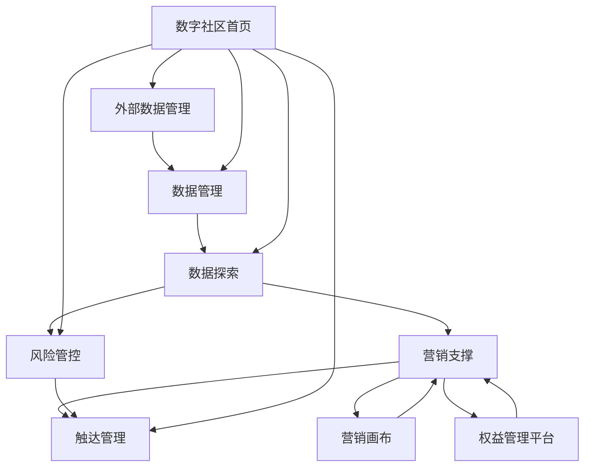

# 剩余项目综合说明文档

## 项目概述

本文档汇总了数字社区平台中尚未单独形成完整说明文档的剩余核心模块，包括数据管理、数据探索、营销支撑、风险管控、外部数据管理、触达管理等关键业务领域。这些模块共同构成了数据社区平台的完整业务闭环，为用户提供从数据资产管理到业务应用的全链路支持。

> 注：数字营销功能已拆分为营销画布和权益管理平台，本文档中的营销支撑模块专注于为这两个平台提供底层数据支撑和效果分析能力。

## 数据管理模块

### 项目定位
数据管理模块作为数据社区的核心基础设施，致力于构建统一、高效、安全的数据资产管理平台。通过标准化的数据管理流程和智能化的数据治理手段，实现数据资产的全生命周期管理，确保数据质量、安全性和可用性。

### 核心功能架构

#### 1. 数据资产管理
- **资产目录管理**：构建分层分级的数据资产目录体系
- **元数据管理**：自动采集和维护数据资产的元数据信息
- **数据血缘追踪**：可视化展示数据的来源、流转和依赖关系
- **资产价值评估**：基于使用频次和业务价值的资产价值评分

#### 2. 数据质量管理
- **质量规则引擎**：支持自定义数据质量检查规则
- **异常检测预警**：实时监控数据异常并发送预警通知
- **质量报告生成**：定期生成数据质量评估报告
- **问题跟踪处理**：建立数据质量问题跟踪和处理闭环

#### 3. 数据权限管控
- **细粒度权限**：支持表级、字段级的精细化权限控制
- **角色权限矩阵**：基于角色的权限分配和管理
- **数据脱敏策略**：敏感数据的动态脱敏和静态脱敏
- **审计日志追踪**：完整的权限操作审计和追踪

#### 4. 数据服务管理
- **服务目录**：统一的数据服务注册和发现
- **API管理**：数据接口的创建、发布、版本控制
- **服务监控**：数据服务的性能监控和SLA管理
- **使用统计分析**：数据服务的使用情况和价值分析

### 业务场景设计

#### 场景一：数据资产盘点
**业务目标**：帮助数据管理员全面了解数据资产现状
**核心流程**：
1. 自动扫描数据源，建立资产清单
2. 基于业务域进行资产分类和标签化
3. 生成资产健康度评估报告
4. 识别高价值和高风险数据资产

#### 场景二：数据质量治理
**业务目标**：建立持续的数据质量改进机制
**核心流程**：
1. 制定数据质量标准和检查规则
2. 自动化执行质量检查任务
3. 异常数据的通知和修复
4. 质量改进效果的跟踪评估

## 数据探索模块

### 项目定位
数据探索模块旨在为数据分析师和业务人员提供直观、高效的数据探索和分析工具，通过可视化的方式降低数据分析门槛，支持从数据发现到洞察生成的完整分析流程。

### 核心功能架构

#### 1. 数据探索工具集
- **可视化查询**：拖拽式的数据查询和筛选界面
- **多维分析**：支持多维度、多指标的交叉分析
- **趋势分析**：时间序列数据的趋势和异常检测
- **关联分析**：发现数据间的关联关系和隐藏模式

#### 2. 智能分析助手
- **自然语言查询**：支持用自然语言描述分析需求
- **智能推荐**：基于数据特征推荐合适的分析方法和图表
- **异常自动检测**：自动识别数据中的异常点和异常模式
- **洞察生成**：自动生成数据洞察和业务建议

#### 3. 协作分析空间
- **分析项目**：支持创建和管理分析项目
- **协作分享**：分析结果和洞察的分享和讨论
- **版本管理**：分析过程和结果的版本控制
- **模板复用**：优秀分析案例的模板化和复用

#### 4. 高级分析能力
- **机器学习集成**：内置常用机器学习算法和模型
- **预测分析**：基于历史数据的趋势预测和模拟
- **A/B测试分析**：实验设计和效果评估的完整支持
- **因果分析**：支持因果推断和效果评估分析

### 业务场景设计

#### 场景一：业务问题诊断
**业务目标**：快速定位业务问题的数据根因
**核心流程**：
1. 选择业务问题相关的数据集
2. 通过可视化工具进行数据探索
3. 识别关键影响因素和异常点
4. 生成问题诊断报告和建议

#### 场景二：增长机会发现
**业务目标**：通过数据发现业务增长机会
**核心流程**：
1. 分析用户行为数据和业务指标
2. 识别高价值用户群体和行为模式
3. 发现潜在的增长点和优化机会
4. 制定基于数据的增长策略

## 营销支撑模块

### 项目定位
营销支撑模块作为营销画布和权益管理平台的支撑系统，专注于提供营销活动的底层数据支持、客户洞察分析和营销效果追踪能力，与营销画布形成完整的营销技术栈。

### 核心功能架构

#### 1. 营销数据服务
- **客户数据整合**：整合多源客户数据形成统一客户视图
- **行为数据追踪**：全渠道客户行为数据的采集和分析
- **标签体系管理**：动态客户标签的生成和管理
- **实时数据计算**：支持实时营销场景的数据计算需求

#### 2. 营销效果分析
- **转化漏斗分析**：多维度营销活动转化效果分析
- **客户旅程分析**：客户在不同触点间的行为轨迹分析
- **ROI计算引擎**：精确的营销投入产出计算
- **长期价值追踪**：客户生命周期价值的持续追踪

#### 3. 智能推荐引擎
- **商品推荐**：基于客户画像的个性化商品推荐
- **内容推荐**：营销内容的智能推荐和优化
- **时机推荐**：最佳营销时机的智能推荐
- **渠道推荐**：基于客户偏好的最优触达渠道推荐

### 业务场景设计

#### 场景一：营销数据准备
**业务目标**：为营销画布提供高质量的客户数据基础
**核心流程**：
1. 整合客户基础数据和行为数据
2. 生成客户标签和分群
3. 建立客户价值评估模型
4. 提供标准化的数据接口服务

#### 场景二：营销效果评估
**业务目标**：为权益管理平台提供营销效果的精确评估
**核心流程**：
1. 建立营销活动效果评估体系
2. 实时追踪营销活动关键指标
3. 分析不同权益策略的效果差异
4. 生成营销优化建议报告

## 风险管控模块

### 项目定位
风险管控模块致力于构建全面、实时的风险识别、评估、监控和处置体系，为业务决策提供风险预警和管控支持，确保业务稳健发展。

### 核心功能架构

#### 1. 风险识别系统
- **规则引擎**：灵活的风险规则配置和管理
- **模型监控**：基于机器学习的风险识别模型
- **异常检测**：实时异常行为检测和预警
- **关联分析**：风险事件的关联分析和传播路径

#### 2. 风险评估体系
- **评分卡模型**：客户和交易的风险评分体系
- **压力测试**：极端情况下的风险承受能力测试
- **情景分析**：不同业务情景下的风险影响评估
- **风险评级**：多维度综合风险评级体系

#### 3. 风险监控预警
- **实时预警**：7×24小时实时风险监控
- **预警分级**：不同级别风险的差异化处理
- **预警通知**：多渠道的预警通知机制
- **处置跟踪**：风险事件的处置过程跟踪

#### 4. 风险报告管理
- **日报生成**：每日风险状况汇总报告
- **专题分析**：特定风险主题的深度分析
- **监管报告**：符合监管要求的合规报告
- **可视化展示**：风险数据的可视化展示

### 业务场景设计

#### 场景一：信贷风险管控
**业务目标**：控制信贷业务的信用风险
**核心流程**：
1. 客户信用评估和授信决策
2. 贷后风险的持续监控
3. 早期预警和催收策略
4. 风险损失的计量和分析

#### 场景二：反欺诈防控
**业务目标**：识别和防范各类欺诈行为
**核心流程**：
1. 欺诈行为的特征识别和建模
2. 交易和行为的实时监控
3. 可疑事件的调查和处置
4. 反欺诈策略的持续优化

## 外部数据管理模块

### 项目定位
外部数据管理模块专注于外部数据资源的接入、整合、管理和应用，通过建立标准化的外部数据管理体系，实现外部数据价值的最大化利用。

### 核心功能架构

#### 1. 数据源接入管理
- **数据源注册**：外部数据源的统一注册和管理
- **接入配置**：灵活的数据接入配置和参数管理
- **数据校验**：接入数据的质量检查和格式验证
- **异常处理**：数据接入异常的自动处理和通知

#### 2. 数据整合处理
- **数据清洗**：外部数据的清洗和标准化处理
- **数据映射**：外部数据与内部数据的映射关系
- **数据融合**：多源外部数据的融合和整合
- **质量评估**：外部数据质量的持续评估和监控

#### 3. 数据服务化
- **API封装**：外部数据的API化封装和发布
- **权限控制**：外部数据使用的权限控制和管理
- **使用监控**：外部数据使用情况的监控和统计
- **成本控制**：外部数据使用的成本核算和控制

#### 4. 价值评估体系
- **效果评估**：外部数据对业务的价值贡献评估
- **ROI分析**：外部数据投入产出的精确计算
- **替代分析**：不同数据源的价值对比和替代分析
- **策略优化**：基于价值评估的数据采购策略优化

### 业务场景设计

#### 场景一：征信数据应用
**业务目标**：通过征信数据提升风控准确性
**核心流程**：
1. 征信数据源的接入和测试
2. 征信数据与内部数据的融合
3. 征信特征在风控模型中的应用
4. 征信数据效果的持续评估

#### 场景二：营销数据补充
**业务目标**：通过外部数据丰富客户画像
**核心流程**：
1. 第三方行为数据的接入
2. 客户画像的丰富和完善
3. 基于丰富画像的精准营销
4. 营销效果的对比和优化

## 触达管理模块

### 项目定位
触达管理模块致力于构建统一、智能的客户触达平台，整合多种触达渠道和资源，实现精准、高效、合规的客户沟通和服务。

### 核心功能架构

#### 1. 渠道管理
- **渠道整合**：短信、邮件、APP推送、微信等多渠道整合
- **资源管理**：各渠道资源的统一管理和配置
- **成本核算**：不同触达渠道的成本核算和优化
- **质量监控**：各渠道触达质量的监控和评估

#### 2. 触达策略
- **时机优化**：基于客户行为的最佳触达时机
- **频次控制**：防止过度触达的频次控制机制
- **内容个性化**：基于客户特征的个性化内容
- **渠道优选**：基于客户偏好的最优触达渠道选择

#### 3. 触达执行
- **批量触达**：大规模的批量触达任务执行
- **实时触达**：基于触发条件的实时触达
- **A/B测试**：触达策略的A/B测试和优化
- **异常处理**：触达失败的自动重试和处理

#### 4. 效果评估
- **触达统计**：触达成功率和响应率统计
- **转化分析**：触达后的客户行为转化分析
- **长期效果**：触达对客户长期价值的影响评估
- **策略优化**：基于效果数据的策略持续优化

### 业务场景设计

#### 场景一：客户服务通知
**业务目标**：通过及时通知提升客户服务体验
**核心流程**：
1. 识别需要通知的客户和服务场景
2. 选择最合适的触达渠道和时机
3. 执行触达并监控效果
4. 收集客户反馈并优化触达策略

#### 场景二：营销活动触达
**业务目标**：通过精准触达提升营销活动效果
**核心流程**：
1. 基于客户分群制定触达策略
2. 设计个性化的触达内容和时机
3. 执行多渠道联合触达
4. 评估触达效果并优化策略

## 技术架构整合

### 统一技术栈
- **前端框架**：Vue 3 + TypeScript
- **UI组件库**：Arco Design Vue（保持一致的设计语言）
- **状态管理**：Pinia（统一的状态管理方案）
- **路由管理**：Vue Router（模块化的路由配置）
- **构建工具**：Vite（现代化的构建和开发体验）

### 模块间集成
- **统一认证**：基于用户中心的统一身份认证
- **权限体系**：基于RBAC的细粒度权限控制
- **数据共享**：通过API网关实现模块间数据共享
- **消息总线**：基于事件驱动的模块间通信
- **监控体系**：统一的系统监控和日志管理

### 部署架构
- **微前端架构**：支持模块的独立开发和部署
- **容器化部署**：基于Docker的容器化部署方案
- **CI/CD流程**：自动化的构建、测试、部署流程
- **环境管理**：开发、测试、预生产、生产环境管理

## 数据流架构

### 数据流向设计
```
外部数据源 → 外部数据管理 → 数据管理 → 数据探索 → 业务应用
                    ↓
              风险管控 ← 数字营销 ← 触达管理
```

### 数据标准化
- **数据标准**：统一的数据标准和规范
- **元数据管理**：完整的元数据管理体系
- **数据质量**：全链路的数据质量保障
- **数据安全**：端到端的数据安全保护

## 核心价值主张

### 业务价值
- **效率提升**：通过自动化和智能化提升业务效率50%以上
- **风险控制**：建立全面的风险识别和控制体系
- **客户体验**：提供个性化、精准的客户服务体验
- **决策支持**：基于数据的科学决策支持体系

### 技术价值
- **架构先进性**：采用现代化的微服务架构
- **扩展灵活性**：支持业务的快速扩展和迭代
- **运维高效性**：自动化的运维和监控体系
- **安全可靠性**：企业级的安全和可靠性保障

### 生态价值
- **开放能力**：提供标准化的API和数据服务
- **生态集成**：支持第三方系统和应用的集成
- **知识沉淀**：建立企业级的数据知识库
- **持续进化**：基于业务反馈的持续优化和进化

## 实施路线图

### 第一阶段：基础设施建设（1-2个月）
- 数据管理模块的核心功能开发
- 基础的数据标准和规范建立
- 统一的身份认证和权限体系

### 第二阶段：核心能力建设（2-3个月）
- 数据探索和风险管理能力建设
- 外部数据接入和管理能力
- 基础的数据分析和可视化能力

### 第三阶段：业务应用建设（2-3个月）
- 数字营销和触达管理能力建设
- 高级分析和智能化能力建设
- 业务场景的深度应用和优化

### 第四阶段：生态完善（持续）
- 基于业务反馈的持续优化
- 新场景和新能力的持续增加
- 生态伙伴的集成和合作

## 附录：模块关系图



## 关键术语定义

- **数据资产**：具有业务价值的数据资源集合
- **数据血缘**：数据的来源、流转和依赖关系
- **客户触达**：通过多种渠道与客户进行沟通和互动
- **风险评级**：对风险程度的量化评估和分级
- **数据服务化**：将数据能力封装为可复用的服务
- **微前端**：将前端应用拆分为独立开发和部署的模块
- **数据治理**：对数据资产进行管理和控制的过程
- **客户画像**：基于数据构建的客户特征和行为模型
- **营销自动化**：基于规则的营销活动自动执行
- **实时风控**：对风险的实时识别和响应