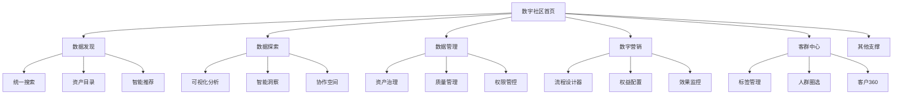
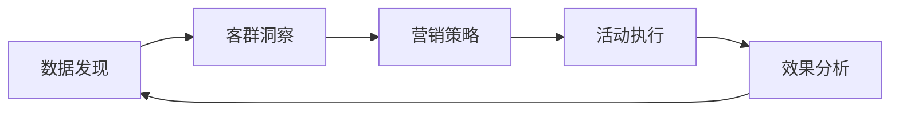

# 数字社区产品说明文档

## 产品概述

数字社区是一个面向企业用户的数据管理产品，通过整合数据资产管理、客户管理、营销管理等核心能力，为企业提供从数据发现到业务增长的完整解决方案。产品采用模块化设计，支持按需组合使用，帮助企业实现数据驱动的精细化运营。

## 产品架构

### 核心模块

数字社区由六大核心产品模块组成，覆盖企业数据应用的完整链路：

- **数据发现**：企业数据资产的智能搜索引擎
- **数据探索**：业务人员的数据分析工作台  
- **数据管理**：数据资产的统一治理平台
- **数字营销**：可视化营销流程设计器
- **客群中心**：客户数据管理与洞察平台
- **其他支撑**：外部数据接入、权限管控等基础能力

### 产品关系图



## 核心产品详解

### 1. 数字社区首页 - 统一工作台

**产品定位**：企业用户的个性化数据工作台

**核心场景**：
- **数据概览**：企业数据资产总览、业务指标监控
- **快捷入口**：根据角色和权限展示常用功能
- **待办提醒**：数据任务、审批流程、异常预警
- **最佳实践**：行业案例、使用指南、操作手册

**用户价值**：
- 减少50%的系统切换时间
- 提升80%的数据查找效率
- 实现个性化工作界面配置

### 2. 数据发现 - 统一搜索门户

**产品定位**：让业务人员通过统一搜索界面快速找到所需数据资产的数据门户

#### 核心价值主张
| 维度 | 现状痛点 | 平台解法 | 量化价值 |
|---|---|---|---|
| **搜索效率** | 数据分散在多个系统，查找需要跨平台 | 统一搜索入口，秒级返回结果 | 数据发现时间从天级缩短到分钟级 |
| **理解成本** | 数据文档缺失，业务理解困难 | 标准化资产详情，业务语言描述 | 数据理解时间从小时级缩短到分钟级 |
| **使用门槛** | 需要技术背景，SQL查询复杂 | 自然语言搜索，业务人员友好 | 数据使用门槛降低50% |
| **协作效率** | 数据问题沟通成本高，重复造轮子 | 统一知识库，经验沉淀共享 | 团队协作效率提升80% |

#### 目标用户画像
| 角色 | 高频场景 | 关键诉求 |
|---|---|---|
| **业务分析师** | 业务数据查找、指标定义查询、数据质量检查 | 快速找到可信数据源，理解业务含义 |
| **数据产品经理** | 数据资产盘点、数据需求评估、数据治理 | 全面了解数据资产状况，支持决策制定 |
| **运营专员** | 用户行为数据查询、营销活动数据支持 | 无需技术背景，快速获取业务数据 |
| **技术开发** | 数据表结构查询、数据血缘关系、接口文档 | 快速理解数据结构，减少沟通成本 |

#### 用户旅程地图
```
需求产生 → 搜索查询 → 结果筛选 → 详情理解 → 权限申请 → 数据使用 → 问题反馈 → 经验沉淀
```

#### 核心功能模块

**1. 统一搜索引擎**
- **关键词搜索**：支持关键词快速搜索数据资产
- **多维度筛选**：按业务域、数据类型、更新时间等多条件筛选
- **分类浏览**：按数据类型和业务范围分类浏览数据资产
- **搜索历史**：记录搜索历史，支持快速复用

**2. 标准化资产详情**
- **业务描述**：用业务语言清晰描述数据含义和使用场景
- **技术信息**：表结构、字段说明、数据量级等技术详情
- **质量报告**：数据质量评分、更新频率、历史变更记录
- **使用指南**：数据使用示例、常见问题、最佳实践

**3. 数据血缘关系**
- **血缘图谱**：可视化展示数据来源、处理过程、下游应用
- **影响分析**：上游变更对下游的影响范围分析
- **溯源追踪**：从报表追溯到原始数据源的完整链路
- **变更通知**：数据变更自动通知相关使用方

**4. 权限管理中心**
- **权限透明**：清晰展示每个数据资产的权限要求
- **一键申请**：在线提交权限申请，流程自动化
- **权限继承**：支持权限继承和批量授权
- **审计追踪**：完整的权限申请和使用记录

#### 典型使用场景

**场景1：营销活动数据准备**
- **痛点**：需要找用户、订单、商品等多张表，跨系统查询耗时
- **解法**：统一搜索入口，一键找到所有相关数据资产
- **效果**：数据准备时间从2天缩短到30分钟

**场景2：新同事数据上手**
- **痛点**：新人不熟悉数据体系，需要大量培训时间
- **解法**：标准化资产详情，业务语言描述，快速理解
- **效果**：新人上手时间从1周缩短到1天

**场景3：数据质量问题排查**
- **痛点**：报表数据异常，需要逐层排查数据源
- **解法**：血缘关系图谱，快速定位问题源头
- **效果**：问题排查时间从半天缩短到30分钟

**场景4：数据资产盘点**
- **痛点**：数据资产状况不清晰，重复建设严重
- **解法**：统一资产目录，实时掌握数据资产状况
- **效果**：资产利用率提升，重复建设减少60%

#### 数据特色
- **实时同步**：数据资产信息实时更新，保证搜索结果的时效性
- **标准化管理**：统一的数据标准和分类体系
- **众包知识**：用户可以对数据资产进行评价和补充说明
- **开放API**：支持与其他系统的数据发现和集成

#### 用户价值
- **业务人员**：数据发现效率提升80%，无需技术背景即可使用
- **数据团队**：减少重复性数据查找工作，专注高价值分析
- **管理团队**：数据资产状况一目了然，支持科学决策
- **技术团队**：降低数据使用门槛，提升数据资产价值

### 3. 数据探索 - 零代码分析平台

**产品定位**：让业务人员通过可视化界面进行数据分析的零代码分析平台

#### 核心价值主张
| 维度 | 现状痛点 | 平台解法 | 量化价值 |
|---|---|---|---|
| **技术门槛** | 需要SQL等技术能力，业务人员无法自助 | 拖拽式分析，零技术门槛 | 数据分析门槛降低70% |
| **分析效率** | 需求响应慢，需要数据团队支持 | 自助式分析，实时生成结果 | 分析效率提升60% |
| **协作效率** | 分析结果分享困难，协作效率低 | 一键分享协作，团队知识沉淀 | 团队协作效率提升50% |
| **决策速度** | 数据获取滞后，影响业务决策 | 实时数据分析，支持快速决策 | 决策响应速度提升3倍 |

#### 目标用户画像
| 角色 | 高频场景 | 关键诉求 |
|---|---|---|
| **业务分析师** | 业务问题诊断、数据趋势分析、专项报告制作 | 快速进行数据探索，无需依赖技术团队 |
| **产品经理** | 产品功能验证、用户行为分析、A/B测试分析 | 直观展示分析结果，支持产品决策 |
| **运营专员** | 活动效果分析、用户增长监控、日常数据报表 | 简单易用，快速生成标准分析报表 |
| **管理层** | 业务指标监控、经营决策支持、趋势预测 | 实时掌握业务状况，支持管理决策 |

#### 用户旅程地图
```
问题发现 → 数据选择 → 分析设计 → 图表生成 → 洞察解读 → 结果分享 → 行动跟进 → 效果验证
```

#### 核心功能模块

**1. 分析助手**
- **模板化分析**：基于预设模板快速生成标准分析
- **图表配置**：支持手动选择和配置适合的图表类型
- **数据检查**：支持数据异常点的手动识别和标记
- **结果说明**：为分析结果提供业务解释和建议

**2. 拖拽式分析设计器**
- **维度拖拽**：将字段拖拽到维度区域，自动生成分析维度
- **指标配置**：支持求和、计数、平均值等多种统计方式
- **筛选条件**：可视化配置数据筛选条件
- **计算字段**：支持自定义计算字段和复杂指标

**3. 图表可视化中心**
- **丰富图表库**：柱状图、折线图、饼图、散点图等20+种图表
- **交互式图表**：支持图表缩放、筛选、钻取等交互操作
- **主题样式**：多种专业主题样式，一键美化图表
- **移动端适配**：图表自动适配手机、平板等移动设备

**4. 协作分享空间**
- **一键分享**：分析结果一键生成分享链接
- **权限控制**：设置查看、编辑等不同权限级别
- **评论讨论**：团队成员可以对分析结果进行评论讨论
- **版本管理**：保存分析历史版本，支持版本对比

**5. 模板市场**
- **行业模板**：电商、金融、教育等行业标准分析模板
- **场景模板**：用户增长、转化漏斗、留存分析等场景模板
- **自定义模板**：用户可以将自己的分析保存为模板
- **模板评价**：用户对模板的使用效果进行评价和反馈

#### 典型使用场景

**场景1：用户增长分析**
- **痛点**：需要分析新用户获取、激活、留存等多个环节
- **解法**：拖拽式配置用户增长漏斗，自动生成转化分析
- **效果**：分析时间从1天缩短到30分钟，效率提升95%

**场景2：营销活动效果评估**
- **痛点**：活动数据分散，难以全面评估效果
- **解法**：一站式活动数据分析，自动生成多维度效果报告
- **效果**：活动复盘时间从2天缩短到2小时

**场景3：产品功能验证**
- **痛点**：产品功能上线后效果验证周期长
- **解法**：实时用户行为分析，快速验证功能效果
- **效果**：产品迭代周期缩短，用户反馈响应更快

**场景4：经营决策支持**
- **痛点**：管理层需要等待周报月报，决策滞后
- **解法**：实时经营数据看板，支持管理层随时查看
- **效果**：决策响应速度提升3倍，抓住市场机会

#### 技术特色
- **零代码操作**：业务人员无需任何技术背景即可使用
- **实时计算**：大数据量下也能实现秒级响应
- **模板化推荐**：基于预设模板提供标准化的分析建议
- **企业级能力**：支持千万级数据的快速分析和展示

#### 用户价值
- **业务人员**：实现100%的自助数据分析，不再依赖技术团队
- **数据团队**：减少重复性分析工作，专注高价值数据科学
- **管理层**：实时掌握业务状况，支持科学决策
- **组织效率**：整体数据分析效率提升，业务响应速度加快

### 4. 数据管理 - 企业数据治理中心

**产品定位**：让企业通过标准化流程科学管理数据资产的数据治理平台

#### 核心价值主张
| 维度 | 现状痛点 | 平台解法 | 量化价值 |
|---|---|---|---|
| **资产可见** | 数据资产状况不清晰，重复建设严重 | 统一资产盘点，资产状况一目了然 | 数据资产利用率提升90%，重复建设减少60% |
| **质量保障** | 数据质量问题频发，影响业务决策 | 系统化质量监控，问题早发现早解决 | 数据质量问题减少60%，业务决策更可靠 |
| **权限管理** | 权限配置复杂，合规风险高 | 精细化权限管理，自动化合规检查 | 权限合规率100%，审计风险显著降低 |
| **服务效率** | 数据服务重复开发，资源浪费 | 统一服务共享，避免重复造轮子 | 数据服务开发效率提升50%，成本降低 |

#### 目标用户画像
| 角色 | 高频场景 | 关键诉求 |
|---|---|---|
| **数据治理专员** | 数据资产盘点、质量监控、合规审计 | 全面掌握数据资产状况，系统性治理 |
| **数据架构师** | 数据架构设计、标准制定、技术选型 | 统一数据标准，优化数据架构 |
| **合规审计员** | 数据权限审计、合规检查、风险评估 | 确保数据使用合规，降低审计风险 |
| **数据产品经理** | 数据服务规划、需求评估、质量管理 | 提升数据服务质量，满足业务需求 |

#### 用户旅程地图
```
资产发现 → 质量评估 → 标准制定 → 治理实施 → 效果监控 → 持续优化 → 价值评估 → 经验推广
```

#### 核心功能模块

**1. 数据资产盘点**
- **自动发现**：自动扫描企业所有数据资产，生成资产清单
- **资产地图**：可视化展示数据资产分布和关系
- **价值评估**：基于使用频率、业务价值等维度评估资产价值
- **生命周期**：跟踪数据资产从创建到消亡的完整生命周期

**2. 质量监控中心**
- **规则引擎**：内置20+种常用数据质量检查规则
- **实时监控**：7×24小时监控数据质量状况
- **异常预警**：数据异常时自动通知相关负责人
- **问题追踪**：质量问题从发现到解决的完整追踪

**3. 标准管理中心**
- **标准制定**：可视化制定数据命名、格式、质量标准
- **标准检查**：自动检查数据是否符合标准要求
- **标准推广**：将优秀实践推广到全组织
- **版本管理**：数据标准的版本控制和变更管理

**4. 权限治理中心**
- **权限审计**：定期审计数据权限配置
- **合规检查**：自动检查是否符合数据保护法规
- **权限优化**：基于使用情况优化权限配置
- **风险评估**：评估数据权限相关的安全风险

**5. 服务共享市场**
- **服务目录**：统一管理所有数据服务
- **服务评价**：用户对数据服务的使用效果进行评价
- **服务复用**：避免重复开发相同的数据服务
- **服务监控**：监控数据服务的使用情况和性能

#### 典型治理场景

**场景1：数据资产大盘点**
- **痛点**：企业数据资产状况不清晰，管理层决策缺乏依据
- **解法**：一键生成数据资产全景图，资产价值一目了然
- **效果**：资产利用率提升90%，重复建设显著减少

**场景2：数据质量专项治理**
- **痛点**：数据质量问题频发，影响业务正常运营
- **解法**：系统化质量检查，问题自动发现和修复
- **效果**：数据质量问题减少60%，业务决策更可靠

**场景3：权限合规审计**
- **痛点**：数据权限配置复杂，合规审计压力大
- **解法**：自动化权限审计，合规风险提前发现
- **效果**：审计准备时间从1周缩短到1天，合规率100%

**场景4：数据服务标准化**
- **痛点**：数据服务重复开发，资源浪费严重
- **解法**：统一服务市场，避免重复造轮子
- **效果**：服务开发效率提升50%，开发成本降低

#### 治理特色
- **流程化治理**：基于标准化流程完成治理工作
- **标准化建议**：基于最佳实践提供治理建议
- **全生命周期**：覆盖数据从产生到消亡的完整治理流程
- **持续优化**：治理效果持续监控和优化

#### 用户价值
- **数据团队**：系统性提升数据质量，减少救火式工作
- **业务团队**：使用更可靠的数据，业务决策更有信心
- **管理层**：数据资产状况一目了然，支持科学决策
- **审计部门**：合规风险显著降低，审计工作更轻松

### 5. 数字营销 - 可视化营销设计器

**产品定位**：让营销人员像搭积木一样设计复杂营销流程的可视化营销任务中心

#### 核心价值主张
| 维度 | 现状痛点 | 平台解法 | 量化价值 |
|---|---|---|---|
| **设计** | 技术门槛高，需要开发介入，平均设计周期2周 | 拖拽式流程设计，业务人员自助完成 | 设计时间从天级缩短至分钟级 |
| **管理** | 营销活动分散管理，缺乏统一视图 | 一站式任务管理，实时监控执行状态 | 活动响应速度提升，ROI提高30% |
| **优化** | 效果分析滞后，难以快速调整策略 | 实时数据反馈，支持动态优化 | 测试周期缩短50%，优化效率提升 |
| **协作** | 跨部门协作效率低，沟通成本高 | 可视化流程共享，团队协作透明化 | 协作效率提升，需求理解一致 |

#### 目标用户画像
| 角色 | 高频场景 | 关键诉求 |
|---|---|---|
| **营销运营专员** | 活动策划、用户分群、营销自动化配置 | 快速设计营销流程，无需技术介入，实时监控效果 |
| **产品经理** | 用户增长策略、产品推广活动设计 | 灵活配置营销策略，A/B测试快速迭代 |
| **数据分析师** | 营销效果分析、用户行为洞察 | 直观展示数据流向，支持复杂分析场景 |
| **技术运营** | 营销系统配置、数据接口管理 | 标准化流程模板，减少重复开发工作 |

#### 用户旅程地图
```
需求产生 → 流程设计 → 节点配置 → 效果预览 → 发布上线 → 监控优化 → 效果复盘 → 流程复用
```

#### 核心功能模块

**1. 流程设计器**
- **拖拽式操作**：像搭积木一样连接各种营销节点
- **丰富节点库**：开始、判断、延迟、消息、结束等多种节点类型
- **实时预览**：设计过程中实时预览流程执行效果
- **智能布局**：自动调整节点位置，让流程图清晰美观

**2. 任务管理中心**
- **活动总览**：一眼看清当前所有营销活动状态
- **实时监控**：实时展示每个活动的执行进度和效果数据
- **模板复用**：将成功的活动保存为模板，一键复用
- **权限管理**：不同角色看到不同的活动权限

**3. 节点配置系统**
- **表单化配置**：每个节点都有对应的配置表单，填写即可使用
- **变量支持**：支持用户属性、行为数据等动态变量
- **条件表达式**：可视化配置复杂的判断条件
- **模板库**：内置常用配置模板，一键应用

**4. 效果监控面板**
- **实时数据**：展示当前活动的触达人数、转化率等关键指标
- **节点级监控**：每个节点的执行数据都能单独查看
- **异常预警**：流程异常时及时通知相关人员
- **对比分析**：支持不同活动的效果对比

**5. 模板市场**
- **场景模板**：按行业、目的分类的营销流程模板
- **一键复用**：选择模板后一键生成新的营销活动
- **用户评价**：用户对模板的使用效果进行评价
- **自定义模板**：用户可以将自己的流程保存为模板

#### 典型使用场景

**场景1：新用户欢迎流程**
- **痛点**：需要开发写代码，调整一次要1周
- **解法**：拖拽式配置7天欢迎流程，实时预览效果
- **效果**：新员工培训时间从1周缩短到1天

**场景2：节日营销活动**
- **痛点**：活动分散管理，效果监控不及时
- **解法**：统一活动管理面板，实时数据监控
- **效果**：活动响应速度提升，ROI提高30%

**场景3：用户分层运营**
- **痛点**：用户标签复杂，策略配置门槛高
- **解法**：可视化标签配置，策略模板复用
- **效果**：用户分群效率提升，精准度提高

**场景4：A/B测试优化**
- **痛点**：测试周期长，调整不灵活
- **解法**：实时数据反馈，支持动态调整策略
- **效果**：测试周期缩短50%，优化效率提升

#### 技术特色
- **零代码设计**：业务人员无需技术背景即可操作
- **实时响应**：所有操作实时反馈，所见即所得
- **企业级能力**：支持千万级客户的复杂营销场景
- **开放扩展**：支持自定义节点类型和配置模板

#### 用户价值
- **营销人员**：营销活动设计时间从天级缩短到分钟级
- **业务团队**：提升50%的营销活动转化率
- **技术团队**：降低70%的营销系统开发工作量
- **管理层**：实现营销活动的全流程可视化管理

### 6. 客群中心 - 客户数据中枢

**产品定位**：让营销人员通过可视化界面构建客户画像、精准圈选目标人群的客户数据中心

#### 核心价值主张
| 维度 | 现状痛点 | 平台解法 | 量化价值 |
|---|---|---|---|
| **数据整合** | 客户数据分散在多个系统，难以统一视图 | 一站式客户数据整合，360度客户画像 | 数据准备时间从周级缩短到小时级 |
| **标签构建** | 标签创建需要技术介入，业务人员无法自助 | 可视化标签创建，业务人员自主配置 | 标签创建效率提升80%，响应速度提升 |
| **人群圈选** | 圈选逻辑复杂，需要SQL等技术能力 | 拖拽式圈选界面，零技术门槛操作 | 圈选效率从天级缩短到分钟级 |
| **洞察分析** | 客户分析维度单一，缺乏深度洞察 | 多维度客户画像，智能洞察建议 | 客户洞察深度提升，营销策略精准度提高 |

#### 目标用户画像
| 角色 | 高频场景 | 关键诉求 |
|---|---|---|
| **营销运营专员** | 活动人群圈选、客户分群、标签管理 | 快速找到目标客户群体，无需技术背景 |
| **数据分析师** | 客户行为分析、用户画像构建、数据洞察 | 多维度客户分析，支持复杂分析场景 |
| **产品经理** | 用户分层策略、产品功能验证、用户反馈收集 | 精准用户分群，支持产品策略验证 |
| **客服主管** | 客户服务质量监控、客户满意度分析 | 快速识别问题客户，提升服务质量 |

#### 用户旅程地图
```
数据接入 → 标签创建 → 人群圈选 → 画像分析 → 策略制定 → 效果验证 → 持续优化 → 经验沉淀
```

#### 核心功能模块

**1. 标签管理中心**
- **可视化创建**：拖拽式标签创建界面，业务人员轻松上手
- **丰富标签类型**：基础属性、行为特征、业务指标等多维度标签
- **标签组合**：支持标签间的逻辑组合，构建复杂客户分群
- **标签生命周期**：标签创建、审核、发布、下线全流程管理

**2. 智能人群圈选**
- **拖拽式圈选**：像搭积木一样组合各种筛选条件
- **实时预览**：圈选过程中实时显示符合条件的客户数量
- **保存模板**：将常用圈选条件保存为模板，一键复用
- **交叉分析**：支持不同人群间的对比分析

**3. 客户画像洞察**
- **360度画像**：整合客户基本信息、行为数据、交易记录等
- **可视化展示**：雷达图、柱状图等多种图表展示客户特征
- **相似客户**：基于标签规则推荐相似客户群体
- **变化趋势**：客户标签和行为的变化趋势分析

**4. 数据权限管理**
- **细粒度权限**：按部门、角色、个人设置数据访问权限
- **数据脱敏**：敏感信息自动脱敏，保障数据安全
- **操作审计**：所有数据操作都有完整记录
- **权限继承**：标签和人群的权限自动继承数据权限

#### 典型使用场景

**场景1：新品推广人群圈选**
- **痛点**：需要技术写SQL查询，调整一次要2-3天
- **解法**：业务人员拖拽式配置新品目标人群，实时看到人数
- **效果**：人群圈选从天级缩短到分钟级，响应速度提升

**场景2：客户流失预警**
- **痛点**：客户流失发现滞后，挽回成本高
- **解法**：基于行为数据自动识别流失风险客户，提前干预
- **效果**：客户流失率降低30%，挽回成功率提升50%

**场景3：高价值客户识别**
- **痛点**：高价值客户识别标准不统一，错失机会
- **解法**：多维度客户价值评估模型，自动识别高价值客户
- **效果**：高价值客户识别准确率提升，营销ROI提高

**场景4：个性化营销**
- **痛点**：营销活动一刀切，效果不佳
- **解法**：基于客户画像精准匹配营销内容和时机
- **效果**：营销转化率提升40%，客户满意度提高

#### 数据特色
- **实时更新**：客户标签和行为数据实时同步更新
- **规则驱动**：基于业务规则提供标签建议
- **企业级能力**：支持千万级客户的标签计算和人群圈选
- **开放集成**：支持与其他系统的数据对接和集成

#### 用户价值
- **营销人员**：人群圈选效率提升80%，营销策略更精准
- **业务团队**：客户洞察深度提升，营销ROI提高30%
- **数据团队**：减少重复性数据工作，专注高价值分析
- **管理层**：客户运营全流程可视化，决策更科学

## 业务流程设计

### 1. 数据驱动业务增长闭环



**业务流程**：
1. **发现机会**：通过数据发现识别业务增长点
2. **洞察客户**：使用客群中心分析目标客户特征
3. **制定策略**：在数字营销设计针对性营销活动
4. **执行落地**：通过系统自动化执行营销活动
5. **持续优化**：基于效果数据持续优化策略

### 2. 典型业务场景

#### 场景一：新客获取优化
- **使用产品**：数据发现 + 客群中心 + 数字营销
- **预期效果**：新客转化率提升30%
- **执行周期**：2周上线，持续优化

#### 场景二：客户价值提升
- **使用产品**：客群中心 + 数据探索 + 数字营销
- **预期效果**：客户LTV提升25%
- **执行周期**：1个月见效，3个月成熟

#### 场景三：数据资产价值化
- **使用产品**：数据管理 + 数据发现 + 数据探索
- **预期效果**：数据利用率提升80%
- **执行周期**：3个月完成数据治理，持续运营

## 产品价值主张

### 核心价值

| 传统痛点 | 数字社区解法 | 量化价值 |
|---|---|---|
| 数据分散，找数困难 | 统一搜索+智能推荐 | 找数时间<2分钟 |
| 技术门槛高，依赖开发 | 零代码操作界面 | 业务人员自主完成 |
| 营销活动重复建设 | 模板化+自动化 | 设计效率提升80% |
| 客户洞察不精准 | 360度客户画像 | 营销转化率提升30% |
| 数据质量不可控 | 全链路质量监控 | 数据问题减少60% |

### 用户价值分层

#### 业务用户
- **数据获取**：从"找不到"到"秒级获取"
- **分析能力**：从"不会分析"到"人人都是分析师"
- **营销效率**：从"周级"到"分钟级"响应

#### 数据团队
- **工作效率**：从"重复支持"到"自助服务"
- **数据质量**：从"事后发现"到"事前预防"
- **资产价值**：从"沉睡数据"到"价值资产"

#### 管理层
- **决策支持**：从"经验决策"到"数据决策"
- **业务增长**：从"粗放增长"到"精准增长"
- **成本控制**：从"重复投入"到"统一平台"

## 产品特色

### 1. 零门槛使用
- 无需技术背景，业务人员可直接使用
- 拖拽式操作，所见即所得
- 丰富的行业模板和最佳实践

### 2. 标准化体验
- 基于规则的数据推荐和洞察
- 系统化的数据质量监控
- 基于规则的客户分群和营销策略

### 3. 企业级能力
- 支持千万级客户数据处理
- 7×24小时稳定运行
- 满足金融级安全合规要求

### 4. 灵活扩展
- 模块化设计，按需组合使用
- 支持私有化部署和云服务
- 开放的API接口，易于集成

## 产品目录结构

```
docs/
├── key-project-docs/
│   ├── 数字社区项目完整说明文档.md
│   ├── 数据发现项目结构说明文档.md
│   ├── 客群中心平台项目说明文档.md
│   ├── 数字社区首页项目说明文档.md
│   ├── 营销画布平台项目说明文档.md
│   └── 权益管理平台项目说明文档.md

src/
├── pages/
│   ├── login/home.vue          # 数字社区首页
│   ├── discovery/              # 数据发现
│   ├── exploration/          # 客群中心
│   ├── marketing/              # 营销画布
│   ├── benefit/               # 权益管理
│   └── management/            # 数据管理
```

## 总结

数字社区通过六大核心产品的有机整合，为企业提供了一个从数据发现到业务增长的完整解决方案。产品以用户为中心，以业务为导向，通过零代码、智能化、企业级的产品设计，帮助企业实现数据驱动的精细化运营，成为企业数字化转型的核心引擎。