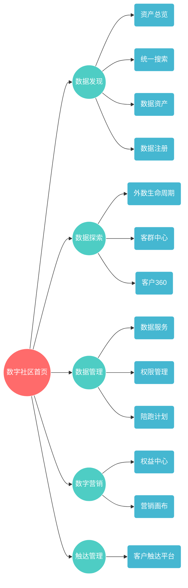

1. 产品总览

数字社区是一个面向公司内用户的数据管理产品，通过整合数据资产管理、客户管理、营销管理等核心能力，为企业提供从数据发现到业务增长的完整解决方案。产品采用模块化设计，支持按需组合使用，帮助企业实现数据驱动的精细化运营。

模块	一句话定位	
首页	统一驾驶舱：身份、资产、指标、待办一站聚合	
数据发现	数据门户：让所有数据资产“找得到、看得懂、用得动”	
数据探索	客户洞察中心：外数生命周期监控 + 客群360	
数据管理	治理中枢：权限、质量、服务、资产全生命周期管理	
数字营销	增长引擎：可视化营销画布 + 权益全周期管理	
触达管理	全渠道指挥中心：选渠道、发消息、看效果	

---

2. 产品关系图（左右树形）



---

3. 核心模块职责边界

3.1 首页（统一工作台）
- 身份信息：用户、部门、角色、在线状态  
- 资产总览：数据集、项目、待办数量  
- 快速通道：自定义快捷入口、智能推荐  
- 社区加油站：制度、案例、公告、帮助  
- 数据站：实时业务指标、趋势、异常提醒  
- 架构图：系统全景导航  
- 通知公告：待办、审批、社区动态  

3.2 数据发现（统一数据门户）
- 资产总览：企业数据资产全景视图  
- 统一搜索：跨系统一站式搜索（表、指标、外部数据）  
- 数据资产：全量数据表、指标地图、征信变量、外部数据目录  
- 数据注册：表管理、指标管理、外部数据接入向导  

3.3 数据探索（客户洞察中心）
- 外数生命周期：外部数据接入、监控、告警、下线全流程  
- 客群中心：标签工厂（规则/算法/导入）、人群圈选、人群包管理  
- 客户360：统一客户视图（基本信息、产品、信用、行为、资产）  

3.4 数据管理（数据治理中枢）
- 数据服务：API 目录、版本管理、SLA 监控  
- 权限管理：细粒度权限（表/字段级）、脱敏、审计日志  
- 陪跑计划：数据需求、质量、服务的一站式对接通道  

3.5 数字营销（增长引擎）
- 营销画布：拖拽式流程设计器（开始、判断、延迟、消息等节点）  
- 权益中心：权益模板、生命周期、库存、核销、电销专用通道  

3.6 触达管理（全渠道指挥中心）
- 整合短信、邮件、App Push、微信、小程序、电销等渠道  
- 策略引擎：时机、频次、内容、渠道优选  
- 效果追踪：触达率、转化率、ROI、长期 LTV  

---

4. 数据与技术架构

层级	技术栈	说明	
前端	Vue 3 + TypeScript + Arco Design	零代码交互、响应式、PWA	
图形引擎	AntV X6（营销画布）、ECharts（可视化）	拖拽流程、血缘图、仪表盘	
状态管理	Pinia（主）+ Vuex（营销画布）	统一用户状态、模块解耦	
构建与部署	Vite + Docker + K8s + Nginx	热更新、灰度、弹性伸缩	

---

6. 文档与代码索引

```
docs/key-project-docs/
├── 数字社区项目完整说明文档.md        ← 本文件
├── 数据发现项目结构说明文档.md
├── 客群中心平台项目说明文档.md
├── 数字社区首页项目说明文档.md
├── 营销画布项目结构说明文档.md
└── 权益管理平台项目说明文档.md

src/pages/
├── login/home.vue                 # 首页
├── discovery/                     # 数据发现
├── exploration/                   # 数据探索（客群中心）
├── marketing/                     # 营销画布 + 权益中心
└── management/                    # 数据管理
```