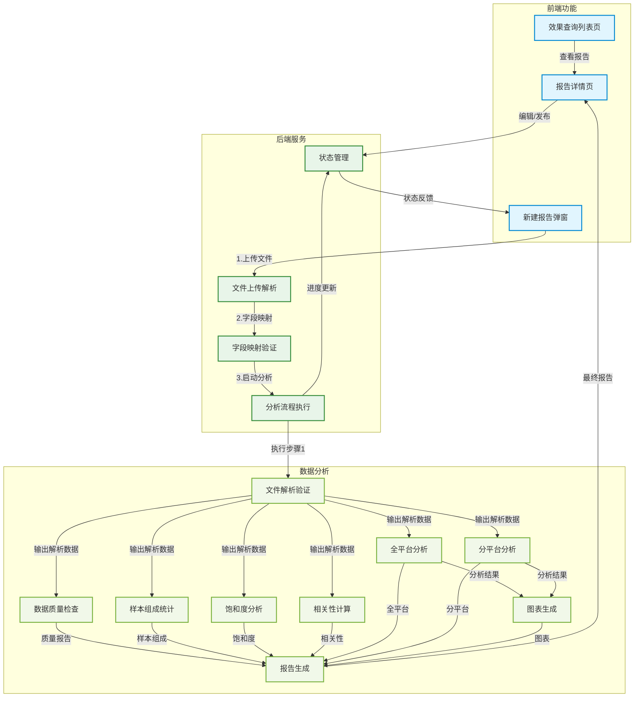
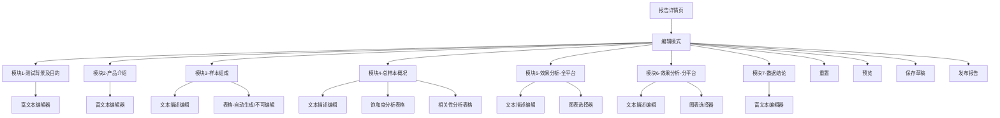

# 外数评估MVP需求文档

## 📋 文档基本信息

- **文档名称**：外数评估MVP需求文档
- **版本信息**：v2.0（2025-08-07）
- **变更日志**：
  - 2025-08-07：重构文档结构，按功能模块重新组织
  - 2025-08-06：初始版本创建
- **编写人**：AI需求分析专家
- **审核人**：人类产品经理

## 📖 名词解释

- **外数评估**：对外部数据源进行效果评估和分析的业务流程
- **产品级分析**：针对单个外数产品进行的专项效果分析
- **样本数据**：用于分析的原始数据文件
- **字段映射**：将上传文件的字段与系统标准字段进行对应配置
- **分析流程**：从数据处理到报告生成的标准化分析步骤
- **报告模板**：预定义的分析报告结构和内容框架

## 🎯 需求背景

随着外数业务的快速发展，需要构建一个专业的外数评估平台来支持产品级效果分析。当前缺乏统一的分析工具和标准化的报告模板，导致分析效率低下、结果不一致。为了提高外数评估的专业性和效率，我们决定开发外数评估MVP版本，专注于产品级分析报告的快速生成、编辑和管理。

## 📋 需求范围

- **包含内容**：
  - 效果查询列表页（报告管理和查看）
  - 分析报告详情页（查看、编辑、发布功能）
  - 新建分析报告弹窗（样本数据读取、字段映射、产品选择、模板应用、流程执行）
  - 标准化的产品级分析报告模板
  - 自动化的分析流程执行

- **不包含内容**：
  - 自定义模板创建功能
  - 分析流程自定义调整
  - 多业务场景支持
  - 高级权限管理
  - 数据源直连功能

## 🔧 功能模块


### 5.1 效果查询列表页

#### 5.1.1 报告列表展示
- **功能描述**：提供外数评估报告的集中管理界面，支持多维度筛选、快速查看和创建新报告
- **路径**：外数效果查询列表页
- **操作步骤**：进入列表页 → 查看报告列表 → 筛选或搜索 → 点击报告查看详情


| 字段         | 说明              | 交互特性                | 限制条件                |
| ---------- | --------------- | ------------------- | ------------------- |
| **报告名称**   | 分析报告名称          |                     |                     |
| **外数产品名称** | 显示被评估产品，点击跳转详情页 | 支持按产品筛选，蓝色链接样式      | 最多显示50个字符           |
| **报告类型**   | 当前仅支持产品级效果评估    | 标签样式展示              | 固定显示"产品级效果评估"       |
| **分析时间跨度** | 用于记录分析样本时间跨度    | 取字分析报告中定义的样本时间字段的范围 | 格式yyyymmdd-yyyymmdd |
| **报告生成日期** | 报告生成日期          | 默认倒序排列              | 自动更新，不可编辑           |
| **报告创建人**  | 报告创建人           |                     | 在新建报告时记录任务人         |
| **状态**     | 待处理/处理中/已完成/失败  | 彩色状态标识              | 状态自动更新              |

**限制条件**：

- 默认按生成日期倒序排列
- 支持分页（10/20/50/100条/页）
- 状态颜色：绿色(已完成)、黄色(处理中)、红色(失败)

#### 5.1.2 筛选和搜索功能
- **功能描述**：支持多维度筛选和快速搜索报告
- **路径**：列表页顶部筛选区域
- **操作步骤**：选择筛选条件 → 点击搜索 → 查看筛选结果

**前端字段**：

| 筛选条件 | 类型 | 默认值 | 限制条件 |
|---|---|---|---|
| **报告生成日期** | 日期范围选择器 | 近30天 | 无时间限制 |
| **外数产品** | 多选下拉框 | 全部 | 最多选择10个产品 |
| **报告状态** | 单选下拉框 | 全部 | 仅支持单一状态筛选 |

#### 5.1.3 新建报告入口
- **功能描述**：提供创建新分析报告的入口
- **路径**：列表页右上角"新建产品级效果评估"按钮
- **操作步骤**：点击新建按钮 → 打开新建分析报告弹窗

**前端字段**：
- 新建按钮：固定位置在列表页右上角
- 按钮文案：显示"新建分析报告"

**限制条件**：
- 仅支持新建分析报告
- 同一时间最多创建1个报告

### 5.2 分析报告详情页

#### 5.2.1 报告查看功能
- **读取模版**：读取外数评估报告模板
- **功能描述**：基于模版内容展示7个固定模块的完整报告内容，支持模块导航和内容查看
- **路径**：从列表页点击报告名称进入详情页
- **操作步骤**：点击报告 → 进入详情页 → 查看各模块内容

**前端字段**：

| 详情内容     | 展示方式   | 数据来源         | 限制条件            |
| -------- | ------ | ------------ | --------------- |
| 报告基本信息   | 顶部信息栏  | 报告元数据        | 显示产品名称、状态、创建时间  |
| 测试背景及目的  | 文字模块   | 模板+用户输入      | 最多显示1000字符      |
| 产品介绍     | 文字模块   | 产品信息+用户输入    | 最多显示800字符       |
| 样本组成     | 文字+数据表 | 数据读取指定文件路径   | 表格最多显示20行       |
| 总样本概况    | 文字+双表格 | 数据读取指定文件路径   | 饱和度和相关性表格各最多10行 |
| 效果分析-全平台 | 文字+图表  | 图片读取指定文件路径选择 | 图表支持缩放查看        |
| 效果分析-分平台 | 文字+图表  | 图片读取指定文件路径选择 | 图表支持缩放查看        |
| 数据结论     | 文字模块   | 模板+分析结果      | 最多显示2000字符      |

#### 5.2.2 报告编辑功能
- **功能描述**：支持对报告内容进行编辑，包括文本内容和展示配置
- **路径**：详情页点击"编辑报告"按钮
- **操作步骤**：点击编辑 → 修改内容 → 保存或取消

**前端字段**：

| 编辑模块 | 支持操作 | 编辑范围 | 限制条件 |
|---|---|---|---|
| 测试背景及目的 | 文字编辑 | 仅可修改文字内容 | 200-500字 |
| 产品介绍 | 文字编辑 | 仅可修改文字内容 | 100-300字 |
| 样本组成 | 文字编辑 | 文字可编辑，表格自动生成 | 文字部分最多200字 |
| 总样本概况 | 文字编辑 | 文字可编辑，表格自动生成 | 文字部分最多300字 |
| 效果分析-全平台 | 文字编辑+图表选择 | 文字可编辑，可选择展示图表 | 文字最多400字，图表最多选择3个 |
| 效果分析-分平台 | 文字编辑+图表选择 | 文字可编辑，可选择展示图表 | 文字最多400字，图表最多选择3个 |
| 数据结论 | 完全编辑 | 完全可编辑 | 最多2000字，支持富文本 |



#### 5.2.3 报告发布功能
- **功能描述**：将编辑完成的报告发布到效果查询列表页，供其他用户查看
- **路径**：详情页点击"发布报告"按钮
- **操作步骤**：编辑完成 → 预览确认 → 点击发布 → 确认发布

**前端字段**：

| 发布状态 | 可见性 | 操作权限 | 限制条件 |
|---|---|---|---|
| 草稿 | 仅创建者 | 可编辑、可删除 | 草稿状态下可无限次编辑 |
| 已发布 | 全体用户 | 仅可查看 | 发布后不可编辑，需要重新创建版本 |
| 已归档 | 仅管理员 | 可恢复、可删除 | 归档后普通用户不可见 |

### 5.3 新建分析报告弹窗

#### 5.3.1 样本数据读取功能
- **功能描述**：通过文件上传方式提供外数评估所需的样本数据
- **路径**：新建报告弹窗第一步
- **操作步骤**：选择文件 → 上传文件 → 验证格式 → 预览数据

**前端字段**：
- 文件上传组件：支持拖拽上传和点击选择
- 支持格式：CSV、Excel(.xlsx/.xls)
- 文件大小限制：最大支持100MB
- 数据预览：显示前10行数据

**限制条件**：
- 文件格式必须为CSV或Excel
- 文件大小不超过100MB
- 必须包含至少100行有效数据
- 首行必须为字段名称

#### 5.3.2 字段映射功能
- **功能描述**：将上传文件的字段与系统标准字段进行映射配置
- **路径**：新建报告弹窗第二步
- **操作步骤**：查看检测字段 → 配置映射关系 → 预览映射结果 → 确认映射

**前端字段**：

| 映射类型 | 字段说明 | 配置方式 | 限制条件 |
|---|---|---|---|
| **样本日期字段** | 用于确定分析时间范围 | 下拉选择 | 必须选择，且字段值必须为日期格式 |
| **平台产品字段** | 用于区分不同平台 | 下拉选择 | 必须选择，字段值为字符串类型 |
| **变量字段** | 用于分析的业务指标 | 多选配置 | 至少选择3个数值型字段 |

**限制条件**：
- 样本日期字段必须包含有效日期数据
- 平台产品字段不能有空值
- 变量字段必须为数值类型
- 字段映射不能重复

#### 5.3.3 外数产品选择功能
- **功能描述**：选择要进行分析的外数产品，支持已注册和未注册产品
- **路径**：新建报告弹窗第三步
- **操作步骤**：查看产品列表 → 选择产品 → 确认选择

**前端字段**：

| 产品类型 | 状态标识 | 选择方式 | 限制条件 |
|---|---|---|---|
| 已注册产品 | 绿色标签"已注册" | 单选 | 直接选择，显示完整产品信息 |
| 未注册产品 | 红色标签"未注册" | 单选+信息填写 | 需要填写产品名称和描述 |

**限制条件**：
- 一次只能选择一个产品
- 未注册产品名称不能重复
- 产品描述最多500字符

#### 5.3.4 报告模版应用功能
- **功能描述**：应用预定义的外数评估-产品级分析报告模板
- **路径**：新建报告弹窗第四步
- **操作步骤**：查看模板结构 → 确认应用模板

**前端字段**：
- 模板名称：外数评估-产品级分析报告模板
- 模板ID：template_external_product_mvp
- 模板结构：7个固定模块预览

**限制条件**：
- 当前版本仅支持一个固定模板
- 模板结构不可修改
- 模块顺序固定

#### 5.3.5 分析流程执行功能
- **功能描述**：执行标准化的外数评估-产品级分析流程，生成分析报告
- **路径**：新建报告弹窗第五步
- **操作步骤**：开始分析 → 查看进度 → 等待完成 → 查看结果

**前端字段**：

| 执行步骤 | 处理内容   | 执行状态       |
| ---- | ------ | ---------- |
| 步骤1  | 文件解析验证 | 等待、执行中、已完成 |
| 步骤2  | 数据质量检查 | 等待、执行中、已完成 |
| 步骤3  | 关键指标计算 | 等待、执行中、已完成 |
| 步骤4  | 饱和度分析  | 等待、执行中、已完成 |
| 步骤5  | 相关性计算  | 等待、执行中、已完成 |
| 步骤6  | 全平台分析  | 等待、执行中、已完成 |
| 步骤7  | 分平台分析  | 等待、执行中、已完成 |
| 步骤8  | 图表生成   | 等待、执行中、已完成 |
| 步骤9  | 报告生成   | 等待、执行中、已完成 |

**限制条件**：
- 执行过程中不可取消
- 失败时提供详细错误信息

## 📊 报告模板详细说明

### 外数评估-产品级分析报告模板
- **模板ID**: `template_external_product_mvp`
- **模板类型**: 固定模块模板
- **模板结构**: 7个固定模块，不可增删
- **数据依赖**: Python执行脚本产出的数据文件(.json/.csv)和图片文件(.png/.svg)

| 模块名称     | 内容类型   | 数据要求         | 编辑权限         | Python输出文件                                                   |
| -------- | ------ | ------------ | ------------ | ------------------------------------------------------------ |
| 测试背景及目的  | 文字描述   | 固定模板文本       | 仅可修改文字内容     | -                                                            |
| 产品介绍     | 文字描述   | 产品基本信息       | 仅可修改文字内容     | -                                                            |
| 样本组成     | 文字+数据表 | 上传数据汇总统计     | 文字可编辑，表格自动生成 | `sample_composition.json`                                    |
| 总样本概况    | 文字+数据表 | 样本饱和度和相关性分析  | 文字可编辑，表格自动生成 | `sample_overview.json`                                       |
| 效果分析-全平台 | 文字+图表  | 全平台效果指标和趋势图表 | 文字可编辑，图表自动生成 | `platform_all_analysis.json` + `platform_all_charts.png`     |
| 效果分析-分平台 | 文字+图表  | 分平台效果指标和对比图表 | 文字可编辑，图表自动生成 | `platform_split_analysis.json` + `platform_split_charts.png` |
| 数据结论     | 文字总结   | 基于分析结果的结论建议  | 完全可编辑        | `conclusion_suggestions.json`                                |

### 字段映射与数据处理说明

#### 字段映射规则
基于用户上传的Excel/CSV文件，系统需要识别和映射以下字段类型：

| 映射类型 | 字段作用 | 示例字段名 | 数据类型 | 验证规则 |
|---|---|---|---|---|
| **样本日期字段** | 确定分析时间范围 | 日期、date、时间 | Date/String | 必须为有效日期格式 |
| **平台产品字段** | 区分不同平台/渠道 | 平台、platform、渠道 | String | 不能为空，用于分组分析 |
| **变量字段(指标)** | 业务分析指标 | 用户数、转化率、收入、点击数、展示数 | Number | 数值型，用于计算分析 |

#### 样本数据结构示例
```csv
id,review_date,product_id,credit_amount,dpd30m3,dpd15m3,dpd15m2,dpd30m1,分数1,分数2,分数3
1,2025-07-10,P1001,50000.00,0,0,1,0,85,72,90
2,2025-07-15,P2034,125000.00,2,1,0,1,62,68,75
3,2025-07-22,P8911,75000.50,0,0,0,0,92,88,95
4,2025-08-01,P4567,200000.00,1,3,2,0,70,65,80
5,2025-08-05,P3098,95000.75,0,1,1,1,78,82,67
```
字段说明：
​id​：唯一交易标识（整数）
​review_date​：审核日期（日期格式 YYYY-MM-DD）-- 对应样本日期
​product_id​：产品代码（字母+数字组合） -- 对应平台产品
​credit_amount​：信用额度（带两位小数的金额）
​dpd30m3​：3个月前30+天逾期次数（整数）
​dpd15m3​：3个月前15+天逾期次数（整数）
​dpd15m2​：2个月前15+天逾期次数（整数）
​dpd30m1​：1个月前30+天逾期次数（整数）
​分数1​：信用评分1（0-100整数）
​分数2​：行为评分（0-100整数）
​分数3​：风险评分（0-100整数）

### 模板内容详细说明

#### 6.1 测试背景及目的
**默认模板内容**：
```
本次外数评估旨在通过对{产品名称}在{分析时间范围}期间的数据表现进行深入分析，
评估其在不同平台的效果差异，为后续的产品优化和投放策略提供数据支撑。

分析目标：
1. 评估产品在各平台的整体表现
2. 识别关键指标的变化趋势和异常
3. 分析平台间的效果差异
4. 提供数据驱动的优化建议
```

#### 6.2 产品介绍
**默认模板内容**：
```
产品名称：{用户选择的外数产品名称}
产品类型：{已注册/未注册产品}
分析范围：{映射的平台字段值列表}
数据来源：用户上传的样本数据文件

产品特点：
- 支持多平台数据分析
- 提供实时效果监控
- 具备完整的数据追踪能力
```

#### 6.3 样本组成
**数据表格字段**（基于Python脚本输出的`sample_composition.json`）：
说明：数据字段基于脚本生成文件读取，读取指定名称的文件展示

| 字段名称 | 数据来源 | 计算逻辑 | 示例值 |
|---|---|---|---|
| 平台 | 用户映射的平台字段 | 去重统计 | iOS, Android, Web |
| 送测样本量 | 用户映射的变量字段汇总 | COUNT(记录数) | 1000, 1200, 800 |
| 有效数据量 | 非空数据统计 | COUNT(非空记录) | 950, 1180, 780 |
| 数据完整率 | 有效数据占比 | 有效数据量/送测样本量 | 95%, 98.3%, 97.5% |
| 时间跨度 | 样本日期字段范围 | MAX(日期)-MIN(日期) | 2024-01-01 ~ 2024-01-10 |

**Python输出文件格式**：
```json
{
  "platforms": [
    {
      "platform_name": "iOS",
      "sample_count": 1000,
      "valid_count": 950,
      "completeness_rate": 0.95,
      "date_range": "2024-01-01 ~ 2024-01-10"
    }
  ],
  "total_summary": {
    "total_samples": 3000,
    "total_valid": 2910,
    "overall_completeness": 0.97
  }
}
```

#### 6.4 总样本概况
**6.4.1 样本饱和度分析表格**（基于`sample_overview.json`）：

| 指标名称 | 有值数 | 均值 | 标准差 | 最小值 | 最大值 | 中位数 | 75%分位数 | 95%分位数 |
|---|---|---|---|---|---|---|---|---|
| 用户数 | 10 | 1065 | 156.2 | 800 | 1300 | 1075 | 1175 | 1285 |
| 转化率 | 10 | 0.047 | 0.007 | 0.038 | 0.06 | 0.046 | 0.052 | 0.058 |
| 收入 | 10 | 4936.8 | 89.4 | 4800 | 5125 | 4940 | 4987.5 | 5080 |

**6.4.2 相关性分析表格**：

| | 指标1 | 指标2 | 指标3 |
|---|---|---|---|
| 指标1| 1 | 0.72| 0.9 |
| 指标2 | 0.72 | 1 | 0.1 |
| 指标3 | 0.91 | 0.2| 1 |

#### 6.5 效果分析-全平台
**数据内容**（基于`platform_all_analysis.json`和`platform_all_charts.png`）：

**6.5.1 关键指标汇总**：
```json
{
  "overall_metrics": {
    "total_users": 10650,
    "avg_conversion_rate": 0.047,
    "total_revenue": 49368,
    "total_clicks": 21500,
    "total_impressions": 464228
  },
  "trend_analysis": {
    "user_growth_rate": 0.15,
    "conversion_stability": "稳定",
    "revenue_trend": "上升"
  }
}
```

**6.5.2 生成图表类型**：
- 时间序列趋势图：各指标随时间变化趋势
- 指标分布图：关键指标的分布情况
- 稳定性分析图：指标波动性分析

#### 6.6 效果分析-分平台
**数据内容**（基于`platform_split_analysis.json`和`platform_split_charts.png`）：

**6.6.1 平台对比分析**：
```json
{
  "platform_comparison": {
    "iOS": {
      "avg_users": 1075,
      "avg_conversion": 0.045,
      "avg_revenue": 4970,
      "performance_rank": 2
    },
    "Android": {
      "avg_users": 1250,
      "avg_conversion": 0.041,
      "avg_revenue": 4955,
      "performance_rank": 3
    },
    "Web": {
      "avg_users": 850,
      "avg_conversion": 0.057,
      "avg_revenue": 4910,
      "performance_rank": 1
    }
  }
}
```

**6.6.2 生成图表类型**：
- 平台对比柱状图：各平台关键指标对比
- 平台份额饼图：各平台用户/收入占比
- 平台趋势对比图：各平台指标变化趋势

#### 6.7 数据结论
**智能生成建议**（基于`conclusion_suggestions.json`）：
```json
{
  "key_findings": [
    "Web平台转化率最高(5.7%)，但用户规模较小",
    "Android平台用户规模最大，但转化率偏低",
    "iOS平台表现均衡，具备优化潜力"
  ],
  "recommendations": [
    "建议加大Web平台的用户获取投入",
    "优化Android平台的转化流程",
    "深入分析iOS平台的用户行为特征"
  ],
  "risk_alerts": [
    "Android平台转化率持续下降需要关注",
    "整体收入增长放缓，需要新的增长点"
  ]
}
```

### Python脚本执行流程

#### 分析流程步骤详细说明
| 步骤  | 处理内容   | 输入文件               | 输出文件                           | 预计时间  |
| --- | ------ | ------------------ | ------------------------------ | ----- |
| 步骤1 | 文件解析验证 | 用户上传的CSV/Excel     | `parsed_data.json`             | < 10秒 |
| 步骤2 | 数据质量检查 | `parsed_data.json` | `quality_report.json`          | < 15秒 |
| 步骤3 | 样本组成统计 | `parsed_data.json` | `sample_composition.json`      | < 20秒 |
| 步骤4 | 饱和度分析  | `parsed_data.json` | `sample_overview.json`         | < 10秒 |
| 步骤5 | 相关性计算  | `parsed_data.json` | `correlation_analysis.json`    | < 30秒 |
| 步骤6 | 全平台分析  | `parsed_data.json` | `platform_all_analysis.json`   | < 25秒 |
| 步骤7 | 分平台分析  | `parsed_data.json` | `platform_split_analysis.json` | < 25秒 |
| 步骤8 | 图表生成   | 所有分析结果             | `*.png` 图表文件                   | < 20秒 |
| 步骤9 | 报告生成   | 所有数据和图表            | `final_report.json`            | < 10秒 |

### Mock指标说明

#### 变量字段Mock指标定义
基于样本数据中的数值字段，系统将自动识别并Mock以下指标类型：

| 原始字段 | Mock指标类型 | 分析维度 | 计算方法 |
|---|---|---|---|
| 用户数 | 规模指标 | 用户规模、增长趋势 | SUM, AVG, 增长率 |
| 转化率 | 效率指标 | 转化效果、稳定性 | AVG, 标准差, 趋势分析 |
| 收入 | 收益指标 | 收益能力、ROI | SUM, AVG, 增长率 |
| 点击数 | 行为指标 | 用户参与度 | SUM, AVG, CTR计算 |
| 展示数 | 曝光指标 | 曝光效果、到达率 | SUM, AVG, 展示效率 |

#### 自动生成的衍生指标
- **CTR (点击率)**: 点击数/展示数
- **ARPU (平均收入)**: 收入/用户数  
- **转化成本**: 收入/转化用户数
- **用户价值**: 收入/用户数
- **平台效率**: 综合评分指标

## 🔄 分析流程说明

### 外数评估-产品级分析流程
- **流程ID**: `workflow_external_product_file_analysis`
- **执行步骤**: 9个标准化步骤，自动执行
- **总执行时间**: 不超过3分钟
- **技术实现**: Python脚本 + 前端进度展示

#### Python脚本架构设计

**主要模块结构**：
```
python-reports/
├── core/
│   ├── data_parser.py          # 文件解析模块
│   ├── data_validator.py       # 数据验证模块
│   ├── field_mapper.py         # 字段映射处理
│   └── report_generator.py     # 报告生成核心
├── processors/
│   ├── sample_analyzer.py      # 样本组成分析
│   ├── saturation_analyzer.py  # 饱和度分析
│   ├── correlation_analyzer.py # 相关性分析
│   ├── platform_analyzer.py    # 平台效果分析
│   └── trend_analyzer.py       # 趋势分析
└── visualizers/
    ├── chart_generator.py      # 图表生成
    ├── table_formatter.py     # 表格格式化
    └── report_formatter.py    # 报告格式化
```

#### 数据流转详细说明

**输入数据格式**：
```json
{
  "file_info": {
    "filename": "sample_data.csv",
    "upload_time": "2024-01-01 10:00:00",
    "file_size": "2.5MB"
  },
  "field_mapping": {
    "date_field": "日期",
    "platform_field": "平台", 
    "variable_fields": ["用户数", "转化率", "收入", "点击数", "展示数"]
  },
  "product_info": {
    "product_name": "测试产品A",
    "product_type": "已注册产品",
    "analysis_period": "2024-01-01 ~ 2024-01-10"
  }
}
```

**输出文件清单**：
| 文件名 | 文件类型 | 内容说明 | 使用模块 |
|---|---|---|---|
| `parsed_data.json` | 数据文件 | 解析后的标准化数据 | 所有分析模块 |
| `quality_report.json` | 报告文件 | 数据质量检查结果 | 数据验证展示 |
| `sample_composition.json` | 数据文件 | 样本组成统计结果 | 样本组成模块 |
| `sample_overview.json` | 数据文件 | 饱和度和相关性分析 | 总样本概况模块 |
| `platform_all_analysis.json` | 数据文件 | 全平台分析结果 | 全平台分析模块 |
| `platform_split_analysis.json` | 数据文件 | 分平台分析结果 | 分平台分析模块 |
| `conclusion_suggestions.json` | 数据文件 | 智能结论和建议 | 数据结论模块 |
| `platform_all_charts.png` | 图片文件 | 全平台分析图表 | 全平台分析模块 |
| `platform_split_charts.png` | 图片文件 | 分平台分析图表 | 分平台分析模块 |
| `final_report.json` | 报告文件 | 完整报告数据结构 | 报告展示 |

#### 执行步骤技术实现

**步骤1: 文件解析验证**
```python
# data_parser.py
def parse_uploaded_file(file_path, field_mapping):
    """
    解析上传的CSV/Excel文件
    - 验证文件格式和编码
    - 应用字段映射规则
    - 标准化数据格式
    """
    return {
        "status": "success",
        "data": parsed_data,
        "metadata": file_metadata
    }
```

**步骤2: 数据质量检查**
```python
# data_validator.py  
def validate_data_quality(parsed_data):
    """
    检查数据质量
    - 空值检查
    - 数据类型验证
    - 异常值检测
    """
    return {
        "completeness_rate": 0.97,
        "data_type_errors": [],
        "outliers": outlier_list,
        "quality_score": 85
    }
```

**步骤3-7: 各类分析模块**
```python
# sample_analyzer.py
def analyze_sample_composition(data, field_mapping):
    """样本组成分析"""
    return sample_composition_results

# saturation_analyzer.py  
def analyze_saturation(data, variable_fields):
    """饱和度分析"""
    return saturation_results

# correlation_analyzer.py
def analyze_correlation(data, variable_fields):
    """相关性分析"""
    return correlation_results
```

**步骤8: 图表生成**
```python
# chart_generator.py
def generate_platform_charts(analysis_data):
    """
    生成分析图表
    - 使用matplotlib/plotly生成图表
    - 保存为PNG/SVG格式
    - 返回图表文件路径
    """
    return {
        "platform_all_charts": "charts/platform_all.png",
        "platform_split_charts": "charts/platform_split.png"
    }
```

#### 前端集成接口

**API接口设计**：
```javascript
// 启动分析流程
POST /api/external-data/analysis/start
{
  "file_path": "/uploads/sample_data.csv",
  "field_mapping": {...},
  "product_info": {...}
}

// 查询分析进度
GET /api/external-data/analysis/progress/{task_id}
{
  "status": "running",
  "current_step": 3,
  "progress": 33,
  "estimated_remaining": 120
}

// 获取分析结果
GET /api/external-data/analysis/result/{task_id}
{
  "status": "completed",
  "report_data": {...},
  "chart_urls": [...],
  "download_url": "/reports/final_report.pdf"
}
```

## ⚠️ 需要补充的内容

以下内容需要与人类产品经理进一步确认和补充：


### 1. 用户权限和角色
- [ ] **用户角色定义**：需要明确不同用户角色的权限范围
- [ ] **报告访问控制**：需要确认报告的查看和编辑权限规则
- [ ] **数据安全要求**：需要明确敏感数据的处理和保护要求

### 2. 异常处理机制
- [ ] **错误处理流程**：需要明确各种异常情况的处理方式
- [ ] **数据恢复机制**：需要确认数据备份和恢复的策略
- [ ] **用户提示信息**：需要明确各种操作的用户提示文案

### 5. 未来扩展规划
详见分析报告管理

## 📋 版本信息

- **当前版本**：v2.1（2025-08-08）
- **变更记录**：
  - 2025-08-08：完善分析报告模板内容，新增字段映射规则、Python脚本架构设计、Mock指标体系和API接口规范
  - 2025-08-07：重构文档结构，按功能模块重新组织，增加详细的前端字段和限制条件说明
  - 2025-08-06：初始版本创建

## 📋 附录

- **相关文档**：
  - 外数评估技术方案：待补充
  - 字段映射功能开发日志：<mcfile name="006_样本文件字段映射功能_2025-08-07.md" path="/Users/mac/nis_mock/data_comunity/data_comunity/docs/development-logs/006_样本文件字段映射功能_2025-08-07.md"></mcfile>
  - 分析报告模板完善日志：<mcfile name="007_分析报告模板完善_2025-08-08.md" path="/Users/mac/nis_mock/data_comunity/data_comunity/docs/development-logs/007_分析报告模板完善_2025-08-08.md"></mcfile>
- **参考链接**：
  - 开发服务器：http://localhost:5175/
  - 项目仓库：待补充
  - 样本数据文件：<mcfile name="sample_data.csv" path="/Users/mac/nis_mock/data_comunity/data_comunity/public/sample_data.csv"></mcfile>

---

## 📊 Mock数据说明

### 样本组成表格字段
- 平台、送测样本量、mob3_30+到期数、mob3_30+客户数、mob3_30+占比、送测样本时间跨度

### 总样本概况
**饱和度表格**：有值数、均值、标准差、最小值、最大值、中位数、75%分位数、95%分位数
**相关性表格**：指标1、指标2、指标3

### 效果分析指标
- 指标1: IV值、WOE值、信息值
