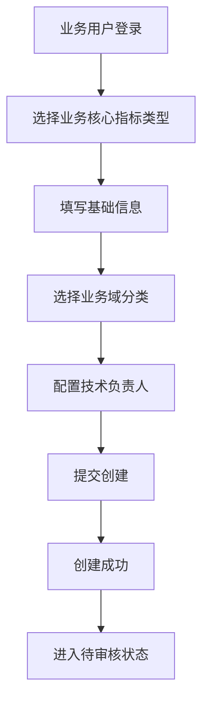
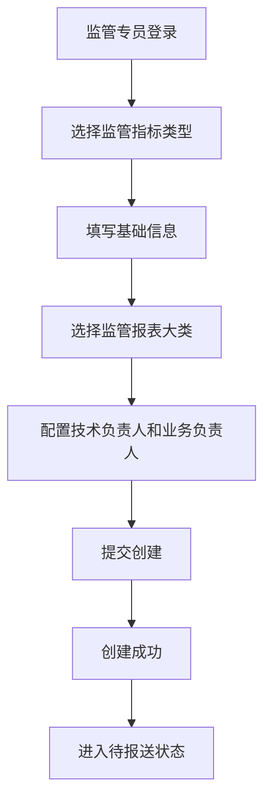
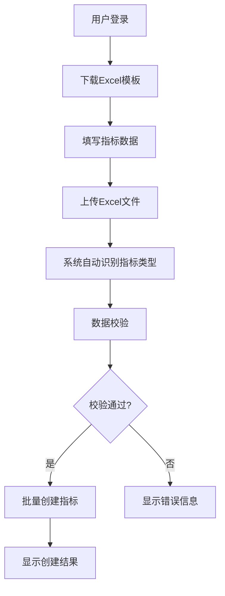

# 文档基本信息
- **文档名称**：数据发现-指标注册需求文档
- **版本信息**：v1.0（2025-08-07）
- **变更日志**：
  - 2025-08-07：初始版本创建
- **编写人**：AI需求分析专家
- **审核人**：人类产品经理

# 名词解释
- **数据发现**：一个供用户发现、理解和使用数据资产的平台
- **指标注册**：在数据发现平台中创建和管理业务核心指标和监管指标的过程
- **业务核心指标**：用于业务运营和分析的关键性能指标
- **监管指标**：用于监管合规和报送的监管要求指标
- **批量注册**：通过Excel模板批量导入和创建指标的功能

# 需求背景
随着金融机构数据治理要求的不断提高，现有的指标管理系统需要支持业务核心指标和监管指标的统一管理。为了提高指标管理的规范性和效率，减少重复建设，满足监管合规要求，我们决定在数据发现平台中新增指标注册功能模块。

# 需求范围
- **包含内容**：
  - 指标类型管理（业务核心指标、监管指标）
  - 单个指标注册功能
  - 批量指标注册功能
  - 指标详情查看和编辑
  - 权限控制和数据校验
- **不包含内容**：
  - 指标计算和加工逻辑
  - 指标数据存储和备份
  - 指标监控和告警功能

# 功能模块

## 5.1 用户角色

| 角色 | 注册方式 | 核心权限 |
|------|----------|----------|
| 业务用户 | 内部账号登录 | 可查看和管理业务核心指标，创建和编辑指标 |
| 技术用户 | 内部账号登录 | 可管理所有类型指标，负责技术实现和维护 |
| 监管专员 | 内部账号登录 | 专门负责监管指标的创建、审核和报送管理 |

## 5.2 功能模块

功能需求：
- **编号**：FR - 指标注册模块 - 指标管理 - 统一指标中心
- **模块**：指标注册模块
- **父功能**：指标管理
- **子功能**：统一指标中心
- **描述**：提供统一的指标浏览、搜索、筛选功能，支持按类型、分类、业务域等多维度查看指标
- **前端字段**：
  - 页面头部：
    - 页面标题："统一指标中心"
    - 创建指标按钮：下拉菜单（单个注册/批量注册）
  - 搜索筛选区域：
    - 类型切换器：业务核心指标/监管指标/全部
    - 搜索框：支持指标名称和编码模糊搜索
    - 筛选条件：
      - 分类：多级分类下拉选择
      - 业务域：多选下拉（仅业务核心指标显示）
      - 监管报表大类：多选下拉（仅监管指标显示）
      - 状态：多选下拉（草稿/已发布/已停用）
      - 负责人：人员选择器
      - 创建时间：日期范围选择
  - 指标列表表格：
    - 列配置：
      - 序号：自动编号
      - 指标名称：可点击跳转到详情页
      - 指标编码：显示编码，支持复制
      - 类型：标签显示（业务/监管）
      - 分类：标签显示分类路径
      - 业务域/监管报表大类：根据类型动态显示
      - 负责人：显示负责人姓名
      - 状态：状态标签（不同颜色）
      - 创建时间：格式化时间显示
      - 操作：查看详情、编辑、复制、删除按钮
  - 分页组件：
    - 每页显示20条记录
    - 显示总记录数和当前页码
- **限制条件**：
  - 搜索结果最多显示100条
  - 支持分页浏览，每页20条
  - 筛选条件支持多选和清空
  - 列表支持按名称、编码、创建时间排序
  - 操作按钮权限控制：只有创建者和管理员可编辑/删除
- **操作步骤**：用户登录 → 进入统一指标中心 → 选择指标类型 → 设置搜索条件 → 查看指标列表 → 进行操作
- **来源文件 + 行号**：src/pages/discovery/unified-metrics/index.vue L1-200

功能需求：
- **编号**：FR - 指标注册模块 - 指标创建 - 单个注册
- **模块**：指标注册模块
- **父功能**：指标创建
- **子功能**：单个注册
- **描述**：提供单个指标的创建和编辑功能，包含基本信息、业务定义、技术逻辑、报表位置和结果表信息五个主要区域
- **前端字段**：
  - 基本信息：
    - 指标名称：文本输入框，必填，最大50字符
    - 指标编码：文本输入框，必填，支持字母、数字、下划线，最大20字符
    - 指标类型：下拉选择（业务核心指标/监管指标），必填
    - 指标分类：下拉选择（用户指标/业务域/技术指标/财务指标/风险指标），必填
    - 统计周期：下拉选择（实时/日更新/离线T+1/离线T+2/每周/每月），必填
  - 业务定义：
    - 业务定义：文本域，必填，最大500字符
    - 使用场景：文本域，可选，最大300字符
  - 技术逻辑：
    - 来源表：文本输入框，必填，最大100字符
    - 加工逻辑：文本域，必填，支持SQL语法，最大1000字符
    - 字段说明：文本域，可选，最大300字符
  - 报表位置：
    - 报表列表：动态表单，包含报表名称和URL字段，至少一个报表
  - 结果表信息：
    - 存储位置：文本输入框，必填，最大100字符
    - 查询代码：文本域，必填，支持SQL语法，最大500字符
- **限制条件**：
  - 指标名称和编码必填，且不能重复
  - 指标类型选择后，相关字段动态显示：
    - 业务核心指标：显示业务域、负责人字段
    - 监管指标：显示监管报表大类、报表名称、业务负责人、技术负责人字段
  - 监管指标必须填写业务负责人和技术负责人
  - 报表列表至少包含一个报表
  - 所有必填字段都有验证规则
- **操作步骤**：点击新建指标 → 选择指标类型 → 填写表单信息 → 保存提交
- **来源文件 + 行号**：src/pages/discovery/asset-management/metric-management/index.vue L200-400

功能需求：
- **编号**：FR - 指标注册模块 - 指标创建 - 批量注册
- **模块**：指标注册模块
- **父功能**：指标创建
- **子功能**：批量注册
- **描述**：提供Excel模板下载、文件上传、数据校验和批量创建功能，支持业务核心指标和监管指标两种类型的批量注册
- **前端字段**：
  - 模板下载：
    - 业务核心指标模板：包含指标名称、编码、分类、业务域、负责人、业务定义、统计周期、来源表等字段
    - 监管指标模板：包含指标名称、编码、监管报表大类、报表名称、业务负责人、技术负责人、业务定义、统计周期等字段
  - 文件上传：
    - 上传区域：支持拖拽和点击上传
    - 文件格式：支持.xlsx和.xls格式
    - 文件大小：最大10MB
  - 数据预览：
    - 表格列：序号、指标名称、编码、分类、统计周期、校验状态、错误信息
    - 校验状态标签：通过（绿色）、警告（橙色）、错误（红色）
  - 批量操作：
    - 批量提交按钮：显示有效数据数量
    - 错误数据导出：支持导出包含错误信息的Excel文件
- **限制条件**：
  - 单次上传文件大小不超过10MB
  - 每次最多处理1000条记录
  - 必须通过数据校验才能提交
  - 业务核心指标模板包含15个字段，监管指标模板包含17个字段
  - 文件解析支持中英文编码
- **操作步骤**：选择指标类型 → 下载模板 → 填写数据 → 上传文件 → 数据校验 → 批量提交
- **来源文件 + 行号**：src/pages/discovery/batch-registration/index.vue L1-200

功能需求：
- **编号**：FR - 指标注册模块 - 指标详情
- **模块**：指标注册模块
- **父功能**：指标管理
- **子功能**：指标详情
- **描述**：展示指标的详细信息，包括基本信息、业务定义、技术逻辑、版本历史等，支持查看、编辑和版本管理
- **前端字段**：
  - 基本信息：
    - 指标名称：文本显示，编辑时为输入框（必填，2-50字符）
    - 指标编码：文本显示，编辑时为输入框（必填，英文数字组合，2-20字符）
    - 指标类型：标签显示（业务核心指标/监管指标），编辑时为下拉选择
    - 分类：标签显示，编辑时为下拉选择（支持多级分类）
    - 业务域/监管报表大类：根据类型动态显示，编辑时为下拉选择
    - 负责人：文本显示，编辑时为人员选择器
    - 状态：标签显示（草稿/已发布/已停用），编辑时为下拉选择
    - 创建时间：时间格式显示
  - 业务定义：
    - 业务定义：多行文本输入框（支持富文本，最大1000字符）
    - 使用场景：多行文本输入框（支持富文本，最大500字符）
  - 技术逻辑：
    - 来源表：输入框（支持表名自动补全）
    - 加工逻辑SQL：代码编辑器（支持SQL语法高亮和格式化）
    - 存储位置：文本显示（自动生成）
    - 查询代码：代码块显示（只读）
  - 报表位置：
    - 报表列表：可添加多个报表项
    - 每个报表项：报表名称输入框 + 报表链接输入框
  - 版本历史：
    - 版本表格：版本号、变更类型、变更内容摘要、操作人、操作时间
    - 版本对比：支持选择两个版本进行差异对比
- **限制条件**：
  - 只有指标创建者和管理员可以编辑
  - 版本历史最多显示50条记录
  - 技术逻辑SQL支持语法高亮和错误检查
  - 业务定义和使用场景支持富文本编辑
  - 报表位置最多添加10个报表项
- **操作步骤**：从指标列表点击指标 → 查看详情页面 → 查看/编辑信息 → 查看版本历史
- **来源文件 + 行号**：src/pages/discovery/asset-management/metric-management/index.vue L200-400

功能需求：
- **编号**：FR - 指标注册模块 - 监管配置
- **模块**：指标注册模块
- **父功能**：系统配置
- **子功能**：监管配置
- **描述**：管理监管报表大类的配置信息，包括新增、编辑、删除监管报表分类
- **前端字段**：
  - 页面头部：
    - 页面标题："监管报表配置"
    - 新增按钮：打开监管报表创建模态框
  - 搜索筛选区域：
    - 搜索框：支持按报表名称和编码搜索
    - 状态筛选：下拉选择（全部/启用/停用）
  - 监管报表列表表格：
    - 列配置：
      - 序号：自动编号
      - 报表编码：唯一标识，支持复制
      - 报表名称：可点击查看详情
      - 描述：显示报表描述信息
      - 状态：状态标签（启用/停用）
      - 创建时间：格式化时间显示
      - 操作：编辑、删除、启用/停用按钮
  - 创建/编辑模态框：
    - 表单字段：
      - 报表编码：输入框（必填，英文数字组合，2-20字符）
      - 报表名称：输入框（必填，2-50字符）
      - 描述：文本域（可选，最大200字符）
      - 状态：单选框（启用/停用）
- **限制条件**：
  - 只有管理员可以操作监管报表配置
  - 监管报表编码必须唯一，不能重复
  - 停用的监管报表不能用于新指标创建
  - 已有关联指标的监管报表不能删除
  - 列表支持按创建时间、名称排序
- **操作步骤**：管理员登录 → 进入监管配置页面 → 查看监管报表列表 → 进行配置操作
- **来源文件 + 行号**：src/pages/discovery/regulatory-config/index.vue L1-100

## 6. 核心流程

### 6.1 业务核心指标注册流程


### 6.2 监管指标注册流程


### 6.3 批量注册流程


## 7. 数据结构设计

### 7.1 指标类型枚举
```typescript
export enum MetricType {
  BUSINESS_CORE = 'BUSINESS_CORE', // 业务核心指标
  REGULATORY = 'REGULATORY'        // 监管指标
}
```

### 7.2 监管报表大类枚举
```typescript
export enum RegulatoryCategory {
  CAPITAL_ADEQUACY = 'CAPITAL_ADEQUACY',     // 资本充足率
  ASSET_QUALITY = 'ASSET_QUALITY',           // 资产质量
  PROFITABILITY = 'PROFITABILITY',          // 盈利能力
  LIQUIDITY = 'LIQUIDITY',                  // 流动性
  LEVERAGE = 'LEVERAGE',                    // 杠杆率
  MACRO_PRUDENTIAL = 'MACRO_PRUDENTIAL'     // 宏观审慎
}
```

### 7.3 指标项接口
```typescript
export interface MetricItem {
  id: string;                    // 指标ID
  name: string;                  // 指标名称
  code: string;                  // 指标编码
  description?: string;         // 指标描述
  type: MetricType;             // 指标类型
  businessDomain?: string;      // 业务域（业务核心指标）
  regulatoryCategory?: RegulatoryCategory; // 监管报表大类（监管指标）
  technicalOwner: string;       // 技术负责人
  businessOwner?: string;       // 业务负责人（监管指标必填）
  status: 'DRAFT' | 'ACTIVE' | 'INACTIVE'; // 状态
  createdAt: string;            // 创建时间
  updatedAt: string;            // 更新时间
}
```

## 8. 业务规则

### 8.1 字段验证规则
- **指标名称**：必填，长度1-50字符，支持中英文、数字和下划线
- **指标编码**：必填，长度6-20字符，仅支持英文、数字和下划线，全局唯一
- **指标描述**：可选，最大长度200字符
- **技术负责人**：必填，必须是有效的用户账号
- **业务负责人**：监管指标必填，业务核心指标可选，必须是有效的用户账号

### 8.2 批量注册规则
- Excel文件大小不超过10MB
- 单次批量注册最多支持100条指标
- 模板必须使用系统提供的标准模板
- 指标编码在批量文件中必须唯一
- 监管指标必须填写业务负责人字段

## 9. 界面设计

### 9.1 设计风格
- 采用现代化、简洁的设计风格
- 使用清晰的视觉层次和适当的留白
- 保持与数据发现平台整体设计语言一致

### 9.2 页面元素
- **类型切换器**：使用选项卡组件，明确标识当前选中的指标类型
- **表单字段**：使用清晰的标签、占位符和验证提示
- **按钮状态**：根据表单验证状态动态启用/禁用提交按钮
- **错误提示**：实时验证，提供明确的错误信息和修正建议

## 10. 非功能性需求

### 10.1 性能要求
- 页面加载时间：首屏加载时间小于3秒
- 接口响应时间：关键接口响应时间小于500ms
- 批量处理：100条指标的批量处理时间小于30秒

### 10.2 可用性要求
- 支持主流浏览器：Chrome、Firefox、Safari、Edge
- 响应式设计：支持桌面端和移动端访问
- 操作引导：提供清晰的操作指引和帮助文档

### 10.3 安全性要求
- 身份认证：所有操作需要用户登录
- 权限控制：基于用户角色进行功能权限控制
- 数据校验：前后端双重数据校验，防止非法数据输入

# 版本信息
- **当前版本**：v1.0（2025-08-07）
- **变更记录**：
  - 2025-08-07：初始版本创建

# 附录
- **相关文档**：
  - 指标管理系统升级需求文档：/Users/mac/nis_mock/data_comunity/data_comunity/.trae/documents/指标管理系统升级需求文档.md
- **参考链接**：
  - 数据发现平台：/Users/mac/nis_mock/data_comunity/data_comunity/docs/key-project-docs/需求文档/数据发现/数据发现-v1.0.md