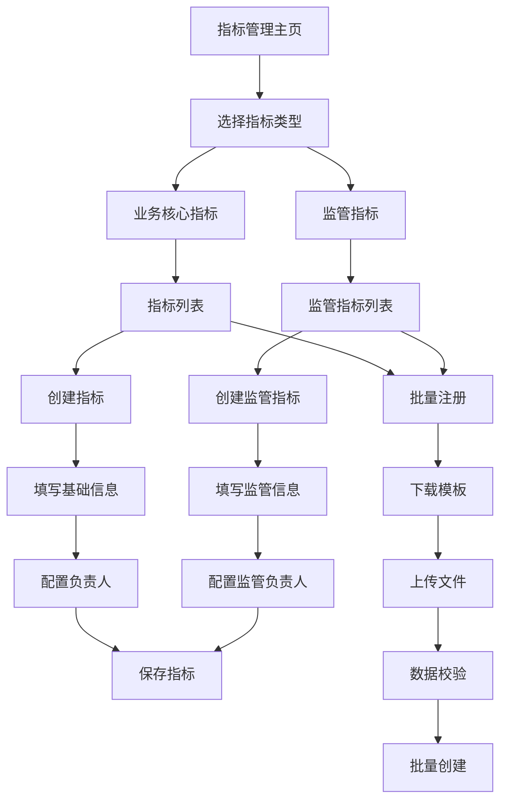

# 数据地图-新增指标注册需求

## 1. 需求背景

随着数据地图功能的不断完善，需要在现有数据地图基础上增加指标注册功能，实现数据资产的统一管理。通过新增指标注册模块，用户可以在数据地图中直接创建和管理业务指标，提升数据资产的完整性和可用性。

## 2. 功能目标

- 支持在数据地图中注册新的业务指标
- 提供指标基本信息录入功能
- 实现指标与数据表的关联配置
- 支持指标分类管理
- 提供指标详情展示页面

## 3. 用户角色

| 角色 | 权限说明 |
|------|----------|
| 监管指标管理员 | 专门负责监管指标的创建、审核和报送管理，可管理监管报表大类和指标分类绑定 |
| 业务指标管理员 | 可创建和管理业务核心指标，负责业务域指标的管理和维护 |
| 普通用户 | 可查看公开指标，无编辑权限 |

## 4. 功能模块设计

### 4.1 指标注册页面

- 指标基本信息填写：名称、编码、描述等
- 指标分类选择：支持多级分类
- 数据源关联：选择关联的数据表和字段
- 负责人配置：技术负责人、业务负责人
- 标签管理：自定义标签，便于检索

### 4.2 指标管理列表

- 指标列表展示：名称、编码、分类、状态等
- 搜索筛选：按名称、分类、标签等条件筛选
- 批量操作：支持批量导出、删除
- 状态管理：启用、停用状态切换

### 4.3 指标详情页面

- 基本信息展示
- 关联数据资产展示
- 版本历史记录
- 使用统计信息
- 权限管理

## 5. 核心业务流程

### 5.1 业务核心指标管理流程

业务指标管理员登录数据地图后，选择业务核心指标类型，可以查看现有指标列表。创建新指标时，填写基础信息、选择业务域、配置技术负责人（业务负责人可选），完成后指标进入待审核状态。

### 5.2 监管指标管理流程

监管指标管理员选择监管指标类型，创建新指标时必须选择监管报表大类，系统自动关联对应的指标分类和报表名称。必须配置技术负责人和业务负责人，完成后指标可用于监管报送。

### 5.3 批量注册流程

#### 5.3.1 业务核心指标批量注册
用户选择业务核心指标类型，下载业务指标Excel模板（包含指标名称、编码、业务域、技术负责人、业务负责人等字段）。填写完成后上传文件，系统校验业务域有效性、技术负责人必填等规则，显示校验结果后批量创建。

#### 5.3.2 监管指标批量注册
用户选择监管指标类型，下载监管指标Excel模板（包含指标名称、编码、监管报表大类、报表名称、指标分类、技术负责人、业务负责人等字段）。系统校验监管报表大类、业务负责人必填、指标分类与报表名称绑定关系等规则，确保监管合规性后批量创建。



## 6. 界面设计

### 6.1 设计风格

- 保持与数据地图整体风格一致
- 使用蓝色为主色调（#1890ff）
- 卡片式布局，清晰的信息层次

### 6.2 主要页面布局

#### 指标注册页面
- 顶部：页面标题和操作按钮
- 左侧：基本信息填写区域
- 右侧：关联配置区域
- 底部：保存、取消按钮

#### 指标列表页面
- 顶部：搜索筛选区域
- 中部：指标表格展示
- 底部：分页控件

#### 指标详情页面
- 顶部：指标基本信息
- 中部：关联资产和使用情况
- 底部：操作按钮区域

## 7. 数据结构设计

### 7.1 指标基本信息

```typescript
interface DataMapMetric {
  id: string;
  name: string;
  code: string;
  description?: string;
  categoryId: string;
  categoryPath: string[];
  dataSource: {
    tableId: string;
    fieldIds: string[];
  };
  owners: {
    technical: string;
    business?: string;
  };
  tags: string[];
  status: 'draft' | 'active' | 'inactive';
  version: number;
  createdAt: string;
  updatedAt: string;
}
```

### 7.2 指标分类结构

```typescript
interface MetricCategory {
  id: string;
  name: string;
  parentId?: string;
  level: number;
  path: string[];
  children: MetricCategory[];
}
```

## 8. 非功能性需求

### 8.1 性能要求

- 指标列表页面加载时间不超过2秒
- 指标详情页面加载时间不超过1秒
- 搜索响应时间不超过500毫秒

### 8.2 安全性要求

- 指标创建需要相应权限
- 敏感信息需要脱敏展示
- 操作日志记录完整

### 8.3 兼容性要求

- 支持主流浏览器（Chrome、Firefox、Safari）
- 支持响应式布局，适配不同屏幕尺寸