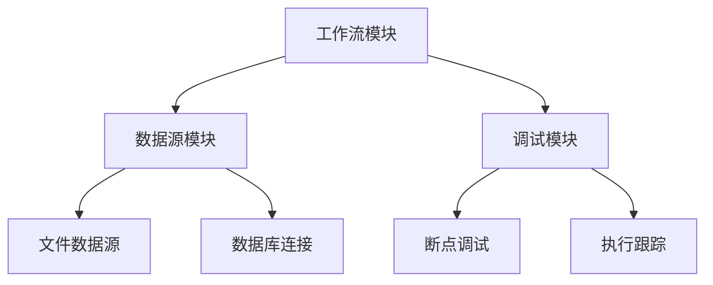

# 数字社区项目需求文档

## 1. 产品总览

### 1.1 模块定义

| 模块名称 | 描述 |
|---------|------|
| 工作流模块 | 实现数据处理流程的可视化编排，支持多种节点类型（数据源、SQL查询、Python脚本）的配置和执行 |
| 数据源模块 | 管理不同类型的数据源，包括文件和数据库连接，提供数据预览功能 |
| 调试模块 | 提供工作流的调试功能，支持断点设置、单步执行、会话管理等 |

### 1.2 产品关系图

## 2. 功能需求

### 2.1 工作流模块

#### FR-工作流模块-工作流管理-工作流创建
- **模块**：工作流模块
- **父功能**：工作流管理
- **子功能**：工作流创建
- **描述**：用户可以创建新的工作流，系统将生成唯一ID并初始化空的工作流结构
- **输入输出**：
  
  | 输入参数 | 类型 | 描述 |
  |---------|------|------|
  | 无 | 无 |  |
  
  | 输出参数 | 类型 | 描述 |
  |---------|------|------|
  | workflowId | string | 新创建工作流的唯一标识符 |
  | workflow | Workflow | 初始化的工作流对象 |

- **交互逻辑**：用户在工作流管理页面点击"创建"按钮，系统调用工作流存储接口创建新的工作流实例，生成唯一ID并初始化空节点和边集合，然后返回新工作流的ID和对象
- **来源文件 + 行号**：src/types/workflow.ts L158-170

#### FR-工作流模块-节点管理-节点创建
- **模块**：工作流模块
- **父功能**：节点管理
- **子功能**：节点创建
- **描述**：用户可以在工作流画布中创建不同类型的节点，包括数据源节点、SQL查询节点和Python脚本节点
- **输入输出**：
  
  | 输入参数 | 类型 | 描述 |
  |---------|------|------|
  | nodeType | NodeType | 节点类型（datasource/sql/python） |
  | position | {x: number, y: number} | 节点在画布中的位置 |
  
  | 输出参数 | 类型 | 描述 |
  |---------|------|------|
  | node | WorkflowNode | 创建的节点对象 |
  | nodeId | string | 创建节点的唯一标识符 |

- **交互逻辑**：用户在工作流画布中通过拖拽或点击工具栏按钮的方式选择节点类型并放置在画布上，系统根据节点类型创建相应的节点对象，设置默认配置，并将其添加到工作流中
- **来源文件 + 行号**：src/types/workflow.ts L86-108, src/types/workflow.ts L205-229

#### FR-工作流模块-连接管理-节点连接
- **模块**：工作流模块
- **父功能**：连接管理
- **子功能**：节点连接
- **描述**：用户可以通过拖拽的方式连接两个节点，建立数据流向关系
- **输入输出**：
  
  | 输入参数 | 类型 | 描述 |
  |---------|------|------|
  | sourceNodeId | string | 源节点ID |
  | targetNodeId | string | 目标节点ID |
  | sourcePort | string | 源节点端口 |
  | targetPort | string | 目标节点端口 |
  
  | 输出参数 | 类型 | 描述 |
  |---------|------|------|
  | edge | WorkflowEdge | 创建的连接对象 |
  | edgeId | string | 创建连接的唯一标识符 |

- **交互逻辑**：用户在画布中通过从一个节点的输出端口拖拽到另一个节点的输入端口来创建连接，系统验证连接的有效性（避免循环依赖），创建连接对象并添加到工作流中
- **来源文件 + 行号**：src/types/workflow.ts L110-122

### 2.2 数据源模块

#### FR-数据源模块-文件管理-文件上传
- **模块**：数据源模块
- **父功能**：文件管理
- **子功能**：文件上传
- **描述**：用户可以上传本地文件作为数据源，系统将保存文件信息并提供预览功能
- **输入输出**：
  
  | 输入参数 | 类型 | 描述 |
  |---------|------|------|
  | file | File | 用户选择的文件对象 |
  
  | 输出参数 | 类型 | 描述 |
  |---------|------|------|
  | dataSource | FileDataSource | 创建的文件数据源对象 |
  | dataSourceId | string | 文件数据源的唯一标识符 |

- **交互逻辑**：用户在数据源管理页面点击"上传"按钮，选择本地文件后，系统读取文件内容，生成文件信息（文件名、大小、类型等），保存到数据源存储中，并提供前10行数据预览
- **来源文件 + 行号**：src/types/workflow.ts L173-182

#### FR-数据源模块-数据库管理-连接配置
- **模块**：数据源模块
- **父功能**：数据库管理
- **子功能**：连接配置
- **描述**：用户可以配置数据库连接信息，系统将验证连接并保存配置
- **输入输出**：
  
  | 输入参数 | 类型 | 描述 |
  |---------|------|------|
  | connectionConfig | DatabaseConnection | 数据库连接配置信息 |
  
  | 输出参数 | 类型 | 描述 |
  |---------|------|------|
  | connection | DatabaseConnection | 创建的数据库连接对象 |
  | connectionId | string | 数据库连接的唯一标识符 |

- **交互逻辑**：用户在数据库管理页面填写连接信息（主机、端口、数据库名、用户名、密码等），点击"测试连接"按钮，系统验证连接信息的有效性，如果连接成功则保存配置到数据源存储中
- **来源文件 + 行号**：src/types/workflow.ts L184-196

### 2.3 调试模块

#### FR-调试模块-断点管理-断点设置
- **模块**：调试模块
- **父功能**：断点管理
- **子功能**：断点设置
- **描述**：用户可以在工作流节点上设置断点，用于调试时暂停执行
- **输入输出**：
  
  | 输入参数 | 类型 | 描述 |
  |---------|------|------|
  | nodeId | string | 需要设置断点的节点ID |
  | enabled | boolean | 是否启用断点 |
  
  | 输出参数 | 类型 | 描述 |
  |---------|------|------|
  | 无 | 无 |  |

- **交互逻辑**：用户在工作流画布中右键点击节点，选择"设置断点"选项，系统在节点上添加断点标记，并在调试执行时遇到断点会暂停执行
- **来源文件 + 行号**：src/utils/workflowDebugger.ts L45-70

#### FR-调试模块-执行控制-单步执行
- **模块**：调试模块
- **父功能**：执行控制
- **子功能**：单步执行
- **描述**：用户可以在调试模式下单步执行工作流节点
- **输入输出**：
  
  | 输入参数 | 类型 | 描述 |
  |---------|------|------|
  | sessionId | string | 调试会话ID |
  
  | 输出参数 | 类型 | 描述 |
  |---------|------|------|
  | executionResult | NodeExecutionResult | 节点执行结果 |

- **交互逻辑**：用户在调试面板中点击"单步执行"按钮，系统获取当前调试会话，检查是否在断点处暂停，如果是则执行当前节点，更新节点状态，并返回执行结果
- **来源文件 + 行号**：src/utils/workflowDebugger.ts L110-150

#### FR-调试模块-会话管理-会话创建
- **模块**：调试模块
- **父功能**：会话管理
- **子功能**：会话创建
- **描述**：用户可以为工作流创建调试会话，用于跟踪执行过程
- **输入输出**：
  
  | 输入参数 | 类型 | 描述 |
  |---------|------|------|
  | workflowId | string | 工作流ID |
  | debugConfig | DebugConfig | 调试配置 |
  
  | 输出参数 | 类型 | 描述 |
  |---------|------|------|
  | sessionId | string | 创建的调试会话ID |
  | session | DebugSession | 调试会话对象 |

- **交互逻辑**：用户在工作流页面点击"调试"按钮，系统创建新的调试会话，初始化会话状态（节点状态、断点信息等），并返回会话ID用于后续调试操作
- **来源文件 + 行号**：src/utils/workflowDebugger.ts L72-95

## 3. 非功能需求

### 3.1 性能需求

#### NFR-全系统-性能-响应时间
- **关联模块**：全系统
- **条目**：性能
- **描述**：系统主要操作响应时间不超过3秒
- **来源文件 + 行号**：src/utils/workflowDebugger.ts L200

### 3.2 可用性需求

#### NFR-全系统-可用性-界面友好
- **关联模块**：全系统
- **条目**：可用性
- **描述**：系统界面应简洁直观，用户能够快速上手使用
- **来源文件 + 行号**：无信息

### 3.3 安全性需求

#### NFR-全系统-安全性-数据保护
- **关联模块**：全系统
- **条目**：安全性
- **描述**：系统应保护用户数据安全，数据库连接密码等敏感信息应加密存储
- **来源文件 + 行号**：src/types/workflow.ts L191

### 3.4 兼容性需求

#### NFR-全系统-兼容性-浏览器兼容
- **关联模块**：全系统
- **条目**：兼容性
- **描述**：系统应兼容主流浏览器（Chrome、Firefox、Safari、Edge）的最新两个版本
- **来源文件 + 行号**：无信息

## 4. 附录

### 4.1 术语表

| 术语 | 定义 |
|------|------|
| 工作流 | 数据处理流程的可视化编排，由多个节点和连接组成 |
| 节点 | 工作流中的基本处理单元，包括数据源、SQL查询、Python脚本等类型 |
| 连接 | 节点之间的数据流向关系 |
| 数据源 | 数据的来源，包括文件和数据库两种类型 |
| 调试 | 在工作流执行过程中设置断点、单步执行等操作，用于排查问题 |
| 会话 | 调试过程中的上下文信息，包括节点状态、执行结果等 |

### 4.2 参考资料

1. 项目代码仓库：/Users/mac/nis_mock/data_comunity/data_comunity
2. 核心类型定义：src/types/workflow.ts
3. 调试器实现：src/utils/workflowDebugger.ts
4. 分支线处理器：src/components/workflow-editor/managers/publish/BranchLineProcessor.ts